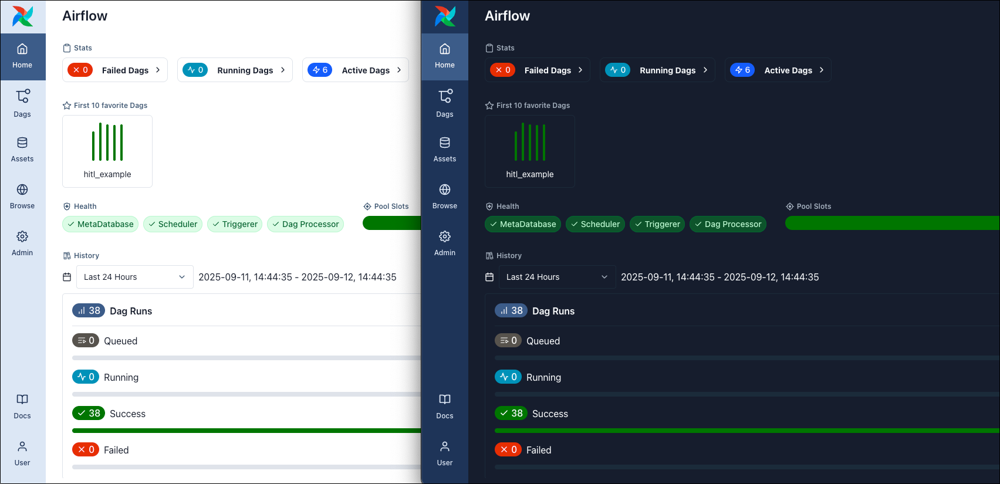
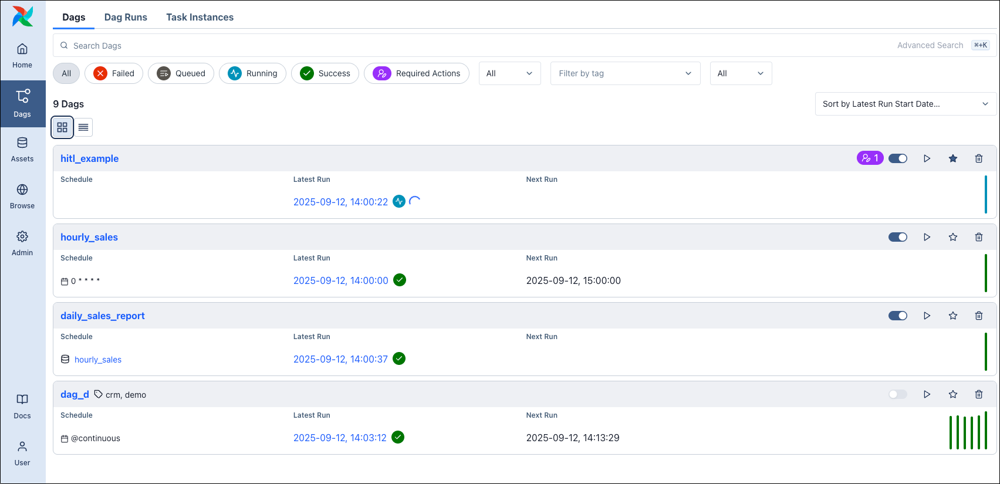

# Введение в интерфейс Airflow (Airflow UI)

[Пользовательский интерфейс Airflow (UI)](https://airflow.apache.org/docs/apache-airflow/stable/ui.html) — веб-центр для мониторинга, управления и отладки пайплайнов, обслуживаемый [API-сервером](https://www.astronomer.io/docs/learn/airflow-components). В Airflow 3 интерфейс переработан на React и стал более интуитивным, с расширяемой системой [плагинов](https://www.astronomer.io/docs/learn/using-airflow-plugins).

Через UI можно не только просматривать DAG и запуски, но и управлять [переменными](variables.md), [подключениями](connections.md) и [пулами](https://www.astronomer.io/docs/learn/airflow-pools), запускать DAG, делать [backfill](https://www.astronomer.io/docs/learn/rerunning-dags#backfill), очищать экземпляры задач и просматривать предыдущие [версии](https://www.astronomer.io/docs/learn/airflow-dag-versioning) DAG.

> Руководство основано на Airflow 3.1 UI. В других версиях элементы могут отличаться.

## Зачем нужен UI

Интерфейс — основной способ наблюдения за окружением Airflow: мониторинг в реальном времени, управление операциями и отладка.

*Переключение светлой/тёмной темы: User → Appearance.*

Основные сценарии:

- **Наблюдаемость** — статус DAG и задач, Grid/Graph/Gantt, логи, зависимости по ассетам.
- **Операционное управление** — пауза DAG, очистка задач, backfill, управление подключениями.
- **Отладка** — проверка структуры DAG, шаблонов и XCom.

## Основные представления (Views)

- **Home/Dashboard** — обзор окружения, статистика, избранные DAG, здоровье компонентов, пулы, история, события ассетов.
- **Dags** — список всех DAG (карточки с историей запусков):

 расписание, следующий запуск, последний запуск, теги, действия (пауза, запуск, избранное). Карточки с полосками истории запусков; можно переключиться на список (list view). Горячие клавиши: `⌘+K` / `Ctrl+K` — поиск.
- **Assets** — список [ассетов](assets.md), граф зависимостей по данным, создание событий ассетов.
- **Browse** — журнал аудита, XCom, Required Actions (human-in-the-loop).
- **Admin** — подключения, переменные, пулы, плагины, провайдеры, конфиг.

## Представление отдельного DAG

В представлении DAG доступны:

- **Grid** и **Graph** — переключение в левом верхнем углу (или клавиша `g`). Grid показывает запуски и состояния задач; верхняя полоска запуска открывает **Gantt**. В Graph можно выбрать версию DAG в меню Options.
- **Вкладки**: Overview, Runs, Tasks, Calendar, Required Actions, Backfills, Audit Log, Code, Details.
- **Действия** (справа вверху): Trigger (одиночный запуск или backfill), избранное, reparse, удаление.

**Dag run** — один запуск DAG: Task Instances, Required Actions, Asset Events, Audit Log, Code, Details; действия: заметка, clear, пометить success/failed.

**Task Instance** — одна задача в запуске: вкладка **Logs** (подсветка, фильтр по уровню), XCom и др.

## Assets (Ассеты)

Вкладка **Assets** — список [ассетов](assets.md), последнее событие, группа, producing tasks, запланированные DAG. Можно вручную создать событие ассета: **Materialize** (запуск producing task) или **Manual** (создание события без выполнения задачи). Граф ассетов показывает зависимости между ассетами и DAG.

## Browse и Admin

**Browse**: журнал аудита, список XCom по окружению, глобальный список Required Actions для human-in-the-loop.

**Admin**: Connections, Variables, Pools, Plugins, Providers, Config (часто отключён в целях безопасности — параметр `api.expose_config`).

## Docs и User

**Docs** — ссылки на официальную документацию Airflow, GitHub, REST API.

**User** — язык, светлая/тёмная тема, вид по умолчанию (Graph), часовой пояс, выход.

---

[← К содержанию](README.md) | [Ассеты →](assets.md)
