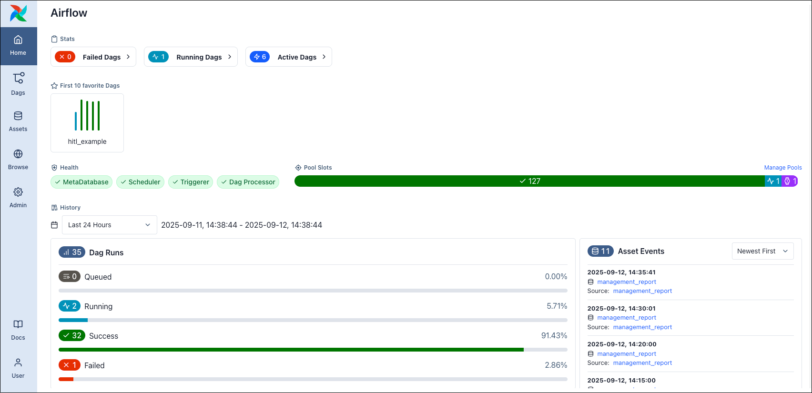
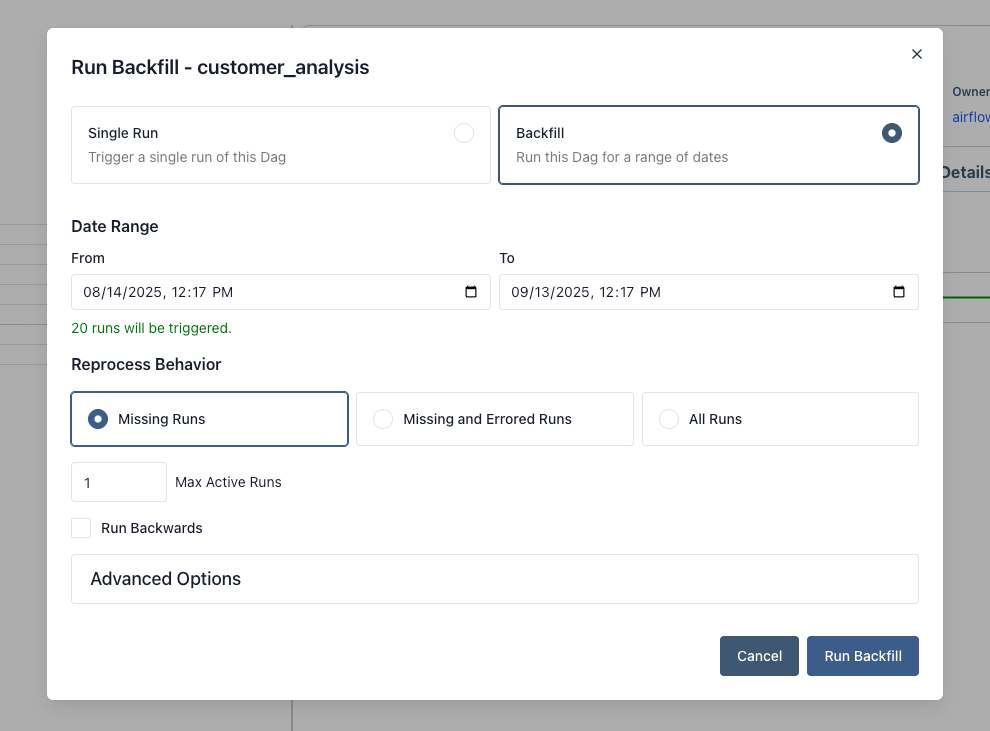
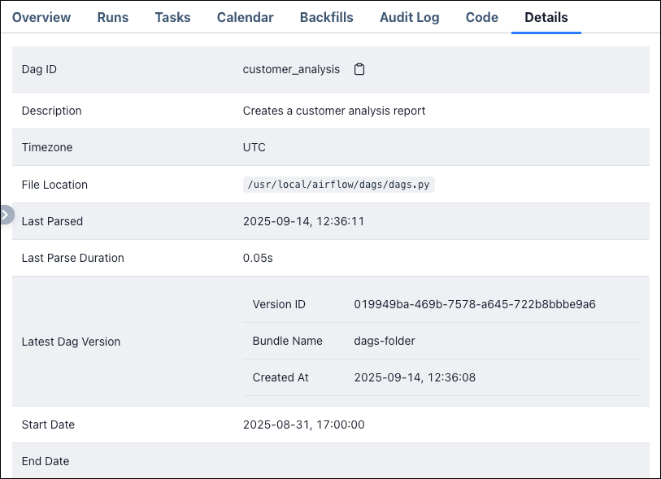

# Введение в интерфейс Airflow (Airflow UI)

[Пользовательский интерфейс (UI) Apache Airflow](https://airflow.apache.org/docs/apache-airflow/stable/ui.html) — веб-центр для мониторинга, управления и отладки пайплайнов данных, обслуживаемый [API-сервером](../03.%20astronomer-infra/airflow-components.md). После существенной переработки в Airflow 3 с упором на удобство разработчиков интерфейс стал React-приложением и получил более интуитивный [плагинный](https://www.astronomer.io/docs/learn/using-airflow-plugins) интерфейс для добавления собственной функциональности.

Через UI можно не только получать детальную информацию о DAG и запусках DAG, но и управлять основными элементами Airflow: [переменными](variables.md), [подключениями](connections.md) и [пулами](https://www.astronomer.io/docs/learn/airflow-pools). Можно напрямую взаимодействовать с пайплайнами: запускать DAG, выполнять [backfill](/docs/learn/rerunning-dags#backfill), очищать экземпляры задач или генерировать [события ассетов](assets.md). В UI также доступны предыдущие [версии](https://www.astronomer.io/docs/learn/airflow-dag-versioning) DAG.

В этом руководстве даётся обзор наиболее полезных возможностей и визуализаций интерфейса Airflow. Чтобы повторять примеры, можно быстро поднять локальное окружение Airflow с помощью [Astro CLI](https://www.astronomer.io/docs/astro/cli/get-started).

> **Инфо.** Руководство основано на интерфейсе Airflow 3.1. В других версиях элементы могут отличаться. Рекомендуется регулярно обновлять окружение Airflow, чтобы использовать новые возможности.

## Необходимая база

Для максимальной отдачи от руководства нужно понимать:

- Основные концепции Airflow. См. [Введение в Apache Airflow](intro-to-airflow.md).
- DAG в Airflow. См. [Введение в DAG Airflow](dags.md).

## Зачем нужен UI

Писать, планировать и запускать DAG можно и без интерфейса Airflow, но для разработки, мониторинга и эксплуатации DAG UI — незаменимый инструмент. Интерфейс служит главным окном в окружение Airflow и даёт видимость и контроль, необходимые для управления сложными потоками данных.

> **Совет.** Переключение светлой и тёмной темы: User → Appearance.

Интерфейс Airflow особенно важен в таких сценариях:

- **Наблюдаемость** — обзор статуса DAG и задач в реальном времени. Использование видов Grid, Graph и Gantt для поиска узких мест, доступ к логам задач для разбора сбоев. При использовании [ассетов](assets.md) для расписания DAG в UI также отображаются зависимости по данным между ассетами и задачами.
- **Операционное управление** — повседневные операции: пауза DAG, очистка задач, [backfill](/docs/learn/rerunning-dags#backfill), управление подключениями Airflow. UI делает управление пайплайнами доступным и для менее технических специалистов.
- **Отладка** — визуальная проверка структуры и зависимостей DAG при разработке. Просмотр отрендеренных шаблонов и XCom для диагностики проблем и ускорения разработки.

> **Примечание.** Видеовведение в интерфейс Airflow см. в модуле [Airflow: UI](https://academy.astronomer.io/path/airflow-101/airflow-ui) в Astronomer Academy.

## Представления (Views)

Интерфейс Airflow организован в несколько основных представлений, доступных из панели навигации. В них есть отдельные экраны для мониторинга DAG и запусков, просмотра ассетов, просмотра объектов Airflow и управления окружением.

Интерфейс сделан интуитивным, но во многих представлениях есть возможности, о которых легко не узнать. Ниже — обзор основных представлений и акцент на отдельных функциях и продвинутых концепциях.

Важнейшие представления:

- **[Home/Dashboard](#homedashboard)** — страница обзора экземпляра Airflow и быстрых ссылок на разные представления.
- **[Dags](#dags)** — список всех DAG в экземпляре. Отсюда можно открыть отдельный DAG и просмотреть его задачи и запуски.
- **[Assets](#assets)** — список всех [ассетов](assets.md) в экземпляре. Отсюда можно открыть графы ассетов с зависимостями по данным между ассетами и DAG.
- **[Browse](#browse)** — доступ к журналу аудита, XCom и обязательным действиям для human-in-the-loop операторов.
- **[Admin](#admin)** — управление элементами вроде подключений, переменных и пулов Airflow.

## Home/Dashboard

Представление **Home** — стартовая страница Airflow и общий дашборд всего окружения. На ней виден обзор статуса пайплайнов и состояния системы, чтобы быстро оценить экземпляр Airflow.

Представление Home состоит из нескольких виджетов:

- **Stats** — краткая сводка нагрузки: число активных DAG, выполняющихся и упавших экземпляров задач. Каждая цифра — кликабельная ссылка на предотфильтрованный список DAG.
- **Favorites** — список избранных DAG. Добавить DAG в избранное можно по клику на звёздочку рядом с именем в представлении DAG или на странице DAG.
- **Health** — общее состояние [компонентов Airflow](../03.%20astronomer-infra/airflow-components.md).
- **Pool Slots** — суммарное число слотов всех настроенных [пулов](https://www.astronomer.io/docs/learn/airflow-pools) и их загрузка.
- **History** — сводная статистика последних запусков DAG и экземпляров задач.
- **Asset Events** — список последних или самых старых событий ассетов.

## Dags

Представление **Dags** — центральная панель управления всеми пайплайнами данных. В нём можно быстро оценить статус DAG, посмотреть последние запуски и выполнить основные операции.

Здесь отображается доступный для поиска и фильтрации список всех DAG с основной метаинформацией:

- **Schedule** — DAG запускается по cron, по расписанию (timetable) или по обновлению [ассетов](assets.md).
- **Next Run** — когда запланирован следующий запуск.
- **Latest Run** — статус и дата последнего запуска.
- **Human-in-the-Loop (HITL)** — иконка показывается, если задача в запуске ждёт ввода пользователя.
- **Tags** — теги DAG для фильтрации и группировки.
- **Actions** — быстрые действия: пауза/снятие паузы, ручной запуск, добавление в избранное для отображения на Home, удаление.

В **карточном виде** также отображается история последних запусков в виде вертикальных полос. Высота полосы — длительность запуска, цвет — состояние, что помогает быстро замечать аномалии.

Для более компактного списка можно переключиться на **списковый вид** — таблица, удобная при большом числе DAG. Переключение между видами — под счётчиком общего числа DAG.

> **Совет.** Горячие клавиши <kbd>⌘</kbd>+<kbd>K</kbd> (или <kbd>Ctrl</kbd>+<kbd>K</kbd> в Windows/Linux) открывают расширенную строку поиска для быстрой фильтрации и навигации по сотням DAG без перезагрузки страницы.

### Отдельный DAG

На странице отдельного DAG отображаются детали по выбранному DAG: запуски, экземпляры задач и обязательные действия (_при использовании human-in-the-loop_). Отсюда можно запустить backfill или переразобрать DAG.

### Действия

В правом верхнем углу страницы DAG расположены кнопки управления жизненным циклом: избранное, reparse, удаление. Кнопка **Trigger** — основной способ запуска запусков вне обычного расписания.

По нажатию **Trigger** открывается диалог: можно запустить один запуск DAG или операцию [backfill](../02.%20astronomer-dags/rerunning-dags.md). В обоих случаях в блоке **Advanced options** доступны дополнительные настройки. Для [backfill](../02.%20astronomer-dags/rerunning-dags.md) задаётся диапазон дат и один из трёх вариантов переобработки.

Можно задать, идёт ли backfill в обратном направлении и к скольким активным запускам он применяется. Во время backfill вверху страницы DAG отображается полоса прогресса. Запуски, созданные backfill, в сетке помечаются отдельной иконкой.

### Виды DAG

Две основные визуализации DAG (слева на странице DAG) — вид **Grid** с встроенной диаграммой Ганта и вид **Graph**.

В сетке отображаются предыдущие запуски DAG: длительность и результат по каждому экземпляру задачи. Столбец — один запуск DAG, ячейка — экземпляр задачи в этом запуске. Цвет ячейки — статус. Маленькая иконка воспроизведения у запуска означает ручной запуск, иконка ассета — запуск по [обновлению ассета](https://astronomer.io/guides/airflow-datasets). Без иконки — запуск по расписанию.

Справа — вкладки с дополнительной информацией о выбранном в Grid или Graph DAG, запуске, задаче или экземпляре задачи.

Клик по верхней полосе запуска в Grid открывает диаграмму Ганта. Клик по ячейке задачи в Grid открывает логи задачи для быстрой отладки.

> **Совет.** **Диаграмма Ганта** показывает один запуск DAG во времени: когда стартовала каждая задача, как долго выполнялась и где задачи шли параллельно. Удобна для поиска узких мест: длинные полосы — самые долгие задачи; их оптимизация может заметно сократить общее время запуска.

В левом верхнем углу переключаются виды Grid и Graph. Вид Graph отображает DAG, задачи и зависимости. Graph можно открыть со страницы DAG независимо от запусков или для конкретного запуска — тогда отображаются и состояния задач.

> **Совет.** Клавиша <kbd>g</kbd> переключает между видами Graph и Grid.

В меню **Options** вида Graph можно выбрать версию DAG и просмотреть историю DAG с задачами и зависимостями этой версии.

### Вкладки

На странице отдельного DAG доступны вкладки:

- **Overview** — сводка по последним запускам и связанным событиям ассетов.
- **Runs** — список всех прошлых и активных запусков DAG с состоянием и длительностью.
- **Tasks** — информация по каждой задаче в DAG и её зависимостям.
- **Calendar** — история прошлых и будущих запланированных запусков в виде календарной сетки по месяцам.
- **Required Actions** — задачи, приостановленные в ожидании ввода пользователя (human-in-the-loop).
- **Backfills** — информация и логи по выполненным backfill.
- **Audit Log** — журнал событий по DAG: запуски, очистки задач и т.д.
- **Code** — исходный Python-код текущей версии DAG.
- **Details** — метаданные DAG: владелец, теги, параметры и т.д.

#### Overview

Вкладка **Overview** — базовая сводка по DAG: последние запуски и связанные события ассетов. Доступна фильтрация по периодам.

#### Runs

Вкладка **Runs** — список запусков с полями: run after date, состояние, тип запуска, пользователь, даты начала и окончания, длительность, версия DAG, дополнительные параметры. Фильтрация по состоянию и типу запуска. Клик по запуску открывает представление [**dag run**](#dag-run).

#### Tasks

Вкладка **Tasks** — сведения по всем задачам DAG: имя, тип оператора, trigger rule, последний экземпляр задачи, диаграмма запусков. По клику на имя задачи открывается страница обзора задачи.

#### Calendar

Вкладка **Calendar** — история запусков в долгосрочной перспективе: сетка по месяцам (почасовой вид) или по году (посуточный вид). Цвет ячейки показывает активность; интенсивность — число запусков за период.

#### Required Actions

Вкладка **Required Actions** — для интерактивных сценариев с human-in-the-loop. Видна только у DAG с задачами, которые приостанавливаются в ожидании ввода. Список экземпляров задач, ожидающих действия или уже обработанных: состояние, тема (subject), Run After, map index для динамических задач, время ответа после выполнения действия. Клик по теме переводит на форму ввода ответа.

#### Backfills

Вкладка **Backfills** — сведения по backfill по этому DAG: период from/to, поведение переобработки, время создания и завершения, длительность, max active runs.

#### Audit Log

Вкладка **Audit Log** — события в окружении Airflow, связанные с выбранным DAG, запуском или экземпляром задачи.

#### Code

Вкладка **Code** — просмотр кода DAG, дата и время последнего разбора. Можно выбрать [версию DAG](https://www.astronomer.io/docs/learn/airflow-dag-versioning) и скопировать код.

#### Details

Вкладка **Details** — метаданные DAG: ID, описание, часовой пояс, файл, время последнего разбора, информация о последней версии, start time, concurrency, max active runs/tasks, catchup, params и т.д.

### Dag run

Представление **dag run** — один запуск DAG. Доступны вкладки, аналогичные представлению DAG:

- **Task Instances** — метаданные по каждому экземпляру задачи в этом запуске. Клик по task ID открывает детали экземпляра, включая логи и XCom.
- **Required Actions** — обязательные human-in-the-loop действия в этом запуске.
- **Asset Events** — исходные [события ассетов](assets.md) с деталями.
- **Audit Log** — журнал аудита по этому запуску.
- **Code** — версия кода DAG, выполненная в этом запуске (важно для отладки прошлых запусков).
- **Details** — метаданные запуска.

В представлении dag run доступны действия: заметка к запуску, очистка (clear), пометить success или failed.

Выбор строки во вкладке **Task Instances** открывает представление отдельного **Task Instance** — самый детальный уровень отладки: один запуск одной задачи. В центре — вкладка **Logs** с логами этого запуска задачи. Логи с подсветкой синтаксиса и фильтром по уровню. Другие вкладки — например, данные, переданные в XCom.

## Assets

Вкладка **Assets** — список [ассетов](assets.md) в экземпляре Airflow.

По умолчанию ассеты отображаются списком с основной информацией:

- **Last Asset Event** — дата последнего события ассета (свежесть данных).
- **Group** — группа ассета.
- **Producing Tasks** — задачи, обновляющие ассет.
- **Scheduled dags** — DAG, в расписании которых участвует этот ассет.

Из этого представления можно вручную создать событие ассета для тестов или для запуска data-aware сценария с одним или несколькими DAG.

Создать событие ассета можно двумя способами:

- **Materialize** — запуск производящей задачи этого ассета.
- **Manual** — создание события ассета без выполнения задачи, с возможностью добавить дополнительную информацию.

По клику на ассет открывается **граф ассетов** — зависимости между ассетами и DAG. Справа — детали по связанным событиям ассетов. Кнопка в правом верхнем углу графа также создаёт событие ассета.

## Browse

Вкладка **Browse** — журнал аудита, обязательные действия human-in-the-loop и XCom.

Журнал аудита перечисляет все залогированные события: время, пользователь, доп. информация по DAG и задаче.

**XComs** — централизованный просмотр XCom по всем задачам в окружении. Каждая запись: ключ, значение, экземпляр задачи (dag ID, run ID, task ID, map index).

**Required Actions** — глобальный список human-in-the-loop по всему экземпляру: ожидающие ввода и уже обработанные. Есть фильтр по состоянию. Клик по теме переводит на форму ответа.

## Admin

Вкладка **Admin** — управление окружением, не привязанное к конкретному DAG:

- **Connections** — просмотр и управление [подключениями Airflow](connections.md).
- **Variables** — просмотр и управление [переменными Airflow](variables.md).
- **Pools** — просмотр и управление [пулами Airflow](https://www.astronomer.io/docs/learn/airflow-pools).
- **Plugins** — просмотр [плагинов Airflow](https://airflow.apache.org/docs/apache-airflow/stable/plugins.html).
- **Providers** — просмотр установленных [провайдеров](https://registry.astronomer.io/).
- **Config** — содержимое `airflow.cfg`.

> **Инфо.** Представление **Config** часто отключено из соображений безопасности. Поведение настраивается параметром [api.expose_config](https://airflow.apache.org/docs/apache-airflow/stable/configurations-ref.html#expose-config).

## Docs

Вкладка **Docs** — ссылки на внешние ресурсы Airflow: [официальная документация](https://airflow.apache.org/docs/apache-airflow/stable/index.html), [репозиторий на GitHub](https://github.com/apache/airflow), [REST API](https://airflow.apache.org/docs/apache-airflow/stable/stable-rest-api-ref.html).

## User

Нижняя иконка в навигации — **User**. Доступно:

- Выбор языка
- Переключение светлой/тёмной темы
- Вид по умолчанию (Graph)
- Часовой пояс экземпляра
- Выход

## Заключение

В этом руководстве дан базовый обзор часто используемых возможностей интерфейса Airflow. От 2.x к 3.x интерфейс стал проще и понятнее.

> **Совет.** [Плагины Airflow](https://airflow.apache.org/docs/apache-airflow/stable/plugins.html) позволяют расширять установку. В [этом руководстве](https://www.astronomer.io/docs/learn/using-airflow-plugins) описано, как расширить UI с помощью плагинов.

Интерфейс Airflow развивается, сообщество продолжает улучшать UX и добавлять функции. Чтобы использовать новое, стоит регулярно обновлять окружение. Идеи и помощь в разработке приветствуются в [сообществе Apache Airflow](https://github.com/apache/airflow?tab=readme-ov-file#contributing).

---

[← К содержанию](README.md) | [Ассеты и data-aware →](assets.md)
