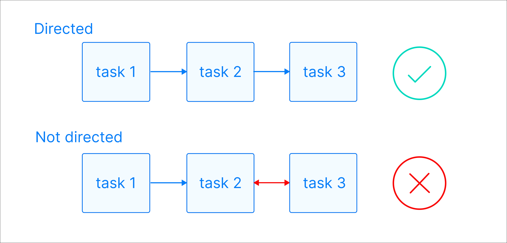
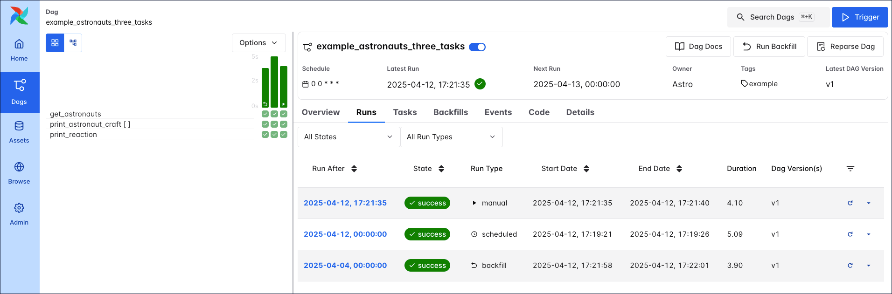

# Введение в DAG в Apache Airflow®

В [Apache Airflow®](https://airflow.apache.org/) **DAG** — это пайплайн или рабочий процесс. DAG — основная организационная единица: набор задач и зависимостей, которые выполняются по расписанию.

DAG задаётся в Python-коде и отображается в Airflow UI. DAG может быть от одной задачи до сотен и тысяч с сложными зависимостями.

## Что такое DAG?

*DAG* (directed acyclic graph — ориентированный ациклический граф) — структура из узлов и рёбер. В Airflow DAG представляет пайплайн с началом и концом.

- **Directed (направленный)** — у задач есть направление:

 выше по потоку (upstream), ниже по потоку (downstream) или параллельно.
- **Acyclic (ациклический)** — нет циклов: задача не может зависеть от себя или от задачи, которая от неё зависит.
- **Graph (граф)** — узлы это задачи, рёбра — зависимости.

Задачи выполняют единицы работы (функция Python, преобразование, вызов внешнего сервиса) и задаются [операторами](operators.md) или [декораторами](https://www.astronomer.io/docs/learn/airflow-decorators). Зависимости задаются разными способами (см. [Управление зависимостями](task-dependencies.md)).

## DAG Run (запуск DAG)

*DAG run* — экземпляр DAG в конкретный момент времени. *Task instance* — экземпляр задачи в конкретный момент. У каждого DAG run уникальный `run_id`; история хранится в [метаданных Airflow](https://www.astronomer.io/docs/learn/airflow-database).

В UI запуски видны в **Grid**:

 каждый DAG run связан с версией DAG — при изменении структуры DAG версия увеличивается.

### Свойства DAG run

- **dag_id** — идентификатор DAG.
- **logical date** — момент времени, после которого этот запуск может быть выполнен (не обязательно момент фактического запуска).
- **task_id** — идентификатор задачи.
- **task state** — состояние экземпляра задачи: `running`, `success`, `failed`, `skipped` и др.

Способы запуска DAG run:

- **Backfill** — создание запусков за прошлые даты (UI, API, CLI).
- **Scheduled** — по расписанию DAG.
- **Manual** — вручную из UI, CLI или API.
- **Asset triggered** — по обновлению [ассетов](assets.md) (data-aware scheduling).

Статусы DAG run: **Queued**, **Running**, **Success**, **Failed**.

## Написание DAG

Файл DAG помещается в [DAG bundle](https://www.astronomer.io/docs/learn/airflow-dag-versioning) (по умолчанию папка `dags`). Airflow парсит файлы каждые ~30 с; принудительно — `airflow dags reserialize`.

Два варианта синтаксиса:

- **TaskFlow API** — декоратор `@dag`; функция с `@dag` определяет DAG. В конце скрипта нужно вызвать функцию. Задачи задаются внутри функции DAG.
- **Традиционный синтаксис** — контекст `with DAG(...)` или экземпляр `DAG`, задачи внутри контекста.

Можно смешивать TaskFlow и традиционные операторы. Однозадачные DAG можно создавать декоратором `@asset` (см. [Ассеты](assets.md)).

### Параметры DAG

- **dag_id** — уникальное имя DAG. Для `@dag` по умолчанию берётся имя функции.
- **start_date** — дата/время, после которых DAG начинает планироваться.
- **schedule** — расписание (cron, timetable, ассеты). По умолчанию `None`.

Полный список параметров: [DAG-level parameters](https://www.astronomer.io/docs/learn/airflow-dag-parameters).

---

[← К содержанию](README.md) | [Планирование →](scheduling.md) | [Зависимости задач →](task-dependencies.md)
