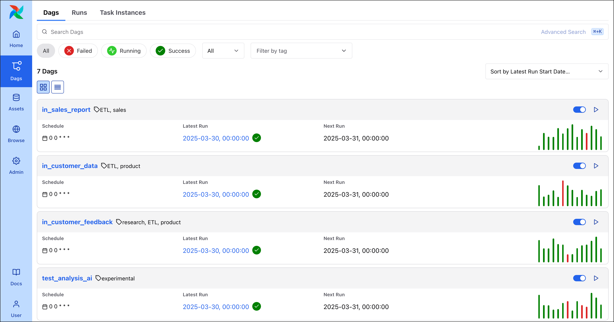
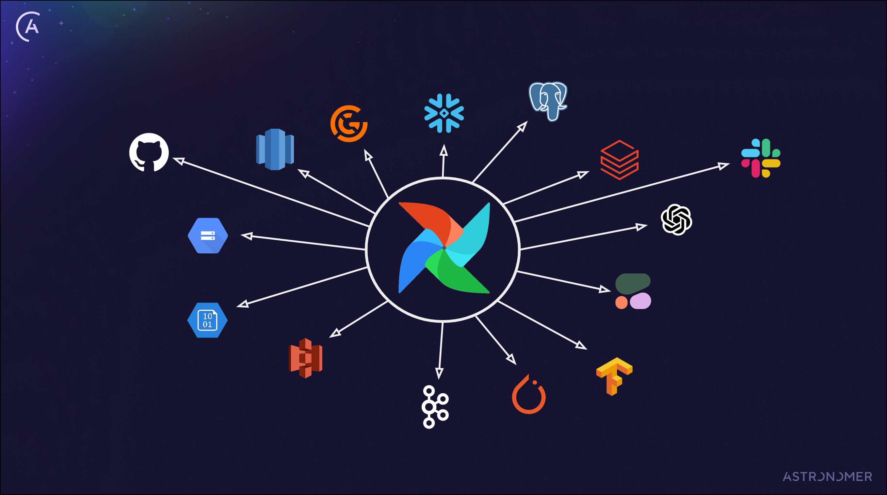
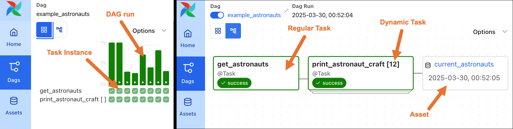

# Введение в Apache Airflow

[Apache Airflow®](https://airflow.apache.org/) — инструмент с открытым исходным кодом для программного создания, планирования и мониторинга пайплайнов данных. Каждый месяц миллионы новых и постоянных пользователей загружают Airflow; у проекта большое и активное сообщество с открытым исходным кодом ([community](https://airflow.apache.org/community/)). Главный принцип Airflow — описывать пайплайны данных как код, что позволяет строить динамичные и масштабируемые рабочие процессы.

В этом руководстве даётся введение в Apache Airflow и его основные концепции. Вы узнаете:

- Где искать материалы для дальнейшего изучения Airflow.
- Важные концепции Airflow.
- Как запускать Airflow.
- Типичные сценарии использования Airflow.
- Зачем использовать Airflow.

> - Практический туториал: [Get started with Apache Airflow](README.md).
>
> По теме есть и другие материалы. См. также:
>
> Другие способы изучить тему

## Необходимая база

Чтобы получить максимум от руководства, нужно понимать:

- Основы Python. См. [документацию Python](https://docs.python.org/3/tutorial/index.html).

## Зачем использовать Airflow

[Apache Airflow](https://airflow.apache.org/index.html) — платформа для программного создания, планирования и мониторинга рабочих процессов. Он особенно полезен для создания и оркестрации сложных пайплайнов данных.

Оркестрация данных лежит в основе любого современного стека данных и обеспечивает развитую автоматизацию пайплайнов. При оркестрации шаги пайплайна «знают» друг о друге, а команда по данным получает единое место для мониторинга, правки и отладки рабочих процессов.

Один из главных принципов Airflow, отличающий его от других инструментов оркестрации, — описание пайплайнов данных как кода. Современные команды по данным стремятся задавать рабочие процессы в коде, чтобы:

- Описывать переиспользуемые параметризуемые участки workflow.
- Массово создавать и обновлять workflow, слишком многочисленные, большие или динамичные для управления через GUI.
- Управлять workflow с помощью привычных инструментов контроля изменений и версий.

Airflow даёт и много других преимуществ:

- **Наблюдаемость**: UI Airflow даёт мгновенный обзор всех пайплайнов и может служить единым источником правды о workflow во всей экосистеме данных.
- **Активное OSS-сообщество**: при миллионах пользователей и тысячах контрибьюторов Airflow остаётся и развивается. Вступите в [Airflow Slack](https://apache-airflow-slack.herokuapp.com/), чтобы стать частью сообщества.
- **Динамические пайплайны**: в Airflow можно создавать [динамические задачи](../02.%20astronomer-dags/dynamic-tasks.md) и подстраивать workflow под данные, обрабатываемые в runtime.
- **Практически неограниченная масштабируемость**: при достаточных вычислительных ресурсах можно оркестрировать сколько угодно процессов любой сложности.
- **Высокая расширяемость**: пайплайны Airflow пишутся на Python, поэтому можно надстраивать существующую кодовую базу и расширять функциональность под свои задачи. Всё, что можно сделать в Python, можно сделать в Airflow. Поддержка описания задач на других языках планируется в 3.0+.
- **Независимость от инструментов**: Airflow может подключаться к любому приложению в экосистеме данных, которое допускает подключение через API. Есть готовые [операторы](operators.md) для многих распространённых инструментов.

## Сценарии использования Airflow

Airflow используют специалисты по данным в [компаниях любого размера и типа](https://github.com/apache/airflow/blob/main/INTHEWILD). Инженерам данных, дата-сайентистам, ML-инженерам и аналитикам нужны действия над данными в сложной сети зависимостей. С Airflow эти действия и зависимости можно оркестрировать на одной платформе, независимо от используемых инструментов и сложности пайплайнов.

К типичным сценариям относятся:

- **Управление инфраструктурой**: Airflow можно использовать для поднятия и остановки инфраструктуры — например, создания и удаления временных таблиц в БД или запуска и остановки кластера Spark. Такой сценарий реализуют около 18% пользователей Airflow. В руководстве [Setup и teardown в Airflow](../04.%20astronomer-advanced/setup-teardown.md) описана основная возможность для этого сценария.
- **MLOps и GenAI**: 23% пользователей Airflow уже оркестрируют Machine Learning Operations (MLOps) с помощью Apache Airflow, 9% используют Airflow именно для GenAI. Обзор лучших практик при использовании Airflow для MLOps — в [Best practices for orchestrating MLOps pipelines with Airflow](../04.%20astronomer-advanced/airflow-mlops.md). Пример сложного сценария с современными ML-инструментами: [Use Cohere and OpenSearch to analyze customer feedback in an MLOps pipeline](https://www.astronomer.io/docs/learn/use-case-llm-customer-feedback).
- **Бизнес-операции**: 58% пользователей Airflow использовали его для оркестрации данных, напрямую поддерживающих бизнес, — создания приложений и продуктов на основе данных, часто в сочетании с MLOps. Пример: вебинар [The Laurel Algorithm: MLOps, AI, and Airflow for Perfect Timekeeping](https://www.astronomer.io/events/webinars/the-laurel-algorithm-mlops-ai-and-airflow-for-perfect-timekeeping-video/).
- **ETL/ELT**: [86% пользователей Airflow](https://airflow.apache.org/blog/airflow-survey-2024/) применяют его для паттернов Extract-Transform-Load (ETL) и Extract-Load-Transform (ELT). Нередко такие пайплайны поддерживают критичные операционные процессы. Пример: [Orchestrate dbt Core jobs with Airflow and Cosmos](https://www.astronomer.io/docs/learn/airflow-dbt).

Конечно, это лишь часть примеров — с Airflow можно оркестрировать практически любые пакетные (batch) рабочие процессы.



## Запуск Airflow

Запускать Airflow можно разными способами, одни проще других. Astronomer рекомендует:

- Использовать [Astro](https://astronomer.io/try-astro) для продакшен-запуска Airflow. Astro — полностью управляемое SaaS-приложение для оркестрации данных, с помощью которого команды разрабатывают и запускают пайплайны на Apache Airflow любого масштаба. Доступен [бесплатный пробный период](https://astronomer.io/try-astro).
- Использовать open-source [Astro CLI](https://www.astronomer.io/docs/astro/cli/get-started-cli) для локального запуска Airflow. Astro CLI — самый простой способ поднять локальный экземпляр Airflow в контейнерах; бесплатен для всех.

В любую установку Airflow входят обязательные компоненты: api-server, scheduler, dag-processor и база метаданных. Подробнее: [Компоненты Airflow](../03.%20astronomer-infra/airflow-components.md).



## Концепции Airflow

Чтобы ориентироваться в материалах по Airflow, полезно понимать следующие концепции.

### Основы пайплайнов

- **Ассет (Asset)**: представление внутри Airflow реального или абстрактного объекта, который создаётся задачей. Ассетами могут быть файлы, таблицы или объекты, не привязанные к данным. Подробнее: [Ассеты и data-aware планирование в Airflow](assets.md).
- **Динамическая задача (Dynamic task)**: задача в Airflow, выступающая шаблоном для переменного числа динамически маппленных задач, создаваемых в runtime. Подробнее: [Динамические задачи](../02.%20astronomer-dags/dynamic-tasks.md).
- **Экземпляр задачи (Task instance)**: выполнение задачи в конкретный момент времени.
- **Задача (Task)**: шаг в DAG, описывающий одну единицу работы.
- **DAG run**: выполнение DAG в конкретный момент времени. DAG run может быть одного из четырёх типов: [`scheduled`](scheduling.md), `manual`, [`dataset_triggered`](assets.md) или [`backfill`](../02.%20astronomer-dags/rerunning-dags.md).
- **DAG**: ориентированный ациклический граф (Directed Acyclic Graph). DAG в Airflow — это workflow, заданный как граф, в котором все зависимости между узлами направленные и узлы не ссылаются на себя (нет циклических зависимостей). Подробнее: [Введение в DAG в Airflow](dags.md).

На следующем снимке показано сравнение вида Grid и вида Graph простого DAG `example_astronauts` с двумя задачами: `get_astronauts` и `print_astronaut_craft`. Задача `get_astronauts` — обычная, задача `print_astronaut_craft` — динамическая. В виде Grid в UI Airflow отображаются отдельные DAG run и экземпляры задач, в виде Graph — структура DAG. Подробнее об интерфейсе: [Введение в интерфейс Airflow](airflow-ui.md).



Этот DAG запрашивает список астронавтов, находящихся в космосе, из Open Notify API и выводит имя каждого и корабль. В нём две задачи: одна получает данные из API и сохраняет результат, вторая выводит результат. Обе задачи написаны на Python с помощью TaskFlow API Airflow, который позволяет превращать Python-функции в задачи Airflow и автоматически выводить зависимости и передавать данные.

Вторая задача использует динамический маппинг задач: для каждого астронавта из списка, полученного из API, создаётся копия задачи. Список меняется в зависимости от числа астронавтов в космосе, и DAG каждый раз подстраивается под него.

Подробное объяснение и инструкции для начала работы — в туториале [Написать первый DAG](README.md).

<details>
<summary>Пример кода DAG example_astronauts</summary>

```python
doc = """
This DAG queries the list of astronauts currently in space from the
Open Notify API and prints each astronaut's name and flying craft.
There are two tasks, one to get the data from the API and save the results,
and another to print the results. Both tasks are written in Python using
Airflow's TaskFlow API, which allows you to easily turn Python functions into
Airflow tasks, and automatically infer dependencies and pass data.

The second task uses dynamic task mapping to create a copy of the task for
each Astronaut in the list retrieved from the API. This list will change
depending on how many Astronauts are in space, and the DAG will adjust
accordingly each time it runs.

For more explanation and getting started instructions, see our Write your
first DAG tutorial: https://www.astronomer.io/docs/learn/get-started-with-airflow
"""

from airflow import Dataset
from airflow.decorators import dag, task
from pendulum import datetime
import requests

# Определение базовых параметров DAG: расписание, start_date и т.д.

@dag(
    start_date=datetime(2024, 1, 1),
    schedule="@daily",
    catchup=False,
    doc_md=doc,
    default_args={"owner": "Astro", "retries": 3},
    tags=["example"],
)
def example_astronauts():
    # Определение задач
    @task(outlets=[Dataset("current_astronauts")])  # Задача обновляет Dataset current_astronauts
    def get_astronauts(**context) -> list[dict]:
        """
        Задача получает список астронавтов в космосе через requests.
        Результаты пушатся в XCom с заданным ключом для последующего пайплайна.
        Задача возвращает список астронавтов для следующей задачи.
        """
        r = requests.get("http://api.open-notify.org/astros.json")
        number_of_people_in_space = r.json()["number"]
        list_of_people_in_space = r.json()["people"]
        context["ti"].xcom_push(
            key="number_of_people_in_space", value=number_of_people_in_space
        )
        return list_of_people_in_space

    @task
    def print_astronaut_craft(greeting: str, person_in_space: dict) -> None:
        """
        Задача выводит имя астронавта и корабль из результатов
        предыдущей задачи и приветствие (в примере захардкожено).
        """
        craft = person_in_space["craft"]
        name = person_in_space["name"]
        print(f"{name} is currently in space flying on the {craft}! {greeting}")

    # Динамический маппинг: задача print_astronaut_craft для каждого астронавта
    print_astronaut_craft.partial(greeting="Hello! :)").expand(
        person_in_space=get_astronauts()  # Зависимости через синтаксис TaskFlow API
    )


# Создание экземпляра DAG
example_astronauts()
```

</details>

Важная лучшая практика — делать задачи по возможности атомарными (каждая задача выполняет одно действие). Кроме того, задачи идемпотентны: при одних и тех же входных данных результат один и тот же. См. [Лучшие практики написания DAG в Apache Airflow](../02.%20astronomer-dags/dag-best-practices.md).

### Написание пайплайнов

Пайплайны в Airflow можно задавать двумя способами:

- **Подход, ориентированный на задачи (Task-oriented)**: вы определяете DAG, заполняете его задачами и задаёте зависимости. Идея — думать о *действиях*, которые нужно выполнить.
- **Подход, ориентированный на ассеты (Asset-oriented)**: в Airflow 3.0 появилась возможность задавать DAG в более «данно-ориентированном» виде: вы определяете ассет (реальный или абстрактный), который нужно создать, и зависимости между [ассетами](assets.md). Идея — думать об *ассетах*, которые нужно создать.

#### Подход, ориентированный на задачи

Задачи в Airflow чаще всего задаются в Python. Можно использовать:

- **Декораторы (`@task`)**: [TaskFlow API](../02.%20astronomer-dags/airflow-decorators.md) позволяет задавать задачи декораторами, оборачивающими Python-функции. Это самый простой способ получить задачи из существующих скриптов. Каждый вызов задекорированной функции становится одной задачей в DAG.
- **Операторы (`XYZOperator`)**: [Операторы](operators.md) — классы-обёртки над Python-кодом для выполнения конкретного действия. Задачу создаёте, передавая параметры в класс. Каждый экземпляр оператора — одна задача в DAG.

Стоит упомянуть два особых типа операторов:

- **Сенсоры**: [Сенсоры](sensors.md) — операторы, которые работают до выполнения заданного условия. Например, [HttpSensor](https://registry.astronomer.io/providers/apache-airflow-providers-http/versions/latest/modules/HttpSensor) ждёт, пока HTTP-ответ удовлетворяет заданным критериям.
- **Deferrable-операторы**: [Deferrable-операторы](../04.%20astronomer-advanced/deferrable-operators.md) используют библиотеку Python [asyncio](https://docs.python.org/3/library/asyncio.html) для асинхронного выполнения. Например, [DateTimeSensorAsync](https://registry.astronomer.io/providers/astronomer-providers/modules/HttpOperatorAsync) асинхронно ждёт наступления заданной даты и времени. Для deferrable-операторов в окружении Airflow должен работать компонент triggerer.

Такие строительные блоки, как BashOperator, декоратор `@task` или PythonOperator, входят в ядро Airflow и устанавливаются во всех экземплярах. Дополнительно многие операторы поставляются в **пакетах провайдеров Airflow**, которые объединяют модули для работы с тем или иным сервисом.

Все доступные операторы и параметры можно посмотреть в [Astronomer Registry](https://registry.astronomer.io/). Для многих инструментов есть [туториалы по интеграции](https://www.astronomer.io/docs/learn/category/integrations--connections) с примером использования провайдера.

#### Подход, ориентированный на ассеты

Для пайплайнов в стиле asset-oriented можно использовать декоратор `@asset`. Подробнее: [Ассеты и data-aware планирование в Airflow](assets.md).

### Дополнительные концепции

Помимо DAG и задач, в Airflow есть и другие концепции, с которыми вы столкнётесь:

- **Планирование в Airflow**: разные способы задать расписание DAG. Подробнее: [Планирование и timetables в Airflow](scheduling.md).
- **Подключения Airflow**: способ хранить учётные данные и параметры подключения к внешним системам и использовать их в DAG. Подробнее: [Управление подключениями в Apache Airflow](connections.md).
- **Переменные Airflow**: пары ключ–значение для хранения информации в окружении Airflow. Подробнее: [Переменные Airflow](variables.md).
- **XCom**: сокращение от *cross-communication*; с помощью XCom можно передавать данные между задачами. Подробнее: [Передача данных между задачами](../02.%20astronomer-dags/passing-data-between-tasks.md).
- **REST API Airflow**: [REST API Airflow](https://airflow.apache.org/docs/apache-airflow/stable/stable-rest-api-ref.html) позволяет взаимодействовать с Airflow программно.

## Ресурсы

- [Вебинары Astronomer](https://www.astronomer.io/events/webinars/): разбор тем по Airflow и Astronomer в прямом эфире; записи доступны по запросу.
- [Astronomer Academy](https://academy.astronomer.io/): видеокурсы по Airflow и Astronomer.
- [Официальная документация Airflow](https://airflow.apache.org/docs/): документация Apache Airflow.
- [Airflow на GitHub](https://github.com/apache/airflow): официальный репозиторий Apache Airflow.
- [Airflow Slack](https://apache-airflow-slack.herokuapp.com/): рабочее пространство Airflow в Slack, лучшее место для вопросов по Airflow.

## Дальнейшие шаги

Теперь, когда у вас есть базовое представление об Apache Airflow, можно написать первый DAG по туториалу [Get started with Apache Airflow](README.md).

---

[← К содержанию](README.md) | [Интерфейс Airflow (UI) →](airflow-ui.md)
