# Параметры (Params) в Airflow

**Params** — это аргументы, которые можно передать в DAG или задачу Airflow во время выполнения; они хранятся в [словаре контекста Airflow](airflow-context.md) для каждого запуска DAG. Передавать params уровня DAG и уровня задачи можно через параметр `params`.

Params хорошо подходят для хранения информации, специфичной для отдельных запусков DAG: изменяемые даты, пути к файлам или конфигурации ML-моделей. Params не шифруются и поэтому не подходят для передачи секретов. См. также [Рекомендации по хранению информации в Airflow](../01.%20astronomer-basic/variables.md).

В этом руководстве рассматриваются:

- Иерархия params в Airflow.
- Как обращаться к params в задаче Airflow.
- Как задавать значения по умолчанию для params на уровне DAG, которые отображаются в интерфейсе Trigger DAG.
- Как передавать params в DAG во время выполнения.

## Необходимая база

Чтобы получить максимум от этого руководства, нужно понимать:

- Контекст Airflow. См. [Контекст Airflow (Airflow context)](airflow-context.md).
- Операторы Airflow. См. [Операторы 101](../01.%20astronomer-basic/operators.md).
- DAG в Airflow. См. [Введение в DAG Airflow](../01.%20astronomer-basic/dags.md).

## Передача params в DAG при запуске

Передавать params в DAG при выполнении можно четырьмя способами:

- Выполнить запрос `POST` к эндпоинту [Trigger Dag Run](https://airflow.apache.org/docs/apache-airflow/stable/stable-rest-api-ref.html#operation/trigger_dag_run) REST API Airflow и использовать параметр `conf`.
- Использовать TriggerDagRunOperator с параметром `conf`.
- Запустить DAG с флагом `--conf` через CLI Airflow ([`airflow dags trigger`](https://airflow.apache.org/docs/apache-airflow/stable/cli-and-env-variables-ref.html#trigger)).
- В веб-интерфейсе Airflow через форму Trigger DAG. Форма открывается при нажатии на кнопку Trigger DAG (Play) в интерфейсе Airflow.

Значения params, переданные в DAG любым из этих способов, переопределяют существующие значения по умолчанию для того же ключа, если [настройка Airflow `dag_run_conf_overrides_params`](https://airflow.apache.org/docs/apache-airflow/stable/configurations-ref.html#dag-run-conf-overrides-params) установлена в `True` (значение по умолчанию).

> Передавать в DAG можно только params, сериализуемые в JSON. Любые params, не сериализуемые в JSON, приведут к ошибке импорта DAG (`ParamValidationError`) при разборе DAG.
>
> Инфо

### Форма Trigger DAG

Передавать params в DAG из веб-интерфейса Airflow можно, нажав кнопку Play в обзоре DAG или синюю кнопку Trigger на странице конкретного DAG.

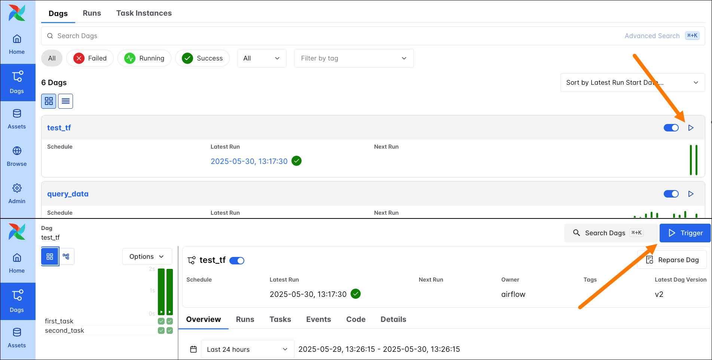

Эта кнопка открывает форму, в которой можно указать параметры запуска DAG. Если у DAG есть params с заданными значениями по умолчанию, в форме для каждого такого param в блоке **Run Parameters** (Параметры запуска) отображается поле. Дополнительные params можно добавить в **Advanced Options** → **Configuration JSON**.

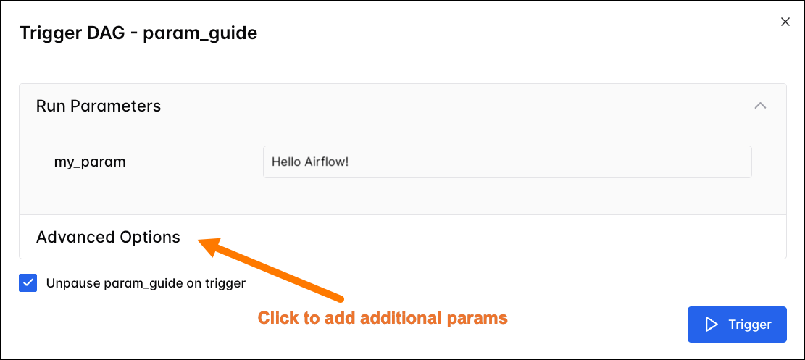

В **Advanced Options** также можно задать Logical Date, Run ID и добавить Dag Run Note для ручного запуска DAG. Params, уже заданные в Run Parameters, по умолчанию попадают в Configuration JSON.

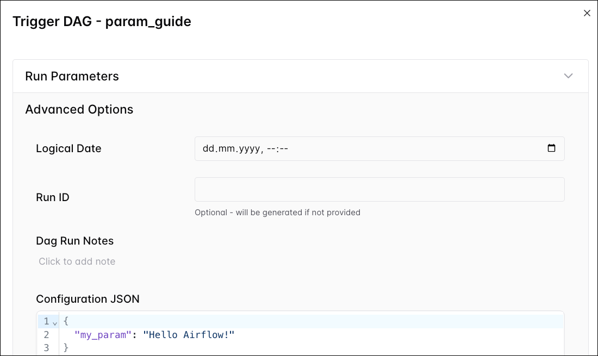

В форме **Trigger DAG**:

- Можно добавить Dag Run Note к запуску DAG.
- Можно задать Run ID произвольной строкой. Если Run ID не указан, Airflow генерирует его по дате запуска.
- Можно задать Logical Date запуска DAG. Можно и не указывать логическую дату, сбросив её в календаре.
- Можно добавить новые params в **Advanced Options** → **Configuration JSON**.
- Можно изменить любые значения по умолчанию для params, определённых в файле DAG в Run Parameters или в Configuration JSON.

После настройки конфигурации запуск DAG выполняется кнопкой **Trigger**.

### CLI

При [запуске DAG Airflow из CLI](https://airflow.apache.org/docs/apache-airflow/stable/cli-and-env-variables-ref.html#dags) передать params в запуск DAG можно, указав JSON-строку в флаге `--conf`. Например, чтобы запустить DAG `params_defaults_example` со значением `Hello from the CLI` для `param1`, выполните:

Через Astro CLI команды Airflow запускаются с помощью `astro dev run`:

```sh
astro dev run dags trigger params_defaults_example --conf '{"param1" : "Hello from the CLI"}'
```

Через Airflow CLI:

```sh
airflow dags trigger params_defaults_example --conf '{"param1" : "Hello from the CLI"}'
```

CLI выводит конфигурацию запуска в терминал:

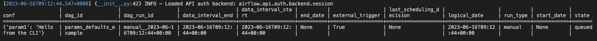

Флаг `--conf` можно использовать с подкомандами CLI Airflow:

- `airflow dags trigger`
- `airflow dags test`
- `airflow dags backfill`

### TriggerDagRunOperator

[TriggerDagRunOperator](cross-dag-dependencies.md#triggerdagrunoperator) — встроенный оператор Airflow, позволяющий запускать DAG из другого DAG. Параметр `conf` у TriggerDagRunOperator позволяет запустить зависимый DAG с нужной конфигурацией.

В примере ниже TriggerDagRunOperator запускает DAG `tdro_example_downstream` и передаёт динамическое значение param `upstream_color` через параметр `conf`. Значение `upstream_color` подставляется [шаблоном Jinja](jinja-templating.md), получающим возвращаемое значение вышестоящей задачи через [XCom](passing-data-between-tasks.md#xcom).

**TaskFlow:**

```python
from pendulum import datetime
from airflow.decorators import dag, task
from airflow.operators.trigger_dagrun import TriggerDagRunOperator
import random


@dag(
    start_date=datetime(2023, 6, 1),
    schedule="@daily",
    catchup=False,
)
def tdro_example_upstream():
    @task
    def choose_color():
        color = random.choice(["blue", "red", "green", "yellow"])
        return color

    tdro = TriggerDagRunOperator(
        task_id="tdro",
        trigger_dag_id="tdro_example_downstream",
        conf={"upstream_color": "{{ ti.xcom_pull(task_ids='choose_color')}}"},
    )

    choose_color() >> tdro


tdro_example_upstream()
```

**Традиционный вариант:**

```python
from pendulum import datetime
from airflow.decorators import dag, task
from airflow.operators.trigger_dagrun import TriggerDagRunOperator
from airflow.operators.python import PythonOperator
import random


def choose_color_func():
    color = random.choice(["blue", "red", "green", "yellow"])
    return color


@dag(
    start_date=datetime(2023, 6, 1),
    schedule="@daily",
    catchup=False,
)
def tdro_example_upstream_traditional():
    choose_color = PythonOperator(
        task_id="choose_color",
        python_callable=choose_color_func,
    )

    tdro = TriggerDagRunOperator(
        task_id="tdro",
        trigger_dag_id="tdro_example_downstream",
        conf={"upstream_color": "{{ ti.xcom_pull(task_ids='choose_color')}}"},
    )

    choose_color >> tdro


tdro_example_upstream_traditional()
```

Запуски DAG `tdro_example_downstream`, инициированные этим вышестоящим DAG, переопределяют значение по умолчанию param `upstream_color` значением из `conf`, поэтому задача `print_color` выводит одно из значений: `red`, `green`, `blue` или `yellow`.

**TaskFlow:**

```python
from pendulum import datetime
from airflow.decorators import dag, task


@dag(
    start_date=datetime(2023, 6, 1),
    schedule=None,
    catchup=False,
    params={"upstream_color": "Manual run, no upstream color available."},
)
def tdro_example_downstream():
    @task
    def print_color(**context):
        print(context["params"]["upstream_color"])

    print_color()


tdro_example_downstream()
```

**Традиционный вариант:**

```python
from pendulum import datetime
from airflow.decorators import dag
from airflow.operators.python import PythonOperator


def print_color_func(**context):
    print(context["params"]["upstream_color"])


@dag(
    start_date=datetime(2023, 6, 1),
    schedule=None,
    catchup=False,
    params={"upstream_color": "Manual run, no upstream color available."},
)
def tdro_example_downstream_traditional():
    PythonOperator(
        task_id="print_color",
        python_callable=print_color_func,
    )


tdro_example_downstream_traditional()
```

## Задание значений по умолчанию для params на уровне DAG

Чтобы задать params для всех запусков DAG, передайте значения по умолчанию в параметр `params` декоратора `@dag` или класса `DAG` в файле DAG. Можно указать значение по умолчанию напрямую или использовать класс `Param` для значения с дополнительными атрибутами.

В примере ниже у DAG два params на уровне DAG с значениями по умолчанию: `param1` и `param2`, причём второй допускает только целые числа.

**TaskFlow:**

```python
from pendulum import datetime
from airflow.decorators import dag, task
from airflow.models.param import Param


@dag(
    start_date=datetime(2023, 6, 1),
    schedule=None,
    catchup=False,
    params={
        "param1": "Hello!",
        "param2": Param(
            23,
            type="integer",
        ),
    },
)
def simple_param_dag():
    @task
    def print_all_params(**context):
        print(context["params"]["param1"] * 3)
        print(context["params"]["param2"])

    print_all_params()


simple_param_dag()
```

**Традиционный вариант:**

```python
from pendulum import datetime
from airflow import DAG
from airflow.operators.python import PythonOperator
from airflow.models.param import Param


def print_all_params_func(**context):
    print(context["params"]["param1"] * 3)
    print(context["params"]["param2"])


with DAG(
    dag_id="simple_param_dag",
    start_date=datetime(2023, 6, 1),
    schedule=None,
    catchup=False,
    params={
        "param1": "Hello!",
        "param2": Param(
            23,
            type="integer",
        ),
    },
):
    PythonOperator(
        task_id="print_all_params",
        python_callable=print_all_params_func,
    )
```

При заданных значениях по умолчанию для params на уровне DAG форма **Trigger DAG** показывает поле для каждого param. В этом интерфейсе можно переопределить значения по умолчанию для отдельных запусков. Параметр с красной звёздочкой обязателен.

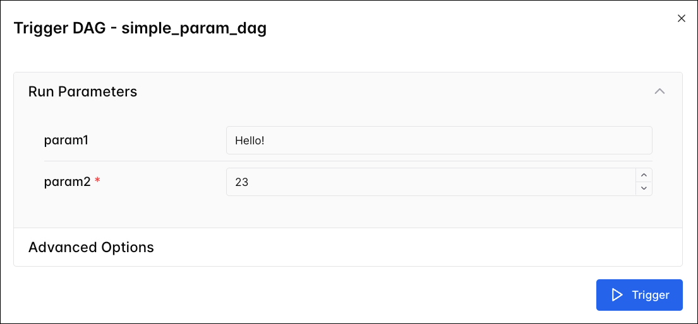

> Если для param указан обязательный `type`, поле по умолчанию считается обязательным из-за [проверки JSON](https://json-schema.org/draft/2020-12/json-schema-validation.html#name-dates-times-and-duration). Чтобы сделать поле необязательным, но с заданным типом, разрешите NULL, задав тип как `["null", "<тип>"]`.
>
> Инфо

> Если тип param не указан, Airflow выводит его по заданному значению по умолчанию.
>
> Инфо

### Типы Param

Поддерживаются следующие типы:

- `object`: поле ввода JSON.
- `array`: многострочное текстовое поле; каждая строка становится элементом массива строк.
- `boolean`: `True` или `False`.
- `number`: число с плавающей запятой (или целое).
- `integer`: целое число.
- `null`: допускает значение None (пустое поле).
- `string`: строка. Тип по умолчанию.

### Атрибуты Param

Кроме атрибута `type` у класса `Param` есть и другие атрибуты для настройки отображения в интерфейсе:

- `const`: фиксированное значение по умолчанию; param скрыт в форме Trigger DAG. Для param всё равно нужно задать значение `default`.
- `enum`: список допустимых значений; в интерфейсе отображается выпадающий список.
- `format`: [формат JSON](https://json-schema.org/draft/2020-12/json-schema-validation.html#name-dates-times-and-duration), по которому Airflow проверяет ввод пользователя.
- `section`: секция в форме Trigger DAG, в которой отображается param. Params без секции попадают в секцию по умолчанию **DAG conf Parameters**.
- `description`: описание param.
- `title`: заголовок param в форме Trigger DAG.

Все атрибуты `Param` необязательны. Для params типа string можно задать `minLength` и `maxLength`; для integer и number — `minimum` и `maximum`.

### Примеры params в интерфейсе Airflow

Ниже приведены примеры params и их отображения в форме Trigger DAG.

Обязательный строковый param с элементами интерфейса для ввода значения:

```python
from airflow.models.param import Param

"my_string_param": Param(
    "Airflow is awesome!",
    type="string",
    title="Favorite orchestrator:",
    description="Enter your favorite data orchestration tool.",
    section="Important params",
    minLength=1,
    maxLength=200,
)
```

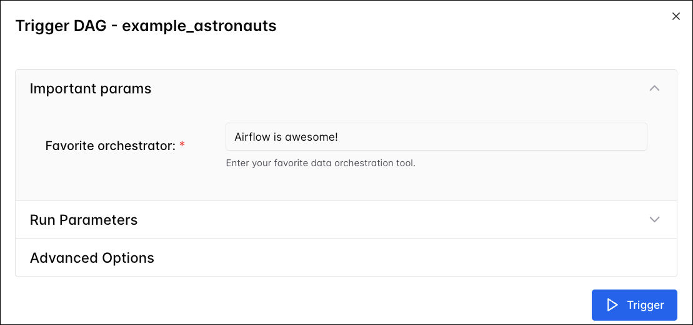

При задании [param типа date, datetime или time](https://datatracker.ietf.org/doc/html/rfc3339#section-5.6) в форме Trigger DAG отображается выбор даты/времени.

```python
from airflow.models.param import Param

"my_datetime_param": Param(
    "2016-10-18T14:00:00+00:00",
    type="string",
    format="date-time",
),
```

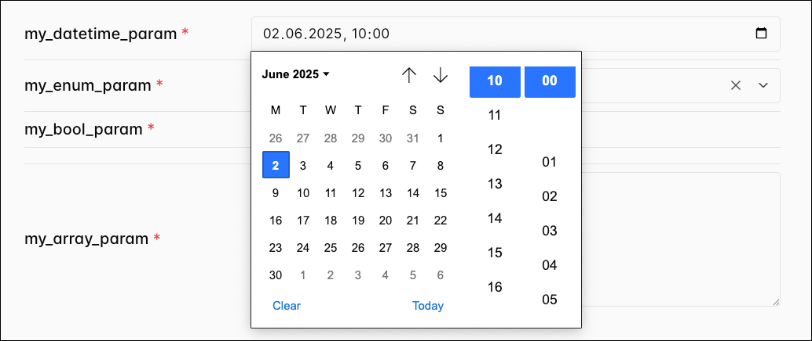

Список значений в атрибуте `enum` даёт выпадающий список в форме Trigger DAG. Значение по умолчанию должно входить в этот список. По правилам проверки JSON необходимо выбрать значение.

```python
from airflow.models.param import Param

"my_enum_param": Param(
    "Hi :)", type="string", enum=["Hola :)", "Hei :)", "Bonjour :)", "Hi :)"]
),
```

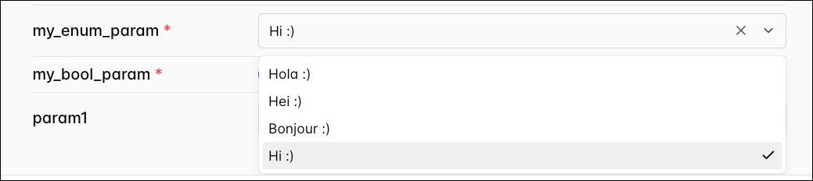

Param типа boolean отображается переключателем в форме Trigger DAG.

```python
from airflow.models.param import Param

"my_bool_param": Param(True, type="boolean"),
```

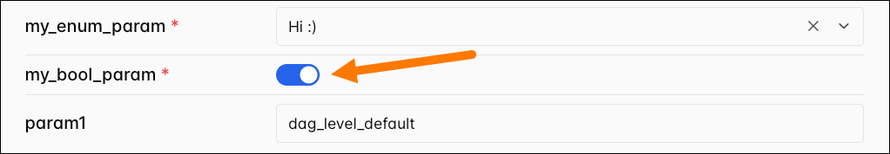

Param типа array — многострочное текстовое поле; каждая строка становится элементом массива.

```python
from airflow.models.param import Param

"my_array_param": Param(["Hello Airflow", ":)"], type="array"),
```

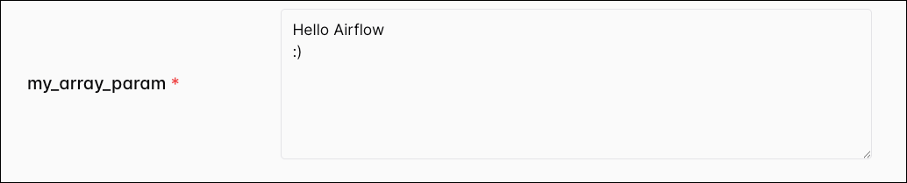

Param типа object — поле ввода JSON; значением должен быть корректный JSON-объект.

```python
from airflow.models.param import Param

"my_object_param": Param({"a": 1, "b": 2}, type="object"),
```

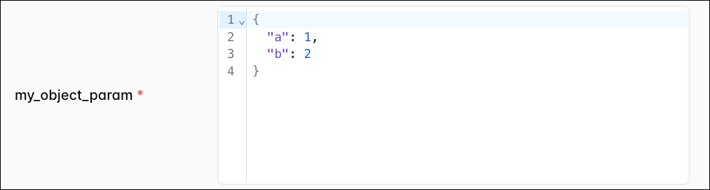

## Задание значений по умолчанию для params на уровне задачи

Значения по умолчанию для params на уровне задачи задаются так же, как на уровне DAG. Если один и тот же ключ задан и на уровне DAG, и на уровне задачи, используется значение на уровне DAG.

**TaskFlow:**

```python
@task(params={"param1": "Hello World!"})
def t1(**context):
    print(context["params"]["param1"])
```

**Традиционный вариант:**

```python
t1 = BashOperator(
    task_id="t1",
    bash_command="echo {{ params.param1 }}",
    params={"param1": "Hello World!"},
)
```

## Доступ к params в задаче

К params в задаче Airflow можно обращаться так же, как к другим элементам [контекста Airflow](airflow-context.md).

**TaskFlow:**

```python
from airflow.decorators import task

@task
def t1(**context):
    print(context["params"]["my_param"])
```

**Традиционный вариант:**

```python
from airflow.operators.python import PythonOperator

def t1_func(**context):
    print(context["params"]["my_param"])

t1 = PythonOperator(
    task_id="t1",
    python_callable=t1_func,
)
```

Params также доступны в [шаблонах Jinja](jinja-templating.md) в виде `{{ params.my_param }}`.

При обращении к param, не заданному для данного запуска DAG, задача завершится исключением.

## Приоритет params

Порядок приоритета params (от высшего к низшему):

1. Значения по умолчанию, заданные на уровне задачи.
2. Значения по умолчанию, заданные на уровне DAG.
3. Params, переданные для конкретного запуска DAG способами из раздела [Передача params в DAG при запуске](#передача-params-в-dag-при-запуске), если включена настройка [core.dag_run_conf_overrides_params](https://airflow.apache.org/docs/apache-airflow/stable/configurations-ref.html#dag-run-conf-overrides-params).

---

[← К содержанию](README.md) | [Контекст →](airflow-context.md) | [Trigger rules →](../01. astronomer-basic/trigger-rules.md)
