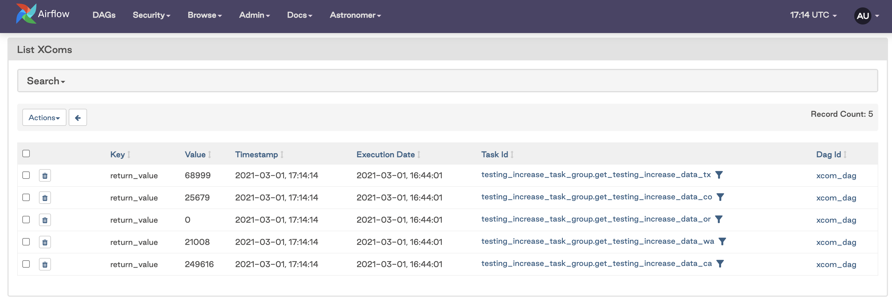
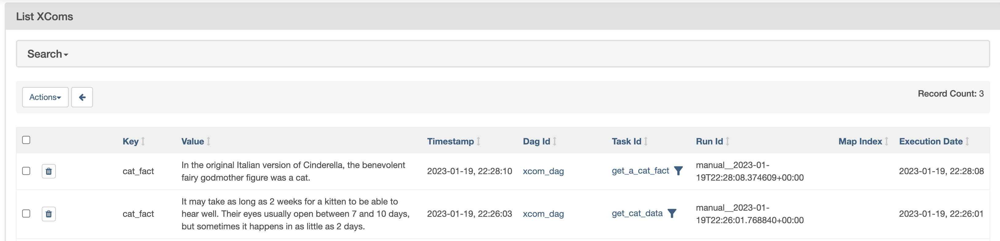
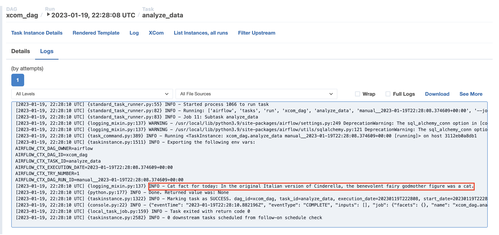

# Передача данных между задачами (XCom и промежуточное хранилище)

Обмен данными между задачами — частый сценарий. Два основных подхода: **XCom** для небольших объёмов и **промежуточное хранилище** (S3, GCS, БД) для больших.

## Идемпотентность и размер данных

- Задачи должны быть **идемпотентными**: повторный запуск с теми же входами даёт тот же результат.
- Размер данных влияет на выбор способа: XCom хранит значения в метаданных Airflow (или в [custom XCom backend](https://www.astronomer.io/docs/learn/custom-xcom-backend-strategies)); ограничения зависят от БД (MySQL ~64 KB, Postgres до 1 GB и т.д.). Большие объёмы — только через внешнее хранилище.

## XCom

**XCom** — встроенный механизм обмена метаданными и небольшими данными между задачами. Значение задаётся ключом, значением и временной меткой.

- **Push:** задача записывает значение (возврат из callable автоматически пушится с ключом `return_value`; явно — `ti.xcom_push(key="my_key", value=...)`).
- **Pull:** задача читает значение — `ti.xcom_pull(task_ids="...", key="...")` или через [Jinja](jinja-templating.md) в шаблонируемых полях: `{{ ti.xcom_pull(task_ids='...') }}`.

В TaskFlow API передача через аргументы автоматически использует XCom: `downstream(upstream())`.

Стандартная сериализация поддерживает JSON, pandas DataFrame (2.6+), Apache Iceberg/Delta (2.8+). Другие типы — через [custom XCom backend](https://www.astronomer.io/docs/learn/custom-xcom-backend-strategies). Просмотр XCom в UI: Admin → XCom (или вкладка у Task Instance).

В логах задачи можно увидеть выведенное значение из вышестоящей задачи; в Admin → XCom — запись с ключом и значением.

  

## Промежуточное хранилище

Для данных, не помещающихся или не подходящих для XCom: одна задача пишет результат во внешнюю систему (S3, GCS, таблица в БД), следующая читает оттуда по пути/ключу/запросу. Путь или идентификатор можно передать через XCom. Обработку очень больших данных лучше выносить в Spark, dbt, warehouse и т.д.; Airflow остаётся оркестратором.

Пример паттерна: задача получает данные из API, сохраняет CSV в S3 через S3Hook; нижестоящая задача читает ключ из XCom, загружает файл из S3 и обрабатывает. См. [Passing data between tasks](https://www.astronomer.io/docs/learn/airflow-passing-data-between-tasks#intermediary-data-storage).

---

[← К содержанию](README.md) | [Контекст →](airflow-context.md) | [Декораторы →](airflow-decorators.md) | [Dynamic tasks →](dynamic-tasks.md)
