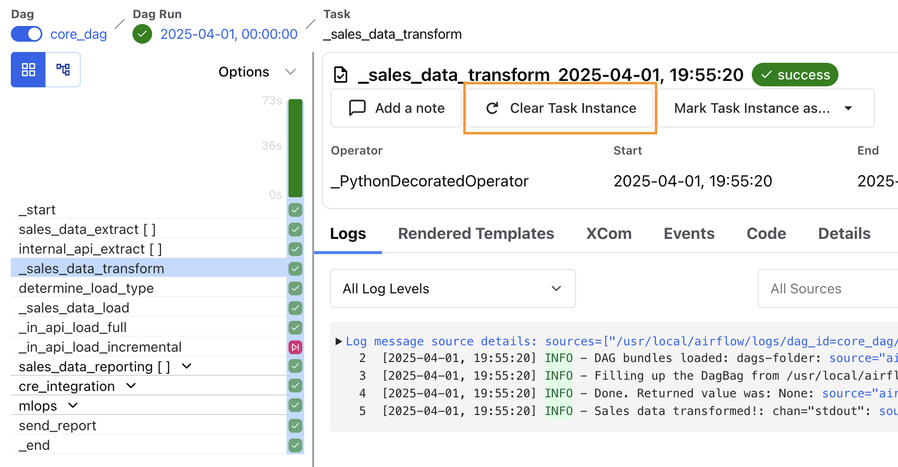
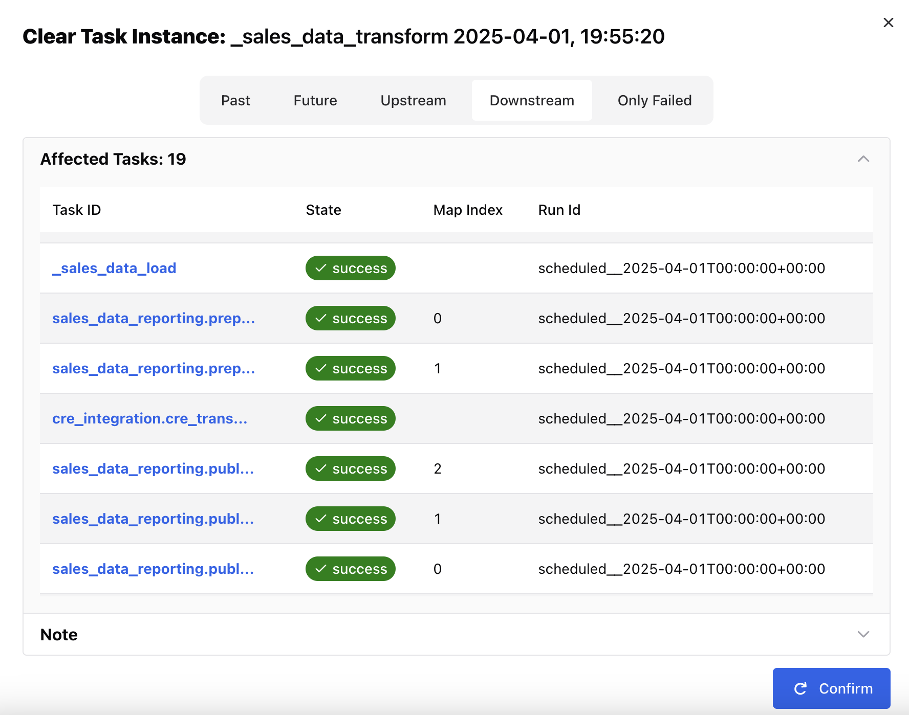
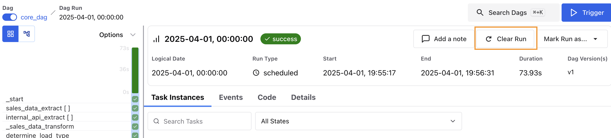
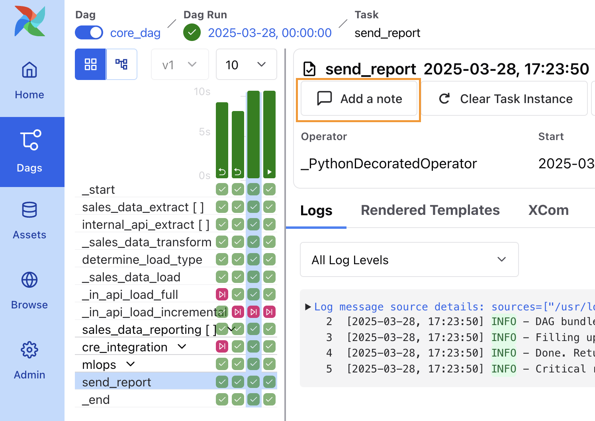
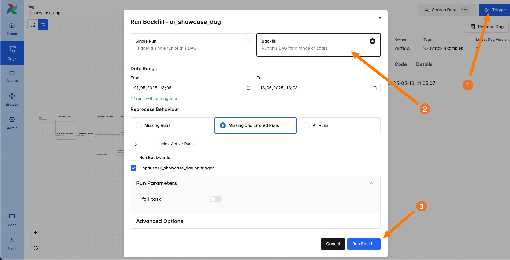

# Повторный запуск DAG и задач (Rerunning)

Когда и как запускать DAG в Airflow, задаётся разными вариантами [расписания](../01.%20astronomer-basic/scheduling.md). Запуск задач или DAG вне обычного расписания может понадобиться, например, в таких случаях:

- Нужно обработать данные за два месяца до даты начала DAG.
- DAG разворачивается с датой начала год назад, и нужно запустить все DAG run за этот период.
- Требуется вручную перезапустить упавшую задачу для одного или нескольких DAG run.
- Нужно, чтобы одна или несколько задач автоматически повторялись при сбое.

В этом руководстве: настройка автоматических повторных попыток (retries), ручной перезапуск задач и DAG, запуск исторических DAG run, а также концепции catchup и backfill в Airflow.

## Необходимая база

Полезно понимать:

- Расписание DAG. См. [Расписание в Airflow](../01.%20astronomer-basic/scheduling.md).

## Автоматические повторные попытки задач

В Airflow можно настроить автоматический повтор задачи при сбое. Число попыток по умолчанию задаётся конфигом **`default_task_retries`** (в `airflow.cfg` или переменной окружения `AIRFLOW__CORE__DEFAULT_TASK_RETRIES`). Для отдельной задачи это переопределяется параметром **`retries`**.

Параметр **`retry_delay`** (по умолчанию `timedelta(seconds=300)`) задаёт паузу между попытками. Максимальную паузу можно ограничить конфигом **`max_task_retry_delay`** (`AIRFLOW__CORE__MAX_TASK_RETRY_DELAY`), по умолчанию 24 часа, или для задачи — параметром **`max_retry_delay`**.

Чтобы пауза между попытками росла до `max_retry_delay`, задайте **`retry_exponential_backoff=True`**.

Обычно число попыток задают для всех задач DAG через **`default_args`** и при необходимости переопределяют для отдельных задач параметром **`retries`**.

В примере ниже четыре задачи всегда падают; у каждой своя конфигурация retry:

```python
from airflow.decorators import dag
from airflow.operators.bash import BashOperator
from pendulum import datetime, duration


@dag(
    start_date=datetime(2023, 4, 1),
    schedule="@daily",
    catchup=False,
    default_args={
        "retries": 3,
        "retry_delay": duration(seconds=2),
        "retry_exponential_backoff": True,
        "max_retry_delay": duration(hours=2),
    },
)
def retry_example():
    t1 = BashOperator(task_id="t1", bash_command="echo I get 3 retries! && False")

    t2 = BashOperator(
        task_id="t2",
        bash_command="echo I get 6 retries and never wait long! && False",
        retries=6,
        max_retry_delay=duration(seconds=10),
    )

    t3 = BashOperator(
        task_id="t3",
        bash_command="echo I wait exactly 20 seconds between each of my 4 retries! && False",
        retries=4,
        retry_delay=duration(seconds=20),
        retry_exponential_backoff=False,
    )

    t4 = BashOperator(
        task_id="t4",
        bash_command="echo I have to get it right the first time! && False",
        retries=0,
    )


retry_example()
```

## Автоматическая пауза DAG при сбоях

Можно настроить автоматическую остановку (паузу) DAG после заданного числа подряд неудачных DAG run, чтобы падающий DAG не продолжал выполняться и не создавал дополнительных проблем.

Глобальный лимит подряд идущих неудачных DAG run задаётся конфигом **`core.max_consecutive_failed_dag_runs_per_dag`**. Например, чтобы все DAG автоматически ставились на паузу после 5 подряд неудачных run:

```text
AIRFLOW__CORE__MAX_CONSECUTIVE_FAILED_DAG_RUNS_PER_DAG=5
```

Для конкретного DAG лимит переопределяется параметром **`max_consecutive_failed_dag_runs`** при создании DAG. Например, пауза после 3 подряд неудачных run:

```python
# from airflow.sdk import dag
# from pendulum import datetime

@dag(
    start_date=datetime(2024, 4, 1),
    schedule="@daily",
    max_consecutive_failed_dag_runs=3,
    catchup=False,
)
def my_dag():
    # Define your tasks here

my_dag()
```

```python
# from airflow.sdk import DAG
# from pendulum import datetime

with DAG(
    dag_id="my_dag",
    start_date=datetime(2024, 4, 1),
    schedule="@daily",
    max_consecutive_failed_dag_runs=3,
    catchup=False,
):
    # Define your tasks here
```

> Параметр и конфиг `max_consecutive_failed_dag_runs` пока экспериментальные и могут измениться в следующих версиях.
>
> Внимание

## Ручной перезапуск задач и DAG

[Перезапуск задач](https://airflow.apache.org/docs/apache-airflow/stable/dag-run.html#re-run-tasks) или всего DAG в Airflow — распространённый сценарий.

Чтобы перезапустить задачу, нужно **очистить** (clear) её состояние: в метасторе обновляются `max_tries` и текущее состояние экземпляра задачи. После перезапуска `max_tries` сбрасывается в `0`, состояние — в `None`.

Как очистить задачу: в UI откройте DAG, выберите нужный экземпляр задачи и нажмите **Clear Task Instance**.



Появится окно с опциями, какие ещё экземпляры очистить и перезапустить:

- **Only Failed** — очищаются только упавшие экземпляры среди выбранных.
- **Downstream** — все задачи текущего DAG run, находящиеся ниже выбранной задачи.
- **Upstream** — все задачи текущего DAG run, находящиеся выше выбранной задачи.
- **Future** — экземпляры этой задачи в DAG run с логической датой после выбранного.
- **Past** — экземпляры этой задачи в DAG run с логической датой до выбранного.

В окне показывается, какие экземпляры будут очищены при текущих настройках. Нажмите **Confirm** — задачи будут очищены и запланированы на повторный запуск.



Очистить экземпляры задач можно и через [Airflow CLI](https://airflow.apache.org/docs/apache-airflow/stable/cli-and-env-variables-ref.html#clear) или [REST API](https://airflow.apache.org/docs/apache-airflow/stable/stable-rest-api-ref.html#operation/patch_task_instance).

Чтобы очистить весь DAG run, откройте его и нажмите **Clear Run**.



> Не меняйте состояние задач напрямую в метасторе Airflow — это может привести к некорректному поведению.
>
> Предупреждение

### Заметки к очищенным задачам и DAG run

В UI можно добавлять заметки к экземплярам задач и к DAG run. Это удобно для учёта ручных изменений (перезапуски, смена статуса). Рекомендуется оставлять заметку при любом ручном изменении экземпляра задачи через UI.

Как добавить заметку:

1. Откройте DAG в Airflow UI.
2. Выберите экземпляр задачи или DAG run.
3. Нажмите **Add a note**.
4. Введите текст и нажмите **Confirm**.



Рекомендуется использовать заметки для отслеживания и прозрачности ручных изменений (перезапуски, смена статуса).

## Catchup

Параметр DAG [**catchup**](https://airflow.apache.org/docs/apache-airflow/stable/dag-run.html#catchup) позволяет обработать данные за логические даты между **start_date** DAG и текущей датой.

При **catchup=True** в момент включения DAG планировщик создаёт DAG run за каждый интервал, который ещё не был выполнен, от `start_date` до текущего интервала. Например: ежедневный DAG с `start_date` 01.01.2025, включён 01.02.2025 — будут запланированы все ежедневные run за январь. То же происходит, если DAG был выключен на период и снова включён.

Параметр задаётся в аргументах DAG. По умолчанию **catchup=False**. Пример с включённым catchup:

```python
@dag(
    dag_id="example_dag",
    start_date=datetime(2025, 4, 23),
    max_active_runs=1,
    schedule="@daily",
    default_args={
        "retries": 1,
        "retry_delay": timedelta(minutes=3),
    },
    catchup=True
)
```

Catchup — мощная возможность, но пользоваться ею нужно осторожно. Например, DAG с расписанием каждые 5 минут и датой начала год назад при **catchup=True** создаст очень много DAG run сразу. Учитывайте ресурсы Airflow и допустимое число одновременных run. Чтобы не перегружать планировщик и внешние системы, можно сочетать catchup с параметрами:

- **`wait_for_downstream`** (на уровне DAG) — аналог `depends_on_past` для всего DAG: следующий DAG run начнётся только после успешного завершения текущего.
- **`depends_on_past`** (на уровне задачи или в `default_args`) — экземпляр задачи ждёт успешного выполнения той же задачи в предыдущем DAG run. Обеспечивает последовательную загрузку и обычно только один активный DAG run за раз.
- **`max_active_runs`** (на уровне DAG) — ограничивает число одновременных DAG run для этого DAG. Например, при значении 3 и 15 catchup run они выполнятся пятью «пачками» по 3.

Чтобы по умолчанию включить catchup для всех DAG (например, при миграции), задайте конфиг **`AIRFLOW__SCHEDULER__CATCHUP_BY_DEFAULT=True`**.

Если catchup включён, но часть задач не должна выполняться во время догоняющих run, можно использовать [**LatestOnlyOperator**](https://registry.astronomer.io/providers/apache-airflow/modules/latestonlyoperator): он выполняется только в последнем по расписанию интервале; в остальных DAG run задача и все нижестоящие пропускаются.

## Backfill

[**Backfill**](https://airflow.apache.org/docs/apache-airflow/stable/core-concepts/dag-run.html#backfill) — запуск DAG за указанный период в прошлом для повторной или пропущенной обработки данных. В отличие от catchup (который создаёт пропущенные run от `start_date` до текущего интервала), период backfill задаётся явно и может быть раньше `start_date` DAG.

В Airflow 3 backfill управляется планировщиком и запускается через UI, API или CLI. В UI: нажмите синюю кнопку **Trigger** и выберите **Backfill**. Укажите диапазон дат и какие run переобрабатывать. Доступны настройки: максимальное число активных run, направление (назад/вперёд), параметры run и один из трёх режимов переобработки:

- **All Runs** — очистить и перезапустить все существующие DAG run в диапазоне и создать недостающие.
- **Missing and Errored Runs** — создать недостающие run и перезапустить ранее упавшие.
- **Missing Runs** — создать и запустить только те run, которых ещё нет за выбранный период.

Запуск — кнопка **Run Backfill**. UI покажет, сколько run будет создано; backfill использует последнюю доступную [версию DAG](dag-versioning.md).



После старта backfill его можно приостановить или отменить в UI. DAG run, созданные backfill, в сетке отмечены значком разворота (u-turn).

Пример backfill через CLI: [документация Airflow](https://airflow.apache.org/docs/apache-airflow/stable/cli-and-env-variables-ref.html#backfill). Запуск через REST API: [Airflow REST API](https://airflow.apache.org/docs/apache-airflow/stable/stable-rest-api-ref.html#tag/Backfill).

При backfill учитывайте доступные ресурсы: при большом числе DAG run и/или других одновременно работающих DAG задайте **max active runs**, чтобы не перегружать планировщик.

---

[← Передача данных](passing-data-between-tasks.md) | [К содержанию](README.md) | [Отладка →](debugging-dags.md)
