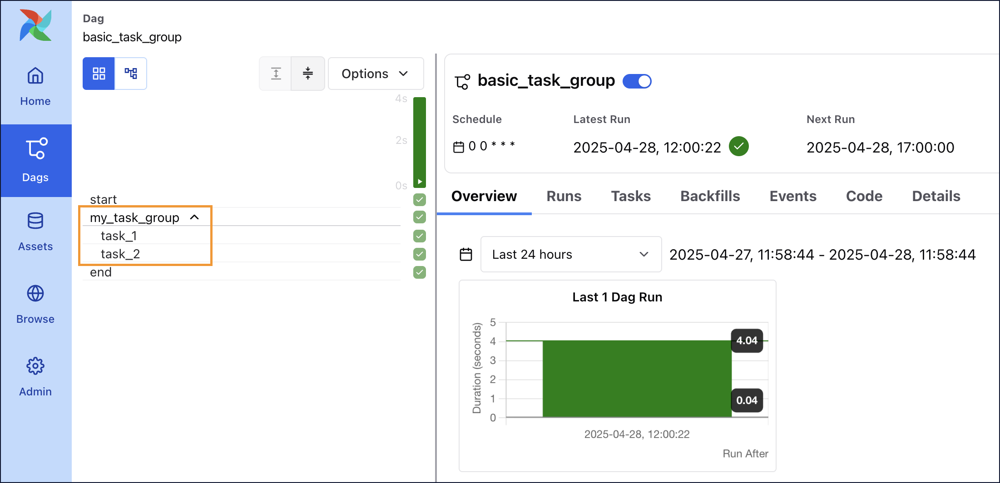
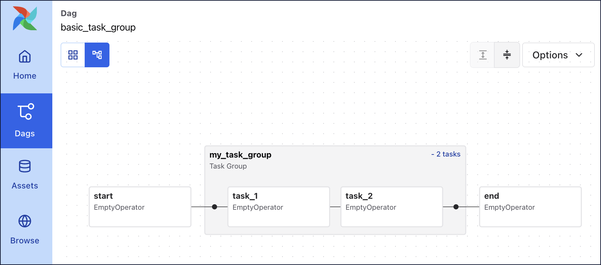
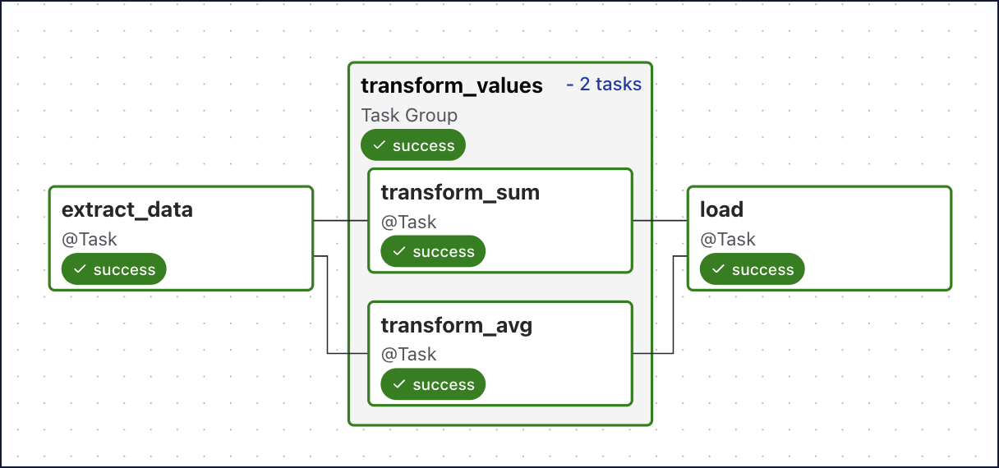
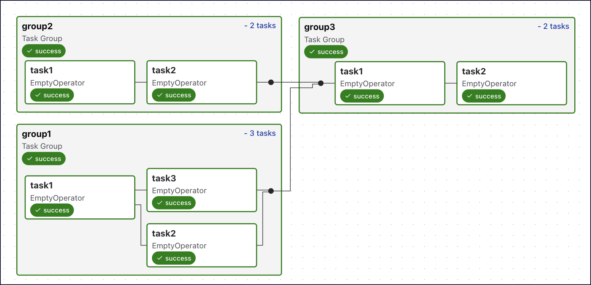
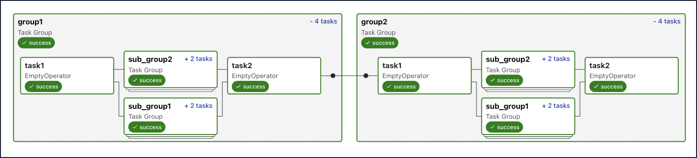
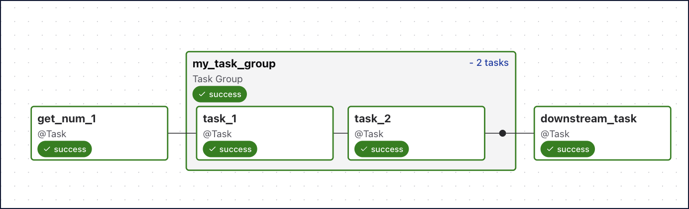

# Группы задач (Task groups)

**Task groups** позволяют логически и визуально объединять задачи в DAG: в Graph/Grid они отображаются как группа, можно сворачивать и разворачивать.

## Зачем использовать

- Визуальная организация сложных DAG (по командам, по таблицам, по моделям в MLOps).
- Переиспользуемые паттерны: одна и та же группа с разными параметрами в нескольких DAG.
- **default_args** на уровне группы вместо всего DAG.
- [Динамический маппинг](dynamic-tasks.md) групп: несколько экземпляров группы с разными входами (единственный способ динамически маппить последовательность задач).

## Определение группы

**Вариант 1 — декоратор @task_group:**

```python
@task_group(group_id="my_task_group")
def tg1():
    t1 = EmptyOperator(task_id="task_1")
    t2 = EmptyOperator(task_id="task_2")
    t1 >> t2

t0 >> tg1() >> t3
```

**Вариант 2 — класс TaskGroup (контекстный менеджер):**

```python
with TaskGroup(group_id="my_task_group") as tg1:
    t1 = EmptyOperator(task_id="task_1")
    t2 = EmptyOperator(task_id="task_2")
    t1 >> t2

t0 >> tg1 >> t3
```

Зависимости внутри группы задаются как обычно (`>>`, `chain`); связь группы с остальным DAG — через `>>` или `chain` с объектом группы (`tg1()` или `tg1`).

Группы отображаются в Grid и Graph:





## Параметры группы

- **group_id** — имя группы (обязательно).
- **default_args** — аргументы по умолчанию для всех задач в группе.
- **tooltip** — подсказка в UI.
- **prefix_group_id** — добавлять ли group_id к task_id (по умолчанию True: полный task_id будет `group_id.task_id`). Важно для XCom и branching — обращаться нужно по полному id.

## task_id в группах

Внутри группы полный **task_id** задачи — `group_id.task_id` (при вложенных группах — `outer_group.inner_group.task_id`). В xcom_pull, branch и при ссылках на задачи используйте этот полный id. При `prefix_group_id=False` префикс не добавляется.

## Передача данных через группу

С декоратором **@task_group** группа может принимать аргументы и возвращать значение (как функция). Если возвращаемое значение передаётся в следующую задачу, зависимость выводится автоматически. Если выход группы никуда не передаётся, зависимость задайте явно: `tg1() >> downstream_task`.



## Динамический маппинг групп

Только с **@task_group**: вызов с **.expand()** создаёт несколько экземпляров группы с разными параметрами:

```python
@task_group(group_id="group1")
def tg1(my_num):
    @task
    def print_num(num):
        return num
    @task
    def add_42(num):
        return num + 42
    print_num(my_num) >> add_42(my_num)

tg1_object = tg1.expand(my_num=[19, 23, 42, 8, 7, 108])
tg1_object >> pull_xcom()
```

XCom из маппленной группы: в xcom_pull указывать `task_ids=["group1.add_42"]` и при необходимости **map_indexes** для конкретных экземпляров.

## Вложенные группы и порядок

Группы можно вкладывать друг в друга. При создании групп в цикле они по умолчанию параллельны; для последовательного выполнения собирайте объекты в список и задавайте зависимости: `[groups[0], groups[1]] >> groups[2]`.





## Кастомный класс TaskGroup

Наследование от **TaskGroup** и определение задач внутри класса (с `@task(task_group=self)` или операторами внутри контекста) даёт переиспользуемый модуль — один класс можно инстанцировать в разных DAG с разными параметрами.



Подробнее: [Task groups](https://www.astronomer.io/docs/learn/task-groups), [Astronomer GitHub: task groups](https://github.com/astronomer/webinar-task-groups).

---

[← К содержанию](README.md) | [Dynamic tasks →](dynamic-tasks.md) | [Зависимости →](../astronomer-basic/task-dependencies.md)
