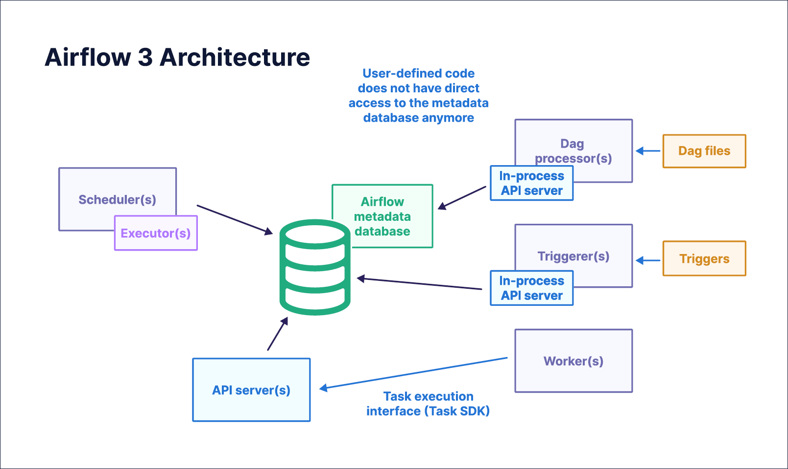

# Компоненты Airflow (Airflow components)

При работе с [Apache Airflow®](https://airflow.apache.org/) понимание компонентов инфраструктуры и их взаимодействия помогает разрабатывать и запускать DAG, устранять неполадки и успешно эксплуатировать Airflow.

В этом руководстве описаны основные компоненты Airflow.

> Между Airflow 2 и Airflow 3 произошли существенные архитектурные изменения: улучшена безопасность и появились возможности вроде удалённого выполнения. Для авторов DAG важно: **прямой доступ к метаданным БД из задач больше невозможен**. Подробнее: [Upgrade from Apache Airflow® 2 to 3](https://www.astronomer.io/docs/learn/airflow-upgrade-2-3) и [Release notes](https://airflow.apache.org/docs/apache-airflow/stable/release_notes.html).
>
> Примечание

## Необходимая база

Полезно понимать:

- Основные концепции Airflow. См. [Introduction to Apache Airflow](https://www.astronomer.io/docs/learn/intro-to-airflow).

## Основные компоненты

Основные компоненты Airflow:

- **Triggerer** — отдельный процесс для выполнения асинхронных Python-функций в рамках trigger-классов. Нужен для [deferrable-операторов](https://www.astronomer.io/docs/learn/deferrable-operators) и [event-driven scheduling](https://www.astronomer.io/docs/learn/airflow-event-driven-scheduling).
- **Метаданные (metadata database)** — хранит данные, важные для работы Airflow: подключения (connections), сериализованные DAG, XCom, историю DAG run и экземпляров задач вместе с метаданными об их состояниях. Чаще всего используется PostgreSQL. См. [поддерживаемые версии](https://airflow.apache.org/docs/apache-airflow/stable/howto/set-up-database.html).
- **DAG processor** — забирает и парсит файлы из расположения, заданного настроенным [DAG bundle(s)](../02.%20astronomer-dags/dag-versioning.md).
- **API server** — FastAPI-сервер, который отдаёт UI Airflow и три API: API для воркеров при выполнении экземпляров задач; внутренний API для UI с обновлениями динамических элементов (состояния задач и DAG run); [публичный Airflow REST API](https://airflow.apache.org/docs/apache-airflow/stable/stable-rest-api-ref.html) для пользователей.
- **Scheduler** — ядро Airflow: следит за всеми задачами и DAG и планирует запуск экземпляров задач, как только выполнены их зависимости. При создании нового DAG run всегда выбирается последняя [версия этого DAG](../02.%20astronomer-dags/dag-versioning.md). Когда задача готова к запуску, планировщик использует настроенный [executor](executors.md) для запуска задачи на воркере.

При локальном запуске через [Astro CLI](https://www.astronomer.io/docs/astro/install-cli) командой `astro dev start` поднимается пять контейнеров — по одному на каждый из основных компонентов.

```
CONTAINER ID    IMAGE                [...]      PORTS       NAMES
f565...         [...]/airflow:latest [...]      >8080/tcp   [...]apiserver1
77e6…           [...]/airflow:latest [...]                  [...]dagprocessor1
88dc...         [...]/airflow:latest [...]                  [...]triggerer1
aa5a...         [...]/airflow:latest [...]                  [...]scheduler1
5f0e...         postgres:12.6        [...]      >5432/tcp   [...]postgres-1
```

Кроме этих компонентов могут быть запущены один или несколько воркеров. Их тип зависит от настроенного [executor](executors.md) планировщика.

## Взаимодействие компонентов

На схеме ниже показано, как основные компоненты взаимодействуют друг с другом:



В общих чертах при добавлении нового простого DAG происходит следующее:

1. Планировщику нужен статус экземпляров задач в DAG, чтобы определить, какие ещё экземпляры теперь удовлетворяют зависимостям и могут быть запланированы. Пока это происходит в фоне, API server отдаёт UI данные о текущем DAG и статусах задач, которые он получает из БД метаданных Airflow.
2. Часть этих данных (например, статус экземпляра задачи) важна для планировщика: он следит за всеми DAG и, как только зависимости выполнены, планирует запуск экземпляров задач.
3. Воркер, взявший экземпляр задачи, выполняет его; метаданные (статус экземпляра, [XCom](https://www.astronomer.io/docs/learn/airflow-passing-data-between-tasks)) отправляются с воркера через API server в БД метаданных Airflow. Если задаче нужны данные (например, [Airflow connection](https://www.astronomer.io/docs/learn/connections)), воркер запрашивает их у API server; сервер получает их из БД метаданных и передаёт воркеру. Пока экземпляр задачи выполняется, воркер пишет логи напрямую в настроенное хранилище логов.
4. Далее экземпляры задач планируются и попадают в очередь. Воркеры опрашивают очередь и забирают запланированные экземпляры для выполнения.
5. Когда планировщик определяет, что DAG готов к следующему run, настроенный [executor](executors.md) решает, как и где запустить первые экземпляры задач этого DAG run.
6. Планировщик проверяет сериализованные DAG и определяет, какие DAG готовы к выполнению по заданному [расписанию](../01.%20astronomer-basic/scheduling.md): сверка расписания с текущим временем, проверка обновлений [assets](../01.%20astronomer-basic/assets.md) и событий от [AssetWatchers](https://www.astronomer.io/docs/learn/airflow-event-driven-scheduling).
7. DAG парсится DAG processor, который сохраняет сериализованную версию в БД метаданных Airflow.

## Управление инфраструктурой Airflow

Все компоненты Airflow должны работать на инфраструктуре, соответствующей требованиям организации. Локальный запуск через [Astro CLI](https://www.astronomer.io/docs/astro/install-cli) удобен для тестов и разработки DAG, но недостаточен для продакшен-нагрузки.

Полезные ресурсы:

- Управляемый Airflow на [Astro](https://www.astronomer.io/product/). Доступен [бесплатный пробный период](https://www.astronomer.io/lp/signup).
- OSS [Official Helm Chart](https://airflow.apache.org/docs/apache-airflow/stable/installation/index.html#using-official-airflow-helm-chart)
- OSS [Production Docker Images](https://airflow.apache.org/docs/apache-airflow/stable/installation/index.html#using-production-docker-images)

При настройке продакшен-окружения важно учитывать масштабирование. См. [Scaling out Airflow](https://www.astronomer.io/docs/learn/airflow-scaling-workers).

## Высокая доступность

Airflow можно сделать высокодоступным, что подходит для крупных организаций с критичными продакшен-нагрузками. Запуск нескольких реплик Scheduler в режиме active-active повышает производительность и отказоустойчивость и устраняет единую точку отказа.

В Astro высокую доступность можно включить при создании deployment: переключатель High Availability в UI или параметр `isHighAvailability` со значением `true` в [API](https://www.astronomer.io/docs/api) или [Terraform](https://registry.terraform.io/providers/astronomer/astro/latest/docs).

---

[← К содержанию](README.md) | [Метаданные БД →](airflow-database.md) | [Исполнители →](executors.md)
