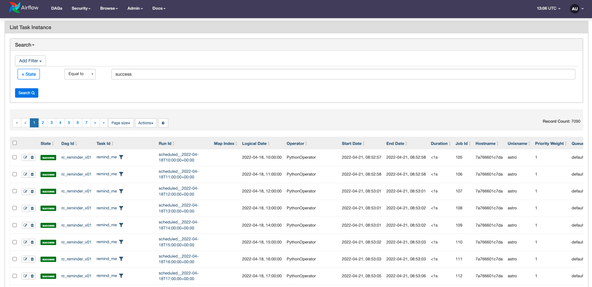

# Метаданные Airflow (Metadata database)

> Эта страница ещё не обновлена под Airflow 3. Описанные концепции актуальны, но часть примеров кода может потребовать правок. При запуске примеров обновляйте импорты и учитывайте возможные breaking changes.
>
> Информация

Метаданная база данных — ключевой компонент Airflow. В ней хранится важная информация: конфигурация ролей и прав доступа окружения, а также все метаданные прошлых и текущих DAG run и task run.

Состояние метаданной БД критично для окружения Airflow. Потеря данных может нарушить выполнение DAG и лишить доступа к данным прошлых запусков. Как и для любого ключевого компонента, для метаданной БД обязательны резервное копирование и план восстановления после сбоев.

В этом руководстве — всё необходимое для поддержания метаданной БД в порядке:

- Доступ к метаданным через Airflow REST API.
- Лучшие практики работы с метаданной БД.
- Важное содержимое БД.
- Требования к СУБД.

## Необходимая база

Полезно понимать:

- Компоненты Airflow. См. [Компоненты Airflow](airflow-components.md).
- Основные концепции Airflow. См. [Introduction to Apache Airflow](../01.%20astronomer-basic/README.md).

## Спецификации БД

Airflow подключается к метаданной БД из слоя приложения через SQLAlchemy и ORM (Object Relational Mapping) в Python. Теоретически подойдёт любая СУБД из [поддерживаемых SQLAlchemy](https://www.sqlalchemy.org/). Чаще всего используют:

- SQLite
- MySQL
- PostgreSQL

В Apache Airflow по умолчанию — SQLite, но **PostgreSQL** распространён гораздо больше и рекомендуется сообществом для большинства сценариев. Astronomer использует Postgres во всех окружениях Airflow, включая локальный запуск через Astro CLI и облачные деплойменты.

При настройке окружения важно учитывать размер метаданной БД. В продакшене обычно используют управляемую БД (автомасштабирование, автоматические бэкапы). Размер зависит от нагрузки. Для ориентира: в Apache Airflow по умолчанию SQLite 2 GB (только для разработки). Astro CLI поднимает окружение с Postgres 1 GB.

Изменения конфигурации и схемы метаданной БД происходят часто — практически с каждым минорным обновлением. Для отката версии Airflow используйте команду [`db downgrade`](https://airflow.apache.org/docs/apache-airflow/stable/howto/usage-cli.html#downgrading-airflow).

## Содержимое метаданной БД

В метаданной БД хранятся данные нескольких типов.

- Прочие вспомогательные таблицы: код DAG в разных форматах, сведения об ошибках импорта и т.п.
- Данные о DAG run и task run, создаваемые планировщиком.
- Данные, используемые в DAG: переменные, подключения (connections), XCom.
- Учётные записи пользователей и права доступа.

Во многих случаях доступ к этим данным возможен через UI Airflow или [stable REST API](https://airflow.apache.org/docs/apache-airflow/stable/stable-rest-api-ref.html). Эти способы предпочтительнее прямых запросов к метаданной БД.

### Пользователи и безопасность (User information)

Отдельный набор таблиц хранит данные о пользователях Airflow и их [правах](https://airflow.apache.org/docs/apache-airflow/stable/security/index.html) к различным функциям. Администратор может просматривать часть этих данных в UI во вкладке Security.

### Конфигурации DAG и переменные (Admin)

DAG могут получать и использовать из метаданной БД, в частности:

- [Pools](../04.%20astronomer-advanced/airflow-pools.md).
- [XCom](../02.%20astronomer-dags/passing-data-between-tasks.md).
- [Connections](../01.%20astronomer-basic/connections.md).
- [Variables](https://airflow.apache.org/docs/apache-airflow/stable/howto/variable.html).

Эти таблицы просматриваются и редактируются во вкладке Admin в UI Airflow.

### DAG run и task run (Browse)

Планировщик опирается на метаданную БД для учёта прошлых и текущих событий. Большая часть этих данных доступна во вкладке Browse в UI Airflow.

- **SLA Misses** — задачи, не уложившиеся в SLA.
- **Triggers** — все текущие [triggers](../04.%20astronomer-advanced/deferrable-operators.md).
- **Task Reschedule** — задачи, перенесённые по расписанию.
- **Task Instances** — запись о каждом запуске задачи с атрибутами (priority weight, длительность, URL лога и т.д.).
- **Audit logs** — события, записанные в метаданную БД (например, пауза DAG, запуск задач).
- **Jobs** — данные планировщика о прошлых и текущих job разных типов (`SchedulerJob`, `TriggererJob`, `LocalTaskJob`).
- **DAG Runs** — сведения о всех прошлых и текущих DAG run: успешность, запуск по расписанию или вручную, детальная информация по времени.

### Прочие таблицы

В метаданной БД есть дополнительные таблицы: теги DAG, сериализованный код DAG, ошибки импорта, текущие состояния сенсоров и т.д. Часть этих данных отображается в UI в разных местах:

- Теги DAG показываются под соответствующим DAG с голубым фоном.
- Ошибки импорта — в верхней части представления DAG в UI.
- Исходный код DAG — по клику на имя DAG в основном представлении, затем представление Code.

## Лучшие практики работы с метаданной БД

- При выборе СУБД проверяйте полную поддержку версии в [документации Airflow](https://airflow.apache.org/docs/apache-airflow/stable/howto/set-up-database.html#choosing-database-backend).
- Метаданная БД критична для масштабируемости и отказоустойчивости деплоймента; в продакшене рекомендуется управляемая БД, например [AWS RDS](https://aws.amazon.com/rds/) или [Google Cloud SQL](https://cloud.google.com/sql). Альтернатива — управляемый Airflow, например [Astro](https://www.astronomer.io/lp/signup/), с встроенной масштабируемой и отказоустойчивой метаданной БД.
- Объём памяти метаданной БД может быть ограничен; нехватка памяти может ухудшать производительность Airflow. Это одна из причин, по которой Astronomer не рекомендует передавать большие объёмы данных через XCom и советует использовать механизмы очистки и архивирования в продакшен-деплойментах.
- Осторожно при [удалении старых записей](https://airflow.apache.org/docs/apache-airflow/stable/usage-cli.html#purge-history-from-metadata-database) командой `db clean`: это может повлиять на последующие запуски задач с аргументом `depends_on_past`. Команда `db clean` позволяет удалять записи старше `--clean-before-timestamp` из всех таблиц метаданной БД или из указанного списка таблиц.
- При обновлении или откате версии Airflow следуйте [рекомендуемым шагам](https://airflow.apache.org/docs/apache-airflow/stable/installation/upgrading.html?highlight=upgrade): бэкап метаданной БД, проверка устаревших возможностей, пауза всех DAG, отсутствие выполняющихся задач.

## Доступ к метаданной БД через Airflow REST API

Предпочтительный способ получения данных из метаданной БД — UI Airflow или GET-запросы к [Airflow REST API](https://airflow.apache.org/docs/apache-airflow/stable/stable-rest-api-ref.html).

Через UI и API можно просматривать большую часть метаданной БД без рисков прямых запросов. В редких случаях, когда ни UI, ни REST API не дают нужных данных, можно использовать SQLAlchemy с моделями Airflow для доступа к метаданной БД. Прямые запросы к метаданной БД не рекомендуются: прямое изменение данных может привести к повреждению окружения Airflow.

Ниже — три примера работы с метаданной БД через Airflow REST API.

### Количество успешно выполненных задач

Частая задача — получить метрики вроде общего числа успешно выполненных задач.

Рекомендуемый способ получить такие данные программно — запрос к [stable REST API](https://airflow.apache.org/docs/apache-airflow/stable/stable-rest-api-ref.html#section/Overview). Убедитесь, что в окружении [настроена авторизация API](https://airflow.apache.org/docs/apache-airflow/stable/security/api.html) и переменная `ENDPOINT_URL` указывает на нужный адрес (для локальной разработки: `http://localhost:8080/`).

Скрипт ниже с помощью библиотеки `requests` выполняет GET-запрос к Airflow API за всеми успешными (`state=success`) Task Instances для всех (сокращение: `~`) DAG run всех (`~`) DAG. Для аутентификации используются имя пользователя и пароль из переменных окружения. Количество успешно выполненных задач даёт свойство `total_entries` в JSON-ответе API.

```python
# import the request library
import requests
import os

# provide the location of your airflow instance
ENDPOINT_URL = "http://localhost:8080/"

# in this example env variables were used to store login information
# you will need to provide your own credentials
user_name = os.environ["USERNAME_AIRFLOW_INSTANCE"]
password = os.environ["PASSWORD_AIRFLOW_INSTANCE"]

# query the API for successful task instances from all dags and all dag runs (~)
req = requests.get(
    f"{ENDPOINT_URL}/api/v1/dags/~/dagRuns/~/taskInstances?state=success",
    auth=(user_name, password),
)

# from the API response print the value for "total entries"
print(req.json()["total_entries"])
```

Тот же результат можно получить в UI: **Browse → Task Instances**, фильтр по состоянию `success`. Количество записей (Record Count) отображается справа.



### Пауза и снятие с паузы DAG

Пауза и снятие с паузы DAG — частые операции. Это можно делать вручную в UI, но при большом числе DAG удобнее использовать Airflow REST API: отправка PATCH-запроса.

Скрипт ниже отправляет PATCH-запрос к Airflow API, чтобы обновить запись DAG с указанным ID (здесь `example_dag_basic`): задаётся пауза (`update_mask=is_paused`) с помощью JSON, в котором `is_paused` установлен в `True` (в примере — постановка на паузу; для снятия с паузы укажите `False`).

```python
# import the request library
import requests
import os

# provide the location of your airflow instance
ENDPOINT_URL = "http://localhost:8080/"

# in this example env variables were used to store login information
# you will need to provide your own credentials
user_name = os.environ["USERNAME_AIRFLOW_INSTANCE"]
password = os.environ["PASSWORD_AIRFLOW_INSTANCE"]

# data to update, for unpausing, simply set this to False
update = {"is_paused": True}
# specify the dag to pause/unpause
dag_id = "example_dag_basic"

# query the API to patch all tasks as paused
req = requests.patch(
    f"{ENDPOINT_URL}/api/v1/dags/{dag_id}?update_mask=is_paused",
    json=update,
    auth=(user_name, password),
)

# print the API response
print(req.text)
```

### Удаление DAG

Метаданные DAG можно удалить через иконку корзины в UI Airflow или отправкой запроса `DELETE` в Airflow REST API. Удаление невозможно, пока DAG ещё выполняется. При этом файл с определением DAG не удаляется — при следующем парсинге папки `/dags` планировщиком DAG снова появится в UI без истории.

Скрипт ниже отправляет DELETE-запрос для DAG с указанным ID (здесь: `dag_to_delete`).

```python
# import the request library
import requests
import os

# provide the location of your airflow instance
ENDPOINT_URL = "http://localhost:8080/"

# in this example env variables were used to store login information
# you will need to provide your own credentials
user_name = os.environ["USERNAME_AIRFLOW_INSTANCE"]
password = os.environ["PASSWORD_AIRFLOW_INSTANCE"]

# specify which dag to delete
dag_id = "dag_to_delete"

# send the deletion request
req = requests.delete(
    f"{ENDPOINT_URL}/api/v1/dags/{dag_id}", auth=(user_name, password)
)

# print the API response
print(req.text)
```

---

[← Компоненты](airflow-components.md) | [К содержанию](README.md) | [Исполнители →](executors.md)
