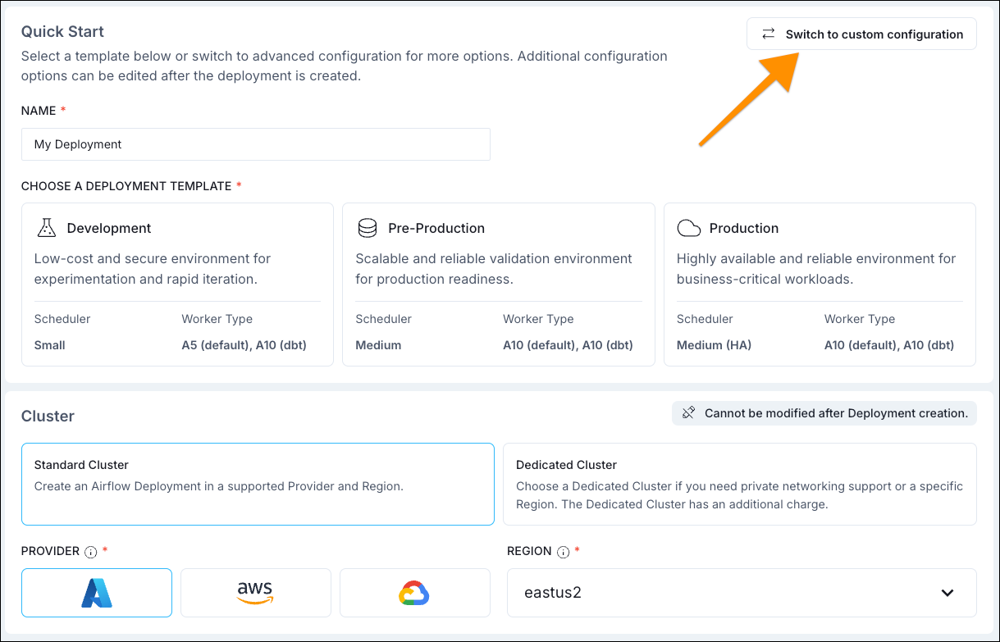
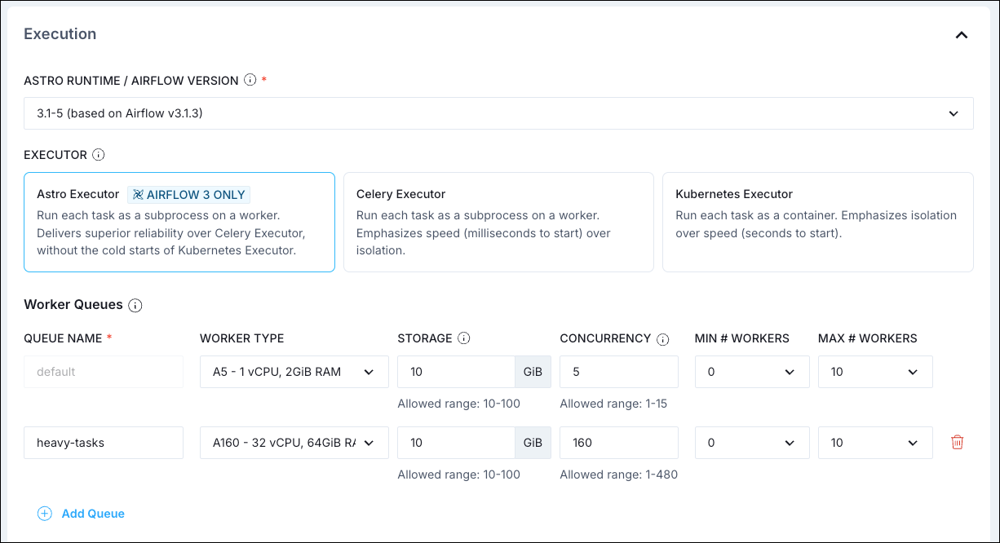

# Исполнители (Executors)

**Executor** — параметр конфигурации [планировщика](airflow-components.md). Он определяет, **где** и **как** выполняется задача. Можно выбрать один из встроенных исполнителей под разные сценарии или реализовать [свой](https://airflow.apache.org/docs/apache-airflow/stable/executor/index.html).

## Рекомендуемые исполнители для продакшена

Три основных варианта:

### AstroExecutor

**AstroExecutor** — проприетарный исполнитель для Airflow 3 на платформе Astro. Использует агентов (воркеров), управляемых API server; поддерживает [hosted](https://www.astronomer.io/docs/astro/execution-mode#hosted-execution) и [remote](https://www.astronomer.io/docs/astro/execution-mode#remote-execution) режимы выполнения. Задачи быстрее стартуют, чем с KubernetesExecutor, и надёжнее распределяются, чем с CeleryExecutor.

Выбирайте AstroExecutor для:

- всех Airflow 3 Deployment на Astro (по умолчанию);
- всех Deployment с remote execution на Astro.

С ним можно использовать [worker queues](https://www.astronomer.io/docs/astro/configure-worker-queues) для разных типов воркеров и ресурсов.

### KubernetesExecutor

Каждый **task instance** выполняется в отдельном Pod в Kubernetes. Полная изоляция задач и тонкая настройка ресурсов на задачу; минус — более долгий старт пода.

Выбирайте для:

- задач с особыми требованиями к ресурсам;
- сценариев с высокой изоляцией.

Требования: метаданные не SQLite; установлен [Kubernetes provider](https://registry.astronomer.io/providers/apache-airflow-providers-cncf-kubernetes/versions/latest). Конфигурация подов: базовая + переопределение через `pod_override` на уровне задачи. См. [Configure KubernetesExecutor](https://www.astronomer.io/docs/astro/kubernetes-executor) (Astro) и [Kubernetes Executor](https://airflow.apache.org/docs/apache-airflow-providers-cncf-kubernetes/stable/kubernetes_executor.html#configuration) (self-hosted).

### CeleryExecutor

Задачи отправляются в очередь (брокер Celery), их забирают **Celery workers**. Быстрый старт задач после первоначальной настройки, горизонтальное масштабирование. Часто используется по умолчанию в Airflow 2 на Astro и в self-managed окружениях.

Выбирайте для:

- высокой параллельной нагрузки;
- стабильных рабочих нагрузок с частым запуском задач;
- всех Airflow 2 Deployment на Astro, если не нужен KubernetesExecutor.

Требования: брокер (Redis, RabbitMQ, Redis Sentinel); Astro использует Redis. Установлен [Celery provider](https://registry.astronomer.io/providers/apache-airflow-providers-celery/versions/latest). На Astro также доступны [worker queues](https://www.astronomer.io/docs/astro/configure-worker-queues). Подробнее: [Configure CeleryExecutor](https://www.astronomer.io/docs/astro/celery-executor) (Astro), [Celery Executor](https://airflow.apache.org/docs/apache-airflow-providers-celery/stable/celery_executor.html) (self-hosted).

### LocalExecutor

Выполняет задачи **в процессе планировщика**. Самый простой вариант в Airflow 3 (SequentialExecutor и DebugExecutor удалены). Дополнительной инфраструктуры не нужно, но при большом числе задач может влиять на производительность планировщика.

Выбирайте для:

- лёгких продакшен-окружений (self-managed);
- локальной разработки и тестов. [Astro CLI](https://www.astronomer.io/docs/astro/cli/overview) использует LocalExecutor.

Максимальное число одновременных задач на один планировщик задаётся [`[core].parallelism`](https://airflow.apache.org/docs/apache-airflow/stable/configurations-ref.html#parallelism) (по умолчанию 32, минимум 1).

### Другие исполнители (self-managed)

- **AwsLambdaExecutor** ([experimental](https://airflow.apache.org/docs/apache-airflow-providers-amazon/stable/executors/lambda-executor.html)) — отправка задач в AWS Lambda.
- **AwsBatchExecutor** — задачи в контейнерах через AWS Batch.
- **AwsEcsExecutor** — каждая задача в отдельной ECS task.
- **EdgeExecutor** — распределение задач по удалённым воркерам по HTTP(s). [Edge3 provider](https://airflow.apache.org/docs/apache-airflow-providers-edge3/stable/index.html), Airflow 2.10+.

Гибриды CeleryKubernetesExecutor и LocalKubernetesExecutor в Airflow 3 удалены. В self-hosted можно настроить [несколько исполнителей](https://airflow.apache.org/docs/apache-airflow/stable/core-concepts/executor/index.html#using-multiple-executors-concurrently) и назначать задаче исполнителя параметром `executor`.

## Настройка исполнителя на Astro

При создании Deployment по умолчанию — AstroExecutor. В UI: кнопка «Switch to custom configuration» → выбор исполнителя. Программно:

- [Terraform](https://registry.terraform.io/providers/astronomer/astro/latest/docs/resources/deployment): параметр `executor` (`ASTRO`, `CELERY`, `KUBERNETES`).
- [Astro API](https://www.astronomer.io/docs/astro/astro-api/platform-api-reference/deployment/create-deployment): в POST параметр `executor`.
- [Astro CLI](https://www.astronomer.io/docs/astro/cli/astro-deployment-create): флаг `--executor` (AstroExecutor, CeleryExecutor, KubernetesExecutor).

  


## Настройка в self-hosted Airflow

В конфиге задаётся список исполнителей в `[core].executor` через запятую:

```ini
[core]
executor = KubernetesExecutor,CeleryExecutor,MyExecutor:my.custom.module.ExecutorClass
```

Два экземпляра одного и того же исполнителя использовать нельзя. Первый в списке — исполнитель по умолчанию. Для задачи исполнитель задаётся параметром `executor`:

```python
@task(executor="CeleryExecutor")
def my_task():
    pass

BashOperator(task_id="my_task", executor="MyExecutor", bash_command="echo 'Hello World!'")
```

---

[← Метаданные БД](airflow-database.md) | [К содержанию](README.md) | [Масштабирование →](scaling-airflow.md)
