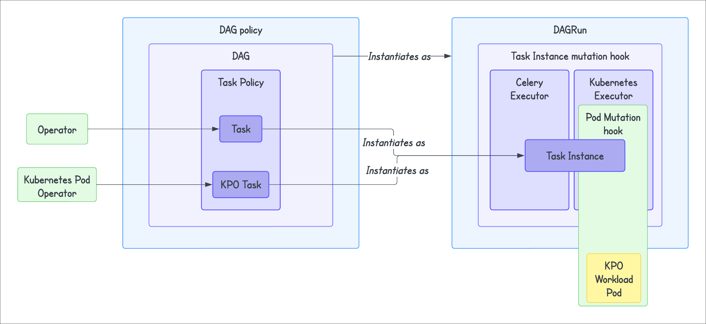

# Расширенные политики кластера (Cluster policies)

> Эта страница ещё не обновлена для Airflow 3. Описанные концепции актуальны, но часть кода может потребовать изменений. При запуске примеров обновите импорты и учтите возможные breaking changes.
>
> Инфо

**Политики кластера (cluster policies)** — наборы правил, которые администраторы Airflow могут задавать для изменения или выполнения собственной логики над несколькими важными объектами Airflow:

- Переменные контекста Airflow (Airflow Context variables)
- Pod
- Task Instance (экземпляр задачи)
- Task (задача)
- DAG

Эти политики позволяют администраторам централизованно управлять тем, как пользователи Airflow или авторы DAG взаимодействуют с кластером Airflow. Политики кластера могут изменять или ограничивать возможности пользователя в соответствии с правилами организации или обеспечивать соблюдение общих стандартов. Например, можно требовать, чтобы все DAG имели `tags` в производственном окружении Airflow.

> В отличие от плагинов Airflow, политики кластера **не отображаются в веб-интерфейсе Airflow**. Поскольку конечные пользователи не видят установленные политики, Astronomer рекомендует добавлять логирование при каждом изменении объекта политикой, чтобы пользователи знали об изменении.
>
> Инфо

Типичные сценарии использования политик кластера:

- Добавление отсутствующих `tags` или email в `owner`
- Направление критичных задач в определённую очередь Celery (`queue`) или пул Airflow (`pool`)
- Ограничение ресурсов, запрашиваемых `KubernetesPodOperator`
- Проверка параметра `catchup` DAG в зависимости от производственного или тестового окружения
- Задание повторов на уровне Task или DAG (retries)

В этом руководстве описаны типы политик кластера, принцип их работы и реализация в Airflow.

## Необходимая база

Чтобы получить максимум от руководства, нужно понимать:

- Astro CLI. См. [Get started with Astro CLI](https://www.astronomer.io/docs/astro/cli/get-started-cli).
- Основы Airflow. См. [Введение в Apache Airflow](https://www.astronomer.io/docs/learn/intro-to-airflow).

## Типы политик кластера

В Airflow можно использовать четыре типа политик кластера:

- **Pod policy (политика Pod):** применяется к Pod Kubernetes, создаваемому при работе `KubernetesPodOperator` или `KubernetesExecutor` в момент выполнения.
- **Task Instance policy (политика экземпляра задачи):** применяется к Task Instance — экземпляру объекта Task, создаваемому в момент выполнения.
- **Task policy (политика задачи):** применяется к объекту Task.
- **DAG policy (политика DAG):** применяется к объекту DAG и принимает объект DAG `dag` в качестве параметра.



## Как работают политики кластера

Любые атрибуты, заданные политиками кластера, имеют приоритет над атрибутами, заданными в DAG или задаче. После внедрения политик, если DAG или задача не соответствуют заданным правилам, политика вызовет исключение `AirflowClusterPolicyViolation` и DAG не будет загружен. В веб-интерфейсе Airflow это исключение отображается как `import error`.

Исключение `AirflowClusterPolicySkipDag` позволяет пропустить DAG. Например, можно не загружать DAG на конец месяца при ежедневной обработке или пропускать DAG с неподходящим тегом окружения. Другой вариант — миграция с устаревшей системы-источника на новую: старые DAG можно пропускать, чтобы избежать сбоев и алертов. Это исключение не отображается в веб-интерфейсе Airflow.

### DAG policy

Политика DAG позволяет переопределять или перенастраивать параметры DAG по заданным критериям. Реализуется функцией `dag_policy`. Она выполняется при загрузке DAG из `DagBag`. С её помощью можно:

- Выполнять код после полной генерации DAG.
- Изменять объект DAG после его загрузки в `DagBag`.

То есть DAG processor по-прежнему разбирает все файлы DAG, даже если один из них пропущен политикой DAG.

Примеры реализации:

- Запрет выполнения DAG путём вызова исключения `AirflowClusterPolicyViolation`.
- Недопущение запуска тестовых DAG в production.
- Требование определённых тегов для DAG (по умолчанию или по условиям).
- Задание владельца по умолчанию для DAG.

Политика `dag_policy` применяется **до** `task_policy` и **после** полной загрузки DAG. Поэтому переопределение параметра `default_args` в `dag_policy` не действует. Чтобы переопределить настройки операторов по умолчанию, используйте политики задач (task policies).

#### Пример

```python
@hookimpl
def ensure_dags_are_tagged(dag: "DAG") -> None:
    tag_labels = [tag.split(":")[0] for tag in dag.tags]
    if not "Owner" in tag_labels:
        raise AirflowClusterPolicyViolation(f"{dag.dag_id} does not have a 'Owner' tag defined.")
```

### Task policy

Политика задачи позволяет переопределять или перенастраивать параметры задачи. Реализуется функцией `task_policy`. Она выполняется при создании задачи во время разбора DAG из `DagBag` при загрузке и изменяет задачи после их добавления в DAG. Таким образом, определение задачи целиком может быть изменено в политике задачи. Политика не привязана к конкретному запуску задачи в `DagRun`. Заданная `task_policy` применяется ко всем экземплярам задачи, которые будут выполнены в будущем. В качестве параметра ожидается `BaseOperator`.

Примеры реализации:

- Переопределение `on_success_callback` или `on_failure_callback` для задачи.
- Использование разного окружения для разных операторов.
- Задание политики таймаута для задачи.

#### Пример

```python
@hookimpl
def task_policy(task: "BaseOperator") -> None:
    min_timeout = datetime.timedelta(hours=24)
    if not task.execution_timeout or task.execution_timeout > min_timeout:
        raise AirflowClusterPolicyViolation(f"{task.dag.dag_id}:{task.task_id} time out is greater than {min_timeout}")
```

### Task Instance policy

> В Airflow версии `2.9.1` и ниже возможны несоответствия в применении `task_instance_mutation_hook`. Исправлено в Airflow `2.9.2`.
>
> Инфо

Политика Task Instance позволяет изменять экземпляры задач до постановки их в очередь планировщиком Airflow. Реализуется функцией `task_instance_mutation_hook`. В отличие от `task_policy`, которая проверяет и изменяет задачи «как определено», политики экземпляра задачи проверяют и изменяют экземпляры задач перед выполнением. В качестве параметра принимается объект TaskInstance `task_instance`. Политика применяется не к задаче, а к экземпляру задачи, связанному с конкретным `DagRun`. Она применяется только к текущему выполняемому запуску (экземпляру) этой задачи. Политика применяется к экземпляру задачи в воркере Airflow перед выполнением экземпляра, а не в процессоре DAG.

Примеры реализации:

- Изменение экземпляра задачи между повторными попытками.
- Задание определённой очереди для отдельных операторов Airflow.

#### Пример

```python
@hookimpl
def task_instance_mutation_hook(task_instance: TaskInstance):
    if task_instance.try_number >= 3:
        task_instance.queue = "big-machine"
```

> Поскольку Airflow определяет приоритет (priority weight) динамически по правилам весов, в хуке Task Instance mutation **нельзя** изменять `priority_weight` экземпляра задачи.
>
> Совет

### Pod policy

Эта политика применяется к Pod Kubernetes, создаваемому в момент выполнения при использовании `KubernetesPodOperator` или `KubernetesExecutor`. Реализуется функцией `pod_mutation_hook`. Эта функция позволяет изменять объект `kubernetes.client.models.V1Pod` перед передачей его клиенту Kubernetes для планирования. В качестве параметра принимается объект Pod `pod`. Политика доступна начиная с Airflow `2.6`.

Например, с её помощью можно изменить ресурсы Pod или добавить sidecar- или init-контейнеры ко всем запускаемым воркерным Pod. В Astro добавление init- или sidecar-контейнеров не разрешено. [Astro](https://www.astronomer.io/docs/astro/deployment-metrics) предоставляет расширенное логирование, сбор метрик и различные способы управления окружением без отдельных контейнеров для сбора статистики или применения настроек окружения.

Примеры реализации:

- Увеличение ресурсов, выделяемых Pod.
- Задание запросов и лимитов ресурсов (resource requests and limits).

#### Пример

```python
from kubernetes.client import models as k8s
from airflow.policies import hookimpl

@hookimpl
def pod_mutation_hook(pod) -> None:
    print("hello from pod_mutation_hook ", type(pod))

    resources = k8s.V1ResourceRequirements(
        requests={
            "cpu": "100m",
            "memory": "256Mi",
        },
        limits={
            "cpu": "1000m",
            "memory": "1Gi",
        },
    )
    pod.spec.containers[0].resources = resources
```

## Реализация

В этом разделе описано, как с помощью `pluggy` реализовать политики кластера для проекта Airflow на Astro CLI. `pluggy` используется для управления плагинами и позволяет иметь несколько реализаций функций политик.

Политики через `pluggy` доступны только в Airflow версии 2.6 и выше. Для версий ниже 2.6 аналогичную реализацию можно выполнить через файл `config/airflow_local_settings.py` в `$AIRFLOW_HOME`: политики задаются в этом файле. При использовании `airflow_local_settings.py` не нужно собирать или устанавливать пакет. На Astro политики можно реализовывать только через интерфейс `pluggy`.

### Шаг 1: Создание пакета для политик

Проще всего реализовать политики кластера в виде пакета, подключаемого к окружению Airflow. Пакет можно поместить в папку `plugins` проекта Astro и установить, [настроив Dockerfile](https://www.astronomer.io/docs/astro/cli/customize-dockerfile). Используется entry point `setuptools` для проекта. Подробнее о сборке Python-пакетов: [Writing pyproject.toml](https://packaging.python.org/en/latest/guides/writing-pyproject-toml/).

Пример структуры пакета `plugins`:

```bash
plugins/
│
├── src/
│   └── policy_plugin/
│       ├── __init__.py
│       └── policy.py
│
├── pyproject.toml
└── README.md
```

1. **Задайте политики в `policy.py`:**

```python
from airflow.policies import hookimpl
from airflow.exceptions import AirflowClusterPolicyViolation

@hookimpl
def task_policy(task):
    print("Hello from task_policy")
    doc_str = "This is a test doc string"
    task.doc = doc_str

@hookimpl
def dag_policy(dag):
    """Ensure that DAG has at least one tag and skip the DAG with `only_for_beta` tag."""
    print("Hello from DAG policy")
    if not dag.tags:
        raise AirflowClusterPolicyViolation(
            f"DAG {dag.dag_id} has no tags. At least one tag required. File path: {dag.fileloc}"
        )
```

При версии Airflow ниже 2.6 или если не нужно упаковывать политики в пакет, их можно задать в `config/airflow_local_settings.py` и пересобрать локальный проект Astro.

2. **В файле `pyproject.toml` добавьте:**

```toml
[build-system]
requires = ["setuptools >= 61.0"]
build-backend = "setuptools.build_meta"

[project]
name = "policy_plugin"
version = "0.3.0"
dependencies = ["apache-airflow>=2.6"]
requires-python = ">=3.8"
description = "Airflow cluster policy"

[project.entry-points.'airflow.policy']
_ = 'policy_plugin.policy'
```

3. **(Опционально) Соберите пакет:**

```bash
python -m build
```

### Шаг 2: Настройка проекта Astro

1. Добавьте в `Dockerfile` строки:

```dockerfile
COPY plugins plugins
RUN pip install ./plugins
```

**Альтернативная настройка**

2. Скопируйте пакет плагина в каталог `plugins` проекта Astro.
3. Инициализируйте проект с помощью [Astro CLI](https://www.astronomer.io/docs/astro/cli/get-started-cli) или откройте существующий проект Astro.

> Можно скопировать `wheel`-файл в каталог `plugins` и выполнить в Dockerfile:
>
> ```dockerfile
> RUN pip install .plugins/plugin_package-*.whl
> ```
>
> Подробнее о распространении пакетов: [Packaging your project](https://packaging.python.org/en/latest/guides/distributing-packages-using-setuptools/#packaging-your-project).
>
> Чтобы не копировать исходный код или переиспользовать пакет в нескольких проектах, рекомендуется **собрать** пакет плагина. Затем можно распространять `wheel`-файл или публиковать пакет в приватном Python-репозитории для удобного управления и версионирования.

4. Выполните `astro dev restart`, чтобы обновить локальный инстанс Airflow. Для сборки и деплоя в Astro Deployment выполните `astro deploy`.

## См. также

- [Доклад на Airflow Summit](https://airflowsummit.org/sessions/2023/an-introduction-to-airflow-cluster-policies/) о политиках кластера
- [Документация Airflow](https://airflow.apache.org/docs/apache-airflow/stable/administration-and-deployment/cluster-policies.html#how-do-define-a-policy-function) по политикам кластера

---

[← К содержанию](README.md) | [MLOps →](airflow-mlops.md)
