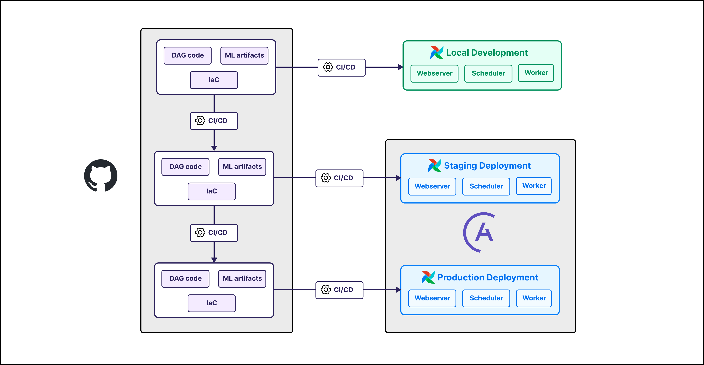
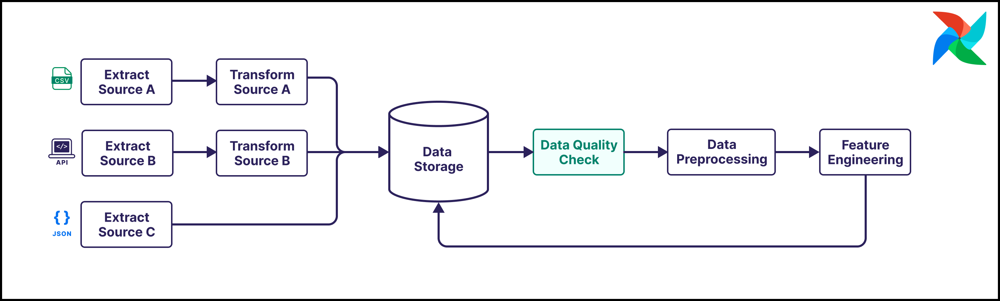
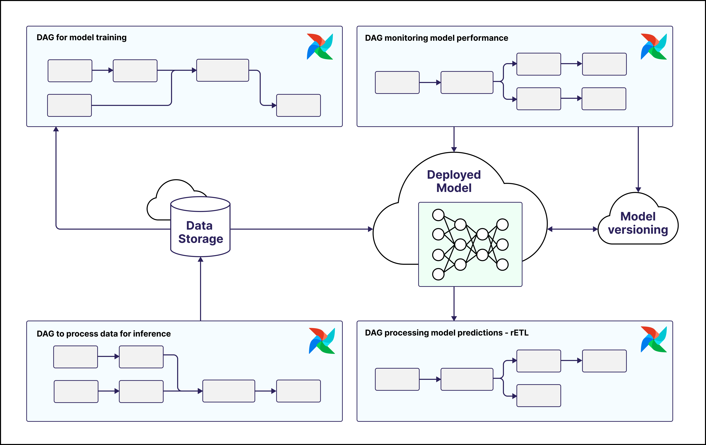
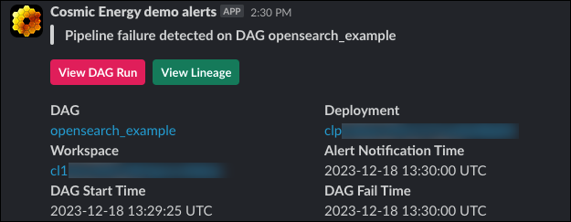
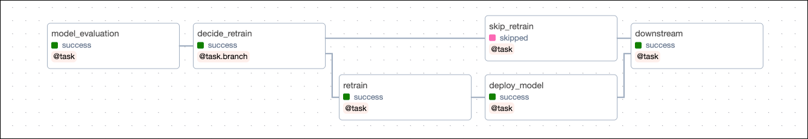
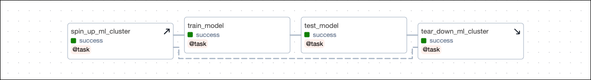
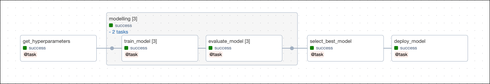

# Airflow для MLOps

> Эта страница ещё не обновлена для Airflow 3. Описанные концепции актуальны, но часть кода может потребовать изменений. При запуске примеров обновите импорты и учтите возможные breaking changes.
>
> Инфо

**Machine Learning Operations (MLOps)** — широкий термин, охватывающий всё необходимое для эксплуатации моделей машинного обучения в production. MLOps быстро развивается, с множеством практик и паттернов; Apache Airflow предоставляет инструмент-агностичную оркестрацию для всех этапов.

В этом руководстве вы узнаете:

- Где искать дополнительные материалы и референсные реализации по использованию Airflow для MLOps.
- Какие возможности и интеграции Airflow особенно полезны для MLOps.
- Как Airflow помогает внедрять лучшие практики для разных компонентов MLOps.
- Как использовать Airflow для операций с большими языковыми моделями (LLMOps).
- Как Airflow вписывается в ландшафт MLOps.

> Модуль Astronomer Academy: [Introduction to GenAI with Apache Airflow®](https://academy.astronomer.io/introduction-to-genai-with-apache-airflow).
>
> По этой теме есть и другие материалы. См. также:
>
> Другие способы изучения

> Референсные архитектуры по [GenAI](https://www.astronomer.io/docs/learn/category/genai) и [MLOps](https://www.astronomer.io/docs/learn/category/mlops), в том числе [Ask Astro](https://github.com/astronomer/ask-astro) — чат-бот для вопросов об Airflow и Astronomer, обученный на актуальной документации.
> Вебинар [Optimizing ML/AI Workflows with Essential Airflow Features](https://www.astronomer.io/events/webinars/optimizing-ml-ai-workflows-with-essential-airflow-features-video/).
>
> Готовы начать? Обратите внимание на рекомендуемые материалы с реализациями ML и AI на Airflow:
>
> Совет

## Необходимая база

Чтобы получить максимум от руководства, нужно понимать:

- Основы Airflow. См. [Введение в Apache Airflow](https://www.astronomer.io/docs/learn/intro-to-airflow).
- Основы [машинного обучения](https://www.coursera.org/specializations/machine-learning-introduction).

## Зачем использовать Airflow для MLOps?

**Machine learning operations (MLOps)** охватывает все паттерны, инструменты и практики, связанные с эксплуатацией моделей машинного обучения в production.

Apache Airflow находится в центре современного MLOps-стека. Будучи инструмент-агностичным, Airflow может оркестрировать все действия в любом MLOps-инструменте с API. В сочетании с тем, что он уже де-факто стандарт для оркестрации data-пайплайнов, Airflow хорошо подходит для унификации рабочих процессов и совместной работы над пайплайнами для data- и ML-инженеров.

Преимущества использования Airflow для MLOps:

- **Использование существующей экспертизы:** во многих организациях уже используют Apache Airflow для data-инженерных процессов и имеют наработанные практики и инструменты. Data- и ML-инженеры могут опираться на существующие процессы и инструменты для оркестрации и мониторинга ML-пайплайнов.
- **Общая платформа:** и data-, и ML-инженеры используют Airflow, что позволяет строить прямые зависимости между пайплайнами, например с помощью [Airflow Datasets](https://www.astronomer.io/docs/learn/airflow-datasets).
- **Интеграции:** у Airflow большая экосистема [интеграций](https://registry.astronomer.io/providers), в том числе множество популярных [инструментов MLOps](https://www.astronomer.io/docs/learn/airflow-mlops#airflow-integrations-for-mlops).
- **Готовность к day 2 Ops:** Airflow — зрелый оркестратор с встроенными возможностями: [автоматические повторы](https://www.astronomer.io/docs/learn/rerunning-dags#automatically-retry-tasks), сложные [зависимости](https://www.astronomer.io/docs/learn/managing-dependencies) и [ветвление](https://www.astronomer.io/docs/learn/airflow-branch-operator), а также [динамические](https://www.astronomer.io/docs/learn/dynamic-tasks) пайплайны.
- **Инкрементальные и идемпотентные пайплайны:** в Airflow можно задавать пайплайны, работающие с данными за заданный период, и выполнять [backfill и перезапуски](https://www.astronomer.io/docs/learn/rerunning-dags#backfill) набора идемпотентных задач. Это удобно для feature store, в том числе с временными признаками, лежащими в основе продвинутого обучения и выбора моделей.
- **Независимость от данных:** Airflow не привязан к формату данных и может оркестрировать любой data-пайплайн. Можно подключать любое хранилище (например, векторную БД или RDBMS) с минимальными усилиями.
- **Гибкий выбор compute:** в Airflow можно [выбирать](https://www.astronomer.io/docs/learn/airflow-mlops#model-operations-and-compute-considerations) вычислительную среду для каждой задачи. Это позволяет подбирать окружение и ресурсы под каждое действие в ML-пайплайне (например, data-задачи на Spark, обучение моделей на GPU).
- **Мониторинг и алерты:** в Airflow есть готовые к production модули мониторинга и уведомлений: [Airflow notifiers](https://www.astronomer.io/docs/learn/error-notifications-in-airflow#notifiers), [расширенное логирование](https://www.astronomer.io/docs/learn/logging), [Airflow listeners](https://www.astronomer.io/docs/learn/airflow-listeners). С их помощью можно гибко настраивать мониторинг ML-операций и получать алерты при сбоях.
- **Расширяемость:** Airflow написан на Python, его можно расширять [кастомными модулями](https://www.astronomer.io/docs/learn/airflow-importing-custom-hooks-operators) и [плагинами Airflow](https://www.astronomer.io/docs/learn/using-airflow-plugins).
- **Нативная среда Python:** пайплайны в Airflow задаются кодом на Python, что упрощает интеграцию популярных ML-инструментов и встраивание MLOps в практики CI/CD. С [декораторами](https://www.astronomer.io/docs/learn/airflow-decorators) TaskFlow API существующие скрипты можно превращать в задачи Airflow.

## Зачем использовать Airflow для LLMOps?

**Large Language Model Operations (LLMOps)** — подмножество MLOps, описывающее работу с большими языковыми моделями (LLM). В отличие от классических ML-моделей, LLM часто слишком велики для обучения с нуля; в LLMOps основное — адаптация существующих LLM под новые сценарии.

Три основных направления в LLMOps:

- **Fine-tuning (дообучение):** обычно предполагает переобучение последних слоёв LLM на своём наборе данных. Часто нужны более сложные пайплайны и больше [compute](https://www.astronomer.io/docs/learn/airflow-mlops#model-operations-and-compute-considerations), оркестрацию которых можно вести в Airflow.
- **Retrieval augmented generation (RAG):** RAG-пайплайны подставляют релевантный контекст из доменных и часто проприетарных данных, чтобы улучшить ответ LLM. См. [Ask Astro](https://www.astronomer.io/docs/learn/reference-architecture-ask-astro) — референсную архитектуру RAG на Airflow.
- **Prompt engineering:** самый простой способ влиять на вывод LLM. В Airflow можно собрать пайплайн, который принимает промпты пользователя, дорабатывает их и отправляет в инференс LLM.

## Компоненты MLOps

MLOps описывает разные подходы к выводу моделей машинного обучения в production. Выделяют четыре основных компонента:

- **ModelOps:** автоматизированное управление, администрирование и мониторинг моделей машинного обучения в production.
- **DataOps:** практики и инструменты data-инженеринга и аналитики, формирующие основу для внедрения ML.
- **DevOps:** практики разработки (dev) и эксплуатации (ops), необходимые для поставки качественного ПО, в том числе приложений на базе ML.
- **BusinessOps:** процессы и активность в организации, необходимые для достижения результата, в том числе успешных MLOps-процессов.

Организации часто находятся на разном уровне зрелости по каждому из этих компонентов. Использование Apache Airflow для оркестрации MLOps-пайплайнов помогает развивать все четыре направления.

### BusinessOps

Первый компонент MLOps — стратегическое согласование со всеми заинтересованными сторонами. Он сильно зависит от организации и сценария и может включать:

- **Model governance:** правила использования ML в организации. Часто связано с регуляторикой (GDPR, HIPAA). В Airflow есть встроенная интеграция с [Open Lineage](https://www.astronomer.io/docs/learn/airflow-openlineage) — открытым стандартом отслеживания происхождения данных, важным для governance моделей.
- **Бизнес-стратегия:** определение целей использования ML и допустимых компромиссов. Модели можно оптимизировать под разные метрики (например, высокий recall или precision); выбор метрик и стратегии модели — задача экспертов предметной области.

### DevOps

Поскольку пайплайны Airflow задаются в Python, к ним применимы практики DevOps. В том числе:

- **Непрерывная интеграция и поставка (CI/CD)**. Стандартная практика — автоматическое тестирование, линтинг и деплой кода. Это держит код в рабочем состоянии и автоматически доставляет изменения в production. Airflow интегрируется с основными CI/CD-инструментами; см. [CI/CD templates](https://www.astronomer.io/docs/astro/ci-cd-templates/template-overview).
- **Версионирование.** Весь код и конфигурация должны храниться в системе контроля версий, например [Git](https://git-scm.com/). Это позволяет отслеживать изменения пайплайнов, моделей и окружения и при необходимости откатываться. Клиенты Astro могут использовать [Deployment rollbacks](https://www.astronomer.io/docs/astro/deploy-history).

> Клиенты Astronomer могут использовать интеграцию Astro с GitHub для автоматического деплоя кода из репозитория в Astro deployment и просмотра метаданных Git в UI Astro. См. [Deploy code with the Astro GitHub integration](https://www.astronomer.io/docs/astro/deploy-github-integration).
>
> Инфо

- **Infrastructure as code (IaC).** Идеально, когда вся инфраструктура описана кодом и проходит тот же CI/CD, что и код пайплайнов и моделей. Так можно контролировать и при необходимости откатывать изменения окружения или быстро разворачивать новые инстансы модели.

На практике следование современным практикам DevOps при использовании Airflow для MLOps означает:

- Хранение артефактов моделей в версионируемой системе (например, MLFlow или object storage).
- Описание всей инфраструктуры как код и один и тот же CI/CD для инфраструктуры и кода Airflow.
- Автоматическое тестирование и линтинг всего кода Airflow перед деплоем.
- Ветки разработки, staging и production в системе контроля версий и привязка их к разным окружениям Airflow. Для Astro: [Manage Astro connections in branch-based deploy workflows](https://www.astronomer.io/docs/astro/astro-use-case/use-case-astro-connections).
- Хранение всего кода и конфигурации Airflow в системе контроля версий (например, Git).

### DataOps

Без данных нет MLOps. Нужны надёжные data-инженерные процессы, чтобы уверенно обучать, тестировать и выводить модели в production. Apache Airflow широко используется для построения надёжных пайплайнов и даёт прочную основу для MLOps.

Стоит уделить внимание следующему:

- **Хранение данных.** Данные для обучения и тестирования. Способ хранения зависит от типа данных и типа ML. Data-инженеринг включает приём данных и перенос их на платформу, с которой модель может работать (object storage, RDBMS, векторная БД). Airflow интегрируется со всеми этими вариантами; [Airflow object storage](https://airflow.apache.org/docs/apache-airflow/stable/core-concepts/objectstorage.html) упрощает типовые операции. **Артефакты моделей:** параметры модели, гиперпараметры и прочие метаданные. Airflow интегрируется с системами версионирования вроде [MLFlow](https://mlflow.org/) или [Weights and Biases](https://www.astronomer.io/docs/learn/airflow-weights-and-biases).
- **Препроцессинг и feature engineering.** Данные часто проходят несколько этапов преобразования перед использованием в модели (например, [препроцессинг](https://scikit-learn.org/stable/modules/preprocessing.html): масштабирование, one-hot-encoding, заполнение пропусков; [отбор признаков](https://scikit-learn.org/stable/modules/feature_selection.html#feature-selection), [снижение размерности](https://en.wikipedia.org/wiki/Dimensionality_reduction), [извлечение признаков](https://scikit-learn.org/stable/modules/feature_extraction.html)). В Airflow эти шаги можно выполнять с помощью [декораторов Airflow](https://www.astronomer.io/docs/learn/airflow-decorators).
- **[Качество данных](https://www.astronomer.io/docs/learn/data-quality) и очистка.** Плохое качество данных ведёт к плохим предсказаниям. Рекомендуется встраивать проверки качества и шаги очистки в пайплайны и задавать требования к данным для успешных последующих ML-операций. Airflow поддерживает интеграцию с любым инструментом качества данных с API и имеет готовые интеграции с [Great Expectations](https://www.astronomer.io/docs/learn/airflow-great-expectations) и [Soda Core](https://www.astronomer.io/docs/learn/soda-data-quality).

Помимо перечисленного, в MLOps часто нужны data governance, [data lineage](https://www.astronomer.io/docs/learn/airflow-openlineage), каталогизация данных и мониторинг дрифта данных.

На практике следование современным практикам data-инженеринга при использовании Airflow для MLOps означает:

- Перенос данных в долговременное холодное хранилище после использования для обучения и тестирования.
- Оркестрация препроцессинга и feature engineering в Airflow.
- Включение проверок качества данных в пайплайны Airflow; критические проверки при падении останавливают пайплайн или вызывают алерт.
- Оркестрация приёма данных из API, БД и object storage в рабочее хранилище для модели (векторная БД, реляционная БД или object storage в зависимости от сценария).
- Следование общим [best practices Airflow](https://www.astronomer.io/docs/learn/dag-best-practices) при написании DAG: атомарные и идемпотентные задачи.

### ModelOps

После закладки основ DevOps и data-инженеринга можно переходить к операциям с моделями.

В Airflow можно использовать выбранные вами ML-инструменты и вычислительные среды. Некоторые организации выносят тяжёлые нагрузки на внешний compute:

- **Внешний compute:** в [AWS](https://registry.astronomer.io/providers/apache-airflow-providers-amazon/versions/latest), [Azure](https://registry.astronomer.io/providers/apache-airflow-providers-microsoft-azure/versions/latest) и [Google Cloud](https://registry.astronomer.io/providers/apache-airflow-providers-google/versions/latest) через соответствующие провайдеры Airflow.
- **Spark:** модули [Spark Airflow provider](https://registry.astronomer.io/providers/apache-airflow-providers-apache-spark/versions/latest).
- **Databricks:** [Astro Databricks provider](https://github.com/astronomer/astro-provider-databricks) и [Databricks Airflow provider](https://registry.astronomer.io/providers/apache-airflow-providers-databricks/versions/latest).
- **Внешние кластеры Kubernetes:** [KubernetesPodOperator](https://www.astronomer.io/docs/learn/kubepod-operator) (и декоратор `@task.kubernetes`).

Другие пользователи [масштабируют](https://www.astronomer.io/docs/learn/airflow-scaling-workers) инфраструктуру Airflow более мощными воркерами для тяжёлых задач. Клиенты Astro могут использовать [worker queues](https://www.astronomer.io/docs/astro/configure-worker-queues) и задавать характеристики воркеров для каждой задачи. Так крупные воркеры задействуются только под самые тяжёлые нагрузки, что экономит ресурсы и затраты.

На практике следование современным практикам model operations при использовании Airflow для MLOps означает:

- Задачи Airflow мониторят качество модели и выполняют автоматические действия (переобучение, переразвёртывание, алерты) при падении метрик ниже порога.
- Оркестрация обучения, дообучения, тестирования и деплоя моделей в Airflow.
- Исследовательский анализ и проверка ML-приложений на небольших подвыборках в ноутбуках перед production. Инструменты вроде [Jupyter](https://jupyter.org/) широко используются; код на Python затем можно перенести в задачи DAG Airflow.

## Как Airflow закрывает задачи MLOps

При использовании Apache Airflow для MLOps можно опираться на три основных паттерна:

- **Весь MLOps в Python-модулях внутри задач Airflow.** Airflow может выполнять любой Python-код и [масштабироваться](https://www.astronomer.io/docs/learn/airflow-scaling-workers), поэтому его можно использовать как универсальный инструмент MLOps.
- **Комбинация оркестрации внешних инструментов и ML-операций внутри Airflow.** Например, создание векторных эмбеддингов в Python-функции в Airflow и последующее обучение модели в [Google Datalab](https://cloud.google.com/monitoring/datalab/set-up-datalab). Декораторы [`@task.kubernetes`](https://www.astronomer.io/docs/learn/kubepod-operator#use-the-taskkubernetes-decorator) или [`@task.external_python_operator`](https://www.astronomer.io/docs/learn/airflow-isolated-environments) позволяют запускать любой Python-код в изолированном окружении с нужными ресурсами.
- **Оркестрация только действий во внешних MLOps-инструментах.** Airflow как инструмент-агностичный оркестратор может управлять всеми шагами в ML-инструментах вроде [MLFlow](https://mlflow.org/) или [AWS SageMaker](https://www.astronomer.io/docs/learn/airflow-sagemaker).

### Возможности Airflow для MLOps

Ряд возможностей Airflow помогает внедрять лучшие практики MLOps:

- **[Backfill и перезапуски](https://www.astronomer.io/docs/learn/rerunning-dags#backfill):** в Airflow можно перезапускать прошлые DAG run и создавать backfill за любой период. Если DAG работают с инкрементами временных данных и идемпотентны, можно ретроспективно менять и создавать признаки — ключевой паттерн для feature store с временными признаками для обучения и тестирования моделей.
- **[Автоматические повторы](https://www.astronomer.io/docs/learn/rerunning-dags#automatically-retry-tasks):** задачи можно настроить на автоматический повтор при сбое с заданной задержкой. Это важно для устойчивости к сбоям внешних сервисов и rate limit; настраивается на уровне окружения, DAG или отдельной задачи.
- **[Алерты и уведомления](https://www.astronomer.io/docs/learn/error-notifications-in-airflow):** в Airflow много вариантов оповещения о событиях в пайплайнах (сбои DAG или задач). Рекомендуется настраивать алерты на критические события в ML-пайплайнах (падение качества модели, провал проверки качества данных). Клиенты Astronomer могут использовать [Astro Alerts](https://www.astronomer.io/docs/astro/alerts).

- **[Ветвление](https://www.astronomer.io/docs/learn/airflow-branch-operator):** в Airflow можно ветвить DAG по результату задачи и строить разные пути в зависимости от исхода. Например, ветвление по качеству модели на тестовой выборке и деплой только при превышении порога.

- **[Setup и teardown](https://www.astronomer.io/docs/learn/airflow-setup-teardown):** в Airflow можно задавать setup- и teardown-задачи, создающие и удаляющие ресурсы для ML. Это переносит идею infrastructure as code в ML-окружение и делает состояние окружения для конкретной ML-операции воспроизводимым.

- **[Динамический маппинг задач](https://www.astronomer.io/docs/learn/dynamic-tasks):** задачи и группы задач можно маппить динамически в runtime. Это позволяет запускать однотипные операции параллельно без заранее известного их числа в DAG run. Например, параллельный запуск набора задач обучения модели с разными гиперпараметрами.

- **[Планирование по данным (Data driven scheduling)](https://www.astronomer.io/docs/learn/airflow-datasets):** с Airflow Datasets DAG можно запускать после обновления конкретного набора данных любой задачей в DAG. Например, DAG обучения модели — после обновления обучающей выборки data-инженерным DAG. См. [Orchestrate machine learning pipelines with Airflow datasets](https://www.astronomer.io/docs/learn/use-case-airflow-datasets-multi-team-ml).

### Интеграции Airflow для MLOps

В Airflow можно оркестрировать действия в любом MLOps-инструменте с API. Для многих инструментов есть готовые интеграции с операторами, декораторами и хуками. Например:

- [Azure ML](https://azure.microsoft.com/en-us/free/machine-learning) — обучение и деплой моделей в Azure.
- (Beta) [Snowpark](https://registry.astronomer.io/providers/astro-provider-snowflake/versions/latest) — выполнение не-SQL кода в Snowflake, в том числе библиотека [Snowpark ML](https://docs.snowflake.com/developer-guide/snowpark-ml/index).
- [Pinecone](https://www.astronomer.io/docs/learn/airflow-pinecone) — векторная БД.
- [Pgvector](https://www.astronomer.io/docs/learn/airflow-pgvector) — расширение для векторных операций в PostgreSQL.
- [OpenSearch](https://www.astronomer.io/docs/learn/airflow-opensearch) — поисковый движок с ML-возможностями.
- [Weaviate](https://www.astronomer.io/docs/learn/airflow-weaviate) — векторная БД с открытым исходным кодом.
- [Weights & Biases](https://www.astronomer.io/docs/learn/airflow-weights-and-biases) — трекинг и визуализация ML-экспериментов.
- [OpenAI](https://www.astronomer.io/docs/learn/airflow-openai) — обучение и деплой больших моделей, в том числе GPT-4 и DALL·E 3.
- [Cohere](https://www.astronomer.io/docs/learn/airflow-cohere) — обучение и деплой LLM.
- [Databricks](https://www.astronomer.io/docs/learn/airflow-databricks) — выполнение нагрузок Apache Spark.
- [AWS SageMaker](https://www.astronomer.io/docs/learn/airflow-sagemaker) — обучение и деплой моделей в AWS.

Провайдеры основных облачных платформ также содержат модули для работы с их ML-инструментами и compute:

- [Google Cloud](https://registry.astronomer.io/providers/apache-airflow-providers-google/versions/latest)
- [Azure](https://registry.astronomer.io/providers/apache-airflow-providers-microsoft-azure/versions/latest)
- [AWS](https://registry.astronomer.io/providers/apache-airflow-providers-amazon/versions/latest)

## Ресурсы

Чтобы узнать больше об использовании Airflow для MLOps:

- **Подкасты:** [Using Airflow To Power Machine Learning Pipelines at Optimove with Vasyl Vasyuta](https://www.astronomer.io/podcast/using-airflow-to-power-machine-learning-pipelines-at-optimove-with-vasyl-vasyuta/), [The Intersection of AI and Data Management at Dosu with Devin Stein](https://www.astronomer.io/podcast/the-intersection-of-ai-and-data-management-at-dosu-with-devin-stein/), [How Laurel Uses Airflow To Enhance Machine Learning Pipelines with Vincent La and Jim Howard](https://www.astronomer.io/podcast/laurel-uses-airflow-enhance-machine-learning-pipelines-vincent-la-jim-howard/), [AI-Powered Vehicle Automation at Ford Motor Company with Serjesh Sharma](https://www.astronomer.io/podcast/ai-powered-vehicle-automation-at-ford-motor-company-with-serjesh-sharma/).
- **eBooks и whitepaper:** [GenAI Cookbook](https://www.astronomer.io/ebooks/gen-ai-airflow-cookbook/), [Guide to Data Orchestration for Generative AI](https://www.astronomer.io/white-papers/gen-ai-data-orchestration/).
- **Вебинары:** [Modern Infrastructure for World Class AI Applications](https://www.astronomer.io/events/webinars/modern-infrastructure-for-world-class-ai-applications-video/) (совместно с Weaviate), [Driving Next-Gen AI Applications with AWS and Astronomer](https://www.astronomer.io/events/webinars/driving-next-gen-ai-applications-with-aws-and-astronomer-video/), [Optimizing ML/AI Workflows with Essential Airflow Features](https://www.astronomer.io/events/webinars/optimizing-ml-ai-workflows-with-essential-airflow-features-video/), [Airflow at Faire: Democratizing Machine Learning at Scale](https://www.astronomer.io/events/webinars/airflow-at-faire-democratizing-machine-learning-at-scale/), [How to Orchestrate Machine Learning Workflows with Airflow](https://www.astronomer.io/events/webinars/how-to-orchestrate-machine-learning-workflows-with-airflow/), [Batch Inference with Airflow and SageMaker](https://www.astronomer.io/events/webinars/batch-inference-with-airflow-and-sagemaker/), [Using Airflow with Tensorflow and MLFlow](https://www.astronomer.io/events/webinars/using-airflow-with-tensorflow-mlflow/).
- **Референсные архитектуры:** [GenAI](https://www.astronomer.io/docs/learn/category/genai), [MLOps](https://www.astronomer.io/docs/learn/category/mlops).

Astronomer продолжает создавать материалы по использованию Airflow для MLOps. Вопросы и предложения по темам можно направлять в канал `#airflow-astronomer` в [Apache Airflow Slack](https://apache-airflow-slack.herokuapp.com/).

---

[← Cluster policies](advanced-cluster-policies.md) | [К содержанию](README.md) | [Плагины →](airflow-plugins.md)
