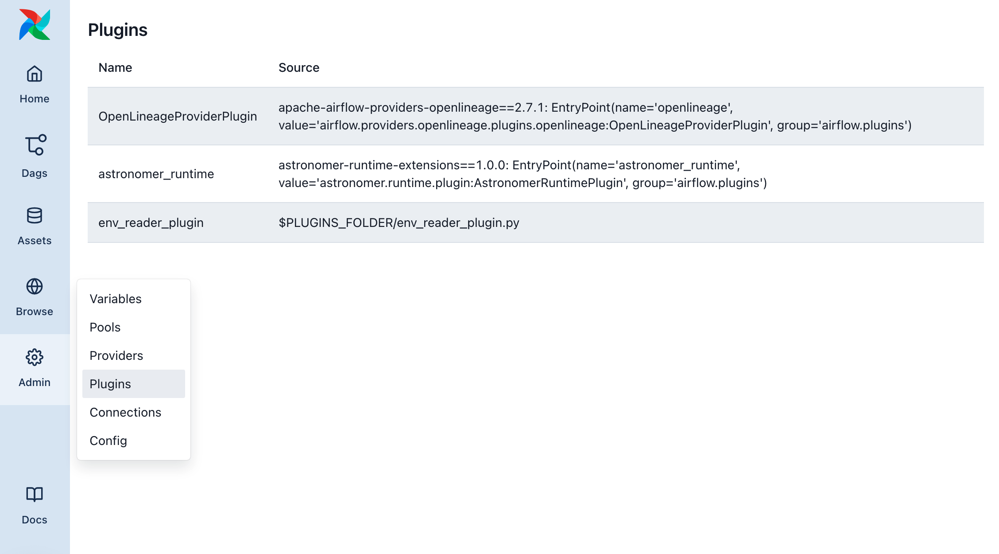
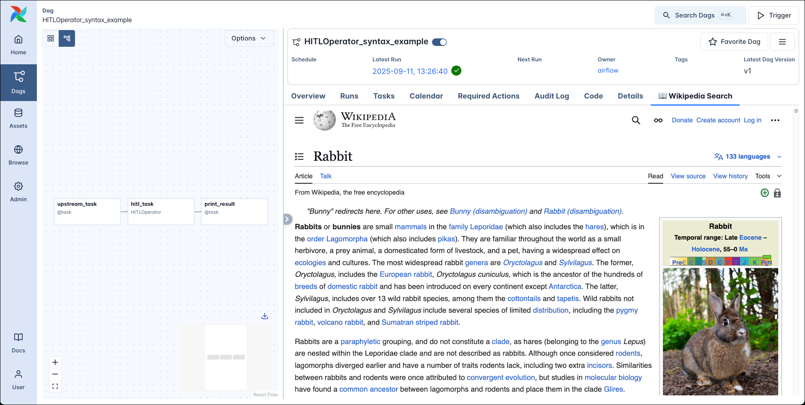
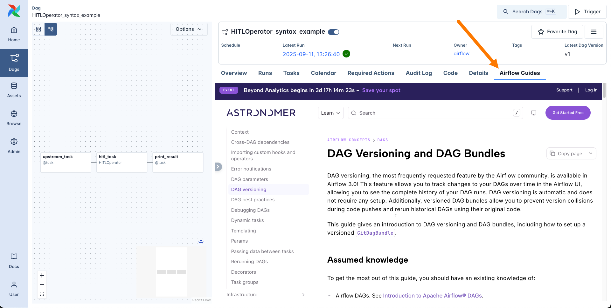
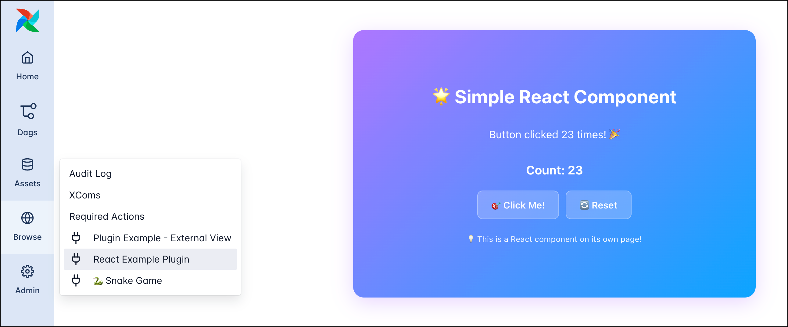
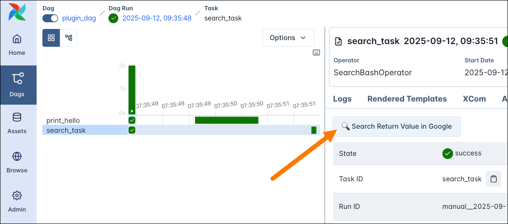
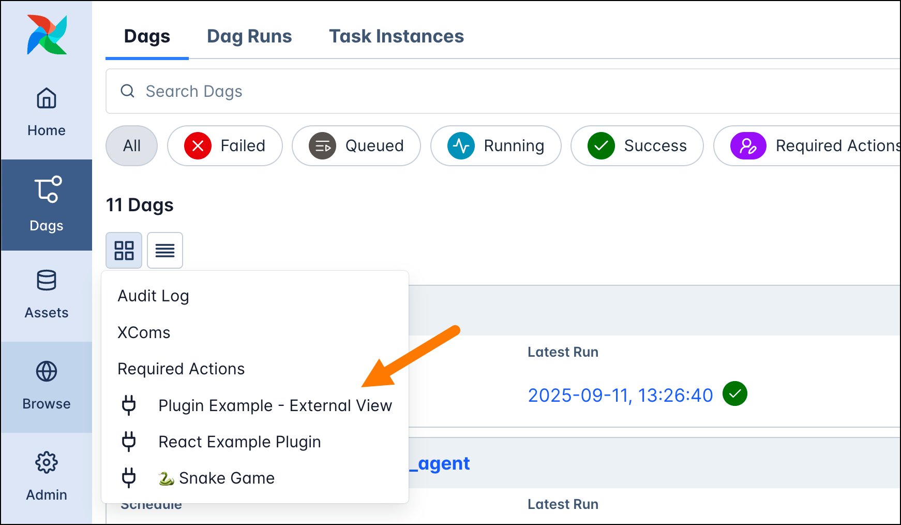
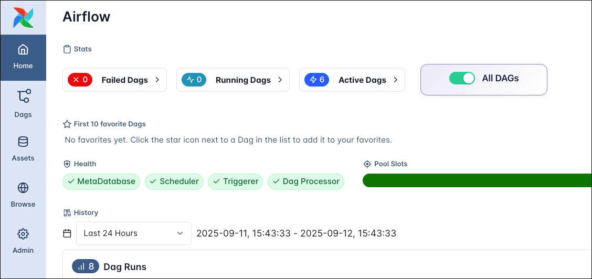

# Использование плагинов Airflow (Using Airflow plugins)

[Плагины Airflow](https://airflow.apache.org/docs/apache-airflow/stable/plugins.html) — внешние возможности, которые можно добавить для настройки установки Airflow, в том числе [веб-интерфейса Airflow](https://www.astronomer.io/docs/learn/airflow-ui). В Airflow 3 в версии 3.1 добавлена полная поддержка плагинов с интерфейсом plugin manager, позволяющим добавлять в плагин разные компоненты: от кастомных макросов до FastAPI-эндпоинтов и React-приложений.

В этом руководстве вы узнаете, когда имеет смысл использовать плагины и как их создавать, с примерами популярных типов.

В Airflow 2 поддерживались представления Flask Appbuilder, пункты меню Flask AppBuilder и Flask Blueprints в плагинах; в Airflow 3 они устарели. Все новые плагины в Airflow 3 должны использовать [External views](https://www.astronomer.io/docs/learn/using-airflow-plugins#external-views), [React apps](https://www.astronomer.io/docs/learn/using-airflow-plugins#react-apps), [FastAPI apps](https://www.astronomer.io/docs/learn/using-airflow-plugins#fastapi-apps) и [FastAPI middlewares](https://www.astronomer.io/docs/learn/using-airflow-plugins#middlewares).

Если нужно использовать устаревшие FAB-плагины в Airflow 3, см. [Upgrading Guide в документации FAB provider](https://airflow.apache.org/docs/apache-airflow-providers-fab/stable/upgrading.html).

## Необходимая база

Чтобы получить максимум от руководства, нужно понимать:

- Основы [JavaScript](https://developer.mozilla.org/en-US/docs/Web/JavaScript) и [React](https://react.dev/).
- Основы [FastAPI](https://fastapi.tiangolo.com/).
- Компоненты Airflow. См. [Компоненты Airflow](https://www.astronomer.io/docs/learn/airflow-components).
- Основы Airflow. См. [Введение в Apache Airflow](https://www.astronomer.io/docs/learn/intro-to-airflow).

## Когда использовать плагины

Плагины дают гибкий способ расширения Airflow. Большинство плагинов расширяют веб-интерфейс Airflow, но можно добавлять и другую функциональность, например FastAPI-приложение. Примеры, когда плагины полезны:

- Добавить кастомный дашборд с информацией о пайплайнах на новой странице в UI Airflow, например статус самых критичных задач.
- Создать дополнительные API-эндпоинты для инстанса Airflow, например для запуска определённого набора DAG.
- Добавить кастомную кнопку в представление Details экземпляра задачи, ведущую к файлам или логам во внешних инструментах, связанных с задачей.
- Добавить middleware к API Airflow для логирования или изменения запросов и ответов.
- Добавить кнопку в представление Home для кастомного действия, например паузы и снятия паузы со всех DAG.

## Интерфейс плагина

Интерфейс плагина задаётся классом `AirflowPlugin` и позволяет добавлять в плагин компоненты. Плагин может состоять из одного или нескольких компонентов; например, в одном плагине можно объединить React-приложение, FastAPI-приложение и несколько кастомных макросов. В инстанс Airflow можно добавить любое количество плагинов.

Чтобы зарегистрировать плагин, поместите его в Python-файл в папке `plugins` вашего инстанса Airflow. Astronomer рекомендует хранить каждый плагин в отдельном файле.

Ниже — плагин `my_plugin`. Он создаётся наследованием от класса `AirflowPlugin` и добавлением компонентов. Сейчас в плагине нет компонентов, поэтому он ничего не делает. Подробнее о компонентах — в разделе [Компоненты плагина](https://www.astronomer.io/docs/learn/using-airflow-plugins#plugin-components).

При разработке плагинов после изменений нужно перезапускать API-сервер Airflow. В `airflow.cfg` можно задать `AIRFLOW__CORE__LAZY_LOAD_PLUGINS=False` для автоматической перезагрузки плагинов; изменения не отразятся в уже запущенных задачах до перезапуска планировщика.

```python
from airflow.plugins_manager import AirflowPlugin

class MyPlugin(AirflowPlugin):
    name = "my_plugin"

    external_views = []
    react_apps = []
    macros = []
    fastapi_apps = []
    fastapi_root_middlewares = []
    global_operator_extra_links = []
    operator_extra_links = []
    timetables = []
    listeners = []

    def on_load(*args, **kwargs):
        pass
```

## Проверка загруженных плагинов

Чтобы увидеть все загруженные плагины и проверить, загрузился ли ваш плагин, откройте страницу **Plugins** в меню **Admin** в левой панели навигации.



## Компоненты плагина

В этом разделе приведены примеры для каждого типа компонентов, которые можно добавить в плагин. Доступные компоненты:

- **Listeners:** слушатели событий в инстансе Airflow. См. [listeners в документации Airflow](https://airflow.apache.org/docs/apache-airflow/stable/administration-and-deployment/listeners.html).
- **Timetables:** дополнительные расписания для DAG. См. [timetables в документации Airflow](https://airflow.apache.org/docs/apache-airflow/stable/authoring-and-scheduling/timetable.html).
- [**Operator extra links**](https://www.astronomer.io/docs/learn/using-airflow-plugins#operator-extra-links): кнопки для операторов, часто ведущие во внешние системы.
- [**Middlewares**](https://www.astronomer.io/docs/learn/using-airflow-plugins#middlewares): middleware для API Airflow.
- [**FastAPI apps**](https://www.astronomer.io/docs/learn/using-airflow-plugins#fastapi-apps): дополнительные API-эндпоинты для инстанса Airflow.
- [**Macros**](https://www.astronomer.io/docs/learn/using-airflow-plugins#macros): предопределённые функции для использования в Jinja-[шаблонах](https://www.astronomer.io/docs/learn/templating) в шаблонируемых полях операторов.
- [**React apps**](https://www.astronomer.io/docs/learn/using-airflow-plugins#react-apps): встраивание React-приложения в UI Airflow.
- [**External views**](https://www.astronomer.io/docs/learn/using-airflow-plugins#external-views): дополнительные представления UI Airflow в разных местах.

### External views

В инстанс Airflow можно добавлять дополнительные представления в разных [местах](https://www.astronomer.io/docs/learn/using-airflow-plugins#locations). Представление может вести на существующий сайт (он будет встроен через iframe) или на страницу, созданную в [FastAPI-приложении](https://www.astronomer.io/docs/learn/using-airflow-plugins#fastapi-apps), зарегистрированном в том же плагине. В примере ниже — добавление представления с Wikipedia в iframe.

```python
from airflow.plugins_manager import AirflowPlugin

class WikipediaExternalViewPlugin(AirflowPlugin):
    name = "wikipedia_external_view"

    external_views = [
        {
            "name": "📖 Wikipedia Search",
            "href": "https://en.wikipedia.org/wiki/Main_Page",
            "destination": "dag",
            "url_route": "wikipedia_search"
        }
    ]
```

В UI Airflow кнопка внешнего представления отображается в представлении Details DAG.





### React apps

Чтобы встроить в UI Airflow более сложное приложение, можно использовать [React app](https://www.astronomer.io/docs/learn/using-airflow-plugins#react-apps). React-приложения можно добавлять в тех же [местах](https://www.astronomer.io/docs/learn/using-airflow-plugins#external-views), что и External views.

```python
from pathlib import Path
from airflow.plugins_manager import AirflowPlugin
from fastapi import FastAPI
from fastapi.responses import FileResponse, HTMLResponse

PLUGIN_DIR = Path(__file__).parent
app = FastAPI(title="Simple React App", version="1.0.0")

@app.get("/my-app.js")
async def serve_react_component():
    js_file_path = PLUGIN_DIR / "my-app.js"
    return FileResponse(
        path=str(js_file_path),
        media_type="application/javascript",
        filename="my-app.js",
    )

@app.get("/")
async def root():
    return {
        "message": "🌟 Simple React App Plugin",
        "type": "react_app",
        "component_url": "/simple-react-app/my-app.js",
        "description": "Embeds a React component directly in Airflow UI",
    }

class SimpleReactAppPlugin(AirflowPlugin):

    name = "simple_react_app"

    fastapi_apps = [
        {"app": app, "url_prefix": "/simple-react-app", "name": "Simple React App"}
    ]

    react_apps = [
        {
            "name": "React Example Plugin",
            "bundle_url": "/simple-react-app/my-app.js",
            "destination": "nav",
            "category": "browse",
            "url_route": "simple-react-app",
        }
    ]
```

После этого добавьте React-приложение в файл `my-app.js` и откройте его в UI Airflow по адресу `http://localhost:8080/simple-react-app/`.



React-приложение можно встроить в некоторые существующие страницы UI Airflow. Поддерживаемые представления: `dashboard`, `dag_overview` и `task_overview`. Чтобы задать положение элемента на странице, используйте CSS-свойство [`order`](https://www.w3schools.com/cssref/css3_pr_order.php), которое задаёт порядок во flex-контейнере.

Плагин должен быть доступен как глобальная переменная в JavaScript-файле. В примере ниже показано, как это сделать для плагина `DAGToggleWidget`:

```javascript
globalThis['DAG Toggle Widget'] = DAGToggleWidget; // совпадает с именем плагина
globalThis.AirflowPlugin = DAGToggleWidget; // запасной вариант, который ищет Airflow
```

Интеграция React-приложений экспериментальна, интерфейсы могут измениться в будущих версиях. В частности, взаимодействие зависимостей и состояния между UI и плагинами может потребовать доработки для более сложных плагинов.

### Macros

Макрос — предопределённая функция, которую можно использовать в Jinja-[шаблонах](https://www.astronomer.io/docs/learn/templating) в шаблонируемых полях операторов.

```python
from airflow.plugins_manager import AirflowPlugin
from datetime import datetime

def month_start(ds):
    d = datetime.strptime(ds, "%Y-%m-%d")
    return d.replace(day=1).strftime("%Y-%m-%d")

class AirflowTestPlugin(AirflowPlugin):
    name = "macro_plugin_example"
    macros = [month_start]
```

В DAG макрос можно использовать в любом [шаблонируемом поле](https://www.astronomer.io/docs/learn/templating):

```python
from airflow.providers.standard.operators.bash import BashOperator

BashOperator(
    task_id="print_hello",
    bash_command="echo {{ macros.macro_plugin_example.month_start(ds) }}"
)
```

### FastAPI apps

В плагине можно использовать [FastAPI](https://fastapi.tiangolo.com/)-приложение, чтобы добавить эндпоинты к инстансу Airflow и взаимодействовать с ним помимо публичного API Airflow.

```python
from airflow.plugins_manager import AirflowPlugin
from fastapi import FastAPI

app = FastAPI(title="Hello World FastAPI App", version="1.0.0")

@app.get("/hello")
async def hello_world():
    return {"message": "Hello from Airflow!"}

class FastAPIAppPlugin(AirflowPlugin):
    name = "hello_fastapi_app"

    fastapi_apps = [
        {"app": app, "url_prefix": "/hello-app", "name": "Hello World FastAPI App"}
    ]
```

После добавления плагина эндпоинты FastAPI-приложения доступны по адресу `http://localhost:8080/`. В примере выше GET-запрос к `http://localhost:8080/hello-app/hello` вернёт ответ "Hello from Airflow!".

```bash
curl http://localhost:8080/hello-app/hello
```

### Эндпоинты FastAPI на Astro

Чтобы вызывать эндпоинт FastAPI-плагина на Astro (например, при сочетании FastAPI-приложения со ссылкой `external_views` в навигации), используйте **относительный путь** в `href` (без ведущего `/`). На Astro API-сервер доступен по другому базовому URL, чем в других окружениях; относительный путь обеспечивает корректное разрешение URI.

```python
from airflow.plugins_manager import AirflowPlugin
from fastapi import FastAPI

app = FastAPI()

@app.get("/dashboard")
async def dashboard():
    return {"message": "Hello!"}

class MyDashboardPlugin(AirflowPlugin):
    name = "my_dashboard"
    fastapi_apps = [
        {"app": app, "url_prefix": "/my-dashboard", "name": "My Dashboard"}
    ]
    external_views = [{
        "name": "My Dashboard",
        "href": "my-dashboard/dashboard",  # относительный путь, без ведущего /
        "destination": "nav",
        "url_route": "my-dashboard",
    }]
```

При раздаче статических файлов через `StaticFiles` в FastAPI всегда используйте относительные пути в HTML-шаблонах и Python-коде. Абсолютные пути вроде `/my-app/static/style.css` на Astro не работают из-за другого базового URL по сравнению с локальной разработкой.

```html
<!-- Правильно: относительный путь (работает везде) -->
<link rel="stylesheet" href="static/style.css">

<!-- Неправильно: абсолютный путь (ломается на Astro) -->
<link rel="stylesheet" href="/my-app/static/style.css">
```

Документация API генерируется автоматически:

- [Redoc](https://github.com/Redocly/redoc) по адресу `https://<ваш-хост>/redoc`
- [Swagger UI](https://swagger.io/) по адресу `https://<ваш-хост>/docs`
- [Схема OpenAPI JSON](https://swagger.io/specification) по адресу `https://<ваш-хост>/openapi.json`

Эти эндпоинты не защищены механизмом аутентификации API Airflow, поэтому аутентификацию нужно настраивать самостоятельно. См. [документацию FastAPI](https://fastapi.tiangolo.com/tutorial/security/).

### Middlewares

К API-серверу Airflow можно добавить middleware для изменения запросов и ответов ко всем его API. Это касается REST API, API, обслуживающего UI Airflow, и любых добавленных FastAPI-приложений.

```python
from typing import Callable
from airflow.plugins_manager import AirflowPlugin
from fastapi import Request, Response
from starlette.middleware.base import BaseHTTPMiddleware

class HelloWorldLoggingMiddleware(BaseHTTPMiddleware):
    async def dispatch(self, request: Request, call_next: Callable) -> Response:
        print(f"🌐 Hello from middleware! Request: {request.method} {request.url}")
        response = await call_next(request)
        response.headers["X-Hello-Middleware"] = "Hello from Airflow middleware!"

        return response

class HelloWorldMiddlewarePlugin(AirflowPlugin):
    name = "hello_middleware"

    fastapi_root_middlewares = [
        {
            "middleware": HelloWorldLoggingMiddleware,
            "args": [],
            "kwargs": {},
            "name": "Hello World Logging Middleware"
        }
    ]
```

В этом примере при запросе к API Airflow в консоль выводится сообщение, а в ответ добавляется кастомный заголовок.

```
2025-09-12T13:51:49.146084000+02:00🌐 Hello from middleware! Request: GET http://localhost:8080/api/v2/hitlDetails/?dag_id=plugin_dag&dag_run_id=manual__2025-09-12T09%3A35%3A49.540843%2B00%3A00&task_id=search_task
```

Middleware применяется ко **всем** запросам ко всем API, обслуживаемым API-сервером Airflow. Чтобы обрабатывать только часть запросов, реализуйте в middleware проверку и выполняйте логику только для нужных запросов.

### Operator extra links

Operator extra link — кнопка, которую можно добавить в представление Details экземпляра задачи любого оператора. Реализовать можно двумя способами:

- **`operator_extra_links`:** кнопка добавляется в Details всех экземпляров задач **конкретного** оператора.
- **`global_operator_extra_links`:** кнопка добавляется в Details **каждого** экземпляра задачи **любого** оператора.

Глобальные и привязанные к оператору ссылки задаются в плагинах Airflow отдельно. В примере ниже — глобальная ссылка, ведущая на результаты поиска в Google по значению, возвращённому экземпляром задачи.

```python
from airflow.plugins_manager import AirflowPlugin
from airflow.sdk.bases.operatorlink import BaseOperatorLink
from airflow.models import XCom
from urllib.parse import quote_plus
from typing import Optional, Dict, Any

class GoogleSearchXComLink(BaseOperatorLink):
    name = "🔍 Search Return Value in Google"

    def get_link(self, operator, *, ti_key, **context) -> str:

        xcom_value = XCom.get_value(ti_key=ti_key, key="return_value")

        search_term = str(xcom_value)
        encoded_search = quote_plus(search_term)

        return f"https://www.google.com/search?q={encoded_search}"

class OperatorExtraLinkPlugin(AirflowPlugin):
    name = "operator_extra_link"
    operator_extra_links = [GoogleSearchXComLink()]
```

Чтобы использовать эту ссылку, её нужно добавить к одному из ваших операторов, по сути создав [кастомный оператор](https://www.astronomer.io/docs/learn/airflow-importing-custom-hooks-operators). Ниже — оператор `SearchBashOperator`, наследующий `BashOperator` и добавляющий к нему `GoogleSearchXComLink`:

```python
class SearchBashOperator(BashOperator):
    operator_extra_links = [GoogleSearchXComLink()]

search_task = SearchBashOperator(
    task_id="search_task",
    bash_command="echo 'Cute animal picture'",
)
```

В UI Airflow кнопка operator extra link отображается в представлении Details экземпляра задачи.



## Расположение (Locations)

UI-плагины вроде [React apps](https://www.astronomer.io/docs/learn/using-airflow-plugins#react-apps) и [External views](https://www.astronomer.io/docs/learn/using-airflow-plugins#external-views) можно размещать в разных местах UI Airflow.

Плагины с **`destination="nav"`** добавляются в левую панель навигации. Для них нужно указать **`category`**; например, категория `browse` поместит плагин в меню Browse.



**`destination="dag"`** добавляет плагин в виде дополнительной вкладки на каждой странице DAG.

Аналогично **`dag_run`**, **`task`** и **`task_instance`** добавляют плагин в виде дополнительной вкладки на каждой странице dag run, task и task instance соответственно.

Для React-приложений их можно встраивать в существующие страницы UI Airflow; поддерживаемые места: `dashboard`, `dag_overview` и `task_overview`. В примере ниже — кнопка, которая ставит и снимает все DAG с паузы, встроенная на страницу Home (dashboard).



---

[← MLOps](airflow-mlops.md) | [К содержанию](README.md) | [Пуллы →](airflow-pools.md)
