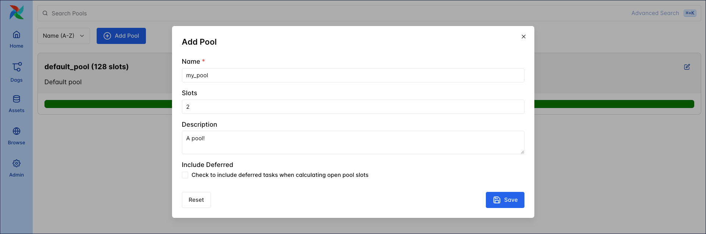

# Пуллы Airflow (Pools)

**Pools** ограничивают параллелизм для произвольного набора задач. Используются, когда нужно не перегружать общий ресурс: один API, одна БД, GPU-ноды и т.д. По умолчанию все задачи попадают в `default_pool` (128 слотов); слоты можно изменить, пул удалить нельзя.

Создание пула: **UI** (Admin → Pools), **REST API** (POST с именем и числом слотов), **CLI** (`airflow pools set` или import из JSON). Назначение задачи: параметр **pool** у оператора (BaseOperator). Если указать несуществующий пул, задача не будет запланирована (ошибка в UI не показывается). Очередность внутри пула задаётся **priority_weight** (больше — выше приоритет); на уровне пула — **priority_weights** и при необходимости свой **weight_rule**. Параметр **pool_slots** (по умолчанию 1) задаёт, сколько слотов занимает одна задача.

Ограничения: пул управляет параллелизмом **task instance**; для лимита DAG run используйте `max_active_runs` или `core.max_active_runs_per_dag`. Одна задача может быть только в одном пуле.

Пример: пул `api_pool` с тремя слотами для задач, бьющих в один API; в одном DAG задать `default_args={"pool": "api_pool", "priority_weight": 3}`, в другом — назначать пул и `priority_weight` только нужным задачам, чтобы при заполнении пула сначала шли задачи с большим весом.

Подробнее: [Airflow pools](https://www.astronomer.io/docs/learn/airflow-pools), [Pools (Airflow docs)](https://airflow.apache.org/docs/apache-airflow/stable/administration-and-deployment/pools.html).

---

[← Плагины](airflow-plugins.md) | [К содержанию](README.md) | [Custom XCom →](custom-xcom-backends.md)
