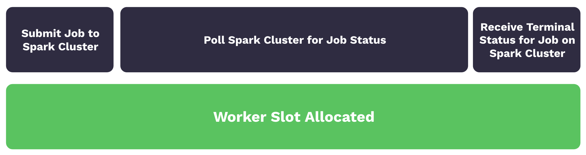
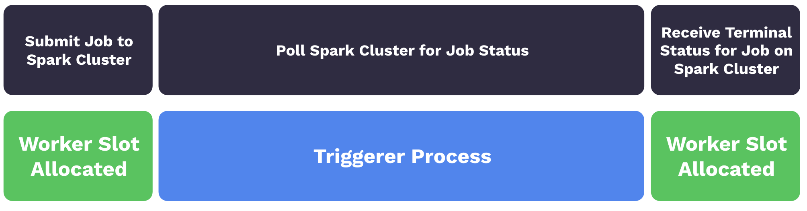
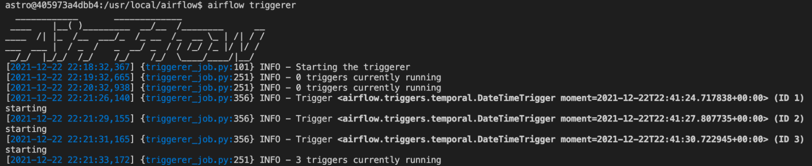
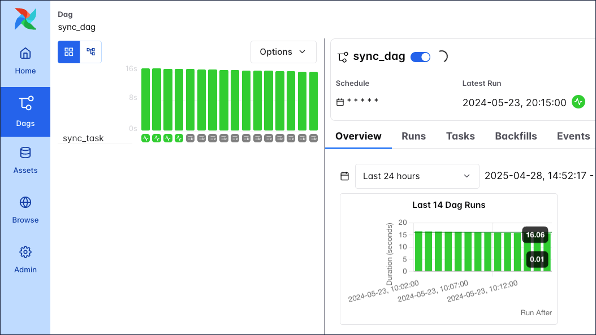
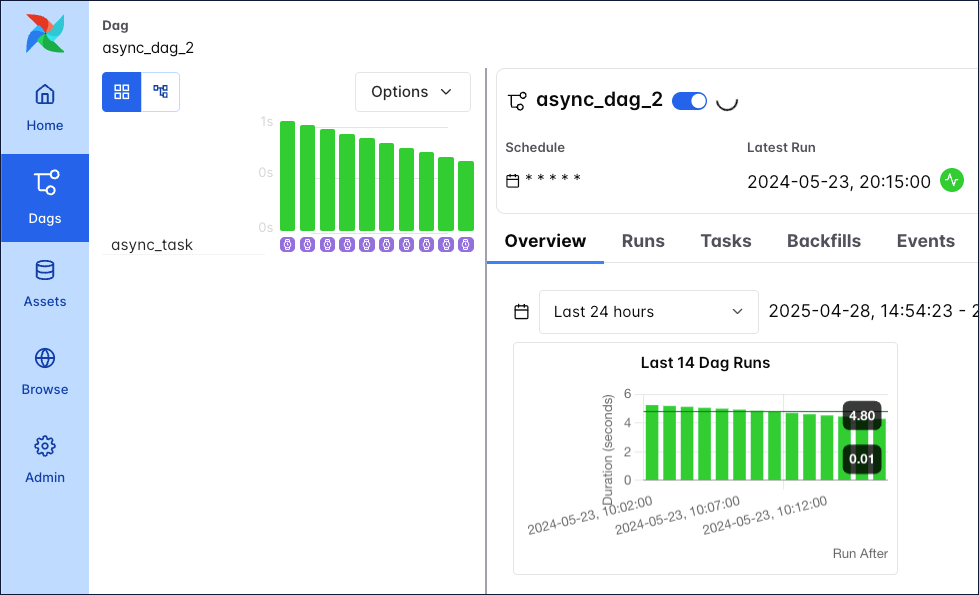

# Deferrable-операторы (Deferrable operators)

Deferrable-операторы используют библиотеку Python [asyncio](https://docs.python.org/3/library/asyncio.html) для эффективного выполнения задач, ожидающих завершения внешнего ресурса. Это освобождает воркеры и позволяет лучше использовать ресурсы. В этом руководстве — концепции deferrable-операторов и их использование в DAG.

## Необходимая база

Чтобы получить максимум от руководства, нужно понимать:

- Сенсоры Airflow. См. [Sensors 101](../01.%20astronomer-basic/sensors.md).
- Операторы Airflow. См. [Operators 101](../01.%20astronomer-basic/operators.md).

## Термины и концепции

Кратко о терминах, связанных с deferrable-операторами:

- **Deferred (отложено):** состояние задачи в Airflow, при котором задача приостановила выполнение, освободила слот воркера и передала триггер процессу triggerer.
- **Triggerer:** сервис Airflow, похожий на scheduler или worker, который запускает [цикл событий asyncio](https://docs.python.org/3/library/asyncio-eventloop.html#asyncio-event-loop) в окружении Airflow. Запуск triggerer обязателен для использования deferrable-операторов.
- **Triggers (триггеры):** небольшие асинхронные фрагменты кода на Python. Благодаря асинхронности они эффективно сосуществуют в одном процессе — triggerer.
- **[asyncio](https://docs.python.org/3/library/asyncio.html):** библиотека Python, основа для асинхронных фреймворков. Она лежит в основе deferrable-операторов и используется при написании триггеров.

Термины deferrable, async и asynchronous здесь используются как синонимы.

При использовании обычных операторов задача отправляет задание во внешнюю систему (например, кластер Spark) и затем опрашивает его статус до завершения. Хотя задача почти не нагружена, она занимает слот воркера на время опроса. Пока слоты заняты, другие задачи ждут в очереди и запускаются с задержкой. Этот процесс показан на рисунке ниже:



При использовании deferrable-операторов слот воркера освобождается, пока задача ждёт статус. При отложении (defer) опрос выполняется как триггер в triggerer, и слот воркера становится свободным. Triggerer может выполнять много асинхронных опросов одновременно, поэтому опросы не занимают воркеры. Когда приходит финальный статус задания, оператор возобновляет задачу, и она снова занимает слот воркера до завершения. Этот процесс показан на рисунке ниже:



> Некоторые deferrable-операторы сразу переходят в отложенное состояние, не попадая сначала на воркер. См. [Triggering Deferral from Start](https://airflow.apache.org/docs/apache-airflow/stable/authoring-and-scheduling/deferring.html#triggering-deferral-from-task-start).
>
> Инфо

Преимущества deferrable-операторов:

- **Устойчивость к перезапускам:** триггеры по задумке stateless. Перезапуск triggerer из-за деплоя или инфраструктуры не переводит отложенные задачи в состояние failure. После повторного запуска triggerer отложенные задачи продолжат выполняться.
- **Меньше потребление ресурсов:** в зависимости от ресурсов и нагрузки в одном процессе triggerer могут выполняться сотни и тысячи отложенных задач. Это может снизить число воркеров в периоды высокой параллельности и позволить уменьшить инфраструктуру Airflow.

> Если для длительной сенсорной задачи нельзя использовать deferrable-оператор (например, нет возможности запустить triggerer), Astronomer рекомендует использовать сенсор в [режиме `reschedule`](https://airflow.apache.org/docs/apache-airflow/stable/core-concepts/sensors.html), чтобы снизить нагрузку на ресурсы. Подробнее о различиях между deferrable-операторами и сенсорами в режиме reschedule: [документация Airflow](https://airflow.apache.org/docs/apache-airflow/stable/authoring-and-scheduling/deferring.html#difference-between-mode-reschedule-and-deferrable-true-in-sensors).
>
> Совет

## Использование deferrable-операторов

Deferrable-операторы стоит использовать для задач, которые занимают слот воркера во время опроса условия во внешней системе. Например, использование deferrable-операторов для сенсоров даёт выигрыш в эффективности и снижает эксплуатационные затраты.

### Запуск triggerer

Для deferrable-операторов в окружении Airflow должен быть запущен triggerer. Настройка на Astro: [Configure a Deployment on Astro Private Cloud - Triggerer](https://www.astronomer.io/docs/astro-private-cloud/v-1-0/configure-deployment#triggerer).

Без Astro запустите процесс triggerer командой `airflow triggerer`. Вывод должен быть похож на следующий:



Когда задачи переходят в отложенное состояние, триггеры регистрируются в triggerer. Число одновременных триггеров в одном процессе triggerer задаётся настройкой [`default_capacity`](https://airflow.apache.org/docs/apache-airflow/stable/configurations-ref.html#triggerer) в Airflow или переменной окружения `AIRFLOW__TRIGGERER__DEFAULT_CAPACITY`. По умолчанию — 1000.

### Deferrable-версии операторов

Многие операторы Airflow (например, [TriggerDagRunOperator](https://registry.astronomer.io/providers/apache-airflow/versions/latest/modules/TriggerDagRunOperator) и [WasbBlobSensor](https://registry.astronomer.io/providers/apache-airflow-providers-microsoft-azure/versions/latest/modules/WasbBlobSensor)) можно перевести в deferrable-режим параметром `deferrable`. Проверить наличие параметра `deferrable` можно в [Astronomer Registry](https://registry.astronomer.io/).

Чтобы по умолчанию использовать deferrable-версию оператора (если она есть), задайте в конфиге Airflow `operators.default_deferrable` в `True`, например переменной окружения:

```text
AIRFLOW__OPERATORS__DEFAULT_DEFERRABLE=True
```

После этого все операторы с параметром `deferrable` по умолчанию будут работать в deferrable-режиме. Для отдельного оператора это можно переопределить параметром `deferrable`:

```python
trigger_dag_run = TriggerDagRunOperator(
   task_id="task_in_downstream_dag",
   trigger_dag_id="downstream_dag",
   wait_for_completion=True,
   poke_interval=20,
   deferrable=False,  # отключение deferrable только для этого экземпляра
)
```

Список операторов с поддержкой deferrable-режима: [документация Airflow](https://airflow.apache.org/docs/apache-airflow-providers/core-extensions/deferrable-operator-ref.html).

Раньше, до появления параметра `deferrable` в обычных операторах, deferrable-операторы были отдельными классами, обычно с суффиксом `-Async`. Часть из них по-прежнему доступна. Например, у `DateTimeSensor` нет параметра `deferrable`, но есть deferrable-версия `DateTimeSensorAsync`.

> Пакет [Astronomer providers](https://github.com/astronomer/astronomer-providers) с множеством операторов с суффиксом `-Async` устарел. Их функциональность перенесена в соответствующие операторы в провайдерах Airflow.
>
> Инфо

## Пример сценария

В примере ниже DAG запускается каждую минуту между `start_date` и `end_date`. В каждом DAG run одна сенсорная задача, которая может выполняться до 20 минут.

```python
from airflow.decorators import dag
from airflow.sensors.date_time import DateTimeSensor
from pendulum import datetime


@dag(
    start_date=datetime(2024, 5, 23, 20, 0),
    end_date=datetime(2024, 5, 23, 20, 19),
    schedule="* * * * *",
    catchup=True,
)
def sync_dag_2():
    DateTimeSensor(
        task_id="sync_task",
        target_time="""{{ macros.datetime.utcnow() + macros.timedelta(minutes=20) }}""",
    )


sync_dag_2()
```

При использовании `DateTimeSensor` каждый запущенный сенсор занимает один слот воркера. При переходе на deferrable-версию сенсора `DateTimeSensorAsync` можно сохранить полную параллельность и освободить воркеры для других задач в Airflow.

На следующем снимке экрана при запуске DAG видно 16 выполняющихся экземпляров задач, в каждом по одному активному `DateTimeSensor`, занимающему слот воркера.



Из-за ограничений Airflow на число активных run одного DAG и число активных задач по DAG во всех run для параллельного выполнения других DAG и задач потребуется масштабирование, см. [Scaling Airflow to optimize performance](../03.%20astronomer-infra/scaling-airflow.md).

При замене `DateTimeSensor` на `DateTimeSensorAsync` по-прежнему будет 16 запущенных DAG run, но задачи окажутся в отложенном (deferred) состоянии и не будут занимать слоты воркеров. В коде DAG меняется только оператор — `DateTimeSensorAsync` вместо `DateTimeSensor`:

```python
from airflow.decorators import dag
from pendulum import datetime
from airflow.sensors.date_time import DateTimeSensorAsync


@dag(
    start_date=datetime(2024, 5, 23, 20, 0),
    end_date=datetime(2024, 5, 23, 20, 19),
    schedule="* * * * *",
    catchup=True,
)
def async_dag_2():
    DateTimeSensorAsync(
        task_id="async_task",
        target_time="""{{ macros.datetime.utcnow() + macros.timedelta(minutes=20) }}""",
    )


async_dag_2()
```

На следующем снимке все задачи в отложенном (фиолетовом) состоянии. Освободившиеся слоты воркеров могут использоваться задачами других DAG — deferrable-оператор получается выгоднее по ресурсам и времени.



## Высокая доступность

Триггеры рассчитаны на высокую доступность. Можно запускать несколько процессов triggerer. Как и в случае [HA scheduler](https://airflow.apache.org/docs/apache-airflow/stable/administration-and-deployment/scheduler.html#running-more-than-one-scheduler), Airflow обеспечивает их совместную работу с блокировками и высокой доступностью. Подробнее: [High Availability](https://airflow.apache.org/docs/apache-airflow/stable/authoring-and-scheduling/deferring.html#high-availability).

## Создание deferrable-оператора

Если оператору полезно быть асинхронным, но готового в OSS Airflow нет, можно реализовать свой deferrable-оператор и класс триггера. При необходимости задачу можно откладывать несколько раз.

Шаблон кастомного deferrable-оператора и триггера приведён ниже. Укажите в методе `.serialize` триггера правильный classpath (сейчас `include.deferrable_operator_template.MyTrigger`) в соответствии со структурой ваших файлов.

**Класс триггера:**

```python
class MyTrigger(BaseTrigger):
    """
    Пример кастомного триггера: ожидание случайного выбора 0 или 1, равного 1.
    Args:
        poll_interval (int): интервал в секундах между опросами.
        my_kwarg_passed_into_the_trigger (str): аргумент, передаваемый в триггер.
    Returns:
        my_kwarg_passed_out_of_the_trigger (str): аргумент, возвращаемый из триггера.
    """

    def __init__(
        self,
        poll_interval: int = 60,
        my_kwarg_passed_into_the_trigger: str = "notset",
        my_kwarg_passed_out_of_the_trigger: str = "notset",
    ):
        super().__init__()
        self.poll_interval = poll_interval
        self.my_kwarg_passed_into_the_trigger = my_kwarg_passed_into_the_trigger
        self.my_kwarg_passed_out_of_the_trigger = my_kwarg_passed_out_of_the_trigger

    def serialize(self) -> tuple[str, dict[str, Any]]:
        """Сериализация аргументов и classpath триггера. Все аргументы должны быть JSON-сериализуемы."""
        return (
            "include.deferrable_operator_template.MyTrigger",
            {
                "poll_interval": self.poll_interval,
                "my_kwarg_passed_into_the_trigger": self.my_kwarg_passed_into_the_trigger,
                "my_kwarg_passed_out_of_the_trigger": self.my_kwarg_passed_out_of_the_trigger,
            },
        )

    async def run(self) -> AsyncIterator[TriggerEvent]:
        while True:
            result = await self.my_trigger_function()
            if result == 1:
                self.log.info("Result was 1, thats the number! Triggering event.")
                self.my_kwarg_passed_out_of_the_trigger = "apple"
                yield TriggerEvent(self.serialize())
                return
            else:
                self.log.info(f"Result was not the one we are waiting for. Sleeping for {self.poll_interval} seconds.")
                await asyncio.sleep(self.poll_interval)

    @sync_to_async
    def my_trigger_function(self) -> str:
        """Здесь выполняется проверка условия (например, вызов API)."""
        import random
        randint = random.choice([0, 1])
        self.log.info(f"Random number: {randint}")
        return randint
```

**Класс оператора:**

```python
class MyOperator(BaseOperator):
    """
    Deferrable-оператор: ожидание случайного выбора 0 или 1, равного 1.
    Args:
        wait_for_completion (bool): ждать ли завершения триггера.
        poke_interval (int): интервал опроса в секундах (в deferrable и sensor режиме).
        deferrable (bool): откладывать ли задачу. Если False — оператор работает как сенсор.
    """

    template_fields: Sequence[str] = ("wait_for_completion", "poke_interval")
    ui_color = "#73deff"

    def __init__(
        self,
        *,
        wait_for_completion: bool = False,
        poke_interval: int = 60,
        deferrable: bool = conf.getboolean("operators", "default_deferrable", fallback=False),
        **kwargs,
    ) -> None:
        super().__init__(**kwargs)
        self.wait_for_completion = wait_for_completion
        self.poke_interval = poke_interval
        self._defer = deferrable

    def execute(self, context: Context):
        if self.wait_for_completion:
            if self._defer:
                self.log.info("Operator in deferrable mode. Starting the deferral process.")
                self.defer(
                    trigger=MyTrigger(
                        poll_interval=self.poke_interval,
                        my_kwarg_passed_into_the_trigger="lemon",
                    ),
                    method_name="execute_complete",
                    kwargs={"kwarg_passed_to_execute_complete": "tomato"},
                )
            else:
                while True:
                    self.log.info("Operator in sensor mode. Polling.")
                    time.sleep(self.poke_interval)
                    import random
                    randint = random.choice([0, 1])
                    self.log.info(f"Random number: {randint}")
                    if randint == 1:
                        self.log.info("Result was 1, thats the number! Continuing.")
                        return randint
        else:
            self.log.info("Not waiting for completion.")

    def execute_complete(
        self,
        context: Context,
        event: tuple[str, dict[str, Any]],
        kwarg_passed_to_execute_complete: str,
    ):
        """Выполняется при завершении триггера."""
        self.log.info("Trigger is complete.")
        self.log.info(f"Event: {event}")
        context["ti"].xcom_push(
            "message_from_the_trigger", event[1]["my_kwarg_passed_out_of_the_trigger"]
        )
        return kwarg_passed_to_execute_complete
```

При разработке кастомного триггера после изменений нужно перезапускать triggerer — он кэширует классы триггеров. Все данные, передаваемые между triggerer и воркером, должны быть JSON-сериализуемы.

Подробнее: [Writing Deferrable Operators](https://airflow.apache.org/docs/apache-airflow/stable/authoring-and-scheduling/deferring.html#writing-deferrable-operators).

Задачу можно откладывать сразу, без того чтобы она сначала попадала на воркер. Ниже — шаблон deferrable-оператора с отложением с самого начала (без вызова `.execute()`). Укажите classpath триггера (сейчас `include.deferrable_operator_template.MyTrigger`) в методе `.serialize` и в `StartTriggerArgs` в соответствии со структурой файлов.

```python
from __future__ import annotations
import asyncio
import time
from asgiref.sync import sync_to_async
from typing import Any, Sequence, AsyncIterator
from airflow.configuration import conf
from airflow.models.baseoperator import BaseOperator
from airflow.triggers.base import BaseTrigger, TriggerEvent
from airflow.utils.context import Context
from airflow.triggers.base import StartTriggerArgs


class MyTrigger(BaseTrigger):
    """Пример кастомного триггера: ожидание случайного 0/1 == 1."""

    def __init__(
        self,
        poll_interval: int = 60,
        my_kwarg_passed_into_the_trigger: str = "notset",
        my_kwarg_passed_out_of_the_trigger: str = "notset",
    ):
        super().__init__()
        self.poll_interval = poll_interval
        self.my_kwarg_passed_into_the_trigger = my_kwarg_passed_into_the_trigger
        self.my_kwarg_passed_out_of_the_trigger = my_kwarg_passed_out_of_the_trigger

    def serialize(self) -> tuple[str, dict[str, Any]]:
        return (
            "include.custom_deferrable_operator.MyTrigger",
            {
                "poll_interval": self.poll_interval,
                "my_kwarg_passed_into_the_trigger": self.my_kwarg_passed_into_the_trigger,
                "my_kwarg_passed_out_of_the_trigger": self.my_kwarg_passed_out_of_the_trigger,
            },
        )

    async def run(self) -> AsyncIterator[TriggerEvent]:
        while True:
            result = await self.my_trigger_function()
            if result == 1:
                self.my_kwarg_passed_out_of_the_trigger = "apple"
                yield TriggerEvent(self.serialize())
                return
            await asyncio.sleep(self.poll_interval)

    @sync_to_async
    def my_trigger_function(self) -> str:
        import random
        return random.choice([0, 1])


class MyDeferrableOperator(BaseOperator):
    """Deferrable-оператор с отложением с самого начала (start_from_trigger)."""

    template_fields: Sequence[str] = ("wait_for_completion", "poke_interval")
    ui_color = "#73deff"

    start_trigger_args = StartTriggerArgs(
        trigger_cls="include.custom_deferrable_operator.MyTrigger",
        trigger_kwargs={
            "poll_interval": 60,
            "my_kwarg_passed_into_the_trigger": "lemon",
        },
        next_method="execute_complete",
        next_kwargs={"kwarg_passed_to_execute_complete": "tomato"},
        timeout=None,
    )
    start_from_trigger = True

    def __init__(
        self,
        *,
        wait_for_completion: bool = False,
        poke_interval: int = 60,
        deferrable: bool = conf.getboolean("operators", "default_deferrable", fallback=False),
        **kwargs,
    ) -> None:
        super().__init__(**kwargs)
        self.wait_for_completion = wait_for_completion
        self.poke_interval = poke_interval
        self._defer = deferrable
        self.start_trigger_args.trigger_kwargs = dict(
            poll_interval=self.poke_interval,
            my_kwarg_passed_into_the_trigger="lemon",
        )

    def execute_complete(
        self,
        context: Context,
        event: tuple[str, dict[str, Any]],
        kwarg_passed_to_execute_complete: str,
    ):
        self.log.info("Trigger is complete.")
        context["ti"].xcom_push(
            "message_from_the_trigger", event[1]["my_kwarg_passed_out_of_the_trigger"]
        )
        return kwarg_passed_to_execute_complete
```

Подробнее и другие примеры: [Triggering Deferral from Start](https://airflow.apache.org/docs/apache-airflow/stable/authoring-and-scheduling/deferring.html#triggering-deferral-from-task-start).

---

[← Custom XCom](custom-xcom-backends.md) | [К содержанию](README.md) | [Event-driven →](event-driven-scheduling.md)
