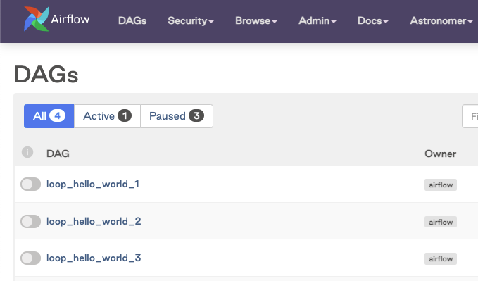
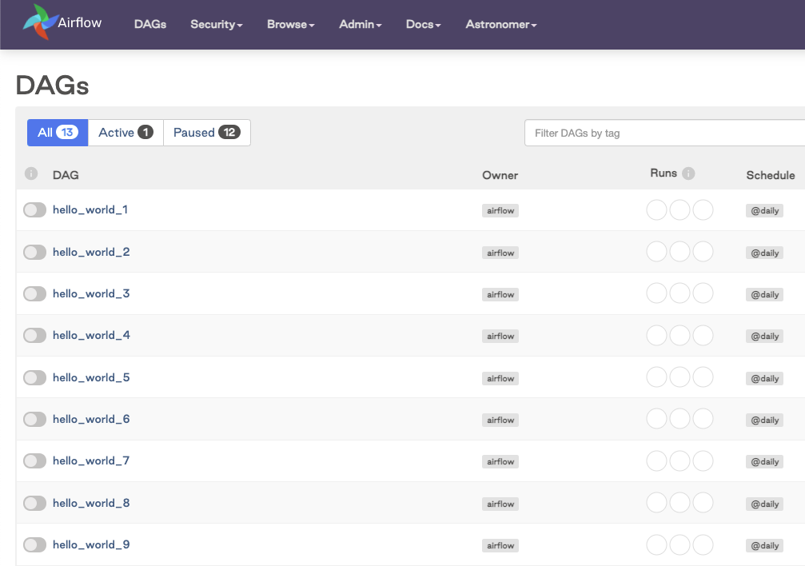

# Динамическая генерация DAG (Dynamically generating DAGs)

> Эта страница ещё не обновлена для Airflow 3. Описанные концепции актуальны, но часть кода может потребовать изменений. При запуске примеров обновите импорты и учтите возможные breaking changes.
>
> Инфо

В Airflow [DAG](https://airflow.apache.org/docs/apache-airflow/stable/core-concepts/dags.html) задаются кодом на Python. Airflow выполняет весь Python-код в `dags_folder` и загружает все объекты `DAG`, попадающие в `globals()`. Проще всего создать DAG — написать статичный Python-файл.

Иногда вручную писать DAG неудобно: например, нужны сотни или тысячи похожих DAG с разными параметрами, или набор DAG для загрузки таблиц без ручного обновления при каждом изменении списка таблиц. В таких случаях DAG имеет смысл генерировать динамически.

Поскольку в Airflow всё задаётся кодом, DAG можно генерировать средствами одного Python. Airflow загрузит любой объект `DAG` в `globals()`, созданный кодом из `dags_folder`. В этом руководстве — как динамически генерировать DAG, когда это уместно и каких ошибок избегать.

Весь код из руководства доступен в [Astronomer Registry](https://github.com/astronomer/dynamic-dags-tutorial).

> Для DAG с динамическим числом параллельных задач в runtime можно использовать [динамический маппинг задач](https://www.astronomer.io/docs/learn/dynamic-tasks) — встроенную возможность Airflow. Astronomer рекомендует сначала рассмотреть динамический маппинг задач, а уже потом при необходимости прибегать к методам динамической генерации DAG из этого руководства.
>
> Совет

> Модуль Astronomer Academy: [Airflow: Dynamic DAGs](https://academy.astronomer.io/astro-runtime-dynamic-dags).
>
> По этой теме есть и другие материалы. См. также:
>
> Другие способы изучения

## Необходимая база

Чтобы получить максимум от руководства, нужно понимать:

- DAG в Airflow. См. [Введение в DAG Airflow](https://www.astronomer.io/docs/learn/dags).

## Метод одного файла

Один из способов динамической генерации DAG — один Python-файл, который создаёт DAG по входным параметрам (например, списку API или таблиц). Типичный сценарий — ETL/ELT с множеством источников или приёмников данных, когда нужны многие DAG по одному шаблону.

Плюсы метода одного файла:

- Добавление DAG сводится к изменению входных параметров и происходит почти мгновенно.
- Параметры могут браться из разных источников.
- Реализация проста.

Минусы:

- Код генерации выполняется при каждом парсинге DAG, так как файл лежит в `dags_folder`. Частота задаётся параметром [`min_file_process_interval`](https://airflow.apache.org/docs/apache-airflow/stable/configurations-ref.html#min-file-process-interval). При большом числе DAG или при обращении к внешним системам (БД) возможны проблемы с производительностью.
- Код конкретного DAG неочевиден — отдельного DAG-файла нет.

Ниже метод одного файла показан на примерах с разными источниками параметров.

### Пример: функция `create_dag`

Чтобы создавать DAG из файла динамически, нужна функция, которая по параметрам строит DAG. В примере шаблон DAG задаётся внутри функции `create_dag`. Код похож на создание одного DAG, но обёрнут в функцию с параметрами.

**TaskFlow:**

```python
from airflow.decorators import dag, task

def create_dag(dag_id, schedule, dag_number, default_args):
    @dag(dag_id=dag_id, schedule=schedule, default_args=default_args, catchup=False)
    def hello_world_dag():
        @task()
        def hello_world():
            print("Hello World")
            print("This is DAG: {}".format(str(dag_number)))

        hello_world()

    generated_dag = hello_world_dag()

    return generated_dag
```

**Традиционный вариант:**

```python
from airflow.models.dag import DAG
from airflow.operators.python import PythonOperator

def create_dag(dag_id, schedule, dag_number, default_args):
    def hello_world_py(*args):
        print("Hello World")
        print("This is DAG: {}".format(str(dag_number)))

    generated_dag = DAG(dag_id, schedule=schedule, default_args=default_args, catchup=False)

    with generated_dag:
        t1 = PythonOperator(
            task_id="hello_world", python_callable=hello_world_py
        )

    return generated_dag
```

Параметры могут приходить из любого источника, доступного скрипту. В примере ниже цикл `range(1, 4)` генерирует параметры, DAG регистрируются в глобальной области видимости и подхватываются планировщиком Airflow:

**TaskFlow:**

```python
from airflow.decorators import dag, task
from pendulum import datetime


def create_dag(dag_id, schedule, dag_number, default_args):
    @dag(dag_id=dag_id, schedule=schedule, default_args=default_args, catchup=False)
    def hello_world_dag():
        @task()
        def hello_world(*args):
            print("Hello World")
            print("This is DAG: {}".format(str(dag_number)))

        hello_world()

    generated_dag = hello_world_dag()

    return generated_dag


# DAG для каждого числа в range(1, 4)
for n in range(1, 4):
    dag_id = "loop_hello_world_{}".format(str(n))

    default_args = {"owner": "airflow", "start_date": datetime(2023, 7, 1)}

    schedule = "@daily"

    dag_number = n

    globals()[dag_id] = create_dag(dag_id, schedule, dag_number, default_args)
```

**Традиционный вариант:**

```python
from pendulum import datetime
from airflow import DAG
from airflow.operators.python import PythonOperator


def create_dag(dag_id, schedule, dag_number, default_args):
    def hello_world_py():
        print("Hello World")
        print("This is DAG: {}".format(str(dag_number)))

    generated_dag = DAG(dag_id=dag_id, schedule=schedule, default_args=default_args)

    with generated_dag:
        PythonOperator(task_id="hello_world", python_callable=hello_world_py)

    return generated_dag


# DAG для каждого числа в range(1, 4)
for n in range(1, 4):
    dag_id = "loop_hello_world_{}".format(str(n))

    default_args = {"owner": "airflow", "start_date": datetime(2023, 7, 1)}

    schedule = "@daily"
    dag_number = n

    globals()[dag_id] = create_dag(dag_id, schedule, dag_number, default_args)
```

Созданные DAG отображаются в UI Airflow:



### Пример: генерация DAG из переменных окружения

Параметры не обязаны быть в самом DAG-файле. Часто DAG генерируют по переменным окружения.

Переменные можно задать локально в `.env` проекта Astro или в [Astro UI](https://www.astronomer.io/docs/astro/manage-env-vars) для деплоев Astro.

```text
DYNAMIC_DAG_NUMBER=10
```

Значение можно прочитать и передать в `range`. Аргумент `default=3` нужен, чтобы файл считался валидным и при отсутствии переменной.

**TaskFlow:**

```python
from airflow.decorators import dag, task
from pendulum import datetime
import os


def create_dag(dag_id, schedule, dag_number, default_args):
    @dag(dag_id=dag_id, schedule=schedule, default_args=default_args, catchup=False)
    def hello_world_dag():
        @task()
        def hello_world(*args):
            print("Hello World")
            print("This is DAG: {}".format(str(dag_number)))

        hello_world()

    generated_dag = hello_world_dag()

    return generated_dag


number_of_dags = os.getenv("DYNAMIC_DAG_NUMBER", default=3)
number_of_dags = int(number_of_dags)

for n in range(1, number_of_dags):
    dag_id = "variable_hello_world_{}".format(str(n))

    default_args = {"owner": "airflow", "start_date": datetime(2023, 7, 1)}

    schedule = "@daily"
    dag_number = n

    globals()[dag_id] = create_dag(dag_id, schedule, dag_number, default_args)
```

**Традиционный вариант:**

```python
from airflow import DAG
from airflow.operators.python import PythonOperator
from pendulum import datetime
import os


def create_dag(dag_id, schedule, dag_number, default_args):
    def hello_world_py():
        print("Hello World")
        print("This is DAG: {}".format(str(dag_number)))

    generated_dag = DAG(dag_id=dag_id, schedule=schedule, default_args=default_args)

    with generated_dag:
        PythonOperator(task_id="hello_world", python_callable=hello_world_py)

    return generated_dag


number_of_dags = os.getenv("DYNAMIC_DAG_NUMBER", default=3)
number_of_dags = int(number_of_dags)

for n in range(1, number_of_dags):
    dag_id = "hello_world_{}".format(str(n))

    default_args = {"owner": "airflow", "start_date": datetime(2023, 7, 1)}

    schedule = "@daily"
    dag_number = n
    globals()[dag_id] = create_dag(dag_id, schedule, dag_number, default_args)
```

Созданные DAG отображаются в UI Airflow:



## Метод нескольких файлов

Другой способ — генерировать отдельный Python-файл под каждый DAG. В итоге в `dags_folder` оказывается по файлу на каждый сгенерированный DAG.

В production генерацию можно встроить в CI/CD: скрипт создаёт DAG-файлы при сборке, затем они деплоятся в Airflow. Либо отдельный DAG периодически запускает скрипт генерации.

Плюсы:

- DAG-файлы создаются до деплоя — полная прозрачность кода, в том числе через кнопку Code в UI Airflow.
- Масштабируется лучше метода одного файла: код генерации не лежит в `dags_folder` и не выполняется при каждом парсинге.

Минусы:

- Изменения и новые DAG появятся только после следующего запуска скрипта (часто — после деплоя).
- Настройка сложнее.

### Пример: генерация DAG из JSON-конфигов

Один из вариантов — Python-скрипт, который по набору JSON-конфигов генерирует DAG-файлы. В примере у всех DAG одна задача — [BashOperator](https://registry.astronomer.io/providers/apache-airflow/versions/latest/modules/BashOperator) с bash-командой. Сценарий: команда аналитиков планирует bash-команды; DAG одинаковые, меняются команда, переменная окружения и расписание.

Сначала создаётся файл-шаблон DAG со структурой. Он похож на обычный DAG-файл, но в места подставляемых значений стоят плейсхолдеры: `dag_id_to_replace`, `schedule_to_replace`, `bash_command_to_replace`, `env_var_to_replace`.

```python
from airflow.decorators import dag
from airflow.operators.bash import BashOperator
from pendulum import datetime

@dag(
    dag_id=dag_id_to_replace,
    start_date=datetime(2023, 7, 1),
    schedule=schedule_to_replace,
    catchup=False,
)
def dag_from_config():
    BashOperator(
        task_id="say_hello",
        bash_command=bash_command_to_replace,
        env={"ENVVAR": env_var_to_replace},
    )

dag_from_config()
```

Далее создаётся каталог `dag-config` с JSON-конфигом для каждого DAG. В конфиге задаются dag_id, расписание, bash-команда и переменная окружения.

```json
{
    "dag_id": "dag_file_1",
    "schedule": "'@daily'",
    "bash_command": "'echo $ENVVAR'",
    "env_var": "'Hello! :)'"
}
```

Затем скрипт обходит конфиги, копирует шаблон в каталог `include` и подставляет в него параметры из конфига:

```python
import json
import os
import shutil
import fileinput

config_filepath = "include/dag-config/"
dag_template_filename = "include/dag-template.py"

for filename in os.listdir(config_filepath):
    f = open(config_filepath + filename)
    config = json.load(f)

    new_filename = "dags/" + config["dag_id"] + ".py"
    shutil.copyfile(dag_template_filename, new_filename)

    for line in fileinput.input(new_filename, inplace=True):
        line = line.replace("dag_id_to_replace", "'" + config["dag_id"] + "'")
        line = line.replace("schedule_to_replace", config["schedule"])
        line = line.replace("bash_command_to_replace", config["bash_command"])
        line = line.replace("env_var_to_replace", config["env_var"])
        print(line, end="")
```

Скрипт можно запускать вручную или в CI/CD. После запуска структура проекта может выглядеть так: в `include` — шаблон и конфиги, в `dags` — сгенерированные DAG-файлы:

```text
.
├── dags
│   ├── dag_file_1.py
│   └── dag_file_2.py
└── include
    ├── dag-config
    │   ├── dag1-config.json
    │   └── dag2-config.json
    ├── dag-template.py
    └── generate-dag-files.py
```

Это простой пример для DAG с одной и той же структурой. Его можно развить: динамические задачи, зависимости, разные операторы и т.д.

## Инструменты для динамического создания DAG

### gusty

Один из популярных инструментов — [gusty](https://github.com/chriscardillo/gusty). gusty — открытая Python-библиотека для динамической генерации DAG в Airflow. Задачи можно описывать в YAML, Python, SQL, R Markdown и Jupyter Notebook.

Установка: `pip install gusty`. В проекте на Astro CLI можно добавить `gusty` в `requirements.txt`.

Использование: в папке `dags` создаётся каталог для DAG gusty. Подкаталоги этого каталога задают DAG, вложенные подкаталоги — группы задач (task groups) внутри DAG.

Пример структуры, из которой получаются 2 DAG из каталога `my_gusty_dags`: в `my_dag_1` две задачи из YAML; в `my_dag_2` одна задача из YAML и две группы задач по две задачи, во второй группе две задачи заданы SQL-файлами.

```text
.
└── dags
    ├── my_gusty_dags
    │   ├── my_dag_1
    │   │   ├── METADATA.yml
    │   │   ├── task_1.yaml
    │   │   └── task_2.yaml
    │   └── my_dag_2
    │       ├── METADATA.yml
    │       ├── task_0.yaml
    │       ├── my_taskgroup_1
    │       │   ├── task_1.yaml
    │       │   └── task_2.yaml
    │       └── my_taskgroup_2
    │           ├── task_3.sql
    │           └── task_4.sql
    ├── creating_gusty_dags.py
    └── my_regular_dag.py
```

Чтобы загрузить DAG из `my_gusty_dags`, нужен скрипт, вызывающий функцию gusty `create_dags`. В примере скрипт `creating_gusty_dags.py` в каталоге `dags`:

```python
from gusty import create_dags

dag = create_dags(
    # путь к каталогу с DAG gusty
    '/usr/local/airflow/dags/my_gusty_dags',
    # namespace для gusty
    globals(),
    # по умолчанию gusty ставит LatestOnlyOperator в корень DAG;
    # отключить: latest_only=False
    latest_only=False
)
```

Параметры DAG задаются в `METADATA.yml`:

```yaml
description: "An example of a DAG created using gusty!"
schedule_interval: "1 0 * * *"
default_args:
    owner: airflow
    depends_on_past: False
    start_date: !days_ago 1
    email: airflow@example.com
    email_on_failure: False
    email_on_retry: False
    retries: 1
    retry_delay: !timedelta 'minutes: 5'
```

Задачи можно описывать в YAML для стандартных и кастомных операторов. Ниже — задача BashOperator с зависимостью от `task_1`:

```yaml
operator: airflow.operators.bash.BashOperator
bash_command: echo $MY_ENV_VAR
dependencies:
  - task_1
env:
    MY_ENV_VAR: "Hello!"
```

Чтобы использовать DAG gusty и обычные DAG в одном окружении, обычные DAG должны лежать в `dags` вне каталога `my_gusty_dags`.

Подробнее о gusty: [README репозитория](https://github.com/chriscardillo/gusty/blob/main/README). Также можно посмотреть примеры: [gusty-demo](https://github.com/chriscardillo/gusty-demo) и [gusty-demo-lite](https://github.com/chriscardillo/gusty-demo-lite).

### DAG Factory

Ещё один инструмент для динамической генерации DAG — [DAG Factory](https://www.astronomer.io/docs/learn/dag-factory). Пакет [dag-factory](https://github.com/astronomer/dag-factory) позволяет создавать DAG из YAML с параметрами DAG и задач, без необходимости знать синтаксис Airflow.

Подробнее о DAG Factory, включая обзор возможностей (ассеты, наследование конфигурации, генерация YAML по шаблону): [DAG Factory tutorial](https://www.astronomer.io/docs/learn/dag-factory).

## Масштабирование

Динамическая генерация DAG при большом масштабе может ухудшить производительность. Итог зависит от числа DAG, конфигурации Airflow и инфраструктуры. Учитывайте:

- Можно увеличить `min_file_processing_interval`, чтобы реже парсить файлы. Имеет смысл, если DAG меняются нечасто и допустима задержка появления изменений из внешнего источника.
- При получении списка DAG из БД запросы идут часто. Нужно учитывать нагрузку на БД и возможную стоимость запросов.
- Весь код в `dags_folder` выполняется не реже, чем раз в `min_file_processing_interval` (или как только успевает DAG file processor). Методы вроде одного файла с генерацией DAG в коде сильнее влияют на производительность при росте числа DAG.

[Тонкая настройка планировщика](https://airflow.apache.org/docs/apache-airflow/stable/administration-and-deployment/scheduler.html#fine-tuning-your-scheduler-performance) помогает смягчить проблемы. Единого «правильного» способа реализовать и масштабировать динамические DAG нет; гибкость Airflow позволяет подобрать решение под вашу организацию.

---

[← Мультиязычность](multilanguage.md) | [К содержанию](README.md) | [Setup/teardown →](setup-teardown.md)
