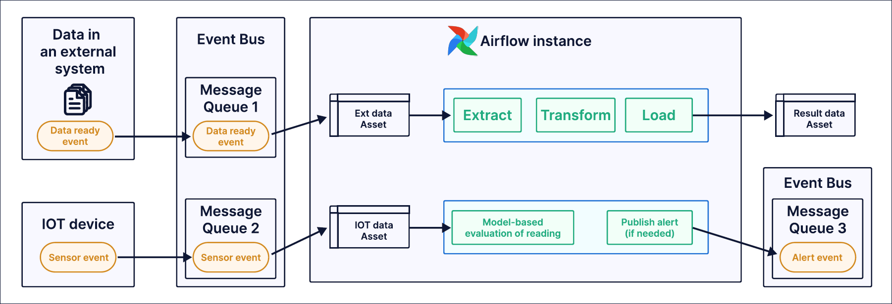

# Event-driven планирование (Event-driven scheduling)

**Event-driven scheduling** — подвид data-aware планирования, при котором DAG запускается при появлении сообщений в очереди сообщений. Это удобно, когда нужно запускать DAG по событиям вне Airflow: доставка данных во внешнюю систему, события IoT-датчиков; важно для пайплайнов инференса.

В этом руководстве — концепции event-driven планирования, типичные сценарии и пример реализации на Amazon SQS и Apache Kafka.

## Необходимая база

Чтобы получить максимум от руководства, нужно понимать:

- Ассеты Airflow. См. [Ассеты и data-aware планирование в Airflow](https://www.astronomer.io/docs/learn/airflow-datasets).

## Концепции

При использовании event-driven планирования важно понимать следующие понятия:

- **AssetEvent:** объект **Asset** в Airflow представляет конкретную или абстрактную сущность данных (файл, таблица в БД или сущность без привязки к данным). **AssetEvent** — одно обновление ассета. В контексте event-driven планирования AssetEvent соответствует одному обнаруженному сообщению в очереди.
- **AssetWatcher:** класс в Airflow, который следит за одним или несколькими триггерами. При срабатывании триггера (`TriggerEvent`) AssetWatcher обновляет связанный ассет, создавая AssetEvent. Полезная нагрузка триггера попадает в словарь `extra` AssetEvent.
- **Trigger (триггер):** асинхронная Python-функция в компоненте [triggerer](https://www.astronomer.io/docs/learn/airflow-components) Airflow. Триггеры, наследующие `BaseEventTrigger`, можно использовать в AssetWatcher для event-driven планирования. Триггер опрашивает очередь сообщений; при появлении нового сообщения создаётся TriggerEvent, сообщение удаляется из очереди.
- **Message queue (очередь сообщений):** сервис обмена сообщениями между системами. Примеры: Amazon SQS, RabbitMQ, Apache Kafka. В Airflow 3.0 event-driven планирование поддерживается для Amazon SQS; поддержка других очередей планируется в следующих версиях.
- **Event-driven scheduling:** подвид data-aware планирования, при котором DAG запускается по сообщениям в очереди. Сообщение в очереди порождается событием вне Airflow.
- **Data-aware scheduling:** планирование DAG по обновлениям ассетов. Помимо event-driven, ассеты могут обновляться успешно завершёнными задачами в том же инстансе Airflow, вручную через UI или через [REST API Airflow](https://airflow.apache.org/docs/apache-airflow/stable/stable-rest-api-ref.html). См. [Ассеты и data-aware планирование в Airflow](https://www.astronomer.io/docs/learn/airflow-datasets).

## Когда использовать event-driven планирование

[Data-aware планирование](https://www.astronomer.io/docs/learn/airflow-datasets) (базовое и расширенное) подходит, когда обновления ассетов происходят внутри Airflow или через [REST API Airflow](https://airflow.apache.org/docs/apache-airflow/stable/stable-rest-api-ref.html). В ряде сценариев DAG нужно запускать по событиям во внешних системах. Два типичных паттерна:

1. **События IoT-датчиков:** устройство IoT отправляет событие датчика в очередь сообщений. DAG в Airflow планируется по этому сообщению и обрабатывает его (например, проверяет значение). При необходимости публикуется алерт в другую очередь.
2. **Доставка данных во внешнюю систему:** данные попадают во внешнюю систему (например, вручную экспертом), в очередь отправляется событие «данные готовы». DAG в Airflow планируется по этому сообщению и запускает ETL-пайплайн для обработки данных во внешней системе.

Частый сценарий — пайплайны инференса: запускаемый DAG вызывает ML-модель. Airflow может оркестрировать пайплайны инференса разного типа, в том числе в приложениях на базе GenAI. В Airflow 3.0 DAG можно запускать с `logical_date=None`, что позволяет одновременно запускать несколько DAG run.

> Сейчас `MessageQueueTrigger` поддерживает Amazon SQS и Apache Kafka; поддержка других очередей планируется. Свой триггер для AssetWatcher можно реализовать, наследуя `BaseEventTrigger`. Подробнее о поддерживаемых триггерах: [документация Airflow](https://airflow.apache.org/docs/apache-airflow/stable/authoring-and-scheduling/event-scheduling.html).
>
> Инфо

## Пример: Amazon SQS

В этом примере DAG запускается сразу после появления сообщения в очереди Amazon SQS.

1. **Настройте подключение к очереди Amazon SQS** в инстансе Airflow. В поле `extra` подключения должен быть указан `region_name`. Подставьте свои учётные данные и регион AWS вместо плейсхолдеров. Другие варианты аутентификации: [документация провайдера Amazon](https://airflow.apache.org/docs/apache-airflow-providers-amazon/stable/connections/aws.html).

```text
AIRFLOW_CONN_AWS_DEFAULT='{"conn_type":"aws","login":"<ACCESS_KEY>","password":"<SECRET_KEY>","extra":{"region_name":"<REGION>"}}'
```

Пользователю AWS нужны как минимум права `sqs:ReceiveMessage` и `sqs:DeleteMessage`.

2. **Добавьте провайдеры** [Airflow Common Messaging](https://airflow.apache.org/docs/apache-airflow-providers-common-messaging/stable/triggers.html) и [Airflow Amazon](https://airflow.apache.org/docs/apache-airflow-providers-amazon/stable/index.html). При использовании Astro CLI добавьте их в `requirements.txt`:

```text
apache-airflow-providers-amazon>=9.7.0
apache-airflow-providers-common-messaging>=1.0.2
aiobotocore
```

3. **Создайте очередь Amazon SQS.** Инструкции: [Amazon Simple Queue Service Documentation](https://docs.aws.amazon.com/AWSSimpleQueueService/latest/APIReference/API_CreateQueue.html).

4. **Создайте новое сообщение в очереди SQS.** Оно запустит DAG, задача `process_message` выведет тело сообщения.

5. **Создайте файл в папке `dags`** вашего проекта Airflow и добавьте следующий код. Замените `SQS_QUEUE` на URL вашей очереди:

```python
from airflow.providers.common.messaging.triggers.msg_queue import MessageQueueTrigger
from airflow.sdk import Asset, AssetWatcher, dag, task
import os

# URL очереди SQS
SQS_QUEUE = "https://sqs.<region>.amazonaws.com/<account_id>/<queue_name>"

# Триггер, слушающий очередь (AWS SQS)
trigger = MessageQueueTrigger(
    aws_conn_id="aws_default",
    queue=SQS_QUEUE,
    waiter_delay=30,  # задержка в секундах между опросами
)

# Ассет, отслеживающий сообщения в очереди
sqs_queue_asset = Asset(
    "sqs_queue_asset", watchers=[AssetWatcher(name="sqs_watcher", trigger=trigger)]
)


@dag(schedule=[sqs_queue_asset])
def event_driven_dag():
    @task
    def process_message(**context):
        triggering_asset_events = context["triggering_asset_events"]
        for event in triggering_asset_events[sqs_queue_asset]:
            print(
                f'Processing message: {event.extra["payload"]["message_batch"][0]["Body"]}'
            )

    process_message()


event_driven_dag()
```

DAG будет запускаться при каждом обновлении ассета `sqs_queue_asset`. У ассета один AssetWatcher `sqs_watcher` с одним MessageQueueTrigger, который опрашивает указанную очередь SQS. Задача `process_message` получает triggering asset events из [контекста Airflow](https://www.astronomer.io/docs/learn/airflow-context) и выводит тело сообщения. Задачу можно заменить на свою логику обработки сообщения.



## Пример: Apache Kafka

Чтобы использовать Apache Kafka как очередь для event-driven планирования:

1. **Создайте новое сообщение в топике Kafka.** Оно запустит DAG, задача `process_message` выведет информацию о событии.

2. **Создайте файл в папке `dags`** и добавьте следующий код. Подставьте свои значения в `KAFKA_QUEUE`:

```python
import json

from airflow.providers.common.messaging.triggers.msg_queue import MessageQueueTrigger
from airflow.providers.standard.operators.empty import EmptyOperator
from airflow.sdk import dag, Asset, AssetWatcher, task

# URL очереди Kafka (подставьте свои host, port, topic)
KAFKA_QUEUE = "kafka://<host>:<port>/<topic>"

# Триггер, слушающий очередь (Kafka)
# apply_function — путь к функции в каталоге include
trigger = MessageQueueTrigger(
    queue=KAFKA_QUEUE,
    apply_function="include.kafka_trigger.apply_function",
)

# Ассет, отслеживающий сообщения в топике Kafka
kafka_topic_asset = Asset(
    "kafka_topic_asset", watchers=[AssetWatcher(name="kafka_watcher", trigger=trigger)]
)


@dag(schedule=[kafka_topic_asset])
def event_driven_dag():
    @task
    def process_message(**context):
        triggering_asset_events = context["triggering_asset_events"]
        for event in triggering_asset_events[kafka_topic_asset]:
            print(f"Processing message: {event}")

    process_message()


event_driven_dag()
```

DAG запускается при обновлении ассета `kafka_topic_asset`. Ассет использует один AssetWatcher `kafka_watcher` с MessageQueueTrigger, опрашивающим указанный топик Kafka. Задача `process_message` получает triggering asset events из [контекста Airflow](https://www.astronomer.io/docs/learn/airflow-context) и выводит данные события. Задачу можно заменить на свою логику обработки.

3. **Создайте файл `kafka_trigger.py`** в папке `include` проекта. Функция будет применена к сообщению Kafka при получении и вернёт значение для обработки в DAG:

```python
import json


def apply_function(*args, **kwargs):
    message = args[-1]
    val = json.loads(message.value())
    print(f"Value in message is {val}")
    return val
```

4. **Настройте подключение к Apache Kafka** в инстансе Airflow. Пример JSON подключения (в зависимости от настроек Kafka в `extra` могут понадобиться дополнительные поля):

```text
AIRFLOW_CONN_KAFKA_DEFAULT='{"conn_type":"general","extra":{"bootstrap.servers":"<host>:<port>","group.id":"<group_id>","security.protocol":"<protocol>","enable.auto.commit":false,"auto.offset.reset":"beginning"}}'
```

5. **Добавьте провайдеры** [Airflow Common Messaging](https://airflow.apache.org/docs/apache-airflow-providers-common-messaging/stable/triggers.html) и [Airflow Apache Kafka](https://airflow.apache.org/docs/apache-airflow-providers-apache-kafka/stable/index.html). В Astro CLI добавьте в `requirements.txt`:

```text
apache-airflow-providers-apache-kafka>=1.9.0
apache-airflow-providers-common-messaging>=1.0.2
```

6. **Создайте топик Apache Kafka.** Инструкции: [документация Apache Kafka](https://kafka.apache.org/documentation/#quickstart).

---

[← Deferrable](deferrable-operators.md) | [К содержанию](README.md) | [Human-in-the-loop →](human-in-the-loop.md)
