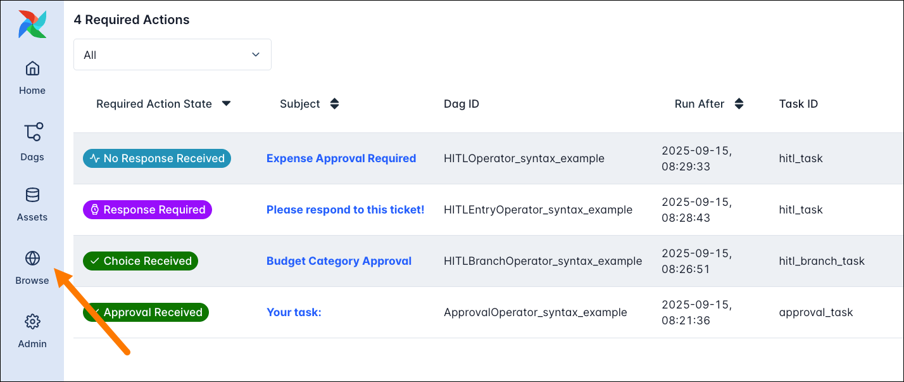

# Human-in-the-loop (Человек в цикле)

**Human-in-the-loop** — сценарий, когда пайплайн приостанавливается и ждёт решения или ввода пользователя (подтверждение, выбор варианта, загрузка данных). Обзор компонентов HitL в Airflow 3:

После действия пользователя DAG продолжает выполнение.

В Airflow это реализуется через специальные операторы и/или задачи, которые переходят в состояние ожидания (например, deferred) до получения ответа. Пользователь может взаимодействовать через UI (кнопки, формы) или через API. Данные для отображения и результат выбора передаются через XCom или внешнее хранилище. В Airflow 3 доступны [HitL-компоненты](https://www.astronomer.io/docs/learn/airflow-human-in-the-loop): задачи ожидания подтверждения, формы в UI, API для отправки ответа.

Типичные кейсы: утверждение данных перед публикацией, выбор ветки обработки, ручная проверка качества, интерактивные отчёты. При реализации важно учитывать таймауты и отмену ожидания.

Подробнее: [Human-in-the-loop](https://www.astronomer.io/docs/learn/airflow-human-in-the-loop).

---

[← Event-driven](event-driven-scheduling.md) | [К содержанию](README.md) | [Изолированные окружения →](isolated-environments.md)
