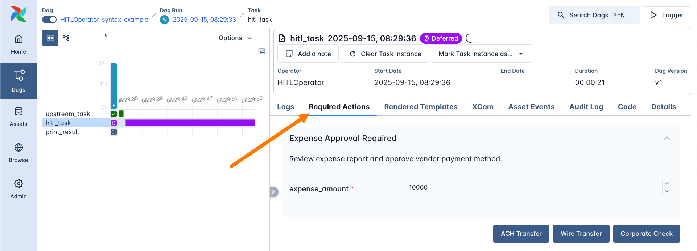
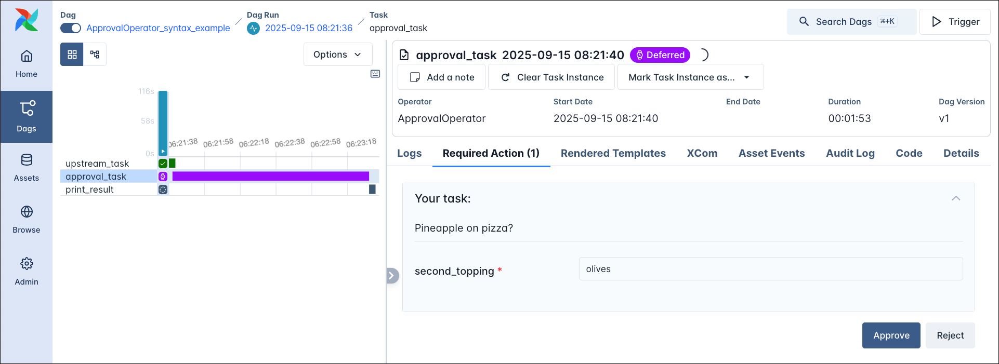
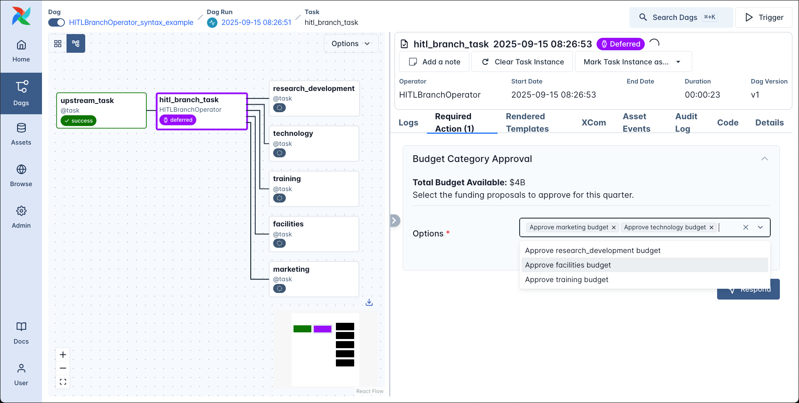
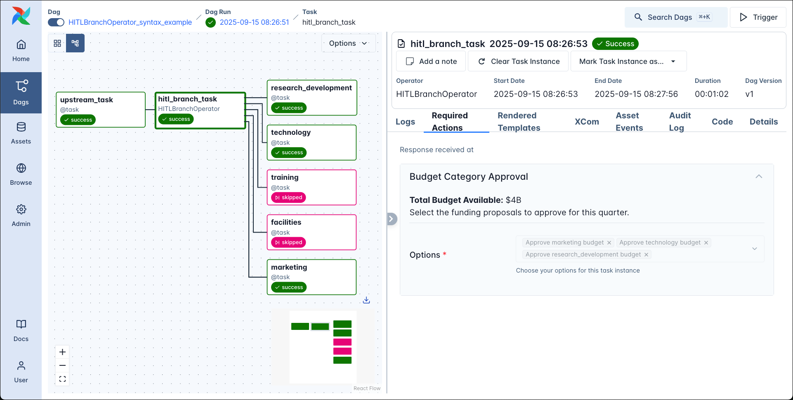
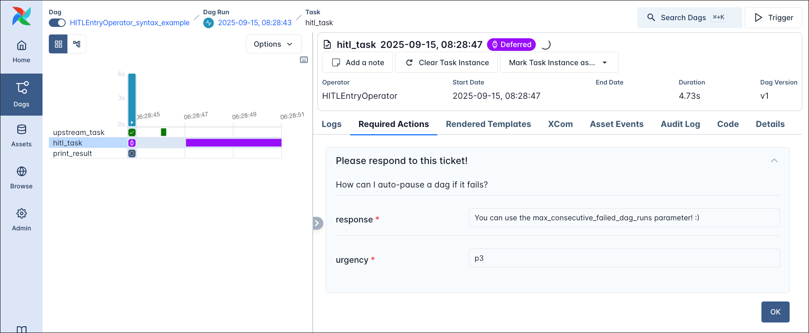

# Human-in-the-loop (Человек в цикле)

Пайплайны **Human-in-the-loop (HITL)** предполагают участие человека: например, утверждение или отклонение результата, сгенерированного ИИ, или [выбор ветки](https://www.astronomer.io/docs/learn/airflow-branch-operator) в DAG в зависимости от результата вышестоящей задачи. В [Airflow standard provider](https://airflow.apache.org/docs/apache-airflow-providers-standard/stable/index.html) есть набор операторов для задач, ожидающих ввода пользователя — через веб-интерфейс Airflow или [REST API Airflow](https://airflow.apache.org/docs/apache-airflow/stable/stable-rest-api-ref.html). Для использования HITL-операторов нужен Airflow 3.1+.

В этом руководстве — доступные HITL-операторы и работа с ними в UI и через API.

## Необходимая база

Чтобы получить максимум от руководства, нужно понимать:

- Deferrable-операторы. См. [Deferrable operators](https://www.astronomer.io/docs/learn/deferrable-operators).
- Операторы Airflow. См. [Operators 101](https://www.astronomer.io/docs/learn/what-is-an-operator).
- Основы Airflow. См. [Введение в Apache Airflow](https://www.astronomer.io/docs/learn/intro-to-airflow).

## Когда использовать Human-in-the-loop

HITL-пайплайны нужны, когда внутри DAG требуется ввод человека (или другой системы вне Airflow). Например:

- DAG требует ввод эксперта (например, обратную связь из пользовательских интервью).
- ИИ маршрутизирует запросы по функциям продукта, а человек решает, куда направить пограничные случаи.
- DAG формирует отчёт по соответствию, и человек должен проверить и подтвердить результат.
- DAG с помощью ИИ готовит ответ на тикет в поддержку, и ответ должен проверить и утвердить человек или запросить правки.

HITL-пайплайны распространены, особенно при использовании ИИ для генерации артефактов, которые нужно проверять вручную. HITL в Airflow позволяет строить такие пайплайны и получать ввод от нетехнических сотрудников через UI Airflow или через обёртку над [REST API Airflow](https://airflow.apache.org/docs/apache-airflow/stable/stable-rest-api-ref.html).

## Required Actions (обязательные действия)

Каждый экземпляр задачи, созданный HITL-оператором, создаёт объект Required Action. Список всех обязательных действий (ожидающих и выполненных) по инстансу Airflow доступен в UI: **Browse → Required Actions**.

Ответ на обязательное действие можно дать так:

- Вызвать эндпоинт [REST API Airflow](https://airflow.apache.org/docs/apache-airflow/stable/stable-rest-api-ref.html) update hitl detail.
- Открыть вкладку **Required Actions** на странице экземпляра задачи и ответить в UI.

## Human-in-the-loop операторы

В Airflow standard provider доступны 4 HITL-оператора:

- **[HITLEntryOperator](https://registry.astronomer.io/providers/apache-airflow-providers-standard/versions/latest/modules/hitlentryoperator):** вариант HITLOperator, в котором пользователь заполняет форму.
- **[HITLBranchOperator](https://registry.astronomer.io/providers/apache-airflow-providers-standard/versions/latest/modules/hitlbranchoperator):** вариант HITLOperator, в котором выбор пользователя определяет [ветвление](https://www.astronomer.io/docs/learn/airflow-branch-operator) — какие задачи выполнить дальше.
- **[ApprovalOperator](https://registry.astronomer.io/providers/apache-airflow-providers-standard/versions/latest/modules/approvaloperator):** вариант HITLOperator с двумя вариантами ответа: «Approve» и «Reject».
- **[HITLOperator](https://registry.astronomer.io/providers/apache-airflow-providers-standard/versions/latest/modules/hitloperator):** базовый класс для всех HITL-операторов.

Все HITL-операторы реализованы как [deferrable-операторы](https://www.astronomer.io/docs/learn/deferrable-operators): они освобождают слот воркера и выполняют асинхронный процесс в компоненте [Triggerer](https://www.astronomer.io/docs/learn/airflow-components) в ожидании ввода пользователя.

Какой оператор выбрать:

- **Утверждение/отклонение** (бинарный выбор) — **ApprovalOperator**. При необходимости добавьте поля формы через `params`.
- **Ввод через форму** без выбора из списка — **HITLEntryOperator**.
- **Выбор следующих задач** (ветвление по решению пользователя) — **HITLBranchOperator**.
- **Остальные сценарии** — **HITLOperator**: произвольный список вариантов и дополнительные поля через `params`.

Часто операторы комбинируют: например, выше по потоку HITLBranchOperator решает, принять ответ ИИ по тикету или эскалировать человеку; ниже HITLEntryOperator собирает ответ человека. И выбранные варианты (`chosen_options`), и ввод в параметры (`params_input`) доступны нижестоящим задачам через [XCom](https://www.astronomer.io/docs/learn/passing-data-between-tasks).


### HITLOperator

**HITLOperator** — базовый класс для всех HITL-операторов и самый гибкий. С ним можно показывать информацию, давать пользователю выбрать один или несколько вариантов из списка и принимать дополнительный ввод через форму на базе [Airflow params](https://www.astronomer.io/docs/learn/airflow-params).

Обязательные параметры:

- **`options`** (обязателен): список строк — варианты ответа внизу формы обязательного действия. Список не может быть пустым. Выбранные варианты доступны нижестоящим задачам через XCom под ключом `chosen_options`.
- **`subject`** (обязателен): заголовок действия, отображается как заголовок во вкладке Required Actions. Поле шаблонируемое ([Jinja](https://www.astronomer.io/docs/learn/templating)).

Необязательные параметры:

- **`notifiers`:** список нотификаторов; при запуске задачи вызывается их метод `.notify()`. Пример: [Использование нотификаторов с HITL-операторами](https://www.astronomer.io/docs/learn/airflow-human-in-the-loop#use-notifiers-with-hitl-operators).
- **`assigned_users`:** список пользователей, которым разрешено отвечать на обязательное действие. Задаётся списком объектов `HITLUser` (`from airflow.sdk.execution_time.hitl import HITLUser`) с полями `id` и `name`. На [Astro](https://www.astronomer.io/lp/signup/) id — Astro ID пользователя в формате `cl1a2b3cd456789ef1gh2ijkl3` (Organization → Access Management). При [SimpleAuthManager](https://airflow.apache.org/docs/apache-airflow/stable/core-concepts/auth-manager.html#simpleauthmanager) id — username; при [FabAuthManager](https://airflow.apache.org/docs/apache-airflow-providers-fab/stable/auth-manager/index.html) — email.
- **`execution_timeout`:** параметр [BaseOperator](https://registry.astronomer.io/providers/apache-airflow/versions/latest/modules/BaseOperator); таймаут задачи ([datetime.timedelta](https://docs.python.org/3/library/datetime.html#datetime.timedelta) или [pendulum.Duration](https://pendulum.eustace.io/docs/#duration)). По умолчанию `None`. После таймаута: если задан список `defaults`, выбираются значения по умолчанию и задача завершается успешно; иначе задача падает.
- **`params`:** поля формы для ввода пользователя через [Airflow params](https://www.astronomer.io/docs/learn/airflow-params). Не все возможности params поддерживаются в HITL. Доступны нижестоящим задачам через XCom под ключом `params_input`.
- **`multiple`:** если `True`, можно выбрать несколько вариантов. По умолчанию `False`.
- **`defaults`:** список вариантов по умолчанию при таймауте. Все должны входить в `options`.
- **`body`:** основной текст. Шаблонируемое поле, поддерживается Markdown.

В примере ниже результат вышестоящей задачи подтягивается из [XCom](https://www.astronomer.io/docs/learn/passing-data-between-tasks), пользователю предлагаются 3 варианта ответа и одно поле `expense_amount` ([Airflow param](https://www.astronomer.io/docs/learn/airflow-params)). Через 5 минут (`execution_timeout`) срабатывает таймаут, выбираются вариант по умолчанию `ACH Transfer` и сумма `10000`. Задача `print_result` выводит `chosen_options` и `params_input` из XCom.

```python
from datetime import timedelta
from airflow.providers.standard.operators.hitl import HITLOperator
from airflow.sdk import dag, task, chain, Param


@dag
def HITLOperator_syntax_example():

    @task
    def upstream_task():
        return "Review expense report and approve vendor payment method."

    _upstream_task = upstream_task()

    _hitl_task = HITLOperator(
        task_id="hitl_task",
        subject="Expense Approval Required",
        body="{{ ti.xcom_pull(task_ids='upstream_task') }}",
        options=["ACH Transfer", "Wire Transfer", "Corporate Check"],
        defaults=["ACH Transfer"],
        multiple=False,
        params={
            "expense_amount": Param(
                10000,
                type="number",
            )
        },
        execution_timeout=timedelta(minutes=5),
    )

    @task
    def print_result(hitl_output):
        print(f"Expense amount: ${hitl_output['params_input']['expense_amount']}")
        print(f"Payment method: {hitl_output['chosen_options']}")

    _print_result = print_result(_hitl_task.output)

    chain(_upstream_task, _hitl_task)


HITLOperator_syntax_example()
```

Форма обязательного действия отображается во вкладке Required Actions на странице экземпляра задачи.



### ApprovalOperator

**ApprovalOperator** — вариант HITLOperator с двумя вариантами ответа: **Approve** и **Reject**. Дополнительно можно задать поля формы через [Airflow params](https://www.astronomer.io/docs/learn/airflow-params).

При выборе **Approve** задача завершается успешно. При **Reject** задача тоже завершается успешно, но все нижестоящие задачи пропускаются (skipped).

```python
from airflow.providers.standard.operators.hitl import ApprovalOperator
from airflow.sdk import dag, task, chain, Param


@dag
def ApprovalOperator_syntax_example():

    @task
    def upstream_task():
        return "Pineapple on pizza?"

    _upstream_task = upstream_task()

    _hitl_task = ApprovalOperator(
        task_id="approval_task",
        subject="Your task:",
        body="{{ ti.xcom_pull(task_ids='upstream_task') }}",
        defaults="Approve",
        params={
            "second_topping": Param(
                "olives",
                type="string",
            )
        },
    )

    @task
    def print_result(hitl_output):
        print(f"Params input: {hitl_output['params_input']}")
        print(f"Chosen options: {hitl_output['chosen_options']}")

    _print_result = print_result(_hitl_task.output)

    chain(_upstream_task, _hitl_task)


ApprovalOperator_syntax_example()
```

В форме отображаются два варианта Approve и Reject и при необходимости поля из params.



### HITLBranchOperator

Для [ветвления](https://www.astronomer.io/docs/learn/airflow-branch-operator) DAG по решению пользователя используется **HITLBranchOperator**. Пользователь выбирает одну или несколько задач, непосредственно следующих за HITLBranchOperator; невыбранные задачи пропускаются.

Параметр **`options_mapping`** задаёт соответствие между вариантами в UI и task_id нижестоящих задач.

```python
from airflow.providers.standard.operators.hitl import HITLBranchOperator
from airflow.sdk import dag, task, chain


_budget_categories = ["marketing", "research_development", "facilities", "training", "technology"]


@dag
def HITLBranchOperator_syntax_example():

    @task
    def upstream_task():
        return {
            "total_budget": "$4B",
        }

    _upstream_task = upstream_task()

    _hitl_branch_task = HITLBranchOperator(
        task_id="hitl_branch_task",
        subject="Budget Category Approval",
        body="""**Total Budget Available:** {{ ti.xcom_pull(task_ids='upstream_task')['total_budget'] }}

Select the funding proposals to approve for this quarter.""",
        options=_budget_categories,
        defaults=["marketing", "research_development"],
        multiple=True,
    )

    for _category in _budget_categories:

        @task(
            task_id=f"{_category}",
        )
        def category_task():
            print(f"Processing budget approval for {_category}")

        _category_task = category_task()
        chain(_hitl_branch_task, _category_task)

    chain(_upstream_task, _hitl_branch_task)


HITLBranchOperator_syntax_example()
```

На снимке ниже — граф DAG с пятью задачами ниже HITLBranchOperator и вкладка Required Actions с формой.



После утверждения бюджета по трём категориям DAG завершается: выполняются 3 нижестоящие задачи, 2 пропускаются.



### HITLEntryOperator

**HITLEntryOperator** — вариант HITLOperator, в котором пользователь заполняет форму и отправляет её без выбора из списка вариантов.

```python
from airflow.providers.standard.operators.hitl import HITLEntryOperator
from airflow.sdk import dag, task, chain, Param


@dag
def HITLEntryOperator_syntax_example():

    @task
    def upstream_task():
        return "How can I auto-pause a dag if it fails?"

    _upstream_task = upstream_task()

    _hitl_task = HITLEntryOperator(
        task_id="hitl_task",
        subject="Please respond to this ticket!",
        body="{{ ti.xcom_pull(task_ids='upstream_task') }}",
        params={
            "response": Param(
                "You can use the max_consecutive_failed_dag_runs parameter! :)",
                type="string",
            ),
            "urgency": Param(
                "p3",
                type="string",
            ),
        },
    )

    @task
    def print_result(hitl_output):
        print(f"Params input: {hitl_output['params_input']}")
        print(f"Chosen options: {hitl_output['chosen_options']}")

    _print_result = print_result(_hitl_task.output)

    chain(_upstream_task, _hitl_task)


HITLEntryOperator_syntax_example()
```



## Использование нотификаторов с HITL-операторами

[Нотификатор Airflow](https://www.astronomer.io/docs/learn/error-notifications-in-airflow) может передавать информацию из HITL-оператора во внешнюю систему (Slack, email и т.д.). Метод `.notify()` нотификатора вызывается при запуске задачи. Простой вариант — использовать метод `HITLOperator.generate_link_to_ui_from_context`, чтобы сформировать ссылку на обязательное действие в UI Airflow.

В примере ниже нотификатор `MyNotifier` выводит в логи Airflow информацию об обязательном действии и ссылку на него.

```python
from airflow.sdk import BaseNotifier, Context, dag, task, Param
from airflow.providers.standard.operators.hitl import HITLOperator
from datetime import timedelta

_BASE_URL = "http://localhost:28080"

class MyNotifier(BaseNotifier):
    template_fields = ("message",)

    def __init__(self, message: str = "") -> None:
        self.message = message

    def notify(self, context: Context) -> None:
        task_state = context['ti'].state
        if task_state == "running":
            url = HITLOperator.generate_link_to_ui_from_context(
                context=context,
                base_url=_BASE_URL,
            )
            self.log.info(self.message)
            self.log.info("Url to respond %s", url)
        else:
            self.log.info("Task state: %s", task_state)
            self.log.info("No response needed!")


notifier_class = MyNotifier(
    message="""
Subject: {{ task.subject }}
Body: {{ task.body }}
Options: {{ task.options }}
"""
)


@dag
def notifier_example():
    HITLOperator(
        task_id="hitl_task",
        subject="Choose a number: ",
        options=["23", "19", "42"],
        notifiers=[notifier_class],
    )


notifier_example()
```

К HITL-операторам можно добавлять обычные колбэки: `on_failure_callback`, `on_success_callback` и т.д.

## API-эндпоинты Human-in-the-loop

Если у пользователя (или системы) нет доступа к UI Airflow, можно использовать [REST API Airflow](https://airflow.apache.org/docs/apache-airflow/stable/stable-rest-api-ref.html) для опроса обязательных действий и ответа на них.

Эндпоинты:

- **`PATCH api/v2/hitlDetails/{dag_id}/{dag_run_id}/{task_id}`** — ответ на конкретное обязательное действие.
- **`GET api/v2/hitlDetails/{dag_id}/{dag_run_id}/{task_id}`** — детали обязательного действия.
- **`GET api/v2/hitlDetails/`** — список обязательных действий в инстансе с фильтрами (`state`, `dag_id` и др.).

Пример скрипта, который отвечает на все ожидающие обязательные действия в заданном DAG из командной строки:

```python
import requests
from typing import Any

_USERNAME = "admin"
_PASSWORD = "admin"
_HOST = "http://localhost:28080/"
_DAG_ID = "HITLOperator_syntax_example"
_TASK_ID = "hitl_task"


def _pick_option(options: list[str]):
    print("Available options: ", options)
    chosen_option = input("Enter the option you want to select: ")
    return chosen_option


def _pick_params(param: dict[str, Any]):
    print("Input for param:", param)
    param_input = input("Enter your value for the param: ")
    return param_input


def _get_jwt_token():
    token_url = f"{_HOST}/auth/token"
    payload = {"username": _USERNAME, "password": _PASSWORD}
    headers = {"Content-Type": "application/json"}
    response = requests.post(token_url, json=payload, headers=headers)
    token = response.json().get("access_token")
    return token


def _get_running_dagruns_for_dag(dag_id: str):
    url = f"{_HOST}/api/v2/dags/{dag_id}/dagRuns?state=running"
    headers = {"Authorization": f"Bearer {_get_jwt_token()}"}
    response = requests.get(url, headers=headers)
    return response.json()


def _get_hitl_details(dag_id: str, dag_run_id: str, task_id: str):
    url = f"{_HOST}/api/v2/hitlDetails/{dag_id}/{dag_run_id}/{task_id}"
    headers = {"Authorization": f"Bearer {_get_jwt_token()}"}
    response = requests.get(url, headers=headers)
    if response.status_code == 200:
        data = response.json()
        print("--------------------------------")
        print("Required Action found for: ", dag_id, "DAG Run: ", dag_run_id, "Task: ", task_id)
        print("Subject: ", data["subject"])
        print("Body: ", data["body"])
        print("Options: ", data["options"])
        print("Params: ", data["params"])
        print("--------------------------------")
        return {"subject": data["subject"], "body": data["body"], "options": data["options"], "params": data["params"]}
    elif response.status_code == 404:
        print("--------------------------------")
        print("404 - No required action found for: ", dag_id, dag_run_id, task_id)
        print("--------------------------------")
        return None
    else:
        print("Error: ", response.status_code, response.json())
        return None


def _add_hitl_response(
    dag_id: str, dag_run_id: str, task_id: str, options: list[str], params: dict[str, Any]
):
    url = f"{_HOST}/api/v2/hitlDetails/{dag_id}/{dag_run_id}/{task_id}"
    headers = {"Authorization": f"Bearer {_get_jwt_token()}"}
    chosen_options = [_pick_option(options)]
    params_input = {p: _pick_params(p) for p in params} if params else {}
    response = requests.patch(
        url, headers=headers, json={"chosen_options": chosen_options, "params_input": params_input}
    )
    if response.status_code == 200:
        print("HITL response added for", dag_id, dag_run_id, task_id)
    elif response.status_code == 409:
        print("409 - Already updated action for:", dag_id, dag_run_id, task_id)
    else:
        print("Error: ", response.status_code, response.json())


def main():
    dag_runs = _get_running_dagruns_for_dag(_DAG_ID).get("dag_runs", [])
    if not dag_runs:
        print("No running dag runs found for DAG: ", _DAG_ID)
    else:
        for dag_run in dag_runs:
            hitl_details = _get_hitl_details(_DAG_ID, dag_run["dag_run_id"], _TASK_ID)
            if hitl_details:
                _add_hitl_response(
                    _DAG_ID, dag_run["dag_run_id"], _TASK_ID, hitl_details["options"], hitl_details["params"]
                )


if __name__ == "__main__":
    main()
```

Подробнее об отправке API-запросов к Airflow на Astro: [Airflow API](https://www.astronomer.io/docs/astro/airflow-api/).

---

[← Event-driven](event-driven-scheduling.md) | [К содержанию](README.md) | [Изолированные окружения →](isolated-environments.md)
