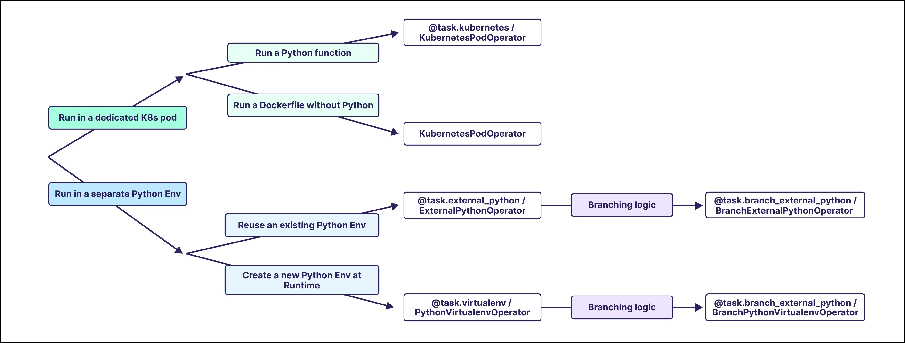

# Изолированные окружения (Isolated environments)

> Эта страница ещё не обновлена под Airflow 3. Показанные концепции актуальны, но часть кода может потребовать правок. При запуске примеров обновите импорты и учтите возможные breaking changes.
>
> Информация

Запуск задачи с другими зависимостями, чем у окружения Airflow, — распространённая практика. Задаче может требоваться другая версия Python, чем у ядра Airflow, или пакеты, конфликтующие с остальными задачами. В таких случаях выполнение задач в изолированном окружении помогает избежать конфликтов зависимостей и обеспечить совместимость с окружением выполнения.

В Airflow есть несколько способов запускать пользовательский Python-код в изолированных окружениях. В этом руководстве описано, как выбрать подходящий вариант, использовать операторы и декораторы виртуальных окружений и получать доступ к контексту и переменным Airflow в изолированных окружениях.

> - Разбор по коду: [Репозиторий примеров DAG изолированных окружений](https://github.com/astronomer/learn-demos/tree/airflow-isolated-environments).
> - Вебинар: [Running Airflow Tasks in Isolated Environments](https://www.astronomer.io/events/webinars/running-airflow-tasks-in-isolated-environments-video/).
> - Astronomer Academy: [Airflow: The KubernetesPodOperator](https://academy.astronomer.io/astro-runtime-the-kubernetespodoperator-1).
> - Astronomer Academy: [Airflow: The ExternalPythonOperator](https://academy.astronomer.io/astro-runtime-the-externalpythonoperator).
>
> По теме есть и другие материалы. См. также:
>
> Другие способы изучить тему

> В этом руководстве рассматриваются варианты изоляции отдельных задач в Airflow. Если нужно запускать все задачи Airflow в отдельных pod’ах Kubernetes, см. [Kubernetes Executor](../03.%20astronomer-infra/executors.md). Клиенты Astronomer могут настроить использование KubernetesExecutor в UI Astro: [Manage Airflow executors on Astro](https://www.astronomer.io/docs/astro/executors-overview).
>
> Информация



## Необходимая база

Чтобы получить максимум от руководства, нужно понимать:

- Основы Kubernetes. См. [Kubernetes Documentation](https://kubernetes.io/docs/home/).
- Виртуальные окружения Python. См. [Python Virtual Environments: A Primer](https://realpython.com/python-virtual-environments-a-primer/).
- Операторы Airflow. См. [Операторы Airflow](../01.%20astronomer-basic/operators.md).
- Декораторы Airflow. См. [Введение в TaskFlow API и декораторы Airflow](../02.%20astronomer-dags/airflow-decorators.md).

## Когда использовать изолированные окружения

Изолированное окружение для задачи имеет смысл в двух случаях:

- Задаче нужны другие версии Python-пакетов, конфликтующие с версиями, установленными в окружении Airflow. Узнать, какие версии пакетов зафиксированы для каждой версии Airflow, можно по полному списку constraints:
- Задаче нужна другая версия Python, чем в окружении Airflow. Apache Airflow поддерживает и доступен для Python 3.8, 3.9, 3.10, 3.11 и 3.12. Для [Astro Runtime](https://quay.io/repository/astronomer/astro-runtime?tab=tags) есть образы для всех поддерживаемых версий Python, поэтому Airflow можно запускать в Docker в воспроизводимом окружении. Подробнее: [Prerequisites](https://airflow.apache.org/docs/apache-airflow/stable/installation/prerequisites.html).

```text
https://raw.githubusercontent.com/apache/airflow/constraints-<AIRFLOW VERSION>/constraints-<PYTHON VERSION>.txt
```

> Рекомендуется фиксировать версии всех пакетов и в основном окружении Airflow (`requirements.txt`), и в изолированных окружениях. Это снижает риск неожиданного поведения из-за обновлений пакетов и конфликтов версий.
>
> Рекомендация Airflow

### Ограничения

При создании изолированных окружений в Airflow часть привычных возможностей Airflow может быть недоступна или подключение к окружению Airflow будет отличаться от обычной задачи.

Типичные ограничения:

- Установка самого Airflow или пакетов провайдеров Airflow в окружении, передаваемом декоратору `@task.external_python` или ExternalPythonOperator, может приводить к неожиданному поведению. Если внутри виртуального окружения нужны Airflow или модуль провайдера Airflow, Astronomer рекомендует использовать декоратор `@task.virtualenv` или PythonVirtualenvOperator. См. [Использование пакетов Airflow в изолированных окружениях](isolated-environments.md).
- Из изолированного окружения нет доступа к [secrets backend](https://airflow.apache.org/docs/apache-airflow/stable/security/secrets/secrets-backend/index.html). Чтобы передать секреты, используйте [шаблоны Jinja](../02.%20astronomer-dags/jinja-templating.md). См. [Использование переменных Airflow в изолированных окружениях](isolated-environments.md).
- [Не все переменные контекста Airflow](https://airflow.apache.org/docs/apache-airflow/stable/howto/operator/python.html#id1) можно передать в виртуальный декоратор: Airflow не поддерживает сериализацию объектов `var`, `ti` и `task_instance`. См. [Использование переменных контекста Airflow в изолированных окружениях](isolated-environments.md).

## Выбор варианта изолированного окружения

В Airflow есть несколько способов запускать задачи в изолированных окружениях.

Чтобы запускать задачи в отдельном pod Kubernetes, можно использовать:

- [KubernetesPodOperator](isolated-environments.md) (KPO)
- Декоратор [`@task.kubernetes`](isolated-environments.md)

Чтобы запускать задачи в виртуальном окружении Python, можно использовать:

- Декоратор [`@task.branch_virtualenv`](isolated-environments.md) / BranchPythonVirtualenvOperator (BPVO)
- Декоратор [`@task.branch_external_python`](isolated-environments.md) / BranchExternalPythonOperator (BEPO)
- Декоратор [`@task.virtualenv`](isolated-environments.md) / PythonVirtualenvOperator (PVO)
- Декоратор [`@task.external_python`](isolated-environments.md) / ExternalPythonOperator (EPO)

У декораторов виртуальных окружений есть операторы с той же функциональностью. Astronomer рекомендует по возможности использовать декораторы — они упрощают работу с [XCom](../02.%20astronomer-dags/passing-data-between-tasks.md).

Выбор зависит от сценария и требований задачи. В таблице ниже указано, какие декораторы и операторы лучше подходят для типичных случаев.

| Сценарий | Варианты реализации |
| --- | --- |
| Запуск Python-задачи в pod K8s | [`@task.kubernetes`](isolated-environments.md), [KubernetesPodOperator](isolated-environments.md) |
| Запуск Docker-образа без дополнительного Python-кода в pod K8s | [KubernetesPodOperator](isolated-environments.md) |
| Запуск Python-задачи в существующем (переиспользуемом) виртуальном окружении | [`@task.external_python`](isolated-environments.md), [ExternalPythonOperator](isolated-environments.md) |
| Запуск Python-задачи в новом виртуальном окружении | [`@task.virtualenv`](isolated-environments.md), [PythonVirtualenvOperator](isolated-environments.md) |
| Ветвящийся код в существующем (переиспользуемом) виртуальном окружении | [`@task.branch_external_python`](isolated-environments.md), [BranchExternalPythonOperator](isolated-environments.md) |
| Ветвящийся код в новом виртуальном окружении | [`@task.branch_virtualenv`](isolated-environments.md), [BranchPythonVirtualenvOperator](isolated-environments.md) |
| Разные пакеты при каждом запуске задачи | [PythonVirtualenvOperator](isolated-environments.md), [BranchPythonVirtualenvOperator](isolated-environments.md) |

При выборе оператора важно учитывать доступную инфраструктуру. Операторы, запускающие задачи в pod’ах Kubernetes, дают полный контроль над окружением и ресурсами, но требуют кластер Kubernetes. Операторы, запускающие задачи в виртуальных окружениях Python, проще в настройке, но не дают такого же контроля над окружением и ресурсами.

| Требования | Декораторы | Операторы |
| --- | --- | --- |
| Кластер Kubernetes | [`@task.kubernetes`](isolated-environments.md) | [KubernetesPodOperator](isolated-environments.md) |
| Docker-образ | [`@task.kubernetes`](isolated-environments.md) (с установленным Python) | [KubernetesPodOperator](isolated-environments.md) (с Python или без) |
| Исполняемый файл Python | [`@task.external_python`](isolated-environments.md), [`@task.branch_external_python`](isolated-environments.md), [`@task.virtualenv`](isolated-environments.md) (*), [`@task.branch_virtualenv`](isolated-environments.md) (*) | [ExternalPythonOperator](isolated-environments.md), [BranchExternalPythonOperator](isolated-environments.md), [PythonVirtualenvOperator](isolated-environments.md) (*), [BranchPythonVirtualenvOperator](isolated-environments.md) (*) |

\* Нужен только если требуется версия Python, отличная от окружения Airflow.

## External Python Operator

Оператор External Python (декоратор `@task.external_python` или ExternalPythonOperator) выполняет Python-функцию в существующем виртуальном окружении Python, изолированном от окружения Airflow. Для использования декоратора `@task.external_python` или ExternalPythonOperator нужно создать отдельное виртуальное окружение Python и указать на него ссылку. Подойдёт любой исполняемый файл Python, созданный любым способом.

Удобный способ создать окружение Python при работе с Astro CLI — [Astronomer PYENV BuildKit](https://github.com/astronomer/astro-provider-venv). BuildKit подключается комментарием в первой строке Dockerfile, как в примере ниже. Так можно создавать виртуальные окружения с ключевым словом `PYENV`.

```dockerfile
# syntax=quay.io/astronomer/airflow-extensions:v1

FROM quay.io/astronomer/astro-runtime:10.3.0-python-3.11

# create a virtual environment for the ExternalPythonOperator and @task.external_python decorator
# using Python 3.9 and install the packages from epo_requirements.txt
PYENV 3.9 epo_pyenv epo_requirements.txt
```

> Для использования BuildKit должен быть включён [Docker BuildKit Backend](https://docs.docker.com/build/buildkit/). В Docker Desktop начиная с версии 23.0 он включён по умолчанию; в более старых версиях его может потребоваться включить вручную.
>
> Примечание

Добавить пакеты в виртуальное окружение можно через отдельный requirements-файл. В примере используется имя `epo_requirements.txt`. Версии пакетов лучше зафиксировать.

```text
pandas==1.4.4
```

> Установка самого Airflow и пакетов провайдеров Airflow в изолированных окружениях может приводить к неожиданному поведению и не рекомендуется. Если внутри виртуального окружения нужны Airflow или модули провайдеров Airflow, Astronomer рекомендует использовать декоратор `@task.virtualenv` или PythonVirtualenvOperator. См. [Использование пакетов Airflow в изолированных окружениях](isolated-environments.md).
>
> Предупреждение

После перезапуска окружения Airflow путь к этому Python можно получить через переменную окружения `ASTRO_PYENV_`. Если окружение создаётся другим способом, параметр `python` декоратора или оператора нужно задать путём к исполняемому файлу Python.

**Taskflow**

Чтобы выполнить любую Python-функцию в виртуальном окружении, повесьте на неё декоратор `@task.external_python` и задайте параметр `python` путём к исполняемому файлу Python.

```python
# from airflow.decorators import task
# import os

@task.external_python(python=os.environ["ASTRO_PYENV_epo_pyenv"])
def my_isolated_task():
    import pandas as pd
    import sys
    print(f"The python version in the virtual env is: {sys.version}")
    print(f"The pandas version in the virtual env is: {pd.__version__}")
    # your code to run in the isolated environment
```

**Traditional**

Чтобы выполнить любую Python-функцию в виртуальном окружении, задайте параметр `python_callable` оператора ExternalPythonOperator своей функцией и параметр `python` — путём к исполняемому файлу Python.

```python
# from airflow.operators.python import ExternalPythonOperator
# import os

def my_isolated_function():
    import pandas as pd
    import sys
    print(f"The python version in the virtual env is: {sys.version}")
    print(f"The pandas version in the virtual env is: {pd.__version__}")

my_isolated_task = ExternalPythonOperator(
    task_id="my_isolated_task",
    python_callable=my_isolated_function,
    python=os.environ["ASTRO_PYENV_epo_pyenv"]
)
```

**Taskflow XCom**

Передавать данные в задачу с декоратором `@task.external_python` и из неё можно так же, как при работе с задачей с декоратором `@task`. Подробнее: [Введение в TaskFlow API и декораторы Airflow](../02.%20astronomer-dags/airflow-decorators.md).

```python
"""
## Игрушечный пример использования декоратора @task.external_python

Декоратор @task.external_python запускает произвольный Python-код в существующем изолированном окружении Python.
"""

from airflow.decorators import dag, task
import pandas as pd
import sys
import os

@dag(
    start_date=None,
    schedule=None,
    doc_md=__doc__,
    description="@task.external_python",
    default_args={
        "owner": "airflow",
        "retries": 0,
    },
    tags=["@task.external_python"],
)
def external_python_decorator_dag():

    @task
    def upstream_task():
        print(f"The python version in the upstream task is: {sys.version}")
        print(f"The pandas version in the upstream task is: {pd.__version__}")
        return {"num": 1, "word": "hello"}

    @task.external_python(python=os.environ["ASTRO_PYENV_epo_pyenv"])
    def my_isolated_task(upstream_task_output: dict):
        """
        Эта функция выполняется в изолированном окружении.
        Args:
            upstream_task_output (dict): число и слово.
        Returns:
            pd.DataFrame: словарь с преобразованными входными данными.
        """
        import pandas as pd
        import sys

        print(f"The python version in the virtual env is: {sys.version}")
        print(f"The pandas version in the virtual env is: {pd.__version__}")

        num = upstream_task_output["num"]
        word = upstream_task_output["word"]

        num_plus_one = num + 1
        word_plus_exclamation = word + "!"

        df = pd.DataFrame(
            {
                "num_plus_one": [num_plus_one],
                "word_plus_exclamation": [word_plus_exclamation],
            },
        )

        return df

    @task
    def downstream_task(arg):
        print(f"The python version in the downstream task is: {sys.version}")
        print(f"The pandas version in the downstream task is: {pd.__version__}")
        return arg

    downstream_task(my_isolated_task(upstream_task()))

external_python_decorator_dag()
```

**Traditional XCom**

Передавать данные в ExternalPythonOperator можно через [шаблон Jinja](../02.%20astronomer-dags/jinja-templating.md), получающий значения [XCom](../02.%20astronomer-dags/passing-data-between-tasks.md) из [контекста Airflow](../02.%20astronomer-dags/airflow-context.md). Чтобы передать данные из ExternalPythonOperator наружу, верните их из `python_callable`. Учтите: шаблоны Jinja по умолчанию подставляются как строки; чтобы получить нативный объект, задайте в определении DAG `render_template_as_native_obj=True`.

```python
"""
## Игрушечный пример использования ExternalPythonOperator

ExternalPythonOperator запускает произвольный Python-код в существующем изолированном окружении Python.
"""

from airflow.decorators import dag, task
from airflow.models.baseoperator import chain
from airflow.operators.python import ExternalPythonOperator
import pandas as pd
import sys
import os

def my_isolated_function(num: int, word: str) -> dict:
    """
    Эта функция передаётся в ExternalPythonOperator для выполнения в изолированном окружении.
    Args:
        num (int): целое число, будет увеличено на 1.
        word (str): строка, к которой будет добавлен восклицательный знак.
    Returns:
        pd.DataFrame: словарь с преобразованными входными данными.
    """
    import pandas as pd
    import sys

    print(f"The python version in the virtual env is: {sys.version}")
    print(f"The pandas version in the virtual env is: {pd.__version__}")

    num_plus_one = num + 1
    word_plus_exclamation = word + "!"

    df = pd.DataFrame(
        {
            "num_plus_one": [num_plus_one],
            "word_plus_exclamation": [word_plus_exclamation],
        },
    )

    return df

@dag(
    start_date=None,
    schedule=None,
    doc_md=__doc__,
    description="ExternalPythonOperator",
    render_template_as_native_obj=True,
    default_args={
        "owner": "airflow",
        "retries": 0,
    },
    tags=["ExternalPythonOperator"],
)
def external_python_operator_dag():

    @task
    def upstream_task():
        print(f"The python version in the upstream task is: {sys.version}")
        print(f"The pandas version in the upstream task is: {pd.__version__}")
        return {"num": 1, "word": "hello"}

    my_isolated_task = ExternalPythonOperator(
        task_id="my_isolated_task",
        python_callable=my_isolated_function,
        python=os.environ["ASTRO_PYENV_epo_pyenv"],
        op_kwargs={
            # в определении DAG задано render_template_as_native_obj=True,
            # чтобы num подставлялся как целое число
            "num": "{{ ti.xcom_pull(task_ids='upstream_task')['num']}}",
            "word": "{{ ti.xcom_pull(task_ids='upstream_task')['word']}}",
        },
    )

    @task
    def downstream_task(arg):
        print(f"The python version in the downstream task is: {sys.version}")
        print(f"The pandas version in the downstream task is: {pd.__version__}")
        return arg

    chain(upstream_task(), my_isolated_task, downstream_task(my_isolated_task.output))

external_python_operator_dag()
```

Полный список параметров декоратора `@task.external_python` / ExternalPythonOperator: [Astronomer Registry](https://registry.astronomer.io/providers/apache-airflow/versions/latest/modules/ExternalPythonOperator).

## Virtualenv Operator

Оператор Virtualenv (декоратор `@task.virtualenv` или PythonVirtualenvOperator) при каждом запуске задачи создаёт новое виртуальное окружение. Если нужны только другие версии пакетов при той же версии Python, что и в окружении Airflow, создавать или указывать исполняемый файл Python не обязательно.

> Установка самого Airflow и пакетов провайдеров Airflow в изолированных окружениях может приводить к неожиданному поведению и в целом не рекомендуется. См. [Использование пакетов Airflow в изолированных окружениях](isolated-environments.md).
>
> Предупреждение

**Taskflow**

Добавьте зафиксированные версии пакетов в параметр `requirements` декоратора `@task.virtualenv`. Декоратор создаёт новое виртуальное окружение при запуске.

```python
# from airflow.decorators import task

@task.virtualenv(requirements=["pandas==1.5.1"])  # добавьте свои зависимости в список
def my_isolated_task():
    import pandas as pd
    print(f"The pandas version in the virtual env is: {pd.__version__}")
    # ваш код для выполнения в изолированном окружении
```

**Traditional**

Добавьте зафиксированные версии нужных пакетов в параметр `requirements` оператора PythonVirtualenvOperator. Оператор создаёт новое виртуальное окружение при запуске.

```python
# from airflow.operators.python import PythonVirtualenvOperator

def my_isolated_function():
    import pandas as pd
    print(f"The pandas version in the virtual env is: {pd.__version__}")
    # ваш код для выполнения в изолированном окружении

my_isolated_task = PythonVirtualenvOperator(
    task_id="my_isolated_task",
    python_callable=my_isolated_function,
    requirements=[
        "pandas==1.5.1",
    ]  # добавьте свои зависимости в список
)
```

**Taskflow XCom**

Передавать данные в задачу с декоратором `@task.virtualenv` и из неё можно так же, как при работе с задачей с декоратором `@task`. Подробнее: [Введение в TaskFlow API и декораторы Airflow](../02.%20astronomer-dags/airflow-decorators.md).

```python
"""
## Игрушечный пример использования декоратора @task.virtualenv

Декоратор @task.virtualenv запускает произвольный Python-код в новом изолированном окружении Python.
"""

from airflow.decorators import dag, task
import pandas as pd

@dag(
    start_date=None,
    schedule=None,
    doc_md=__doc__,
    description="@task.virtualenv",
    default_args={
        "owner": "airflow",
        "retries": 0,
    },
    tags=["@task.virtualenv"],
)
def virtualenv_decorator_dag():

    @task
    def upstream_task():
        print(f"The pandas version in the upstream task is: {pd.__version__}")
        return {"num": 1, "word": "hello"}

    @task.virtualenv(requirements=["pandas==1.5.1"])
    def my_isolated_task(upstream_task_output: dict):
        """
        Эта функция выполняется в изолированном окружении.
        Args:
            upstream_task_output (dict): число и слово.
        Returns:
            pd.DataFrame: словарь с преобразованными входными данными.
        """
        import pandas as pd

        print(f"The pandas version in the virtual env is: {pd.__version__}")

        num = upstream_task_output["num"]
        word = upstream_task_output["word"]

        num_plus_one = num + 1
        word_plus_exclamation = word + "!"

        df = pd.DataFrame(
            {
                "num_plus_one": [num_plus_one],
                "word_plus_exclamation": [word_plus_exclamation],
            },
        )

        return df

    @task
    def downstream_task(arg):
        print(f"The pandas version in the downstream task is: {pd.__version__}")
        return arg

    downstream_task(my_isolated_task(upstream_task_output=upstream_task()))

virtualenv_decorator_dag()
```

**Traditional XCom**

Передавать данные в PythonVirtualenvOperator можно через [шаблон Jinja](../02.%20astronomer-dags/jinja-templating.md), получающий значения [XCom](../02.%20astronomer-dags/passing-data-between-tasks.md) из [контекста Airflow](../02.%20astronomer-dags/airflow-context.md). Чтобы передать данные из PythonVirtualenvOperator наружу, верните их из `python_callable`. Шаблоны Jinja по умолчанию подставляются как строки; чтобы получить нативный объект, задайте в определении DAG `render_template_as_native_obj=True`.

```python
"""
## Игрушечный пример использования PythonVirtualenvOperator

PythonVirtualenvOperator запускает произвольный Python-код в новом изолированном окружении Python.
"""

from airflow.decorators import dag, task
from airflow.models.baseoperator import chain
from airflow.operators.python import PythonVirtualenvOperator
import pandas as pd
import sys

def my_isolated_function(num: int, word: str) -> dict:
    """
    Эта функция передаётся в PythonVirtualenvOperator для выполнения в изолированном окружении.
    Args:
        num (int): целое число, будет увеличено на 1.
        word (str): строка, к которой будет добавлен восклицательный знак.
    Returns:
        pd.DataFrame: словарь с преобразованными входными данными.
    """
    import pandas as pd

    print(f"The pandas version in the virtual env is: {pd.__version__}")

    num_plus_one = num + 1
    word_plus_exclamation = word + "!"

    df = pd.DataFrame(
        {
            "num_plus_one": [num_plus_one],
            "word_plus_exclamation": [word_plus_exclamation],
        },
    )

    return df

@dag(
    start_date=None,
    schedule=None,
    doc_md=__doc__,
    description="PythonVirtualenvOperator",
    render_template_as_native_obj=True,
    default_args={
        "owner": "airflow",
        "retries": 0,
    },
    tags=["PythonVirtualenvOperator"],
)
def python_virtualenv_operator_dag():

    @task
    def upstream_task():
        print(f"The python version in the upstream task is: {sys.version}")
        print(f"The pandas version in the upstream task is: {pd.__version__}")
        return {"num": 1, "word": "hello"}

    my_isolated_task = PythonVirtualenvOperator(
        task_id="my_isolated_task",
        python_callable=my_isolated_function,
        requirements=["pandas==1.5.1"],
        op_kwargs={
            # в определении DAG задано render_template_as_native_obj=True,
            # чтобы num подставлялся как целое число
            "num": "{{ ti.xcom_pull(task_ids='upstream_task')['num']}}",
            "word": "{{ ti.xcom_pull(task_ids='upstream_task')['word']}}",
        },
    )

    @task
    def downstream_task(arg):
        print(f"The python version in the downstream task is: {sys.version}")
        print(f"The pandas version in the downstream task is: {pd.__version__}")
        return arg

    chain(upstream_task(), my_isolated_task, downstream_task(my_isolated_task.output))

python_virtualenv_operator_dag()
```

Параметр `requirements` у PythonVirtualenvOperator [поддерживает шаблонизацию](../02.%20astronomer-dags/jinja-templating.md), поэтому можно использовать [шаблоны Jinja](../02.%20astronomer-dags/jinja-templating.md) для передачи данных в момент выполнения. Например, можно подставлять разную версию pandas при каждом запуске задачи.

```python
# from airflow.decorators import task
# from airflow.models.baseoperator import chain
# from airflow.operators.python import PythonVirtualenvOperator

@task
def get_pandas_version():
    pandas_version = "1.5.1"  # получите версию pandas по своей логике
    return pandas_version

my_isolated_task = PythonVirtualenvOperator(
    task_id="my_isolated_task",
    python_callable=my_isolated_function,
    requirements=[
        "pandas=={{ ti.xcom_pull(task_ids='get_pandas_version') }}",
    ],
)

chain(get_pandas_version(), my_isolated_task)
```

Если задаче нужна версия Python, отличная от окружения Airflow, эту версию нужно установить в окружении Airflow, чтобы ею мог пользоваться Virtualenv. Используйте [Astronomer PYENV BuildKit](https://github.com/astronomer/astro-provider-venv) в Dockerfile для установки другой версии Python.

```dockerfile
# syntax=quay.io/astronomer/airflow-extensions:v1

FROM quay.io/astronomer/astro-runtime:10.3.0-python-3.11

PYENV 3.10 pyenv_3_10
```

> Для использования BuildKit должен быть включён [Docker BuildKit Backend](https://docs.docker.com/build/buildkit/). В Docker Desktop начиная с версии 23.0 он включён по умолчанию; в более старых версиях его может потребоваться включить вручную.
>
> Примечание

Версию Python можно указать напрямую через параметр `python` декоратора/оператора.

**Taskflow**

```python
# from airflow.decorators import task

@task.virtualenv(
    requirements=["pandas==1.5.1"],
    python_version="3.10",  # укажите версию Python
)
def my_isolated_task():
    import pandas as pd
    import sys
    print(f"The python version in the virtual env is: {sys.version}")
    print(f"The pandas version in the virtual env is: {pd.__version__}")
    # ваш код для выполнения в изолированном окружении
```

**Traditional**

```python
# from airflow.operators.python import PythonVirtualenvOperator

def my_isolated_function():
    import pandas as pd
    import sys
    print(f"The python version in the virtual env is: {sys.version}")
    print(f"The pandas version in the virtual env is: {pd.__version__}")
    # ваш код для выполнения в изолированном окружении

my_isolated_task = PythonVirtualenvOperator(
    task_id="my_isolated_task",
    python_callable=my_isolated_function,
    requirements=["pandas==1.5.1"],
    python_version="3.10",  # укажите версию Python
)
```

Полный список параметров декоратора `@task.virtualenv` и PythonVirtualenvOperator: [Astronomer Registry](https://registry.astronomer.io/providers/apache-airflow/versions/latest/modules/pythonvirtualenvoperator).

## Kubernetes Pod Operator

Оператор Kubernetes (декоратор `@task.kubernetes` или KubernetesPodOperator) выполняет задачу Airflow в отдельном pod Kubernetes. Декоратор `@task.kubernetes` можно использовать для запуска произвольного Python-кода в отдельном pod на Docker-образе с установленным Python; KubernetesPodOperator запускает любой существующий Docker-образ.

Для использования декоратора `@task.kubernetes` или KubernetesPodOperator нужны Docker-образ и доступ к кластеру Kubernetes. В примере ниже показано, как запустить задачу в отдельном pod в том же namespace и кластере Kubernetes, что и окружение Airflow. Подробнее: [Use the KubernetesPodOperator](kubernetes-pod-operator.md) и [Run the KubernetesPodOperator on Astro](https://www.astronomer.io/docs/astro/kubernetespodoperator).

**Taskflow**

```python
# from airflow.decorators import task
# from airflow.configuration import conf

# при запуске Airflow в Kubernetes текущий namespace можно взять из конфига Airflow
namespace = conf.get("kubernetes", "NAMESPACE")

@task.kubernetes(
    image="<YOUR IMAGE>",
    in_cluster=True,
    namespace=namespace,
    name="<YOUR POD NAME>",
    get_logs=True,
    log_events_on_failure=True,
    do_xcom_push=True,
)
def my_isolated_task(num: int):
    return num + 1
```

**Traditional**

```python
# from airflow.providers.cncf.kubernetes.operators.pod import KubernetesPodOperator
# from airflow.configuration import conf

# при запуске Airflow в Kubernetes текущий namespace можно взять из конфига Airflow
namespace = conf.get("kubernetes", "NAMESPACE")

my_isolated_task = KubernetesPodOperator(
    task_id="my_isolated_task",
    namespace=namespace,
    # ваш Docker-образ содержит скрипты для выполнения в изолированном окружении
    image="<YOUR IMAGE>",
    name="<YOUR POD NAME>",
    in_cluster=True,
    is_delete_operator_pod=True,
    get_logs=True,
)
```

## Virtual branching operators (операторы ветвления в виртуальном окружении)

Операторы ветвления в виртуальном окружении позволяют выполнять условную логику задач в изолированном окружении Python.

- Декоратор `@task.branch_virtualenv` / BranchPythonVirtualenvOperator: условная логика в новом виртуальном окружении Python.
- Декоратор `@task.branch_external_python` / BranchExternalPythonOperator: условная логика в существующем виртуальном окружении Python.

Чтобы выполнять условную логику в изолированном окружении, используйте варианты декораторов и операторов для ветвления. Подробнее о ветвлении в Airflow: [Branching in Airflow](../02.%20astronomer-dags/branch-operator.md).

**Taskflow Epo**

```python
# from airflow.decorators import task
# import os

@task.branch_external_python(python=os.environ["ASTRO_PYENV_epo_pyenv"])
def my_isolated_task():
    import pandas as pd
    import random
    print(f"The pandas version in the virtual env is: {pd.__version__}")

    num = random.randint(0, 100)

    if num > 50:
        # верните task_id нижестоящей задачи, которую нужно выполнить
        return "downstream_task_a"
    else:
        return "downstream_task_b"
```

**Traditional Epo**

```python
# from airflow.operators.python import BranchExternalPythonOperator
# import os

def my_isolated_function():
    import pandas as pd
    import random
    print(f"The pandas version in the virtual env is: {pd.__version__}")

    num = random.randint(0, 100)

    if num > 50:
        # верните task_id нижестоящей задачи, которую нужно выполнить
        return "downstream_task_a"
    else:
        return "downstream_task_b"

my_isolated_task = BranchExternalPythonOperator(
    task_id="my_isolated_task",
    python_callable=my_isolated_function,
    python=os.environ["ASTRO_PYENV_epo_pyenv"]
)
```

**Taskflow Venv**

```python
# from airflow.decorators import task

@task.branch_virtualenv(requirements=["pandas==1.5.3"])
def my_isolated_task():
    import pandas as pd
    import random
    print(f"The pandas version in the virtual env is: {pd.__version__}")

    num = random.randint(0, 100)

    if num > 50:
        # верните task_id нижестоящей задачи, которую нужно выполнить
        return "downstream_task_a"
    else:
        return "downstream_task_b"
```

**Traditional Venv**

```python
# from airflow.operators.python import BranchPythonVirtualenvOperator

def my_isolated_function():
    import pandas as pd
    import random
    print(f"The pandas version in the virtual env is: {pd.__version__}")

    num = random.randint(0, 100)

    if num > 50:
        # верните task_id нижестоящей задачи, которую нужно выполнить
        return "downstream_task_a"
    else:
        return "downstream_task_b"

my_isolated_task = BranchPythonVirtualenvOperator(
    task_id="my_isolated_task",
    python_callable=my_isolated_function,
    requirements=["pandas==1.5.1"],
)
```

## Использование переменных контекста Airflow в изолированных окружениях

Часть переменных [контекста Airflow](../02.%20astronomer-dags/airflow-context.md) можно передавать в изолированные окружения, например `logical_date` DAG run. Из-за ограничений совместимости другие объекты контекста (например, `ti`) в изолированные окружения передать нельзя. Подробнее: [документация Airflow](https://airflow.apache.org/docs/apache-airflow/stable/howto/operator/python.html#id1).

**Taskflow Epo**

```python
# from airflow.decorators import task
# import os

# для использования logical_date в epo_pyenv должен быть установлен pendulum
@task.external_python(python=os.environ["ASTRO_PYENV_epo_pyenv"])
def my_isolated_task(logical_date):
    print(f"The logical date is: {logical_date}")
    # ваш код для выполнения в изолированном окружении

my_isolated_task()
```

**Traditional Epo**

```python
# from airflow.operators.python import ExternalPythonOperator
# import os

def my_isolated_function(logical_date_from_op_kwargs):
    print(f"The logical date is: {logical_date_from_op_kwargs}")
    # ваш код для выполнения в изолированном окружении

my_isolated_task = ExternalPythonOperator(
    task_id="my_isolated_task",
    python_callable=my_isolated_function,
    # для использования logical date в epo_pyenv должен быть установлен pendulum
    python=os.environ["ASTRO_PYENV_epo_pyenv"],
    op_kwargs={
        "logical_date_from_op_kwargs": "{{ logical_date }}",
    },
)
```

**Taskflow Venv**

```python
# from airflow.decorators import task

@task.virtualenv(
    requirements=[
        "pandas==1.5.1",
        "pendulum==3.0.0",
    ],  # pendulum нужен для использования logical date
)
def my_isolated_task(logical_date):
    print(f"The logical date is: {logical_date}")
    # ваш код для выполнения в изолированном окружении
```

**Traditional Venv**

```python
# from airflow.operators.python import PythonVirtualenvOperator

def my_isolated_function(logical_date_from_op_kwargs):
    print(f"The logical date is: {logical_date_from_op_kwargs}")
    # ваш код для выполнения в изолированном окружении

my_isolated_task = PythonVirtualenvOperator(
    task_id="my_isolated_task",
    python_callable=my_isolated_function,
    requirements=[
        "pandas==1.5.1",
        "pendulum==3.0.0",
    ],  # pendulum нужен для использования logical date
    op_kwargs={
        "logical_date_from_op_kwargs": "{{ logical_date }}"
    },
)
```

## Использование переменных Airflow в изолированных окружениях

Передавать переменные Airflow в изолированные окружения можно через [шаблоны Jinja](../02.%20astronomer-dags/jinja-templating.md) в аргументе `op_kwargs` операторов PythonVirtualenvOperator или ExternalPythonOperator. Так можно передавать секреты в изолированное окружение; в логах они маскируются по правилам из раздела [Скрытие чувствительной информации в переменных Airflow](https://www.astronomer.io/docs/learn/airflow-variables#hide-sensitive-information-in-airflow-variables).

**Traditional Venv**

```python
# from airflow.operators.python import PythonVirtualenvOperator

def my_isolated_function(password_from_op_kwargs):
    print(f"The password is: {password_from_op_kwargs}")

my_isolated_task = PythonVirtualenvOperator(
    task_id="my_isolated_task",
    python_callable=my_isolated_function,
    requirements=["pandas==1.5.1"],
    python_version="3.10",
    op_kwargs={
        "password_from_op_kwargs": "{{ var.value.my_secret }}",
    },
)
```

**Traditional Epo**

```python
# from airflow.operators.python import ExternalPythonOperator
# import os

def my_isolated_function(password_from_op_kwargs):
    print(f"The password is: {password_from_op_kwargs}")

my_isolated_task = ExternalPythonOperator(
    task_id="my_isolated_task",
    python_callable=my_isolated_function,
    python=os.environ["ASTRO_PYENV_epo_pyenv"],
    op_kwargs={
        "password_from_op_kwargs": "{{ var.value.my_secret }}",
    },
)
```

## Использование пакетов Airflow в изолированных окружениях

> Использование пакетов Airflow внутри изолированных окружений может приводить к неожиданному поведению и не рекомендуется.
>
> Предупреждение

Если в виртуальном окружении нужны Airflow или модуль провайдера Airflow, используйте декоратор `@task.virtualenv` или PythonVirtualenvOperator вместо декоратора `@task.external_python` или ExternalPythonOperator. Начиная с Airflow 2.8 виртуальное окружение можно кэшировать для повторного использования, задав `venv_cache_path` в декораторе `@task.virtualenv` или в PythonVirtualenvOperator — это ускорит последующие запуски задачи.

**Taskflow**

```python
# from airflow.decorators import task

@task.virtualenv(
    requirements=[
        "apache-airflow-providers-snowflake==5.3.0",
        "apache-airflow==2.8.1",
        "pandas==1.5.3",
    ],
    venv_cache_path="/tmp/venv_cache",  # опциональное кэширование виртуального окружения
)
def my_isolated_task():
    from airflow.providers.snowflake.hooks.snowflake import SnowflakeHook
    import pandas as pd

    hook = SnowflakeHook(snowflake_conn_id="MY_SNOWFLAKE_CONN_ID")
    result = hook.get_first("SELECT * FROM MY_TABLE LIMIT 1")
    print(f"The pandas version in the virtual env is: {pd.__version__}")

    return result

my_isolated_task()
```

**Traditional**

```python
# from airflow.operators.python import PythonVirtualenvOperator

def my_isolated_function():
    from airflow.providers.snowflake.hooks.snowflake import SnowflakeHook
    import pandas as pd

    hook = SnowflakeHook(snowflake_conn_id="MY_SNOWFLAKE_CONN_ID")
    result = hook.get_first("SELECT * FROM MY_TABLE LIMIT 1")
    print(f"The pandas version in the virtual env is: {pd.__version__}")

    return result

my_isolated_task = PythonVirtualenvOperator(
    task_id="my_isolated_task",
    python_callable=my_isolated_function,
    requirements=[
        "pandas==1.5.3",
        "apache-airflow==2.8.1",
        "apache-airflow-providers-snowflake==5.3.0",
    ],
    venv_cache_path="/tmp/venv_cache",  # опциональное кэширование виртуального окружения
)
```

---

[← Human-in-the-loop](human-in-the-loop.md) | [К содержанию](README.md) | [KubernetesPodOperator →](kubernetes-pod-operator.md)
