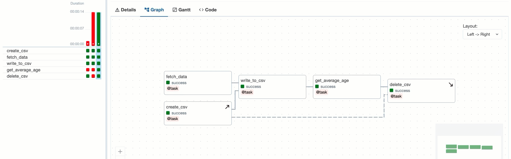
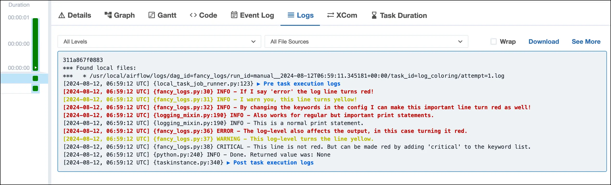
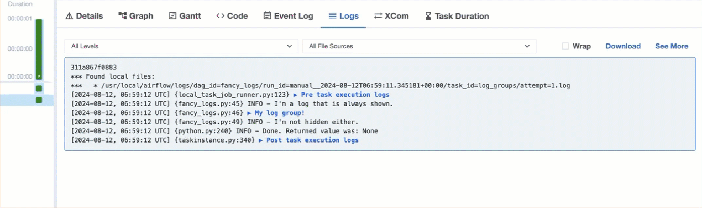
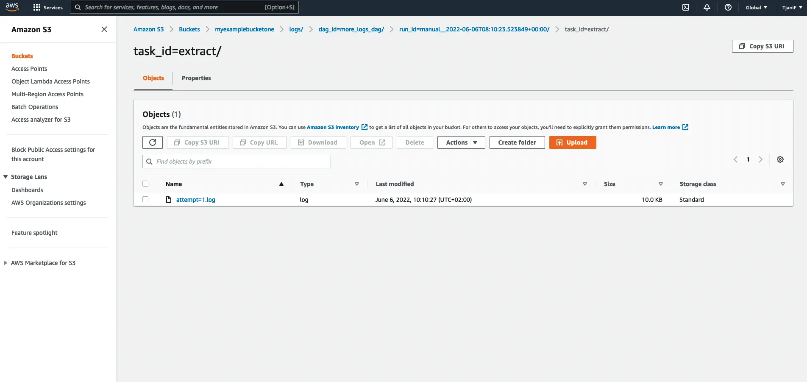
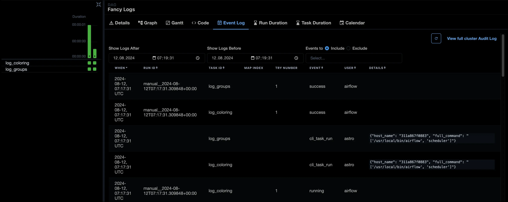
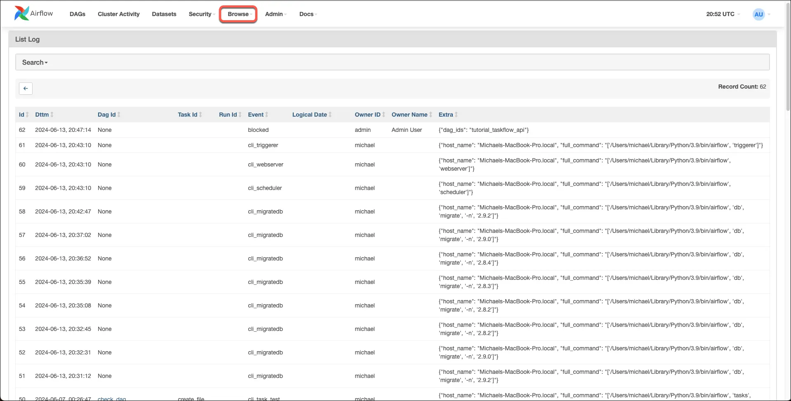

# Логирование (Logging)

Логи задач по умолчанию пишутся в указанное в конфигурации хранилище (локальная ФС или remote: S3, GCS, Azure Blob). Ключевые настройки: **remote_logging** (включение отправки в облако), **remote_base_log_folder** (путь в облаке), **logging_level** (уровень для логгеров Airflow), **task_log_reader** (как читать логи в UI — из локального файла или из remote).

Формат логов и имя файла можно настроить через конфиг; для задач путь обычно включает `dag_id`, `task_id`, `execution_date`, `try_number`. При использовании custom task handler или remote logging нужно установить соответствующий **task_log_handler** и при необходимости свой класс для чтения логов в UI.

Логи планировщика и воркеров пишутся отдельно; для централизованного сбора часто используют внешние системы (CloudWatch, Stackdriver, ELK).

При отправке логов в S3 используется настроенный bucket и структура каталогов:

В UI Airflow доступны журнал событий (event log) и при необходимости аудит-логи:

В коде задач рекомендуется использовать стандартный модуль `logging`: `logging.getLogger(__name__)` или передавать логгер из контекста. Так логи корректно попадают в вывод задачи и в UI. Избегайте print для важной информации — используйте логгер с подходящим уровнем.

Подробнее: [Logging](https://www.astronomer.io/docs/learn/logging), [Airflow logging](https://airflow.apache.org/docs/apache-airflow/stable/logging-monitoring/logging-tasks.html).

---

[← KubernetesPodOperator](kubernetes-pod-operator.md) | [К содержанию](README.md) | [Мультиязычность →](multilanguage.md)
