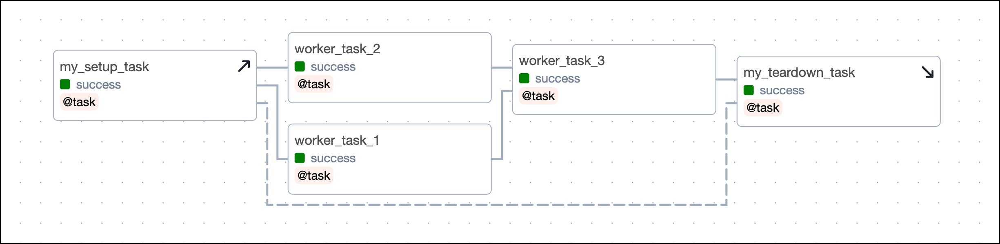

# Setup и teardown (Setup and teardown)

**Setup и teardown** — паттерн для задач, которые подготавливают и затем освобождают ресурс. Пример DAG:

Ресурс (временная БД, тестовое окружение, выделенный кластер). Задачи помечаются как **setup** или **teardown**; teardown выполняется после всех «рабочих» задач, зависящих от setup, даже при сбое части из них (по умолчанию teardown не пропускается при падении downstream). Так ресурс гарантированно очищается.

В TaskFlow API: декоратор **@task(setup=True)** или **@task(teardown=True)**. У классических операторов — параметр **setup** или **teardown** у BaseOperator. Зависимости задаются как обычно: рабочие задачи зависят от setup; teardown зависит от рабочих (или от группы). Возможна вложенная цепочка setup → work → teardown с несколькими уровнями. Для очистки при любом исходе можно комбинировать с trigger rules и on_failure_callback.

Подробнее: [Setup and teardown](https://www.astronomer.io/docs/learn/airflow-setup-teardown), [Airflow docs](https://airflow.apache.org/docs/apache-airflow/stable/authoring-and-scheduling/setup-and-teardown.html).

---

[← Динамические DAG](dynamic-dags.md) | [К содержанию](README.md) | [Общий код →](sharing-code.md)
