# Setup и teardown (Setup and teardown)

> Эта страница ещё не обновлена под Airflow 3. Показанные концепции актуальны, но часть кода может потребовать правок. При запуске примеров обновите импорты и учтите возможные breaking changes.
>
> Информация

В продакшен-окружениях Airflow рекомендуется поднимать ресурсы и конфигурацию перед запуском определённых задач и освобождать их даже при падении задач. Такой подход снижает использование ресурсов и затраты.

Начиная с Airflow 2.7, для создания и удаления ресурсов можно использовать специальный тип задач. В этом руководстве — всё про задачи setup и teardown в Airflow.

> - Вебинар: [Efficient data quality checks with Airflow 2.7](https://www.astronomer.io/events/webinars/efficient-data-quality-checks-with-airflow-2-7/).
> - Вебинар: [What's New in Airflow 2.7](https://www.astronomer.io/events/webinars/whats-new-in-airflow-2-7/).
>
> По теме есть и другие материалы. См. также:
>
> Другие способы изучить тему

## Необходимая база

Чтобы получить максимум от руководства, нужно понимать:

- Управление зависимостями в Airflow. См. [Manage task and task group dependencies in Airflow](../01.%20astronomer-basic/task-dependencies.md).
- Декораторы Airflow. См. [Введение в TaskFlow API и декораторы Airflow](../02.%20astronomer-dags/airflow-decorators.md).

## Когда использовать задачи setup/teardown

Задачи setup/teardown гарантируют, что ресурсы, нужные для выполнения задачи Airflow, создаются до запуска задачи и освобождаются после её завершения, независимо от сбоев задач.

Любую задачу Airflow можно сделать setup или teardown; при этом меняется поведение и в UI Airflow отображается связь setup/teardown.

Типичные сценарии:

- Поднять хранилище в [кастомном XCom backend](custom-xcom-backends.md) для данных, обрабатываемых задачами Airflow, и освободить его после того, как данные XCom больше не нужны.
- Управлять ресурсами для [проверок качества данных](../05.%20astronomer-write-dags/sql-check-operators.md).
- Управлять вычислительными ресурсами для обучения ML-модели.
- Управлять Spark-кластером для тяжёлых нагрузок.

## Концепции setup/teardown

Любую задачу можно объявить setup или teardown. Setup-задача, соответствующая ей teardown-задача и задачи между ними образуют воркфлоу setup/teardown.

Задачи, которые выполняются после setup и до связанной teardown, считаются входящими в область (scope) этого воркфлоу. Обычно они используют ресурсы, созданные setup и освобождаемые teardown.

Поведение setup/teardown отличается от обычных задач:

- Может быть setup без teardown и наоборот. Если задан только setup, в его область входит всё, что идёт после него по потоку; при очистке (clear) любой из этих задач setup тоже будет перезапущен.
- Если teardown находится в [task group](../02.%20astronomer-dags/task-groups.md) и зависимость задана на группу, при проверке выполнения зависимости teardown не учитывается. Например, задача `run_after_task_group`, зависящая от группы `work_in_the_cluster`, выполнится, даже если teardown упал или ещё выполняется.
- При определении успешности DAG run Airflow по умолчанию не учитывает teardown. То есть если teardown падает последней задачей DAG, DAG всё равно считается успешным. На снимке ниже DAG run не помечается как неуспешный из-за падения `tear_down_cluster`.

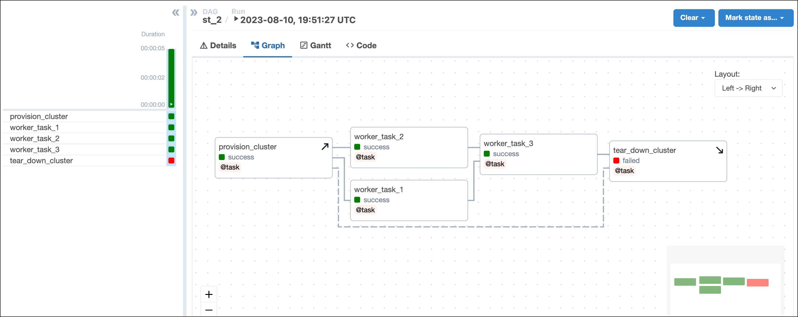

Поведение можно изменить, задав `on_failure_fail_dagrun=True` в [методе `.as_teardown()`](setup-teardown.md) или [декораторе `@teardown`](setup-teardown.md).

- Teardown без связанного setup выполняется один раз после завершения всех вышестоящих рабочих задач, независимо от их успеха или неудачи.
- Teardown выполняется, если хотя бы один связанный setup успешно завершён и все вышестоящие задачи завершены (успешно или нет). Если все связанные setup упали или пропущены, teardown будет помечен как failed или skipped соответственно.
- Очистка задачи, входящей в область setup/teardown, также очищает и перезапускает связанные setup и teardown, чтобы ресурсы заново создавались для перезапуска и освобождались после завершения.

### До и после использования setup и teardown

Задачи setup и teardown делают DAG устойчивее: ресурсы создаются в нужный момент и освобождаются даже при падении рабочих задач.

Следующий DAG не использует функциональность setup/teardown Airflow. Ресурсы создаёт обычная задача `provision_cluster`, три рабочие задачи используют эти ресурсы, освобождение выполняет задача `tear_down_cluster`.

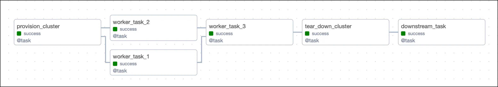

При такой схеме падение любой рабочей задачи приведёт к тому, что `tear_down_cluster` не выполнится. Ресурсы не будут освобождены и продолжат потреблять средства. Кроме того, задачи, зависящие от `tear_down_cluster`, тоже не запустятся, если у них нет [trigger rules](../01.%20astronomer-basic/trigger-rules.md) для запуска при падении вышестоящих.

Преобразовать `provision_cluster` в setup, а `tear_down_cluster` в teardown можно по примерам из раздела [реализация setup/teardown](setup-teardown.md).

После преобразования в Grid setup-задачи отображаются стрелкой вверх, teardown — стрелкой вниз. После настройки [воркфлоу setup/teardown](setup-teardown.md) между `provision_cluster` и `tear_down_cluster` задачи соединяются пунктиром. Задачи `worker_task_1`, `worker_task_2` и `worker_task_3` входят в область этого воркфлоу.

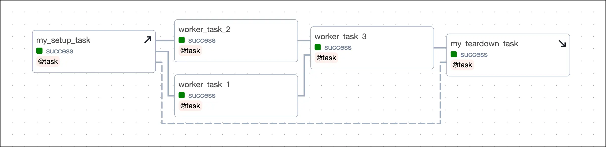

Даже если одна из рабочих задач падает (например, `worker_task_2` на снимке ниже), задача `tear_down_cluster` всё равно выполнится, ресурсы будут освобождены, а нижестоящие задачи завершатся успешно.

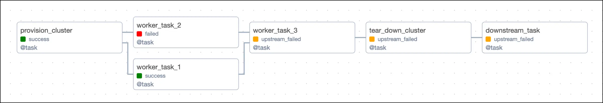

При очистке любой рабочей задачи очищаются и перезапускаются и setup, и teardown. Это удобно при восстановлении после сбоя пайплайна, когда нужно перезапустить одну или несколько задач, использующих ресурс.

Например, в том же DAG: `worker_task_2` упала, `worker_task_3` не запустилась из-за падения вышестоящей. Если очистить `worker_task_2` (Clear task), вместе с ней очистятся и перезапустятся setup `provision_cluster`, teardown `tear_down_cluster`, а также `worker_task_2`, `worker_task_3` и `downstream_task`. Так можно полностью восстановить выполнение без перезапуска `worker_task_1` и без ручного перезапуска отдельных задач.

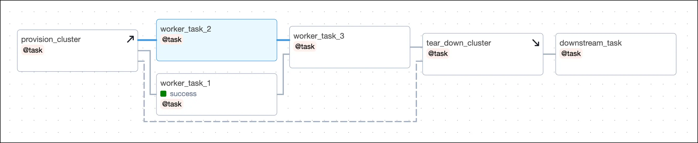

## Реализация setup/teardown

Сделать задачу setup или teardown можно двумя способами:

- Декораторы `@setup` и `@teardown` для Python-функции.
- Методы `.as_setup()` и `.as_teardown()` у задач TaskFlow API или классических операторов.

Добавить рабочие задачи в область воркфлоу setup/teardown можно двумя способами:

- Контекстный менеджер с методом `.teardown()`.
- Размещение задач между setup и teardown в графе зависимостей DAG.

Выбор способа — вопрос предпочтений.

В одном DAG может быть любое количество setup и teardown. Чтобы Airflow понимал, какие setup и teardown относятся друг к другу, нужно [создать воркфлоу setup/teardown](setup-teardown.md).

### Методы `.as_setup()` и `.as_teardown()`

Любую задачу можно превратить в setup или teardown.

Чтобы сделать задачу setup, вызовите `.as_setup()` у объекта вызванной задачи.

```python
@task
def my_setup_task():
    return "Setting up resources!"

my_setup_task_obj = my_setup_task()
my_setup_task_obj.as_setup()

# можно вызвать .as_setup() прямо на вызове функции
# my_setup_task().as_setup()
```

```python
def my_setup_task_func():
    return "Setting up resources!"

my_setup_task_obj = PythonOperator(
    task_id="my_setup_task",
    python_callable=my_setup_task_func,
)

my_setup_task_obj.as_setup()
```

Чтобы сделать задачу teardown, вызовите `.as_teardown()` у объекта вызванной задачи. У teardown должна быть хотя бы одна вышестоящая рабочая задача.

```python
@task
def worker_task():
    return "Doing some work!"

@task
def my_teardown_task():
    return "Tearing down resources!"

my_teardown_task_obj = my_teardown_task()
worker_task() >> my_teardown_task_obj.as_teardown()

# можно вызвать .as_teardown() прямо на вызове функции
# worker_task() >> my_teardown_task().as_teardown()
```

```python
def worker_task_func():
    return "Doing some work!"

worker_task_obj = PythonOperator(
    task_id="worker_task",
    python_callable=worker_task_func,
)

def my_teardown_task_func():
    return "Setting up resources!"

my_teardown_task_obj = PythonOperator(
    task_id="my_teardown_task",
    python_callable=my_teardown_task_func,
)

worker_task_obj >> my_teardown_task_obj.as_teardown()
```

После определения setup и teardown нужно [задать их воркфлоу](setup-teardown.md), чтобы Airflow понимал, какие задачи работают с одними и теми же ресурсами.

### Декораторы `@setup` и `@teardown`

В TaskFlow API можно использовать декораторы `@setup` и `@teardown`, чтобы превратить Python-функцию в setup или teardown.

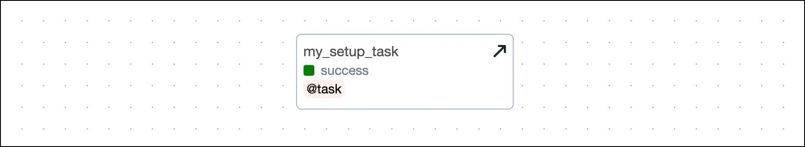

```python
from airflow.decorators import setup

@setup
def my_setup_task():
    return "Setting up resources!"

my_setup_task()
```

Как и с `.as_teardown()`, у задачи с `@teardown` должна быть хотя бы одна вышестоящая рабочая задача. Рабочая задача может быть с декоратором `@task` или классическим оператором.

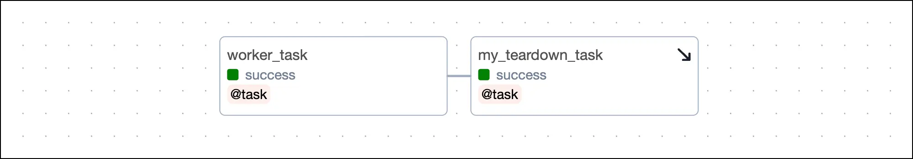

```python
from airflow.decorators import task, teardown

@task
def worker_task():
    return "Doing some work!"

@teardown
def my_teardown_task():
    return "Tearing down resources!"

worker_task() >> my_teardown_task()
```

После определения setup и teardown нужно [создать их воркфлоу](setup-teardown.md), чтобы Airflow понимал, какие задачи работают с одними и теми же ресурсами.

### Создание воркфлоу setup/teardown

Airflow должен понимать, какие setup и teardown связаны по управляемым ресурсам. Связать setup и teardown в одном воркфлоу можно так:

- Передать объект задачи с декоратором `@setup` аргументом в задачу с декоратором `@teardown`.
- Связать setup и teardown обычной зависимостью через оператор `>>` или функцию вроде `chain()`.
- Передать объект setup в аргумент `setups` метода `.as_teardown()` у teardown.

При использовании декораторов `@setup` и `@teardown` аргумент `setups` использовать нельзя.

В одном DAG может быть несколько наборов setup/teardown — и [параллельных](setup-teardown.md), и [вложенных](setup-teardown.md).

Количество setup, teardown и рабочих задач в области не ограничено.

Например: одна задача создаёт кластер, вторая меняет окружение в кластере, третья освобождает кластер. Первые две можно объявить setup, третью — teardown в одном воркфлоу. Затем в область можно добавить 10 задач, работающих с этим кластером.

Связать setup и teardown можно несколькими способами.

С декоратором `@task` можно использовать `.as_teardown()` и аргумент `setups`, чтобы указать, какие setup входят в один воркфлоу с teardown. Альтернатива — [декораторы `@setup` и `@teardown`](setup-teardown.md) и связь через прямые зависимости.

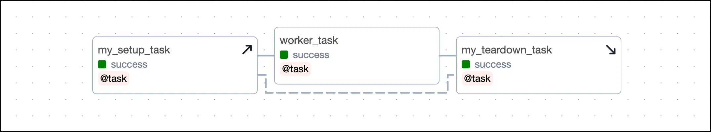

```python
@task
def my_setup_task():
    return "Setting up resources!"

@task
def worker_task():
    return "Doing some work!"

@task
def my_teardown_task():
    return "Tearing down resources!"

my_setup_task_obj = my_setup_task()

(
    my_setup_task_obj  # .as_setup() вызывать не обязательно
    >> worker_task()
    >> my_teardown_task().as_teardown(setups=my_setup_task_obj)
)
```

С классическими операторами Airflow используйте `.as_teardown()` и аргумент `setups`, чтобы связать setup и teardown в одном воркфлоу.

```python
def my_setup_task_func():
    return "Setting up resources!"

def worker_task_func():
    return "Doing some work!"

def my_teardown_task_func():
    return "Tearing down resources!"

my_setup_task_obj = PythonOperator(
    task_id="my_setup_task",
    python_callable=my_setup_task_func,
)

worker_task_obj = PythonOperator(
    task_id="worker_task",
    python_callable=worker_task_func,
)

my_teardown_task_obj = PythonOperator(
    task_id="my_teardown_task",
    python_callable=my_teardown_task_func,
)

(
    my_setup_task_obj  # .as_setup() вызывать не обязательно
    >> worker_task_obj
    >> my_teardown_task_obj.as_teardown(setups=my_setup_task_obj)
)
```

Вместо `setups` можно задать прямую зависимость между setup и teardown. Прямая зависимость между setup и teardown интерпретируется Airflow как один воркфлоу, независимо от того, что делают задачи.

```python
(
    my_setup_task_obj.as_setup()  # .as_setup() нужен
    >> worker_task()
    >> my_teardown_task_obj.as_teardown()
)

my_setup_task_obj >> my_teardown_task_obj
```

Следующий код даёт тот же DAG с использованием аргумента `setups`:

```python
(
    my_setup_task_obj  # .as_setup() не обязателен
    >> worker_task()
    >> my_teardown_task_obj.as_teardown(setups=my_setup_task_obj)
)
```

С декораторами `@setup` и `@teardown` воркфлоу между двумя задачами можно задать либо прямыми зависимостями, либо передачей объекта setup аргументом в teardown.

Второй вариант удобен, чтобы передать из setup в teardown данные вроде id ресурса.

```python
from airflow.decorators import task, setup, teardown

@setup
def my_setup_task():
    print("Setting up resources!")
    my_cluster_id = "cluster-2319"
    return my_cluster_id

@task
def worker_task():
    return "Doing some work!"

@teardown
def my_teardown_task(my_cluster_id):
    return f"Tearing down {my_cluster_id}!"

my_setup_task_obj = my_setup_task()
my_setup_task_obj >> worker_task() >> my_teardown_task(my_setup_task_obj)
```

Контекстный менеджер с вызовом `.as_teardown()` может охватывать набор задач, входящих в область setup/teardown. В примере ниже три задачи входят в область воркфлоу, заданного `my_cluster_setup_task` и `my_cluster_teardown_task`.

```python
with my_cluster_teardown_task_obj.as_teardown(setups=my_cluster_setup_task_obj):
    worker_task_1() >> [worker_task_2(), worker_task_3()]
```

Задачу, созданную вне контекстного менеджера, можно добавить в область явно через метод `.add_task()` у объекта контекстного менеджера.

```python
# создание задачи вне контекстного менеджера
worker_task_1_obj = worker_task_1()

with my_cluster_teardown_task_obj.as_teardown(
    setups=my_cluster_setup_task_obj
) as my_scope:
    my_scope.add_task(worker_task_1_obj)
```

#### Несколько setup/teardown в одном воркфлоу

Чтобы связать один teardown с несколькими setup, передайте список setup в аргумент `setups`. Вызывать `.as_setup()` для setup не обязательно.

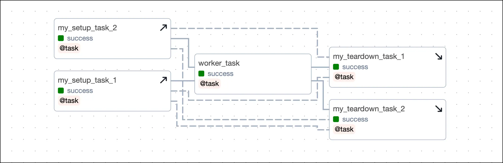

```python
(
    [my_setup_task_obj_1, my_setup_task_obj_2, my_setup_task_obj_3]
    >> worker_task()
    >> my_teardown_task().as_teardown(
        setups=[my_setup_task_obj_1, my_setup_task_obj_2, my_setup_task_obj_3]
    )
)
```

Чтобы связать один setup с несколькими teardown, передайте объект setup в аргумент `setups` метода `.as_teardown()` у каждого teardown.

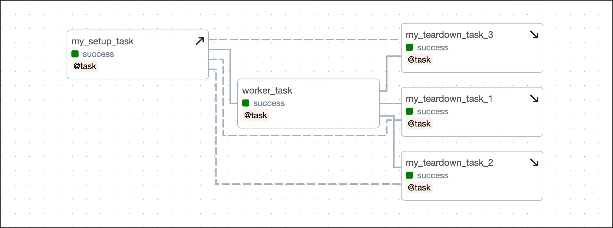

```python
(
    my_setup_task_obj
    >> worker_task()
    >> [
        my_teardown_task_obj_1.as_teardown(setups=my_setup_task_obj),
        my_teardown_task_obj_2.as_teardown(setups=my_setup_task_obj),
        my_teardown_task_obj_3.as_teardown(setups=my_setup_task_obj),
    ]
)
```

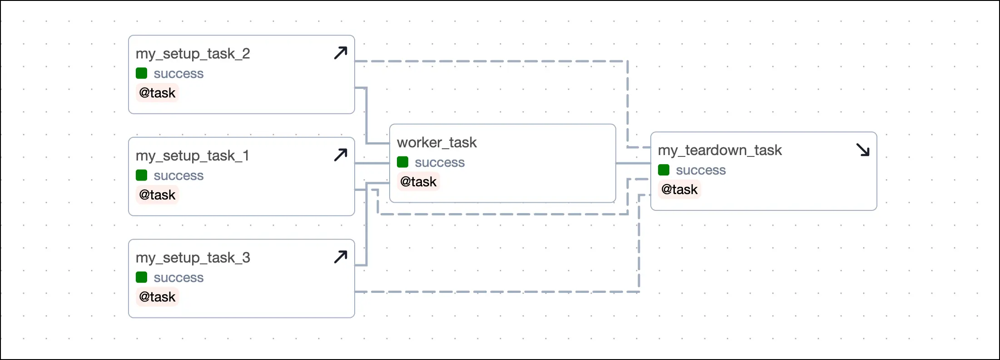

Если в воркфлоу больше одного setup и одного teardown и вы не используете `setups`, нужно задать несколько зависимостей: каждый setup должен быть вышестоящим для каждого teardown. В примере ниже два setup и два teardown; для определения воркфлоу заданы четыре зависимости.

```python
(
    [my_setup_task_obj_1.as_setup(), my_setup_task_obj_2.as_setup()]
    >> worker_task()
    >> [my_teardown_task_obj_1.as_teardown(), my_teardown_task_obj_2.as_teardown()]
)

# зависимости между каждым setup и каждым teardown
my_setup_task_obj_1 >> my_teardown_task_obj_1
my_setup_task_obj_1 >> my_teardown_task_obj_2
my_setup_task_obj_2 >> my_teardown_task_obj_1
my_setup_task_obj_2 >> my_teardown_task_obj_2
```

Тот же DAG с использованием `setups`:

```python
(
    [my_setup_task_obj_1, my_setup_task_obj_2]
    >> worker_task()
    >> [
        my_teardown_task_obj_1.as_teardown(
            setups=[my_setup_task_obj_1, my_setup_task_obj_2]
        ),
        my_teardown_task_obj_2.as_teardown(
            setups=[my_setup_task_obj_1, my_setup_task_obj_2]
        ),
    ]
)
```

#### Параллельные воркфлоу setup/teardown

В одном DAG может быть несколько независимых пар setup/teardown. Например, один воркфлоу поднимает и освобождает кластер, другой — временную БД.

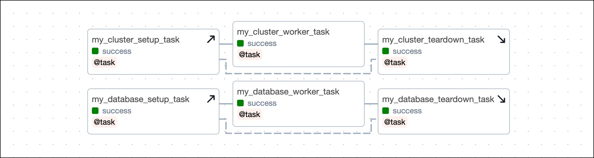

```python
from airflow.decorators import task, setup, teardown

@setup
def my_cluster_setup_task():
    print("Setting up resources!")
    my_cluster_id = "cluster-2319"
    return my_cluster_id

@task
def my_cluster_worker_task():
    return "Doing some work!"

@teardown
def my_cluster_teardown_task(my_cluster_id):
    return f"Tearing down {my_cluster_id}!"

@setup
def my_database_setup_task():
    print("Setting up my database!")
    my_database_name = "DWH"
    return my_database_name

@task
def my_database_worker_task():
    return "Doing some work!"

@teardown
def my_database_teardown_task(my_database_name):
    return f"Tearing down {my_database_name}!"

my_setup_task_obj = my_cluster_setup_task()
(
    my_setup_task_obj
    >> my_cluster_worker_task()
    >> my_cluster_teardown_task(my_setup_task_obj)
)

my_database_setup_obj = my_database_setup_task()
(
    my_database_setup_obj
    >> my_database_worker_task()
    >> my_database_teardown_task(my_database_setup_obj)
)
```

```python
@task
def my_cluster_setup_task():
    print("Setting up resources!")
    my_cluster_id = "cluster-2319"
    return my_cluster_id

@task
def my_cluster_worker_task():
    return "Doing some work!"

@task
def my_cluster_teardown_task(my_cluster_id):
    return f"Tearing down {my_cluster_id}!"

@task
def my_database_setup_task():
    print("Setting up my database!")
    my_database_name = "DWH"
    return my_database_name

@task
def my_database_worker_task():
    return "Doing some work!"

@task
def my_database_teardown_task(my_database_name):
    return f"Tearing down {my_database_name}!"

my_setup_task_obj = my_cluster_setup_task()
(
    my_setup_task_obj
    >> my_cluster_worker_task()
    >> my_cluster_teardown_task(my_setup_task_obj).as_teardown(
        setups=my_setup_task_obj
    )
)

my_database_setup_obj = my_database_setup_task()
(
    my_database_setup_obj
    >> my_database_worker_task()
    >> my_database_teardown_task(my_database_setup_obj).as_teardown(
        setups=my_database_setup_obj
    )
)
```

#### Вложенные воркфлоу setup/teardown

Setup и teardown можно вкладывать: внешняя и внутренняя область. Это полезно, когда есть базовый ресурс (например, кластер), который поднимается один раз и освобождается после всей работы, и при этом на нём есть ресурсы, которые нужно поднимать и освобождать для отдельных групп задач.

В примере ниже — код зависимостей для структуры с внешним и внутренним воркфлоу setup/teardown:

- `outer_worker_1`, `outer_worker_2`, `outer_worker_3` — рабочие задачи во внешней области.
- `inner_worker_1`, `inner_worker_2` — рабочие задачи во внутренней области. Все задачи внутренней области входят и во внешнюю.
- `inner_setup` и `inner_teardown` — внутренние setup и teardown, оба входят во внешнюю область.
- `outer_setup` и `outer_teardown` — внешние setup и teardown.

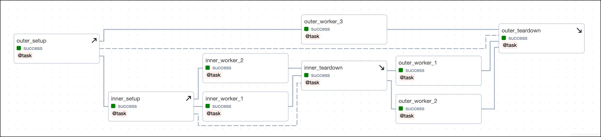

```python
outer_setup_obj = outer_setup()
inner_setup_obj = inner_setup()
outer_teardown_obj = outer_teardown()

(
    outer_setup_obj
    >> inner_setup_obj
    >> [inner_worker_1(), inner_worker_2()]
    >> inner_teardown().as_teardown(setups=inner_setup_obj)
    >> [outer_worker_1(), outer_worker_2()]
    >> outer_teardown_obj.as_teardown(setups=outer_setup_obj)
)

outer_setup_obj >> outer_worker_3() >> outer_teardown_obj
```

При очистке задачи очищаются все связанные с ней setup и teardown плюс все нижестоящие задачи. Например:

- Очистка любой внутренней рабочей задачи (`inner_worker_1`, `inner_worker_2`) очистит `inner_setup`, `inner_teardown`, `outer_setup`, `outer_teardown`, а также `outer_worker_1` и `outer_worker_2` (они ниже внутренних). `outer_worker_3` не очистится — она идёт параллельно внутренним.
- Очистка любой внешней рабочей задачи (`outer_worker_1`, `outer_worker_2`, `outer_worker_3`) также очистит `outer_setup` и `outer_teardown`.

### Задача после task group

Если teardown входит в [task group](../02.%20astronomer-dags/task-groups.md) и зависимость задана на группу, при проверке выполнения зависимости teardown не учитывается.

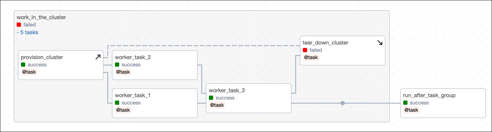

### Сужение области setup

Если у setup нет связанных нижестоящих задач, область можно ограничить пустой teardown-задачей. Например, если `my_worker_task_3_obj` не использует ресурсы `my_setup_task` и при её очистке setup не должен перезапускаться, в цепочку зависимостей можно добавить пустую teardown-задачу:

```python
my_setup_task >> [my_worker_task_1_obj >> my_worker_task_2_obj] >> my_worker_task_3_obj

[my_worker_task_1_obj >> my_worker_task_2_obj] >> EmptyOperator(
    task_id="empty_task"
).as_teardown(setups=my_setup_task)
```

## Пример DAG

В примере DAG имитируется паттерн setup/teardown, который можно запустить локально. Воркфлоу состоит из задач:

- `get_average_age_obj` входит в область setup/teardown. При падении этой задачи DAG всё равно должен удалить «CSV-файл» (в реальности это может быть дорогой кластер). Чтобы восстановиться после сбоя при перезапуске `get_average_age_obj`, нужно заново создать CSV, снова получить данные и записать их. Так как задача в области `create_csv`, `write_to_csv` и `fetch_data`, при перезапуске `get_average_age_obj` эти задачи тоже перезапустятся.
- `delete_csv` — связанная teardown-задача, удаляет ресурс (CSV-файл).
- `fetch_data` — setup, получает данные из удалённого источника и передаёт их для записи в CSV.
- `write_to_csv` — setup, записывает данные в CSV.
- `create_csv` — setup, создаёт CSV-файл в каталоге из [DAG param](../02.%20astronomer-dags/airflow-params.md).

В DAG есть 3 задачи вне области setup/teardown:

- `end` — пустая задача в конце DAG.
- `report_file_path` — выводит путь к CSV в логи.
- `start` — пустая задача в начале DAG.

В DAG есть параметр для проверки setup/teardown: в Trigger DAG включите `fetch_bad_data`, чтобы в пайплайн попали некорректные данные и `get_average_age_obj` упала. `delete_csv` всё равно выполнится и удалит CSV. После исправления данных можно очистить `get_average_age_obj` — все задачи воркфлоу setup/teardown перезапустятся и завершатся успешно.

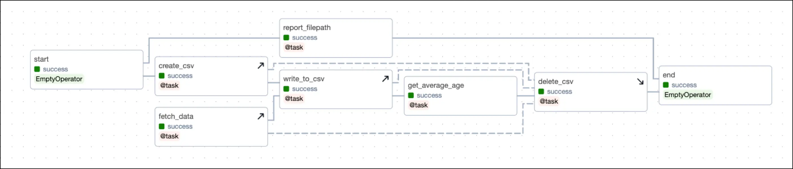

**Успешный DAG:**

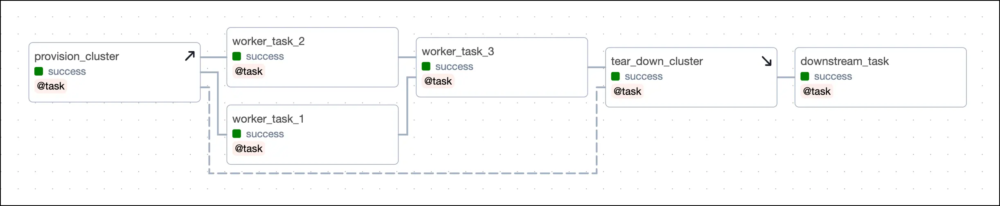

**DAG при падении рабочей задачи:**

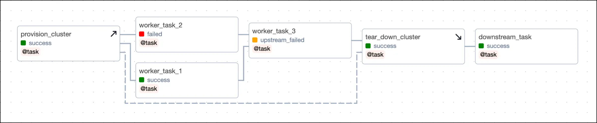

```python
"""
## Использование .as_teardown() в простом локальном примере

DAG с setup/teardown: подготовка CSV, запись и поведение при некорректных данных.
"""

from airflow.decorators import dag, task
from airflow.models.baseoperator import chain
from pendulum import datetime
from airflow.models.param import Param
from airflow.operators.empty import EmptyOperator
import os
import csv
import time


def get_params_helper(**context):
    folder = context["params"]["folder"]
    filename = context["params"]["filename"]
    cols = context["params"]["cols"]
    return folder, filename, cols


@dag(
    start_date=datetime(2023, 7, 1),
    schedule=None,
    catchup=False,
    params={
        "folder": "include/my_data",
        "filename": "data.csv",
        "cols": ["id", "name", "age"],
        "fetch_bad_data": Param(False, type="boolean"),
    },
    tags=[".is_teardown()", "setup/teardown"],
)
def setup_teardown_csv_methods():
    start = EmptyOperator(task_id="start")
    end = EmptyOperator(task_id="end")

    @task
    def report_filepath(**context):
        folder, filename, cols = get_params_helper(**context)
        print(f"Filename: {folder}/{filename}")

    @task
    def create_csv(**context):
        folder, filename, cols = get_params_helper(**context)

        if not os.path.exists(folder):
            os.makedirs(folder)

        with open(f"{folder}/{filename}", "w", newline="") as f:
            writer = csv.writer(f)
            writer.writerows([cols])

    @task
    def fetch_data(**context):
        bad_data = context["params"]["fetch_bad_data"]

        if bad_data:
            return [
                [1, "Joe", "Forty"],
                [2, "Tom", 29],
                [3, "Lea", 19],
            ]
        else:
            return [
                [1, "Joe", 40],
                [2, "Tom", 29],
                [3, "Lea", 19],
            ]

    @task
    def write_to_csv(data, **context):
        folder, filename, cols = get_params_helper(**context)

        with open(f"{folder}/{filename}", "a", newline="") as f:
            writer = csv.writer(f)
            writer.writerows(data)

        time.sleep(10)

    @task
    def get_average_age(**context):
        folder, filename, cols = get_params_helper(**context)

        with open(f"{folder}/{filename}", "r", newline="") as f:
            reader = csv.reader(f)
            next(reader)
            ages = [int(row[2]) for row in reader]

        return sum(ages) / len(ages)

    @task
    def delete_csv(**context):
        folder, filename, cols = get_params_helper(**context)

        os.remove(f"{folder}/{filename}")

        if not os.listdir(f"{folder}"):
            os.rmdir(f"{folder}")

    start >> report_filepath() >> end

    create_csv_obj = create_csv()
    fetch_data_obj = fetch_data()
    write_to_csv_obj = write_to_csv(fetch_data_obj)
    get_average_age_obj = get_average_age()
    delete_csv_obj = delete_csv()

    chain(
        start,
        create_csv_obj,
        write_to_csv_obj,
        get_average_age_obj,
        delete_csv_obj.as_teardown(
            setups=[create_csv_obj, write_to_csv_obj, fetch_data_obj]
        ),
        end,
    )


setup_teardown_csv_methods()
```

```python
"""
## Использование @setup и @teardown в простом локальном примере

DAG с setup/teardown: подготовка CSV, запись и поведение при некорректных данных.
"""

from airflow.decorators import dag, task, setup, teardown
from airflow.models.baseoperator import chain
from pendulum import datetime
from airflow.models.param import Param
from airflow.operators.empty import EmptyOperator
import os
import csv
import time


def get_params_helper(**context):
    folder = context["params"]["folder"]
    filename = context["params"]["filename"]
    cols = context["params"]["cols"]
    return folder, filename, cols


@dag(
    start_date=datetime(2023, 7, 1),
    schedule=None,
    catchup=False,
    params={
        "folder": "include/my_data",
        "filename": "data.csv",
        "cols": ["id", "name", "age"],
        "fetch_bad_data": Param(False, type="boolean"),
    },
    tags=["@setup", "@teardown", "setup/teardown"],
)
def setup_teardown_csv_decorators():
    start = EmptyOperator(task_id="start")
    end = EmptyOperator(task_id="end")

    @task
    def report_filepath(**context):
        folder, filename, cols = get_params_helper(**context)
        print(f"Filename: {folder}/{filename}")

    @setup
    def create_csv(**context):
        folder, filename, cols = get_params_helper(**context)

        if not os.path.exists(folder):
            os.makedirs(folder)

        with open(f"{folder}/{filename}", "w", newline="") as f:
            writer = csv.writer(f)
            writer.writerows([cols])

    @setup
    def fetch_data(**context):
        bad_data = context["params"]["fetch_bad_data"]

        if bad_data:
            return [
                [1, "Joe", "Forty"],
                [2, "Tom", 29],
                [3, "Lea", 19],
            ]
        else:
            return [
                [1, "Joe", 40],
                [2, "Tom", 29],
                [3, "Lea", 19],
            ]

    @setup
    def write_to_csv(data, **context):
        folder, filename, cols = get_params_helper(**context)

        with open(f"{folder}/{filename}", "a", newline="") as f:
            writer = csv.writer(f)
            writer.writerows(data)

        time.sleep(10)

    @task
    def get_average_age(**context):
        folder, filename, cols = get_params_helper(**context)

        with open(f"{folder}/{filename}", "r", newline="") as f:
            reader = csv.reader(f)
            next(reader)
            ages = [int(row[2]) for row in reader]

        return sum(ages) / len(ages)

    @teardown
    def delete_csv(**context):
        folder, filename, cols = get_params_helper(**context)

        os.remove(f"{folder}/{filename}")

        if not os.listdir(f"{folder}"):
            os.rmdir(f"{folder}")

    start >> report_filepath() >> end

    create_csv_obj = create_csv()
    fetch_data_obj = fetch_data()
    write_to_csv_obj = write_to_csv(fetch_data_obj)
    get_average_age_obj = get_average_age()
    delete_csv_obj = delete_csv()

    chain(
        start,
        create_csv_obj,
        write_to_csv_obj,
        get_average_age_obj,
        delete_csv_obj,
        end,
    )

    # при @setup и @teardown задачи связываются обычными зависимостями
    # или через task flow (см. сложный пример)
    create_csv_obj >> delete_csv_obj
    fetch_data_obj >> delete_csv_obj
    write_to_csv_obj >> delete_csv_obj


setup_teardown_csv_decorators()
```

---

[← Динамические DAG](dynamic-dags.md) | [К содержанию](README.md) | [Общий код →](sharing-code.md)
