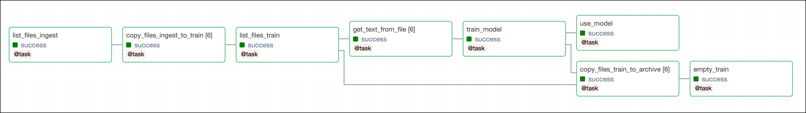

# Использование Airflow Object Storage в ML-пайплайне

> Эта страница ещё не обновлена под Airflow 3. Описанные концепции актуальны, но часть примеров кода может потребовать правок. При запуске примеров обновляйте импорты и учитывайте возможные breaking changes.
>
> Информация

В Airflow 2.8 появилась возможность [Airflow object storage](https://airflow.apache.org/docs/apache-airflow/stable/core-concepts/objectstorage.html), которая упрощает работу с удалёнными и локальными объектными хранилищами.

В этом туториале эта возможность показана на примере простого ML-пайплайна: классификатор определяет, кто скорее мог произнести фразу — капитан Кирк или капитан Пикар из Star Trek.

## Зачем использовать Airflow object storage?

Объектные хранилища широко используются в современных пайплайнах: сырые данные, артефакты моделей, изображения, видео, текст, аудио и т.д. У разных хранилищ свои соглашения по именам и путям, поэтому работать с данными across разных хранилищ бывает неудобно.

Возможность object storage в Airflow позволяет:

- Эффективно передавать большие файлы: для объектных хранилищ Airflow использует [shutil.copyfileobj()](https://docs.python.org/3/library/shutil.html#shutil.copyfileobj) и передаёт файлы чанками, не загружая их целиком в память.
- Передавать файлы между разными объектными хранилищами без отдельных XToYTransferOperator.
- Менять хранилище без правок кода DAG.
- Работать с хранилищами через единый [Path API](https://docs.python.org/3/library/pathlib.html). Учитывайте ограничения, связанные с природой удалённых хранилищ. См. [Cloud Object Stores are not real file systems](https://airflow.apache.org/docs/apache-airflow/stable/core-concepts/objectstorage.html#cloud-object-stores-are-not-real-file-systems).

## Время прохождения

Туториал рассчитан примерно на 20 минут.

## Необходимая база

Для прохождения туториала полезно понимать:

- Основы [pathlib](https://docs.python.org/3/library/pathlib.html).
- Task Flow API. См. [Декораторы Airflow и TaskFlow API](../02.%20astronomer-dags/airflow-decorators.md).
- Основы Airflow: написание DAG и определение задач. См. [Get started with Apache Airflow](../01.%20astronomer-basic/README.md).

## Требования

- Объектное хранилище. В туториале используется [Amazon S3](https://aws.amazon.com/s3/), подойдут также [Google Cloud Storage](https://cloud.google.com/storage), [Azure Blob Storage](https://azure.microsoft.com/en-us/services/storage/blobs/) или локальная файловая система.
- [Astro CLI](https://www.astronomer.io/docs/astro/cli/get-started).

## Шаг 1: Настройка проекта Astro

1. Чтобы создать [подключение Airflow](../01.%20astronomer-basic/connections.md) к AWS S3, добавьте в `.env` переменную окружения (подставьте свои учётные данные AWS; для другого хранилища измените тип и параметры подключения):

```text
AIRFLOW_CONN_MY_AWS_CONN='{"conn_type": "aws", "login": "<YOUR_AWS_ACCESS_KEY>", "password": "<YOUR_AWS_SECRET_KEY>"}'
```

2. Добавьте в `requirements.txt` проекта Astro провайдер Amazon с extra `s3fs` и пакет [scikit-learn](https://scikit-learn.org/stable/). Для Google Cloud Storage или Azure Blob Storage установите соответственно [Google provider](https://registry.astronomer.io/providers/apache-airflow-providers-google/versions/latest) или [Azure provider](https://registry.astronomer.io/providers/apache-airflow-providers-microsoft-azure/versions/latest):

```text
apache-airflow-providers-amazon[s3fs]==8.13.0
scikit-learn==1.3.2
```

3. Создайте новый проект Astro:

```bash
mkdir astro-object-storage-tutorial && cd astro-object-storage-tutorial
astro dev init
```

## Шаг 2: Подготовка данных

В пайплайне будет обучаться классификатор: «Кирк или Пикар» сказал фразу. Обучающая выборка — по 3 цитаты каждого капитана в файлах `.txt`.

1. Загрузите файлы из [репозитория Astronomer на GitHub](https://github.com/astronomer/2-8-example-dags/tree/main/include/ingestion_data_object_store_use_case) в нужные папки.
2. В бакете создайте папку `ingest` с двумя подпапками: `kirk_quotes` и `picard_quotes`.
3. Создайте в S3 бакет с именем `astro-object-storage-tutorial`.

## Шаг 3: Создание DAG

1. Скопируйте код ниже в файл `object_storage_use_case.py` в папке `dags`.

DAG использует три расположения в объектном хранилище; их можно направить на разные системы, меняя для каждого `OBJECT_STORAGE_X`, `PATH_X` и `CONN_ID_X`:

- **base_path_ingest** — базовый путь для данных приёма (цитаты, загруженные в шаге 2).
- **base_path_train** — путь к данным для обучения модели.
- **base_path_archive** — путь архива, куда перемещаются уже использованные для обучения данные.

DAG состоит из восьми задач. Задача `list_files_ingest` получает `base_path_ingest`, обходит подпапки `kirk_quotes` и `picard_quotes` и возвращает все файлы как объекты `ObjectStoragePath`. Методы `.iterdir()`, `.is_dir()` и `.is_file()` позволяют перечислять и проверять содержимое независимо от типа хранилища. Задача `copy_files_ingest_to_train` [динамически маппится](../02.%20astronomer-dags/dynamic-tasks.md) по списку файлов из `list_files_ingest`, копирует файлы из ingest в train (метод `.copy()` у `ObjectStoragePath`; внутри используется `shutil.copyfileobj()`). Задача `list_files_train` перечисляет файлы в `base_path_train`. Задача `get_text_from_file` маппится по этим файлам и читает текст через `.read_block()`. Имя файла даёт метку; метка и текст возвращаются словарём и передаются через [XCom](../02.%20astronomer-dags/passing-data-between-tasks.md) в следующую задачу. Задача `train_model` обучает [наивный байесовский классификатор](https://scikit-learn.org/stable/modules/naive_bayes.html) по данным из `get_text_from_file`, сериализует модель в base64 и передаёт через XCom. Задача `use_model` десериализует модель и делает предсказание по цитате из [параметра DAG](https://www.astronomer.io/docs/learn/airflow-params) `my_quote`, выводя результат в логи. Задача `copy_files_train_to_archive` копирует файлы из train в archive. Задача `empty_train` удаляет все файлы из папки train.



```python
"""
## Перемещение файлов между объектными хранилищами в MLOps-пайплайне

Этот DAG демонстрирует базовое использование Airflow 2.8 Object Storage:
копирование файлов между расположениями в объектном хранилище в пайплайне
обучения наивного байесовского классификатора для различения цитат капитана
Кирка и капитана Пикара и предсказания для введённой пользователем цитаты.

Для запуска DAG нужны: содержимое include/ingestion_data_object_store_use_case
в вашем объектном хранилище, установленный провайдер и подключение Airflow.
Для локального хранилища можно использовать file:// и подправить пути.
"""

from airflow.decorators import dag, task
from pendulum import datetime
from airflow.io.path import ObjectStoragePath
from airflow.models.baseoperator import chain
from airflow.models.param import Param
import joblib
import base64
import io

OBJECT_STORAGE_INGEST = "s3"
CONN_ID_INGEST = "my_aws_conn"
PATH_INGEST = "astro-object-storage-tutorial/ingest/"

OBJECT_STORAGE_TRAIN = "s3"
CONN_ID_TRAIN = "my_aws_conn"
PATH_TRAIN = "astro-object-storage-tutorial/train/"

OBJECT_STORAGE_ARCHIVE = "file"
CONN_ID_ARCHIVE = None
PATH_ARCHIVE = "include/archive/"

base_path_ingest = ObjectStoragePath(
    f"{OBJECT_STORAGE_INGEST}://{PATH_INGEST}", conn_id=CONN_ID_INGEST
)
base_path_train = ObjectStoragePath(
    f"{OBJECT_STORAGE_TRAIN}://{PATH_TRAIN}", conn_id=CONN_ID_TRAIN
)
base_path_archive = ObjectStoragePath(
    f"{OBJECT_STORAGE_ARCHIVE}://{PATH_ARCHIVE}", conn_id=CONN_ID_ARCHIVE
)


@dag(
    start_date=datetime(2023, 12, 1),
    schedule=None,
    catchup=False,
    tags=["ObjectStorage"],
    doc_md=__doc__,
    params={
        "my_quote": Param(
            "Time and space are creations of the human mind.",
            type="string",
            description="Enter a quote to be classified as Kirk-y or Picard-y.",
        ),
    },
)
def object_storage_use_case():
    @task
    def list_files_ingest(base: ObjectStoragePath) -> list[ObjectStoragePath]:
        """List files in remote object storage including subdirectories."""
        labels = [obj for obj in base.iterdir() if obj.is_dir()]
        files = [f for label in labels for f in label.iterdir() if f.is_file()]
        return files

    @task
    def copy_files_ingest_to_train(src: ObjectStoragePath, dst: ObjectStoragePath):
        """Copy a file from one remote system to another. Streamed in chunks via shutil.copyfileobj."""
        src.copy(dst=dst)

    @task
    def list_files_train(base: ObjectStoragePath) -> list[ObjectStoragePath]:
        """List files in remote object storage."""
        files = [f for f in base.iterdir() if f.is_file()]
        return files

    @task
    def get_text_from_file(file: ObjectStoragePath) -> dict:
        """Read files in remote object storage."""
        bytes = file.read_block(offset=0, length=None)
        text = bytes.decode("utf-8")
        key = file.key
        filename = key.split("/")[-1]
        label = filename.split("_")[-2]
        return {"label": label, "text": text}

    @task
    def train_model(train_data: list[dict]):
        """Train a Naive Bayes Classifier using the files in the train folder."""
        from sklearn.feature_extraction.text import CountVectorizer
        from sklearn.naive_bayes import MultinomialNB
        from sklearn.pipeline import make_pipeline
        from sklearn.model_selection import train_test_split

        text_data = [d["text"] for d in train_data]
        labels = [d["label"] for d in train_data]
        X_train, X_test, y_train, y_test = train_test_split(
            text_data, labels, test_size=0.2, random_state=42
        )
        model = make_pipeline(CountVectorizer(), MultinomialNB())
        model.fit(X_train, y_train)
        buffer = io.BytesIO()
        joblib.dump(model, buffer)
        buffer.seek(0)
        encoded_model = base64.b64encode(buffer.getvalue()).decode("utf-8")
        return encoded_model

    @task
    def use_model(encoded_model: str, **context):
        """Load the model and use it for prediction."""
        my_quote = context["params"]["my_quote"]
        model_binary = base64.b64decode(encoded_model)
        buffer = io.BytesIO(model_binary)
        model = joblib.load(buffer)
        predictions = model.predict([my_quote])
        print(f"The quote: '{my_quote}'")
        print(f"sounds like it could have been said by {predictions[0].capitalize()}")

    @task
    def copy_files_train_to_archive(src: ObjectStoragePath, dst: ObjectStoragePath):
        """Copy a file from a remote system to local storage."""
        src.copy(dst=dst)

    @task
    def empty_train(base: ObjectStoragePath):
        """Empty the train folder."""
        for file in base.iterdir():
            file.unlink()

    files_ingest = list_files_ingest(base=base_path_ingest)
    files_copied = copy_files_ingest_to_train.partial(dst=base_path_train).expand(
        src=files_ingest
    )
    files_train = list_files_train(base=base_path_train)
    chain(files_copied, files_train)
    train_data = get_text_from_file.expand(file=files_train)
    encoded_model = train_model(train_data=train_data)
    use_model(encoded_model=encoded_model)
    chain(
        encoded_model,
        copy_files_train_to_archive.partial(dst=base_path_archive).expand(
            src=files_train
        ),
        empty_train(base=base_path_train),
    )


object_storage_use_case()
```

## Шаг 4: Запуск DAG

1. В каталоге проекта Astro выполните `astro dev start`, откройте Airflow UI по адресу `localhost:8080`.
2. В UI запустите DAG `object_storage_use_case` кнопкой play. Укажите любую цитату в [параметре Airflow](../02.%20astronomer-dags/airflow-params.md) `my_quote`.
3. После завершения DAG run откройте логи задачи `use_model` — там будет предсказание модели. Пример вывода:

```text
[2023-12-11, 00:19:22 UTC] {logging_mixin.py:188} INFO - The quote: 'Time and space are creations of the human mind.'
[2023-12-11, 00:19:22 UTC] {logging_mixin.py:188} INFO - sounds like it could have been said by Picard
```

## Итог

Вы использовали возможность Airflow object storage для работы с файлами в разных расположениях. Подробнее о методах и возможностях — в [документации Airflow OSS](https://airflow.apache.org/docs/apache-airflow/stable/core-concepts/objectstorage.html).

---

[← К содержанию](README.md) | [Документирование DAG →](dag-documentation.md)
