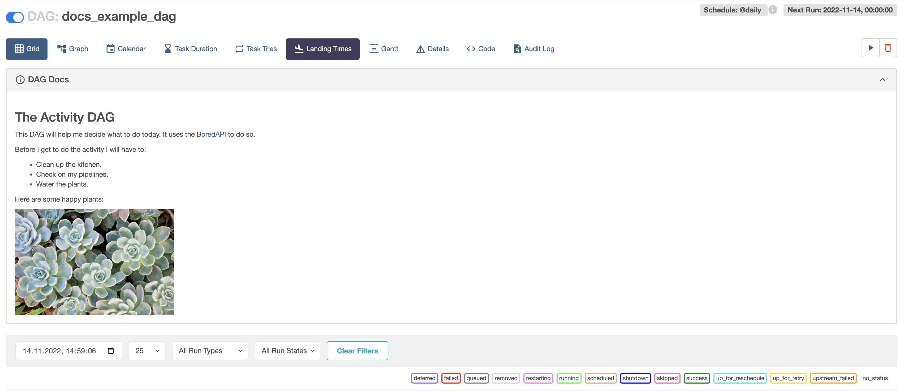
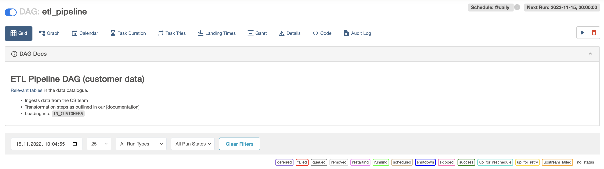
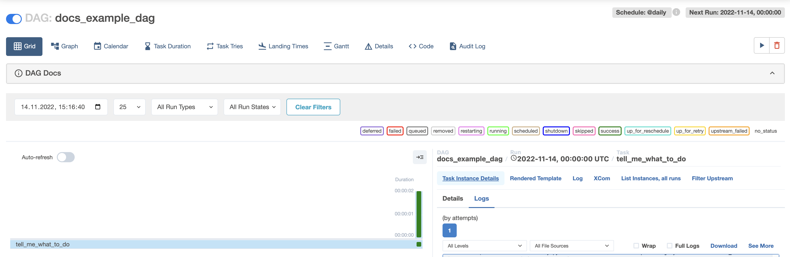
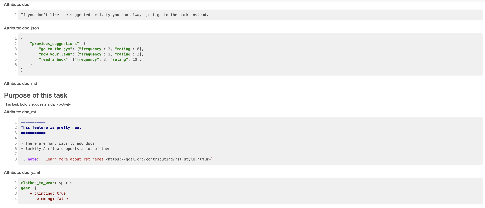
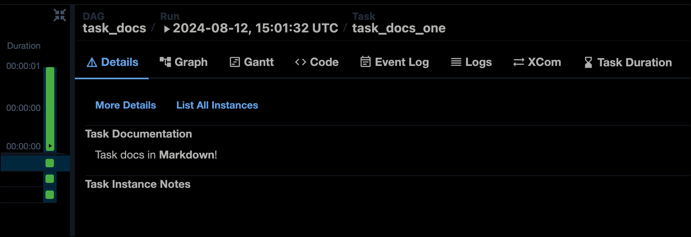
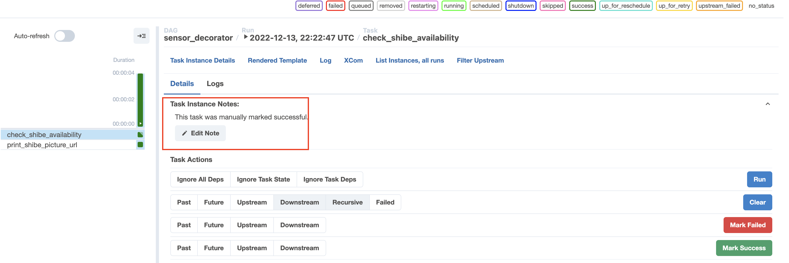

# Документирование DAG в Airflow UI (Custom UI docs)

> Эта страница ещё не обновлена под Airflow 3. Описанные концепции актуальны, но часть примеров кода может потребовать правок. При запуске примеров обновляйте импорты и учитывайте возможные breaking changes.
>
> Информация

В Airflow можно создавать документацию DAG в формате Markdown, которая отображается в UI.

После прохождения туториала вы сможете:

- Добавлять собственные docstring к задаче Airflow.
- Добавлять собственные docstring к DAG Airflow.

## Время прохождения

Туториал рассчитан примерно на 15 минут.

## Необходимая база

- Основы Python. См. [Python Documentation](https://docs.python.org/3/tutorial/index.html).
- Основы Airflow. См. [Introduction to Apache Airflow](../01.%20astronomer-basic/README.md).

## Требования

- [Astro CLI](https://www.astronomer.io/docs/astro/cli/install-cli).

## Шаг 1: Создание проекта Astro

Чтобы запустить Airflow локально, нужен проект Astro.

1. Создайте каталог для проекта и перейдите в него: `mkdir <имя_каталога> && cd <имя_каталога>`.
2. Инициализируйте проект Astro: `astro dev init`.
3. Чтобы разрешить необработанный HTML в описаниях DAG (Markdown), добавьте в `.env` переменную окружения: `AIRFLOW__WEBSERVER__ALLOW_RAW_HTML_DESCRIPTIONS=True`. Тогда в описаниях DAG можно использовать HTML. Если из соображений безопасности не включать эту настройку, Markdown по-прежнему будет работать, а HTML из туториала отобразится как обычный текст.
4. Запустите Airflow: `astro dev start`.

## Шаг 2: Создание нового DAG

1. В папке `dags` создайте файл `docs_example_dag.py`.
2. Скопируйте в него один из вариантов DAG ниже (декораторы или традиционный стиль).

**Вариант с декораторами:**

```python
from airflow.decorators import task, dag
from pendulum import datetime
import requests


@dag(
    start_date=datetime(2022, 11, 1),
    schedule="@daily",
    catchup=False
)
def docs_example_dag():
    @task
    def tell_me_what_to_do():
        response = requests.get("https://bored-api.appbrewery.com/random")
        return response.json()["activity"]

    tell_me_what_to_do()


docs_example_dag()
```

**Традиционный вариант:**

```python
from airflow.models.dag import DAG
from airflow.operators.python import PythonOperator
from pendulum import datetime
import requests


def query_api():
    response = requests.get("https://bored-api.appbrewery.com/random")
    return response.json()["activity"]


with DAG(
    dag_id="docs_example_dag",
    start_date=datetime(2022, 11, 1),
    schedule=None,
    catchup=False,
):
    tell_me_what_to_do = PythonOperator(
        task_id="tell_me_what_to_do",
        python_callable=query_api,
    )
```

В DAG одна задача `tell_me_what_to_do`: она обращается к [API](https://bored-api.appbrewery.com/random), получает случайное занятие на день и выводит его в логи.

## Шаг 3: Добавление документации к DAG

К DAG можно добавить описание в формате Markdown — оно будет отображаться на страницах Grid, Graph и Calendar в Airflow UI.

1. Добавьте в файл `docs_example_dag.py` над определением DAG строку с документацией:

```python
doc_md_DAG = """
### The Activity DAG

This DAG will help me decide what to do today. It uses the [BoredAPI](https://bored-api.appbrewery.com/random) to do so.

Before I get to do the activity I will have to:

- Clean up the kitchen.
- Check on my pipelines.
- Water the plants.

Here are some happy plants:


"""
```

Текст написан в Markdown: заголовок, ссылка, маркированный список и изображение (в HTML). Подробнее о Markdown: [The Markdown Guide](https://www.markdownguide.org/).

2. Передайте эту строку в параметр **doc_md** при определении DAG:

```python
@dag(
    start_date=datetime(2022, 11, 1),
    schedule="@daily",
    catchup=False,
    doc_md=doc_md_DAG
)
def docs_example_dag():
    ...
```

```python
with DAG(
    dag_id="docs_example_dag",
    start_date=datetime(2022, 11, 1),
    schedule="@daily",
    catchup=False,
    doc_md=doc_md_DAG
):
    ...
```

3. Откройте представление Grid и нажмите на баннер **DAG Docs**, чтобы увидеть отображённую документацию.





> Airflow автоматически подхватывает docstring, написанный сразу под определением DAG, и показывает его как DAG Docs. При использовании `with DAG():` в параметр `doc_md` можно передать путь к `.md`-файлу — удобно, если одна и та же документация нужна нескольким DAG.
>
> Совет

## Шаг 4: Добавление документации к задаче

К отдельным задачам тоже можно добавить описание в формате Markdown, Monospace, JSON, YAML или reStructuredText. Рендерится только Markdown; остальные форматы отображаются как форматированный текст.

1. Добавьте строки с документацией в разных форматах (например, перед определением DAG):

**Markdown:**

```python
doc_md_task = """
### Purpose of this task

This task **boldly** suggests a daily activity.
"""
```

**Monospace:**

```python
doc_monospace_task = """
If you don't like the suggested activity you can always just go to the park instead.
"""
```

**JSON:**

```python
doc_json_task = """
{
  "previous_suggestions": {
    "go to the gym": {"frequency": 2, "rating": 8},
    "mow your lawn": {"frequency": 1, "rating": 2},
    "read a book": {"frequency": 3, "rating": 10}
  }
}
"""
```

**YAML:**

```python
doc_yaml_task = """
clothes_to_wear: sports
gear: |
  - climbing: true
  - swimming: false
"""
```

**reStructuredText:**

```python
doc_rst_task = """
===========
This feature is pretty neat
===========

* there are many ways to add docs
* luckily Airflow supports a lot of them

.. note:: `Learn more about rst here! <https://docutils.sourceforge.io/rst.html>`__
"""
```

2. Передайте эти строки в параметры задачи (`doc_md`, `doc`, `doc_json`, `doc_yaml`, `doc_rst`):

**С декоратором @task:**

```python
@task(
    doc_md=doc_md_task,
    doc=doc_monospace_task,
    doc_json=doc_json_task,
    doc_yaml=doc_yaml_task,
    doc_rst=doc_rst_task
)
def tell_me_what_to_do():
    response = requests.get("https://bored-api.appbrewery.com/random")
    return response.json()["activity"]

tell_me_what_to_do()
```

**С PythonOperator:**

```python
tell_me_what_to_do = PythonOperator(
    task_id="tell_me_what_to_do",
    python_callable=query_api,
    doc_md=doc_md_task,
    doc=doc_monospace_task,
    doc_json=doc_json_task,
    doc_yaml=doc_yaml_task,
    doc_rst=doc_rst_task
)
```

3. В Airflow UI запустите DAG.
4. В представлении Grid нажмите на зелёный квадрат нужного экземпляра задачи.
5. Откройте **Details** → **Task Instance Details**. Документация задачи отображается по атрибутам (doc_md, doc, doc_json, doc_yaml, doc_rst).





В Airflow 2.10+ документация задачи, переданная в `doc_md` или как docstring у задачи с декоратором `@task`, отображается в деталях задачи в UI.



## Шаг 5: Заметки к экземпляру задачи и DAG run

К экземплярам задач и DAG run можно добавлять заметки из представления Grid в Airflow UI. Это удобно, чтобы передать коллегам контекст (например, почему упал конкретный запуск).

1. Откройте представление Grid для DAG `docs_example_dag`, созданного в шаге 2.
2. Выберите экземпляр задачи или DAG run.
3. Откройте **Details** → **Task Instance Notes** или **DAG Run notes** → **Add Note**.
4. Введите текст заметки и нажмите **Save Note**.



## Итог

Теперь вы умеете добавлять документацию и к DAG, и к задачам Airflow в UI.

---

[← Object Storage](airflow-objectstorage.md) | [К содержанию](README.md) | [DAG Factory →](dag-factory.md)
