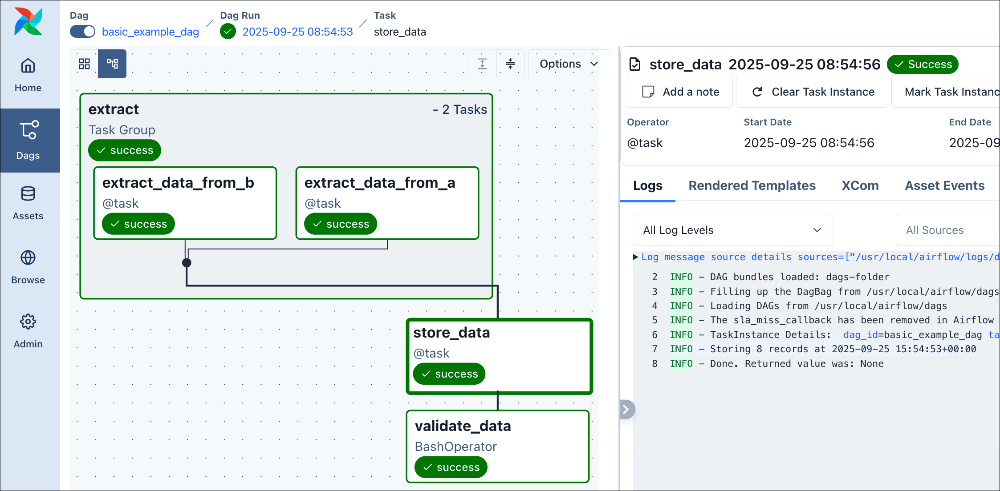
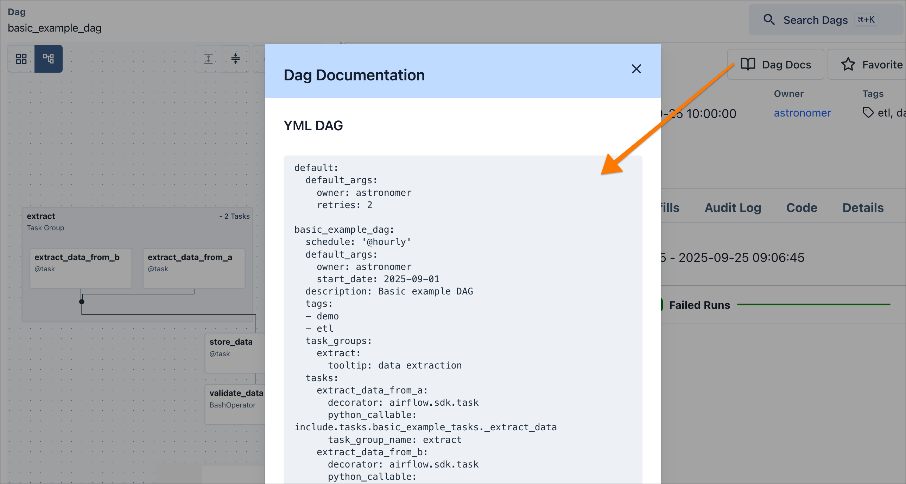
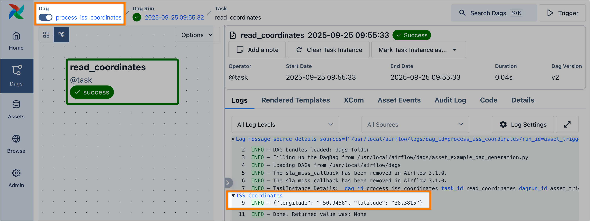
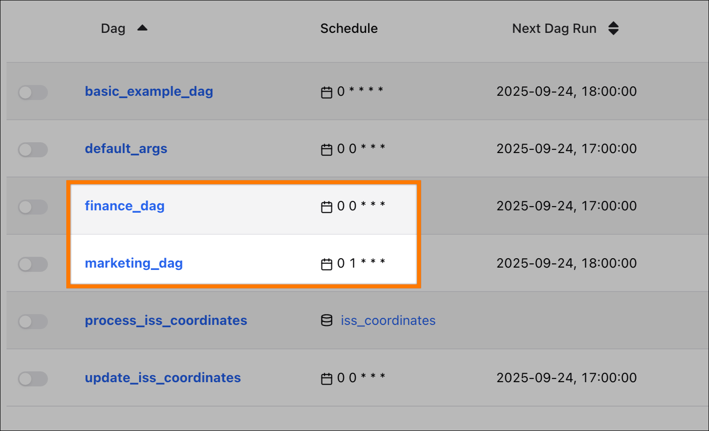
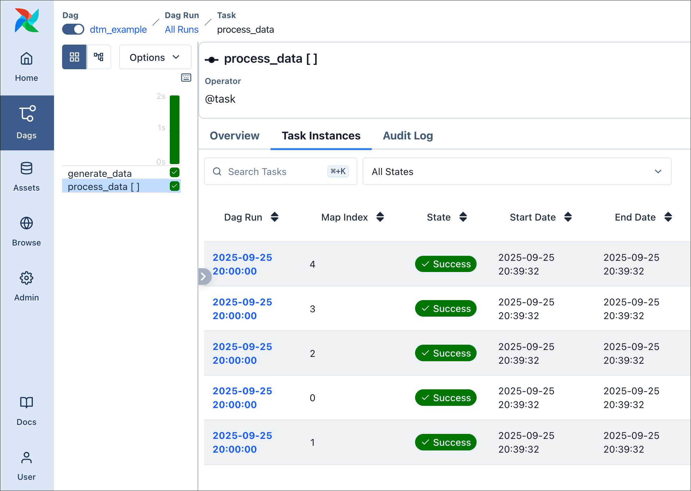

# DAG Factory

[DAG Factory](https://astronomer.github.io/dag-factory/latest/) — open-source инструмент от Astronomer для [динамической генерации](https://www.astronomer.io/docs/learn/dynamically-generating-dags) [Apache Airflow®](https://airflow.apache.org/) DAG из [YAML](https://yaml.org/). Обычно DAG в Airflow пишут только на Python; DAG Factory позволяет пользователям без знания Python работать с Airflow.

В этом руководстве — полный проход по пакету DAG Factory: установка, структура проекта по лучшим практикам и описание многозадачного пайплайна целиком в YAML. В примере используются TaskFlow API, группы задач и передача данных между задачами — всё из конфигурационного файла. В итоге вы сможете применять эти приёмы к своим динамическим DAG.

DAG Factory совместим со всеми продуктами Astronomer и с любой установкой Apache Airflow. Исходный код: [dag-factory](https://github.com/astronomer/dag-factory) на GitHub.

## Когда использовать DAG Factory

Писать DAG напрямую на Python гибко и мощно, но не всегда самое удобное решение. DAG Factory предлагает конфигурационный подход: структура пайплайнов задаётся в YAML. Это особенно полезно в нескольких случаях.

## Расширение возможностей команды

YAML часто проще Python. DAG Factory даёт аналитикам и младшим разработчикам создавать и поддерживать свои DAG без глубокого знания Airflow, через упрощённый декларативный синтаксис.

## Стандартизация повторяющихся DAG

Если у вас десятки DAG по одному шаблону (например, типовой extract-and-load), DAG Factory подходит идеально: один шаблон и множество DAG за счёт смены параметров в YAML, меньше дублирования и проще поддержка.

## Разделение логики и структуры

DAG Factory разделяет «что» и «как»: в YAML явно заданы структура и зависимости DAG, а бизнес-логика остаётся в Python-функциях. DAG проще читать, код — модульнее и удобнее тестировать.

В части сценариев удобнее другие способы написания DAG, например чистый Python.

При сложной условной логике, ветвлении или тонкой обработке ошибок, которую неудобно выражать в YAML, обычно лучше нативный Python. Отлаживать DAG в YAML сложнее: нет пошаговой отладки и богатого логирования. Имеет смысл учитывать опыт команды и существующие практики. [Asset-aware scheduling](https://www.astronomer.io/docs/learn/airflow-datasets) в DAG Factory поддерживается, но может быть менее удобен, чем в нативном Python.

## Необходимая база

Полезно понимать:

- [Операторы Airflow](https://www.astronomer.io/docs/learn/what-is-an-operator).
- [Основы Airflow](https://www.astronomer.io/docs/learn/get-started-with-airflow): написание DAG и определение задач.
- [Компоненты Airflow](https://www.astronomer.io/docs/learn/airflow-components) и их взаимодействие.

## Требования

- [Astro CLI](https://www.astronomer.io/docs/astro/cli/install-cli)
- Python 3.9.0+

## Шаг 1: Инициализация проекта Airflow (Astro CLI)

Создайте каталог проекта и инициализируйте проект Astro с помощью [Astro CLI](https://www.astronomer.io/docs/astro/cli/install-cli):

```bash
mkdir my-dag-factory-project && cd my-dag-factory-project
astro dev init
```

Команда `init` создаёт стандартную структуру проекта Airflow. Для этого туториала удалите пример DAG по умолчанию:

```bash
rm dags/exampledag.py
```

Добавьте библиотеку `dag-factory` в зависимости проекта. В `requirements.txt` добавьте строку:

```text
dag-factory==1.0.1
```

Запустите локальное окружение Airflow. Astro CLI соберёт проект и установит `dag-factory`:

```bash
astro dev start
```

После запуска UI Airflow откроется по адресу `http://localhost:8080`, список DAG будет пуст.

## Шаг 2: Организация проекта

Важна правильная структура проекта. Хранить все YAML, Python и SQL в `dags/` можно, но это перегружает DAG processor.

Рекомендация Astronomer: помещать Python, SQL и прочие скрипты, которые не являются определениями DAG, в папку **`include/`**. Файлы оттуда доступны DAG, но не парсятся DAG processor, что снижает нагрузку.

Для туториала используем структуру, подходящую и для реальных проектов:

- **`include/`** — подпапка `tasks` для Python-функций, вызываемых операторами; там же могут лежать SQL и другие вспомогательные скрипты.
- **`dags/`** — только YAML-конфиги и Python-скрипт, генерирующий DAG из них.

Для крупных проектов с миксом динамических и обычных Python DAG можно выделить, например, `dags/configs/` под YAML для DAG Factory.

Создайте папку `tasks` внутри `include` для бизнес-логики:

```bash
mkdir -p include/tasks
```

## Шаг 3: Подготовка функций

Примерный DAG будет использовать и [TaskFlow API](https://www.astronomer.io/docs/learn/airflow-decorators) (декоратор задачи), и [традиционный оператор](https://www.astronomer.io/docs/learn/what-is-an-operator) (BashOperator). DAG Factory поддерживает оба варианта; туториал ориентирован на Airflow 3.x и по возможности использует TaskFlow API.

Перед описанием DAG в YAML напишите Python-функции для задач и поместите их в `include/tasks/`.

Создайте файл `include/tasks/basic_example_tasks.py`:

```python
def _extract_data() -> list[int]:
    return [1, 2, 3, 4]

def _store_data(processed_at: str, data_a: list[int], data_b: list[int]) -> None:
    print(f"Storing {len(data_a + data_b)} records at {processed_at}")
```

Функции лучше делать небольшими, самодостаточными и отдельно тестируемыми — это совпадает с лучшими практиками и для DAG Factory, и для Airflow в целом.

## Шаг 4: Определение базового DAG в YAML

Создайте в папке `dags` файл `basic_example.yml` с таким содержимым:

```yaml
basic_example_dag:
  default_args:
    owner: "astronomer"
    start_date: 2025-09-01
  description: "Basic example DAG"
  tags: ["demo", "etl"]
  schedule: "@hourly"

  task_groups:
    extract:
      tooltip: "data extraction"

  tasks:
    extract_data_from_a:
      decorator: airflow.sdk.task
      python_callable: include.tasks.basic_example_tasks._extract_data
      task_group_name: extract

    extract_data_from_b:
      decorator: airflow.sdk.task
      python_callable: include.tasks.basic_example_tasks._extract_data
      task_group_name: extract

    store_data:
      decorator: airflow.sdk.task
      python_callable: include.tasks.basic_example_tasks._store_data
      processed_at: "{{ logical_date }}"
      data_a: +extract_data_from_a
      data_b: +extract_data_from_b
      dependencies: [extract]

    validate_data:
      operator: airflow.providers.standard.operators.bash.BashOperator
      bash_command: "echo data is valid"
      dependencies: [store_data]
```

В YAML заданы структура DAG и задачи. Запись `+extract_data_from_a` и `+extract_data_from_b` передаёт возвращаемые значения задач `extract` в задачу `store_data`; `{{ logical_date }}` — пример Jinja.

## Шаг 5: Скрипт-генератор DAG

Остаётся создать Python-скрипт, который Airflow будет парсить: он с помощью DAG Factory загружает YAML и генерирует объекты DAG. Так вы полностью контролируете процесс и при необходимости можете его кастомизировать.

Создайте файл `dags/basic_example_dag_generation.py`:

```python
import os
from pathlib import Path

from dagfactory import load_yaml_dags

DEFAULT_CONFIG_ROOT_DIR = "/usr/local/airflow/dags/"
CONFIG_ROOT_DIR = Path(os.getenv("CONFIG_ROOT_DIR", DEFAULT_CONFIG_ROOT_DIR))

config_file = str(CONFIG_ROOT_DIR / "basic_example.yml")

load_yaml_dags(
    globals_dict=globals(),
    config_filepath=config_file,
)
```

После парсинга этого файла DAG с ID `basic_example_dag` появится в UI. В пайплайне 4 задачи, две из них в группе:

- **validate_data** — классический BashOperator, выводит «data is valid».
- **store_data** — TaskFlow API, вызывает `_store_data` из `include/tasks/basic_example_tasks.py`. Параметры задаются в YAML по имени; `+extract_data_from_a` и т.п. означают подстановку возвращаемого значения задачи. Поддерживается Jinja, в том числе [переменные, макросы и фильтры](https://airflow.apache.org/docs/apache-airflow/stable/templates-ref.html).
- **extract_data_from_a / extract_data_from_b** — TaskFlow API, вызывают `_extract_data`; в примере две такие задачи, обе возвращают список чисел.

Функция `load_yaml_dags` генерирует DAG. Можно указать один файл или каталог — тогда рекурсивно обрабатываются все `.yml` и `.yaml`. Сгенерированные DAG попадают в контекст Airflow через переданный `globals_dict`. Подробнее: [официальная документация](https://astronomer.github.io/dag-factory/latest/configuration/load_yaml_dags/).

DAG, созданные через DAG Factory, автоматически получают тег `dagfactory`. В представлении отдельного DAG при выборе **Dag Docs** по умолчанию показывается YAML, из которого DAG создан — это удобно при отладке.





## (Опционально) Шаг 6: Asset-aware scheduling в YAML

Рассмотрим [asset-aware scheduling](https://www.astronomer.io/docs/learn/airflow-datasets) и его настройку через DAG Factory: один DAG (producer) обновляет asset, второй (consumer) запускается по обновлению этого asset.

Создайте Python-функции для задач. Файл `include/tasks/asset_example_tasks.py`:

```python
import json
import tempfile
import requests

def _get_iss_coordinates_file_path() -> str:
    return tempfile.gettempdir() + "/iss_coordinates.txt"

def _update_iss_coordinates() -> None:
    placeholder = {"latitude": "0.0", "longitude": "0.0"}

    try:
        response = requests.get("http://api.open-notify.org/iss-now.json", timeout=5)
        response.raise_for_status()
        data = response.json()
        coordinates = data.get("iss_position", placeholder)
    except Exception:
        coordinates = placeholder

    with open(_get_iss_coordinates_file_path(), "w") as f:
        f.write(json.dumps(coordinates))

def _read_iss_coordinates() -> None:
    path = _get_iss_coordinates_file_path()
    with open(path, "r") as f:
        print("::group::ISS Coordinates")
        print(f.read())
        print("::endgroup::")
```

`_update_iss_coordinates` получает данные из API и пишет в файл; `_read_iss_coordinates` читает файл и выводит содержимое в отдельную группу логов.

Создайте YAML `dags/asset_example.yml`:

```yaml
default:
  start_date: 2025-09-01

update_iss_coordinates:
  schedule: "@daily"
  tasks:
    update_coordinates:
      decorator: airflow.sdk.task
      python_callable: include.tasks.asset_example_tasks._update_iss_coordinates
      outlets:
        - __type__: airflow.sdk.Asset
          name: "iss_coordinates"

process_iss_coordinates:
  schedule:
    - __type__: airflow.sdk.Asset
      name: "iss_coordinates"
  tasks:
    read_coordinates:
      decorator: airflow.sdk.task
      python_callable: include.tasks.asset_example_tasks._read_iss_coordinates
```

В одном YAML заданы DAG **update_iss_coordinates** (producer) и **process_iss_coordinates** (consumer). У producer в `outlets` указан asset `iss_coordinates`; у consumer в `schedule` — тот же asset, так создаётся зависимость. Блок верхнего уровня `default` задаёт общие настройки для всех DAG в файле.

Скрипт генерации `dags/asset_example_dag_generation.py`:

```python
import os
from pathlib import Path

from dagfactory import load_yaml_dags

DEFAULT_CONFIG_ROOT_DIR = "/usr/local/airflow/dags/"
CONFIG_ROOT_DIR = Path(os.getenv("CONFIG_ROOT_DIR", DEFAULT_CONFIG_ROOT_DIR))

config_file = str(CONFIG_ROOT_DIR / "asset_example.yml")

load_yaml_dags(
    globals_dict=globals(),
    config_filepath=config_file,
)
```

После парсинга в UI появятся два DAG, связанные asset `iss_coordinates`. После успешного завершения `update_iss_coordinates` автоматически запустится `process_iss_coordinates`.



Упрощённый вариант — [@asset синтаксис](https://www.astronomer.io/docs/learn/airflow-datasets#asset-syntax): декоратор `@asset(schedule="@daily")` у функции `_update_iss_coordinates` в Python позволяет не описывать DAG producer в YAML. Здесь оба DAG в YAML для демонстрации работы DAG Factory с producer и consumer.

## (Опционально) Шаг 7: Альтернативная загрузка YAML

Ранее для каждого DAG использовался отдельный Python-скрипт генерации. Так удобно тонко управлять процессом и не обрабатывать лишние YAML при большом их числе. Но это усложняет структуру.

Функция `load_yaml_dags` может рекурсивно обрабатывать все YAML в папке DAG. Удалите скрипты `dags/basic_example_dag_generation.py` и `dags/asset_example_dag_generation.py` и создайте один файл `dags/dag_generation.py`:

```python
# импорт нужен, чтобы DAG processor не пропускал файл
from airflow.sdk import dag
from dagfactory import load_yaml_dags

load_yaml_dags(globals_dict=globals())
```

Импорт `dag` добавлен как признак для Airflow: при поиске DAG в dag bundle учитываются только Python-файлы, содержащие (без учёта регистра) строки `airflow` и `dag`. Чтобы парсить все Python-файлы, отключите конфиг `DAG_DISCOVERY_SAFE_MODE`. Каталог с YAML можно задать отдельно, передав в `load_yaml_dags` аргумент `dags_folder`.

Результат будет тем же: все добавленные YAML будут обрабатываться автоматически.

## (Опционально) Шаг 8: Конфигурация и наследование

При росте числа DAG важно не дублировать одну и ту же конфигурацию. В DAG Factory есть централизованная конфигурация и наследование.

Можно задавать значения по умолчанию и для аргументов DAG (например, `schedule`), и для аргументов задач (например, `retries` через `default_args`).

В `dags/asset_example.yml` уже использован общий блок `default` внутри файла. Ещё мощнее комбинировать глобальные defaults с наследованием.

DAG Factory автоматически ищет файл **`defaults.yml`** в папке dags и применяет его ко всем DAG в этой папке и подпапках. Так получается единый источник правды для глобальных настроек. Путь к конфигурации можно переопределить параметром `defaults_config_path` в `load_yaml_dags`.

Пример стандартов компании:

- Расписание по умолчанию для всех DAG — ежедневно в полночь (`@daily`), если не задано иное.
- У всех задач по умолчанию 2 повтора (`retries`).
- Владелец по умолчанию — `astronomer`, если DAG не привязан к отделу.
- Общая `start_date`: `2025-09-01`.

Создайте `dags/defaults.yml`:

```yaml
schedule: "@daily"

default_args:
  owner: "astronomer"
  retries: 2
```

Наследование: DAG Factory применяет `defaults.yml` иерархически. `defaults.yml` в подпапке наследует от родителя и может переопределять любые настройки.

Пример: разный `owner` для отделов Marketing и Finance и другое расписание только для Marketing (1:00 вместо полуночи).

Структура каталогов:

```text
airflow
└── dags
    ├── defaults.yml
    ├── marketing
    │   ├── defaults.yml
    │   └── marketing_dag.yml
    └── finance
        ├── defaults.yml
        └── finance_dag.yml
```

`dags/marketing/defaults.yml`:

```yaml
schedule: "0 1 * * *"

default_args:
  owner: "astronomer-marketing"
```

`dags/finance/defaults.yml`:

```yaml
default_args:
  owner: "astronomer-finance"
```

Определения самих DAG становятся минимальными. `dags/marketing/marketing_dag.yml`:

```yaml
marketing_dag:
  tasks:
    some_process:
      operator: airflow.providers.standard.operators.bash.BashOperator
      bash_command: "echo processing data"
```

`dags/finance/finance_dag.yml`:

```yaml
finance_dag:
  tasks:
    some_process:
      operator: airflow.providers.standard.operators.bash.BashOperator
      bash_command: "echo processing data"
```

`start_date`, `owner`, `retries` берутся из слоёв `defaults.yml`. В UI будут два DAG с разными унаследованными свойствами: **finance_dag** — owner из локального `defaults.yml` (`astronomer-finance`), schedule и retries из глобального; **marketing_dag** — schedule и owner из локального (`0 1 * * *`, `astronomer-marketing`), retries из глобального.



Если `defaults.yml` лежит внутри `dags_folder`, DAG Factory может попытаться разобрать его как DAG и выдать ошибки в логах. Чтобы этого избежать, задавайте отдельный `defaults_config_path`; наследование при этом сохраняется.

## Продвинутое использование: динамический маппинг задач

DAG Factory поддерживает [динамический маппинг задач](https://www.astronomer.io/docs/learn/dynamic-tasks): параллельные задачи создаются в рантайме. Пример с TaskFlow API. Пусть в `include/tasks/dtm_tasks.py` определены функции:

```python
def _generate_data():
    return [1, 2, 3, 4, 5]

def _process_data(processing_date, value):
    print(f"Processing {value} at {processing_date}")
```

В YAML достаточно указать аргументы в блоках `partial` и `expand`:

```yaml
dtm_example:
  default_args:
    owner: "astronomer"
    start_date: 2025-09-01
  schedule: "@hourly"

  tasks:
    generate_data:
      decorator: airflow.sdk.task
      python_callable: include.tasks.dtm_tasks._generate_data

    process_data:
      decorator: airflow.sdk.task
      python_callable: include.tasks.dtm_tasks._process_data
      partial:
        processing_date: "{{ logical_date }}"
      expand:
        value: +generate_data
      dependencies: [generate_data]
```

Выход `generate_data` будет использован для создания параллельных экземпляров задачи `process_data`.



## Продвинутое использование: динамическая генерация YAML

Выше DAG создавались из статичных YAML. Если нужно много DAG с похожей структурой, конфигурации можно [генерировать динамически](https://www.astronomer.io/docs/learn/dynamically-generating-dags) по шаблону YAML.

Нужны два файла:

- Python-скрипт, который подставляет в шаблон фактические значения и записывает итоговый YAML.
- Шаблон YAML со структурой DAG и плейсхолдерами для меняющихся значений.

Удобно использовать Jinja2. Шаблон `include/template.yml`:

```text
{{ dag_id }}:
  schedule: "{{ schedule }}"
  tasks:
    task_1:
      operator: airflow.providers.standard.operators.bash.BashOperator
      bash_command: "{{ bash_command_task_1 }}"
    task_2:
      operator: airflow.providers.standard.operators.bash.BashOperator
      bash_command: "{{ bash_command_task_2 }}"
      dependencies: [task_1]
```

Скрипт `generate_yaml.py` (в корне проекта): читает шаблон, подставляет переменные, записывает результат в `dags/dynamic_dags.yml`. Запускать вручную для локальной разработки или из CI/CD:

```python
from pathlib import Path
import yaml
from jinja2 import Environment, FileSystemLoader

TEMPLATE_DIR = "include"
TEMPLATE_NAME = "template.yml"
OUTPUT_FILE = "dags/dynamic_dags.yml"
TEMPLATE_VARIABLES = [
    {
        "dag_id": "example_1",
        "schedule": "@daily",
        "bash_command_task_1": "echo task 1 from example 1",
        "bash_command_task_2": "echo task 2 from example 1",
    },
    {
        "dag_id": "example_2",
        "schedule": "@weekly",
        "bash_command_task_1": "echo task 1 from example 2",
        "bash_command_task_2": "echo task 2 from example 2",
    },
]

def generate_dags_from_template():
    env = Environment(loader=FileSystemLoader(TEMPLATE_DIR), autoescape=True)
    template = env.get_template(TEMPLATE_NAME)
    all_dags = {}
    for variables in TEMPLATE_VARIABLES:
        rendered_yaml_str = template.render(variables)
        dag_config = yaml.safe_load(rendered_yaml_str)
        all_dags.update(dag_config)
    output_path = Path(OUTPUT_FILE)
    with open(output_path, "w") as f:
        yaml.dump(all_dags, f, sort_keys=False)
    print(f"Successfully generated {len(TEMPLATE_VARIABLES)} dags into {OUTPUT_FILE}")

if __name__ == "__main__":
    generate_dags_from_template()
```

В результате получится файл `dags/dynamic_dags.yml` с двумя DAG `example_1` и `example_2`.

## Итог

Вы прошли путь от одного DAG в YAML до настройки генерации пайплайнов из конфигурации. Вы научились:

- Генерировать YAML-конфигурации с помощью шаблонизатора.
- Управлять настройками через иерархию `defaults.yml` и наследование.
- Использовать asset-aware scheduling и динамический маппинг задач.
- Передавать данные между задачами и применять TaskFlow API.
- Описывать DAG, задачи и группы задач декларативно в YAML.

DAG Factory даёт конфигурационный способ разработки под Airflow: расширение возможностей команды, стандартизация ETL или разделение структуры и логики пайплайна. Дополнительные примеры и сценарии — в [репозитории DAG Factory](https://github.com/astronomer/dag-factory/tree/main/dev/dags).

---

[← Документирование DAG](dag-documentation.md) | [К содержанию](README.md) | [PyCharm →](pycharm-local-dev.md)
