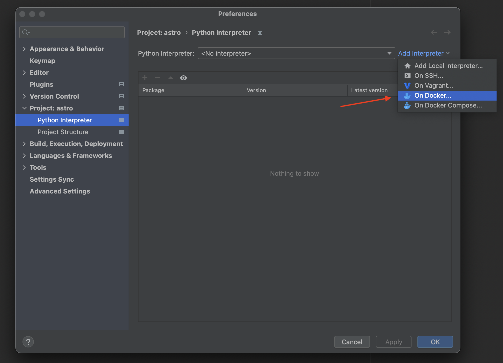
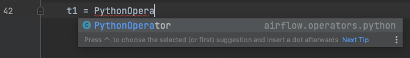
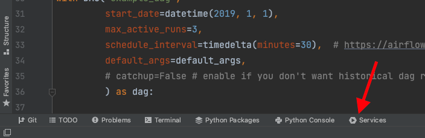

# PyCharm: локальная разработка

Настройка [PyCharm](https://www.jetbrains.com/pycharm/) для локальной разработки DAG с [Astro CLI](https://www.astronomer.io/docs/astro/cli/overview): автодополнение, подсветка ошибок, управление контейнерами из IDE.

## Требования

- Astro-проект, запущенный локально (`astro dev start`).
- Astro CLI.
- PyCharm.

## Настройка интерпретатора Python

1. В PyCharm: Settings → Build, Execution, Deployment → Docker — указать подключение к Docker.
2. Project → Python Interpreter → Add Interpreter → On Docker.
3. Выбрать образ, который использует ваш Airflow (тот же, что в `docker ps` после `astro dev start`).
4. Дождаться загрузки образа и применить.

После настройки PyCharm покажет deprecated/неиспользуемые импорты, синтаксические ошибки и автодополнение для Airflow API:

## Управление контейнерами

При интерпретаторе из Docker в панели **Services** (⌘+8 / Ctrl+8) отображаются контейнеры: scheduler, triggerer, webserver, postgres. Запуск — зелёная кнопка; логи — по клику на контейнер. Для выполнения CLI-команд: правый клик по scheduler → Create Terminal → bash в контейнер.

Подробнее: [PyCharm local development](https://www.astronomer.io/docs/learn/pycharm-local-dev), [Debug with dag.test()](../astronomer-advanced/testing-airflow.md).

---

[← DAG Factory](dag-factory.md) | [К содержанию](README.md) | [SQL check operators →](sql-check-operators.md)
