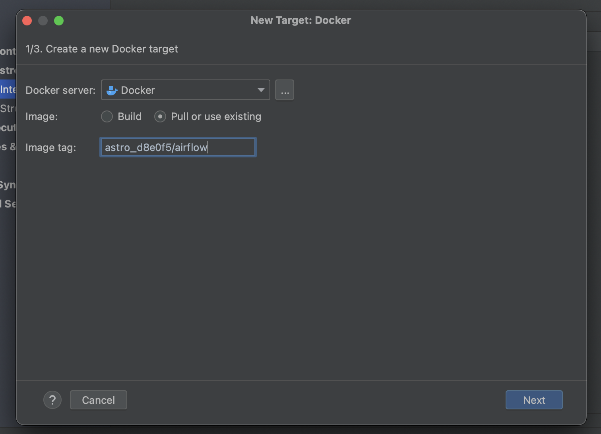
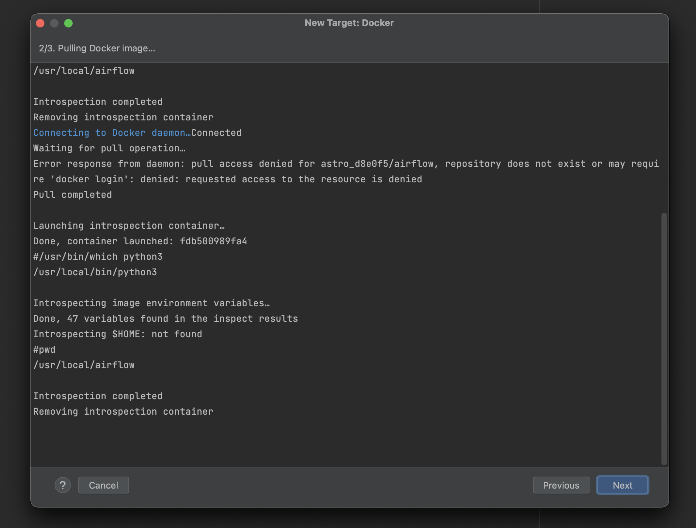
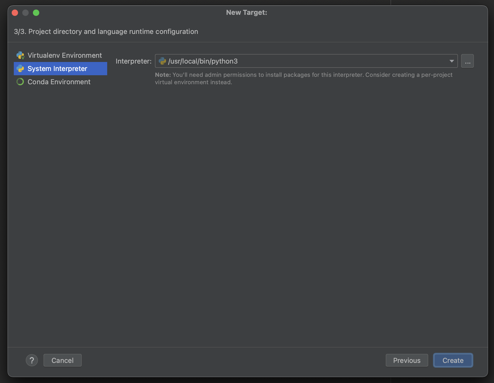
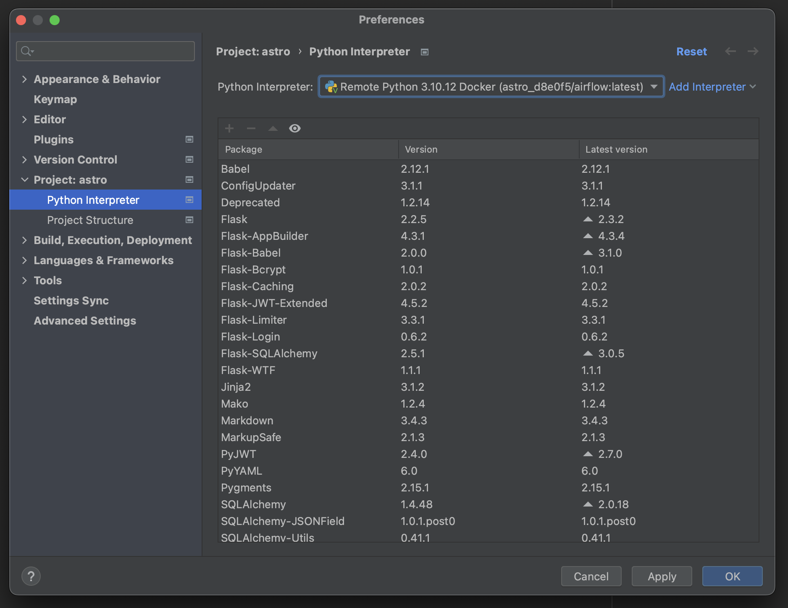
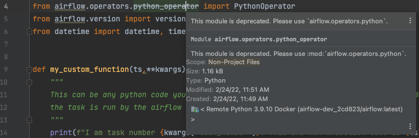
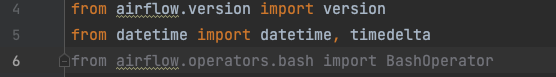
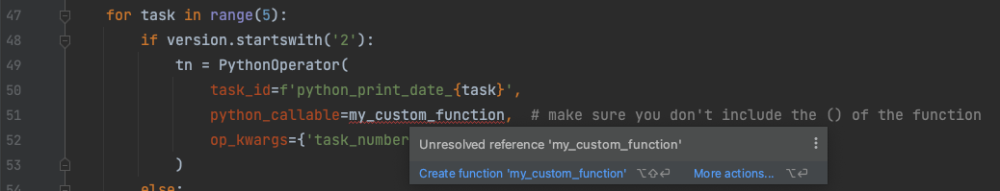
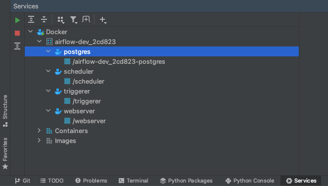
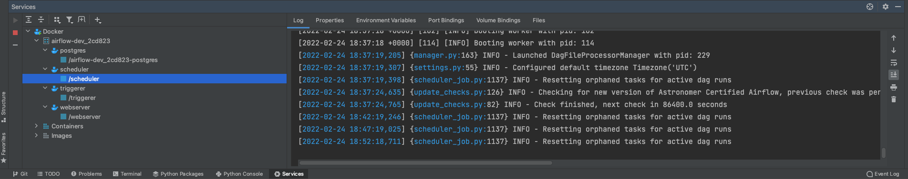
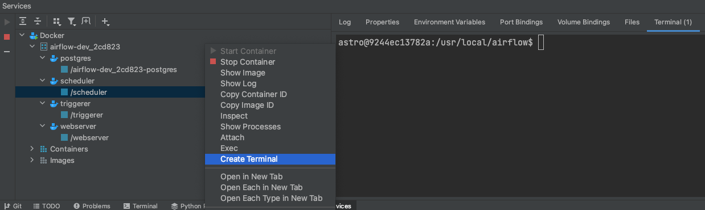

# PyCharm: локальная разработка

> Эта страница ещё не обновлена для Airflow 3. Показанные концепции актуальны, но часть кода может потребовать изменений. При запуске примеров обновите при необходимости импорты и учитывайте возможные breaking changes.
>
> Info

В этом примере показано, как настроить [PyCharm](https://www.jetbrains.com/pycharm/) для локальной разработки с Airflow и [Astro CLI](https://www.astronomer.io/docs/astro/cli/overview). Настройка локальной среды разработки позволяет быстрее итерироваться при разработке DAG, используя возможности IDE.

## Перед началом

Перед этим примером убедитесь, что у вас есть:

- Astro-проект, запущенный локально на компьютере. См. [Getting started with the Astro CLI](https://www.astronomer.io/docs/astro/cli/get-started-cli)
- [Astro CLI](https://www.astronomer.io/docs/astro/cli/install-cli)
- [PyCharm](https://www.jetbrains.com/pycharm/)

## Настройка интерпретатора Python

Чтобы разрабатывать DAG Airflow в PyCharm, нужно настроить хотя бы один интерпретатор Python. В этом примере интерпретатор настраивается через Docker — так можно писать Python-код и работать с запущенными DAG прямо из PyCharm.

1. В настройках PyCharm откройте **Build, Execution, Deployment** → **Docker** и укажите способ подключения к Docker-демону. Подробнее: [Connect to Docker](https://www.jetbrains.com/help/pycharm/docker.html#connect_to_docker).
2. Перейдите в **Project** → **Python Interpreter**. Нажмите кнопку **Add Interpreter** справа и выберите **On Docker**.
3. В появившемся окне выберите **Pull or use existing** в поле **Image**. В поле **Image tag** выберите Docker-образ, на котором запущена ваша среда Airflow, затем нажмите **Next**.
4. Дождитесь, пока PyCharm загрузит образ, и нажмите **Next**.
5. Убедитесь, что **System Interpreter** установлен на Python 3. По умолчанию путь указывает на расположение Python 3 на машине и обычно менять его не нужно. Нажмите **Create**.
6. На экране настройки интерпретатора убедитесь, что выбран образ Docker, и нажмите **Apply**, затем **OK**.

## Написание кода Airflow в PyCharm

После настройки PyCharm на использование нужного интерпретатора для Airflow становятся доступны автодополнение, подсветка устаревших и неиспользуемых импортов и подсветка синтаксических ошибок.

PyCharm показывает устаревшие импорты в проекте:

Может предупреждать о неиспользуемом импорте:

Как и в других Python-проектах, PyCharm подсвечивает синтаксические ошибки в коде Airflow:

Пример автодополнения кода и отображения встроенных определений в PyCharm:

## Управление Docker-контейнерами Airflow из PyCharm

При интерпретаторе из Docker к контейнерам можно подключаться прямо из PyCharm через панель **Services**. Если панели нет, нажмите `Ctrl+8` (или `Cmd+8` на macOS).

Запустите Docker, нажав зелёную кнопку воспроизведения в панели Services. Появятся те же контейнеры, что и при выполнении `docker ps` после локального запуска Astro-проекта:

Логи контейнеров можно смотреть, нажимая на `/scheduler`, `/triggerer`, `/webserver` или `/airflow-dev_2cd823-postgres`. Названия могут отличаться в зависимости от расположения родительской папки проекта:

Команды Airflow CLI выполняются так: правый клик по **/scheduler** → **Create Terminal** — откроется bash внутри контейнера:

## См. также

- [Интерактивная отладка с dag.test()](../04.%20astronomer-advanced/testing-airflow.md#debug-interactively-with-dagtest)
- [Разработка в VS Code](vscode-local-dev.md)

---

[← DAG Factory](dag-factory.md) | [К содержанию](README.md) | [SQL check operators →](sql-check-operators.md)
