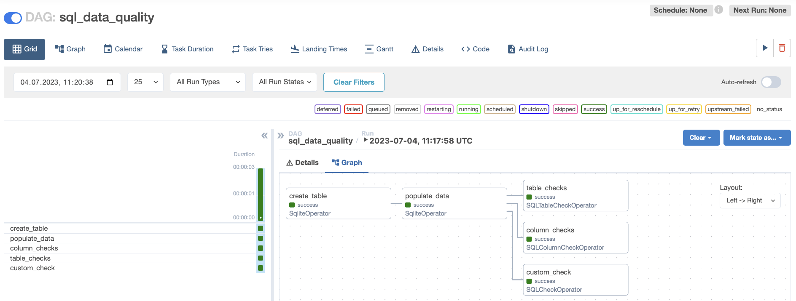

# SQL check operators: проверка качества данных

> Эта страница ещё не обновлена для Airflow 3. Показанные концепции актуальны, но часть кода может потребовать изменений. При запуске примеров обновите при необходимости импорты и учитывайте возможные breaking changes.
>
> Info

Качество данных критично для успеха систем данных организации. С проверками качества прямо в DAG можно останавливать пайплайны и уведомлять заинтересованных до того, как некорректные данные попадут в озеро или хранилище.

Операторы проверки SQL из [Common SQL provider](https://registry.astronomer.io/providers/apache-airflow-providers-common-sql/versions/latest) дают простой и эффективный способ реализовать проверки качества данных в DAG Airflow. С их помощью можно быстро сделать пайплайн именно для проверки качества или добавить такие проверки в существующие пайплайны несколькими строками кода.

В этом туториале показано, как использовать три оператора проверки SQL (SQLColumnCheckOperator, SQLTableCheckOperator и SQLCheckOperator) для набора проверок качества данных в DAG.

> - Пример репозитория: [data quality demo](https://github.com/astronomer/airflow-data-quality-demo/).
> - Вебинар: [Efficient data quality checks with Airflow 2.7](https://www.astronomer.io/events/webinars/efficient-data-quality-checks-with-airflow-2-7/).
> - Вебинар: [Implementing Data Quality Checks in Airflow](https://www.astronomer.io/events/webinars/implementing-data-quality-checks-in-airflow/).
>
> По этой теме есть несколько материалов. См. также:
>
> Other ways to learn

## Время прохождения

Туториал занимает примерно 30 минут.

## Предполагаемые знания

Чтобы получить максимум от туториала, желательно понимать:

- Выполнение SQL из Airflow. См. [Исполнение SQL в Airflow](../01.%20astronomer-basic/execute-sql.md).
- Как проектировать процесс проверки качества данных. См. [Data quality and Airflow](https://www.astronomer.io/docs/learn/data-quality).

## Предварительные требования

- Любовь к птицам.
- Доступ к реляционной БД. Можно использовать in-memory SQLite, для чего понадобится [SQLite provider](https://registry.astronomer.io/providers/apache-airflow-providers-sqlite/versions/latest). Обратите внимание: операторы пока не поддерживают BigQuery `job_id`.
- [Astro CLI](https://www.astronomer.io/docs/astro/cli/overview).

## Шаг 1: Настройка Astro-проекта

Чтобы использовать SQL check operators, установите [Common SQL provider](https://registry.astronomer.io/providers/apache-airflow-providers-common-sql/versions/latest) в Astro-проекте.

1. Выполните команды для создания нового Astro-проекта:

```bash
$ mkdir astro-sql-check-tutorial && cd astro-sql-check-tutorial
$ astro dev init
```

2. Добавьте Common SQL provider и SQLite provider в файл `requirements.txt` проекта:

```
apache-airflow-providers-common-sql==1.5.2
apache-airflow-providers-sqlite==3.4.2
```

## Шаг 2: Создание подключения к SQLite

1. В веб-интерфейсе Airflow откройте **Admin** → **Connections** и нажмите **+**.
2. Создайте подключение с именем `sqlite_conn`, типом **SQLite** и укажите: **Connection Id**: `sqlite_conn`, **Connection Type**: `SQLite`, **Host**: `/tmp/sqlite.db`.

## Шаг 3: Добавление SQL-файла с пользовательской проверкой

1. В папке `include` создайте файл `custom_check.sql`.
2. Скопируйте в него следующий SQL:

```sql
WITH all_combinations_unique AS (
SELECT DISTINCT bird_name, observation_year AS combos_unique
  FROM '{{ params.table_name }}'
  )
SELECT CASE
  WHEN COUNT(*) = COUNT(combos_unique) THEN 1
  ELSE 0
END AS is_unique
FROM '{{ params.table_name }}' JOIN all_combinations_unique;
```

Этот запрос возвращает 1, если все комбинации `bird_name` и `observation_year` в заданной таблице уникальны, и 0 в противном случае.

## Шаг 4: Создание DAG с SQL check operators

1. Запустите Airflow командой `astro dev start`.
2. В папке `dags` создайте файл `sql_data_quality.py`.
3. Вставьте в него следующий код DAG:

```python
"""
## Check data quality using SQL check operators

This DAG creates a toy table about birds in SQLite to run data quality checks on using the
SQLColumnCheckOperator, SQLTableCheckOperator, and SQLCheckOperator.
"""

from airflow.decorators import dag
from airflow.providers.common.sql.operators.sql import (
    SQLColumnCheckOperator,
    SQLTableCheckOperator,
    SQLCheckOperator,
)
from airflow.providers.sqlite.operators.sqlite import SqliteOperator
from pendulum import datetime

_CONN_ID = "sqlite_conn"
_TABLE_NAME = "birds"


@dag(
    start_date=datetime(2023, 7, 1),
    schedule=None,
    catchup=False,
    template_searchpath=["/usr/local/airflow/include/"],
)
def sql_data_quality():
    create_table = SqliteOperator(
        task_id="create_table",
        sqlite_conn_id=_CONN_ID,
        sql=f"""
        CREATE TABLE IF NOT EXISTS {_TABLE_NAME} (
            bird_name VARCHAR,
            observation_year INT,
            bird_happiness INT
        );
        """,
    )

    populate_data = SqliteOperator(
        task_id="populate_data",
        sqlite_conn_id=_CONN_ID,
        sql=f"""
        INSERT INTO {_TABLE_NAME} (bird_name, observation_year, bird_happiness) VALUES
        ('King vulture (Sarcoramphus papa)', 2022, 9),
        ('Victoria Crowned Pigeon (Goura victoria)', 2021, 10),
        ('Orange-bellied parrot (Neophema chrysogaster)', 2021, 9),
        ('Orange-bellied parrot (Neophema chrysogaster)', 2020, 8),
        (NULL, 2019, 8),
        ('Indochinese green magpie (Cissa hypoleuca)', 2018, 10);
        """,
    )

    column_checks = SQLColumnCheckOperator(
        task_id="column_checks",
        conn_id=_CONN_ID,
        table=_TABLE_NAME,
        partition_clause="bird_name IS NOT NULL",
        column_mapping={
            "bird_name": {
                "null_check": {"equal_to": 0},
                "distinct_check": {"geq_to": 2},
            },
            "observation_year": {"max": {"less_than": 2023}},
            "bird_happiness": {"min": {"greater_than": 0}, "max": {"leq_to": 10}},
        },
    )

    table_checks = SQLTableCheckOperator(
        task_id="table_checks",
        conn_id=_CONN_ID,
        table=_TABLE_NAME,
        checks={
            "row_count_check": {"check_statement": "COUNT(*) >= 3"},
            "average_happiness_check": {
                "check_statement": "AVG(bird_happiness) >= 9",
                "partition_clause": "observation_year >= 2021",
            },
        },
    )

    custom_check = SQLCheckOperator(
        task_id="custom_check",
        conn_id=_CONN_ID,
        sql="custom_check.sql",
        params={"table_name": _TABLE_NAME},
    )

    create_table >> populate_data >> [column_checks, table_checks, custom_check]


sql_data_quality()
```

DAG создаёт и заполняет таблицу SQLite `birds` с данными о птицах, затем запускает три задачи с проверками качества. Задача `column_checks` использует **SQLColumnCheckOperator** для проверок на уровне колонок из словаря `column_mapping` и операторный параметр `partition_clause`, чтобы выполнять проверки только по строкам, где `bird_name` не NULL. Задача `table_checks` использует **SQLTableCheckOperator** для двух проверок по таблице: `row_count_check` — не менее трёх строк; `average_happiness_check` — средняя «счастливость» птиц не менее 9 (с проверкой на уровне проверки `partition_clause`: только наблюдения с 2021 года). Задача `custom_check` использует **SQLCheckOperator**: выполняется любой SQL, возвращающий одну строку; если любое значение в строке при приведении к bool в Python даёт `False` (например, 0), проверка и задача считаются проваленными. Задача запускает SQL из файла `include/custom_check.sql` с параметром `table_name`. Чтобы использовать SQL из файла, путь к папке с файлом нужно указать в параметре DAG `template_searchpath`.

4. Откройте Airflow по адресу `http://localhost:8080/`, запустите DAG вручную (кнопка play) и откройте DAG в Grid view. Все проверки настроены так, чтобы проходить.



5. В логах задач SQL check operators видно детали выполненных проверок и их результаты. Например, в логах задачи `column_checks` отображаются пять проверок по трём колонкам:

```
[2023-07-04, 11:18:01 UTC] {sql.py:374} INFO - Running statement: SELECT col_name, check_type, check_result FROM (
  SELECT 'bird_name' AS col_name, 'null_check' AS check_type, bird_name_null_check AS check_result
  FROM (SELECT SUM(CASE WHEN bird_name IS NULL THEN 1 ELSE 0 END) AS bird_name_null_check FROM birds WHERE bird_name IS NOT NULL) AS sq
  UNION ALL
  SELECT 'bird_name' AS col_name, 'distinct_check' AS check_type, bird_name_distinct_check AS check_result
  FROM (SELECT COUNT(DISTINCT(bird_name)) AS bird_name_distinct_check FROM birds WHERE bird_name IS NOT NULL) AS sq
  UNION ALL
  SELECT 'observation_year' AS col_name, 'max' AS check_type, observation_year_max AS check_result
  FROM (SELECT MAX(observation_year) AS observation_year_max FROM birds WHERE bird_name IS NOT NULL) AS sq
  UNION ALL
  SELECT 'bird_happiness' AS col_name, 'min' AS check_type, bird_happiness_min AS check_result
  FROM (SELECT MIN(bird_happiness) AS bird_happiness_min FROM birds WHERE bird_name IS NOT NULL) AS sq
  UNION ALL
  SELECT 'bird_happiness' AS col_name, 'max' AS check_type, bird_happiness_max AS check_result
  FROM (SELECT MAX(bird_happiness) AS bird_happiness_max FROM birds WHERE bird_name IS NOT NULL) AS sq
) AS check_columns, parameters: None
[2023-07-04, 11:18:01 UTC] {sql.py:397} INFO - Record: [('bird_name', 'null_check', 0), ('bird_name', 'distinct_check', 4), ('observation_year', 'max', 2022), ('bird_happiness', 'min', 8), ('bird_happiness', 'max', 10)]
[2023-07-04, 11:18:01 UTC] {sql.py:420} INFO - All tests have passed
```

## Как это устроено

SQL check operators абстрагируют SQL-запросы и упрощают проверки качества данных. В отличие от стандартного [BaseSQLOperator](https://airflow.apache.org/docs/apache-airflow-providers-common-sql/stable/_api/airflow/providers/common/sql/operators/sql/index.html#airflow.providers.common.sql.operators.sql.BaseSQLOperator) они возвращают булево решение: задача падает, если любая из проверок не прошла. Это помогает остановить пайплайн до попадания плохих данных в целевое хранилище. Строки кода и значения, по которым проверка не прошла, видны в логах Airflow.

Рекомендуемые операторы для проверок качества:

- [SQLIntervalCheckOperator](https://registry.astronomer.io/providers/apache-airflow-providers-common-sql/modules/sqlintervalcheckoperator) — сравнение текущих данных с историческими.
- [SQLCheckOperator](https://registry.astronomer.io/providers/apache-airflow-providers-common-sql/modules/sqlcheckoperator) — произвольный SQL, возвращающий одну строку, которая интерпретируется как булевы значения; удобен для сложных проверок по нескольким таблицам.
- [SQLTableCheckOperator](https://registry.astronomer.io/providers/apache-airflow-providers-common-sql/modules/sqltablecheckoperator) — несколько пользовательских проверок по одной или нескольким колонкам таблицы.
- [SQLColumnCheckOperator](https://registry.astronomer.io/providers/apache-airflow-providers-common-sql/modules/sqlcolumncheckoperator) — одна или несколько готовых проверок по одной или нескольким колонкам в одной задаче.

Astronomer рекомендует по возможности использовать **SQLColumnCheckOperator** и **SQLTableCheckOperator** вместо старых [SQLValueCheckOperator](https://registry.astronomer.io/providers/apache-airflow-providers-common-sql/modules/sqlvaluecheckoperator) и [SQLThresholdCheckOperator](https://registry.astronomer.io/providers/apache-airflow-providers-common-sql/modules/sqlthresholdcheckoperator) для лучшей читаемости кода.

### SQLColumnCheckOperator

У **SQLColumnCheckOperator** есть параметр `column_mapping` — словарь проверок по колонкам. В одной задаче можно запустить много проверок и в логах Airflow видеть, какие прошли, какие нет.

Оператор подходит для:

- проверки числа уникальных значений в колонке;
- проверки уникальности колонок первичного ключа;
- проверок на NULL;
- проверки, что числовые значения в колонке не ниже минимума, не выше максимума или в заданном диапазоне (с допуском или без).

Доступны 5 типов проверок колонок (абстракции над SQL):

- `"null_check"`: `"SUM(CASE WHEN column IS NULL THEN 1 ELSE 0 END) AS column_null_check"`
- `"distinct_check"`: `"COUNT(DISTINCT(column)) AS column_distinct_check"`
- `"unique_check"`: `"COUNT(column) - COUNT(DISTINCT(column)) AS column_unique_check"`
- `"max"`: `"MAX(column) AS column_max"`
- `"min"`: `"MIN(column) AS column_min"`

Результат можно сравнивать с ожиданием с помощью квалификаторов: `less_than`, `leq_to`, `equal_to`, `geq_to`, `greater_than`.

Дополнительно SQLColumnCheckOperator:

- поддерживает параметр на уровне оператора `partition_clause` для проверки подмножества строк таблицы (см. раздел про `partition_clause` ниже);
- по умолчанию превращает результат `None` в 0 и всё равно выполняет проверку (например, при проверке минимума на пустой таблице проверка пройдёт). Поведение меняется параметром `accept_none=False` — тогда все проверки, вернувшие `None`, считаются проваленными;
- позволяет задать допуск к сравнению в долях (0.1 = 10%), пример — в разделе про `partition_clause`.

### SQLTableCheckOperator

**SQLTableCheckOperator** выполняет пользовательские SQL-проверки по одной или нескольким колонкам таблицы. Сложность и число колонок не ограничены. Проверки передаются в параметре `checks` словарём.

Подходит для:

- сравнений между несколькими колонками (агрегированными и нет);
- проверки, что даты в заданных границах (например, `MY_DATE_COL BETWEEN '2019-01-01' AND '2019-12-31'`);
- проверки количества строк;
- проверок с агрегатами по всей таблице (например, сравнение средних по двум колонкам через `AVG()`).

Как и у SQLColumnCheckOperator, можно передать SQL-условие без ключевого слова `WHERE` в параметр `partition_clause` на уровне оператора или отдельной проверки.

### SQLCheckOperator

**SQLCheckOperator** выполняет переданный SQL, берёт одну строку результата и смотрит, есть ли среди значений такое, которое при [приведении к bool в Python](https://docs.python.org/3/library/stdtypes.html) даёт `False` (например, 0). Если такое значение есть, задача падает. С ним можно проверять:

- результат любой функции, которую можно записать SQL-запросом;
- сравнения между несколькими таблицами;
- варианты категориальных переменных и типов данных;
- часть строки или всю строку в сравнении с известным набором значений;
- значение одной колонки.

Целевые таблицы задаются в самом SQL. Параметр `sql` может быть строкой с полным запросом или, как в туториале, путём к файлу с запросом.

### partition_clause

В **SQLColumnCheckOperator** и **SQLTableCheckOperator** можно ограничивать набор строк с помощью параметра `partition_clause` на уровне проверки или задачи. В параметр передаётся SQL-условие без ключевого слова `WHERE`; оно применяется к таблице перед выполнением проверки или группы проверок.

В примере ниже у SQLColumnCheckOperator задан `partition_clause` на уровне оператора и у одной из двух проверок в `column_mapping`.

В этом примере:

- для `MY_NUM_COL_2` проверяется, что максимум меньше 300; учитываются только строки по check-level `partition_clause` (`CUSTOMER_STATUS = 'active'`);
- для `MY_NUM_COL_1` проверяется минимум 10 с допуском 10%: проверка пройдёт, если минимум в колонке от 9 до 11.

Обе проверки выполняются только по строкам, удовлетворяющим операторному `partition_clause` `CUSTOMER_NAME IS NOT NULL`. Если заданы и операторный, и проверочный `partition_clause`, используются оба условия.

```python
column_checks = SQLColumnCheckOperator(
    task_id="column_checks",
    conn_id="MY_DB_CONNECTION",
    table="MY_TABLE",
    partition_clause="CUSTOMER_NAME IS NOT NULL",
    column_mapping={
        "MY_NUM_COL_1": {"min": {"equal_to": 10, "tolerance": 0.1}},
        "MY_NUM_COL_2": {
            "max": {"less_than": 300, "partition_clause": "CUSTOMER_STATUS = 'active'"}
        },
    },
)
```

---

[← PyCharm](pycharm-local-dev.md) | [К содержанию](README.md) | [VS Code →](vscode-local-dev.md)
