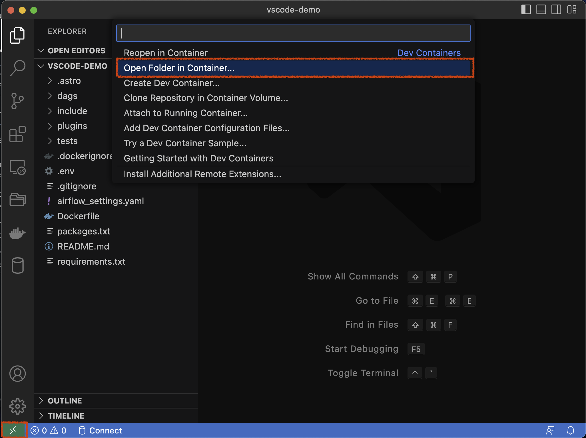
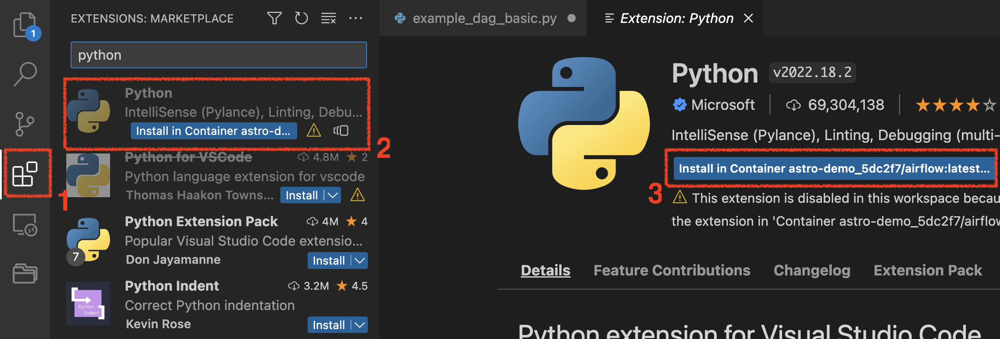
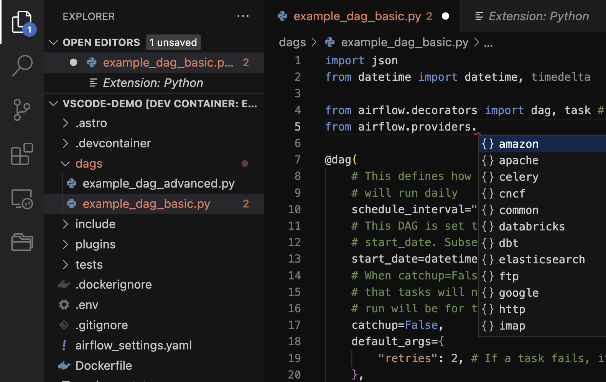

# VS Code: локальная разработка

> Эта страница ещё не обновлена для Airflow 3. Показанные концепции актуальны, но часть кода может потребовать изменений. При запуске примеров обновите при необходимости импорты и учитывайте возможные breaking changes.
>
> Info

В этом примере показано, как настроить [VS Code](https://code.visualstudio.com/) для локальной разработки с Airflow и [Astro CLI](https://www.astronomer.io/docs/astro/cli/overview). Настройка локальной среды позволяет быстрее итерироваться при разработке DAG, используя возможности IDE: автодополнение кода, подсветку устаревших и неиспользуемых импортов, подсветку ошибок и предупреждений.

## Перед началом

Перед этим примером убедитесь, что у вас есть:

- Astro-проект, запущенный локально на компьютере. См. [Getting started with the Astro CLI](https://www.astronomer.io/docs/astro/cli/get-started-cli)
- [Astro CLI](https://www.astronomer.io/docs/astro/cli/install-cli)
- Расширение [Dev Containers](https://marketplace.visualstudio.com/items?itemName=ms-vscode-remote.remote-containers) для VS Code
- [VS Code](https://code.visualstudio.com/)

## Написание кода Airflow в VS Code

Выполните шаги ниже, чтобы начать писать DAG в VS Code.

1. Откройте в VS Code папку с вашим Astro-проектом. В левом нижнем углу окна нажмите на зелёную иконку контейнеров и выберите **Open Folder in Container...**

2. Откроется проводник с предложением выбрать папку проекта. Выберите папку Astro-проекта и нажмите **Open**, затем **From 'Dockerfile'**. Откроется новое окно VS Code; в левом нижнем углу будет видно, что среда подключена к запущенному Docker-контейнеру.
3. Установите расширение [Python](https://marketplace.visualstudio.com/items?itemName=ms-python.python) в новую сессию VS Code: откройте раздел **Extensions**, найдите `Python` — первым в списке должно быть расширение от Microsoft. Установите его, нажав **Install in Container**.

4. Убедитесь, что интерпретатор Python настроен: откройте в папке `dags/` вашего Astro-проекта файл `dags/example_dag_basic.py` и начните набирать Python-код.

После настройки интеграции VS Code начнёт показывать предупреждения и подсказки автодополнения для Airflow. В примере ниже видно, что интерпретатор предлагает автодополнение для строки импорта.

## См. также

- [Интерактивная отладка с dag.test()](../04.%20astronomer-advanced/testing-airflow.md#debug-interactively-with-dagtest)
- [Разработка в PyCharm](pycharm-local-dev.md)

---

[← SQL check operators](sql-check-operators.md) | [К содержанию](README.md)
