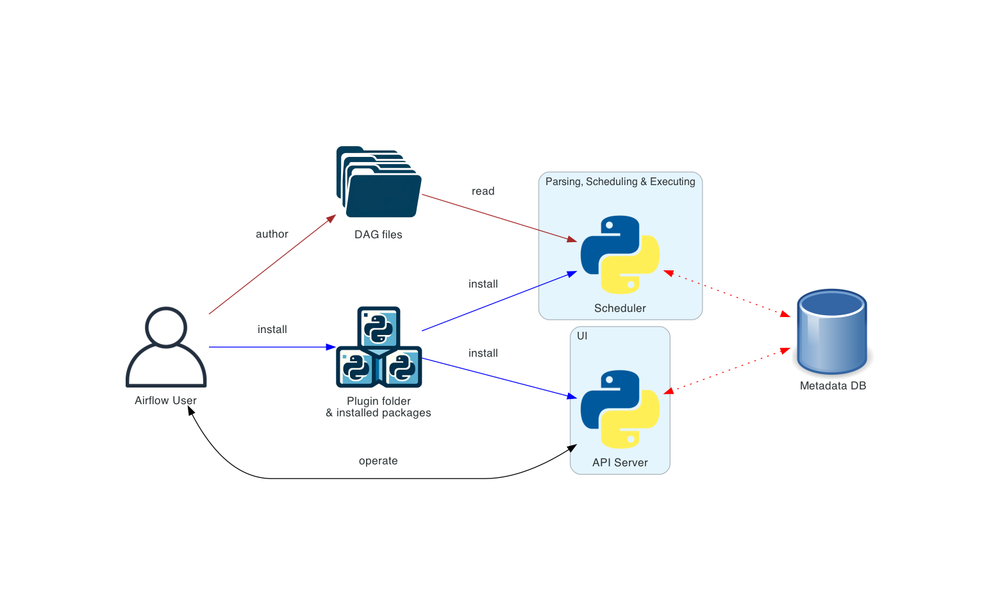
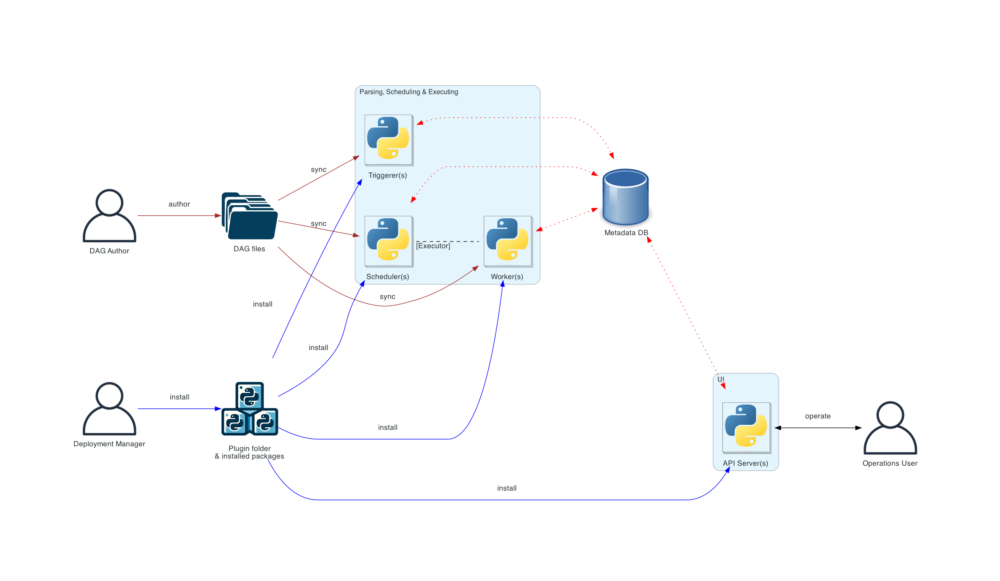
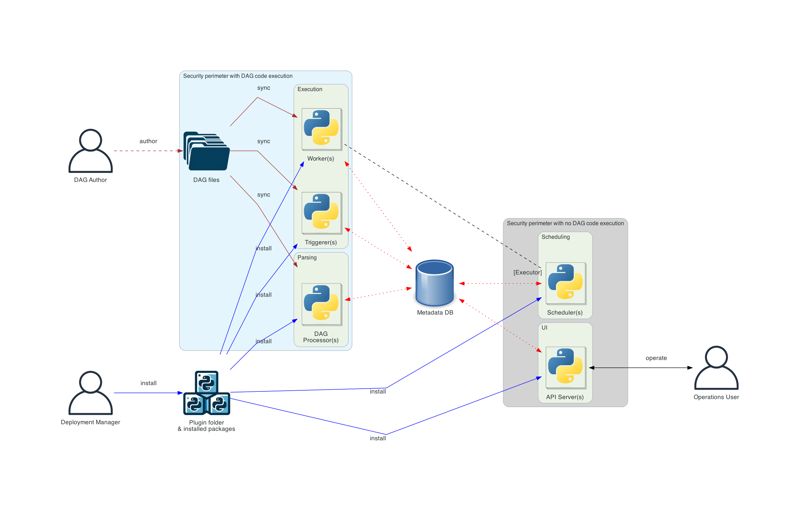
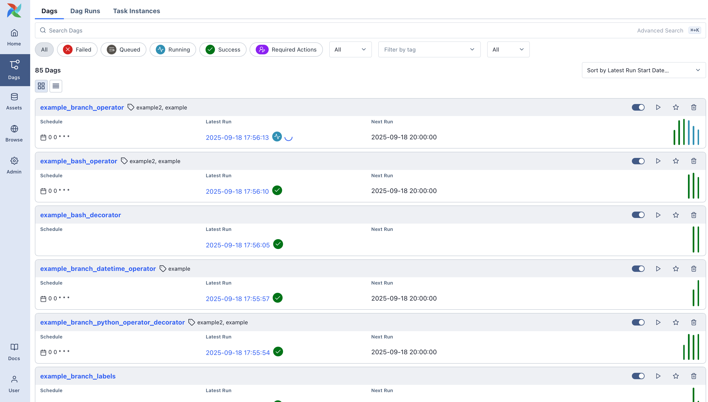
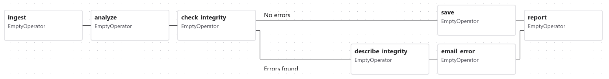

# Обзор архитектуры

Airflow — платформа для создания и запуска рабочих процессов (workflow). Рабочий процесс представляется в виде [DAG](https://airflow.apache.org/docs/apache-airflow/stable/core-concepts/dags.html) (ориентированный ациклический граф) и состоит из отдельных единиц работы — [задач (Tasks)](https://airflow.apache.org/docs/apache-airflow/stable/core-concepts/tasks.html), связанных зависимостями и потоками данных.

DAG задаёт зависимости между задачами, то есть порядок их выполнения. Задачи описывают, что делать: получать данные, запускать анализ, вызывать другие системы и т.д.

Сам Airflow не привязан к тому, что вы запускаете: он может оркестрировать и выполнять что угодно — с поддержкой высокого уровня через один из провайдеров или напрямую как команду с помощью [операторов](https://airflow.apache.org/docs/apache-airflow/stable/core-concepts/operators.html) Shell или Python.

## Компоненты Airflow

Архитектура Airflow состоит из нескольких компонентов. Ниже описаны функции каждого компонента и то, входит ли он в минимальную установку Airflow или является опциональным для расширяемости, производительности и масштабирования.

### Обязательные компоненты

Минимальная установка Airflow включает:

- **[Планировщик (scheduler)](https://airflow.apache.org/docs/apache-airflow/stable/administration-and-deployment/scheduler.html)** — отвечает и за запуск запланированных workflow, и за передачу [задач](https://airflow.apache.org/docs/apache-airflow/stable/core-concepts/tasks.html) исполнителю (executor). **[Исполнитель (executor)](https://airflow.apache.org/docs/apache-airflow/stable/core-concepts/executor/index.html)** — параметр конфигурации планировщика, а не отдельный процесс; он работает внутри процесса планировщика. Доступно несколько исполнителей «из коробки», можно реализовать и свой.

- **Обработчик DAG (Dag processor)** — разбирает файлы DAG и сериализует их в базу метаданных. Подробнее об обработке файлов DAG: [Dag File Processing](https://airflow.apache.org/docs/apache-airflow/stable/administration-and-deployment/dagfile-processing.html).

- **Веб-сервер (webserver)** — предоставляет пользовательский интерфейс для просмотра, запуска и отладки DAG и задач.

- **Каталог с файлами DAG** — читается планировщиком, чтобы определять, какие задачи запускать и когда.

- **База метаданных** — обычно PostgreSQL или MySQL; в ней хранится состояние задач, DAG и переменных.

Настройка базы метаданных описана в [Set up a Database Backend](https://airflow.apache.org/docs/apache-airflow/stable/howto/set-up-database.html) и необходима для работы Airflow.

### Опциональные компоненты

Некоторые компоненты Airflow опциональны и позволяют улучшить расширяемость, масштабируемость и производительность:

- **Опциональные воркеры (workers)** — выполняют задачи, переданные планировщиком. В простой установке воркер может быть частью планировщика, а не отдельным компонентом. Воркеры могут работать как долгоживущий процесс при [CeleryExecutor](https://airflow.apache.org/docs/apache-airflow-providers-celery/stable/celery_executor.html) или как Pod при [KubernetesExecutor](https://airflow.apache.org/docs/apache-airflow-providers-cncf-kubernetes/stable/kubernetes_executor.html).

- **Опциональный триггер (triggerer)** — выполняет отложенные (deferred) задачи в цикле событий asyncio. В простой установке без отложенных задач триггер не нужен. Подробнее об отложенных задачах: [Deferrable Operators & Triggers](https://airflow.apache.org/docs/apache-airflow/stable/authoring-and-scheduling/deferring.html).

- **Опциональный каталог плагинов** — плагины расширяют функциональность Airflow (аналогично установленным пакетам). Плагины читаются планировщиком, обработчиком DAG, триггером и веб-сервером. Подробнее: [Plugins](https://airflow.apache.org/docs/apache-airflow/stable/administration-and-deployment/plugins.html).

## Развёртывание компонентов Airflow

Все компоненты — Python-приложения, их можно разворачивать разными способами.

В окружение Python компонентов можно устанавливать дополнительные пакеты — например, кастомные операторы или сенсоры, или расширять Airflow плагинами.

Airflow можно запустить на одной машине с простой установкой (только планировщик и веб-сервер), но он рассчитан на масштабирование и безопасность и может работать в распределённом окружении: компоненты — на разных машинах, с разными периметрами безопасности, с несколькими экземплярами каждого компонента.

Разделение компонентов повышает безопасность: они изолированы друг от друга и выполняют разные функции. Например, отделение обработчика DAG от планировщика гарантирует, что планировщик не имеет доступа к файлам DAG и не выполняет код, написанный автором DAG.

Установкой и администрированием Airflow может заниматься один человек; в более сложных сценариях в развёртывании участвуют разные роли пользователей, взаимодействующих с разными частями системы. Это важный аспект безопасного развёртывания. Роли подробно описаны в [Airflow Security Model](https://airflow.apache.org/docs/apache-airflow/stable/security/security_model.html); в общем случае это:

- **Deployment Manager** — устанавливает и настраивает Airflow, управляет развёртыванием.
- **Dag author** — пишет DAG и передаёт их в Airflow.
- **Operations User** — запускает DAG и задачи, следит за выполнением.

## Схемы архитектуры

Ниже показаны варианты развёртывания Airflow: от простого «одна машина» и одного пользователя до более сложного с отдельными компонентами, ролями и изолированными периметрами безопасности.

Условные обозначения на схемах:

- **Коричневые сплошные линии** — передача и синхронизация файлов DAG.
- **Синие сплошные линии** — развёртывание и доступ к установленным пакетам и плагинам.
- **Чёрные пунктирные линии** — управление воркерами со стороны планировщика (через executor).
- **Чёрные сплошные линии** — доступ к UI для управления выполнением workflow.
- **Красные пунктирные линии** — доступ всех компонентов к базе метаданных.

### Базовая установка Airflow



Это самый простой вариант развёртывания, обычно на одной машине. Часто используется LocalExecutor: планировщик и воркеры в одном процессе Python, файлы DAG читаются планировщиком напрямую с локальной файловой системы. Веб-сервер работает на той же машине, что и планировщик. Компонента triggerer нет, то есть отложенные задачи (task deferral) недоступны.

В такой установке роли пользователей обычно не разделяют: развёртывание, конфигурация, эксплуатация, разработка DAG и сопровождение выполняются одним человеком, между компонентами нет разделения по безопасности.

Если нужно запустить Airflow на одной машине в простой конфигурации, можно не разбирать сложные схемы ниже и перейти к разделу «Workloads».

### Распределённая архитектура Airflow



Компоненты Airflow распределены по нескольким машинам, введены роли: Deployment Manager, Dag author, Operations User. Подробнее о ролях: [Airflow Security Model](https://airflow.apache.org/docs/apache-airflow/stable/security/security_model.html).

В распределённом развёртывании важно учитывать безопасность компонентов. Веб-сервер не имеет прямого доступа к файлам DAG. Код на вкладке `Code` в UI берётся из базы метаданных. Веб-сервер не выполняет код, переданный автором DAG; он может выполнять только код, установленный как пакет или плагин Deployment Manager’ом. Operations User имеет доступ только к UI: может запускать DAG и задачи и следить за выполнением, но не может писать DAG.

Файлы DAG должны синхронизироваться между всеми компонентами, которые их используют: планировщиком, триггером и воркерами. Синхронизация может выполняться разными способами; типичные варианты описаны в [Manage Dag files](https://airflow.apache.org/docs/helm-chart/stable/manage-dag-files.html) документации Helm Chart (один из способов развёртывания Airflow в кластере K8s).

### Архитектура с отдельным обработчиком DAG



В более сложных установках с упором на безопасность и изоляцию используется отдельный компонент — обработчик DAG, так что планировщик не получает доступа к файлам DAG. Это подходит, когда важна изоляция между разобранными задачами. В Airflow пока нет полноценной мультитенантности, но так можно гарантировать, что код автора DAG никогда не выполняется в контексте планировщика.

> **Примечание.** При изменении файла DAG возможны ситуации, когда планировщик и воркер какое-то время видят разные версии DAG, пока оба не синхронизируются. Чтобы избежать этого, можно отключать DAG на время развёртывания и включать после завершения. При необходимости настраивается частота синхронизации и сканирования каталога DAG. Меняйте эти настройки только если вы уверены в своих действиях.

## Workloads (нагрузки)

DAG выполняется как последовательность [задач](https://airflow.apache.org/docs/apache-airflow/stable/core-concepts/tasks.html). Чаще всего встречаются три типа задач:

- **[Операторы (Operators)](https://airflow.apache.org/docs/apache-airflow/stable/core-concepts/operators.html)** — готовые задачи, которые можно быстро объединять в цепочки и собирать из них большую часть DAG.

- **[Сенсоры (Sensors)](https://airflow.apache.org/docs/apache-airflow/stable/core-concepts/sensors.html)** — подкласс операторов, которые только ждут наступления внешнего события.

- Задача, оформленная через **TaskFlow** — задекорированная функция `@task`, то есть пользовательская Python-функция, упакованная в задачу. Подробнее: [TaskFlow](https://airflow.apache.org/docs/apache-airflow/stable/core-concepts/taskflow.html).

Внутри все они являются подклассами `BaseOperator` в Airflow; понятия «задача» и «оператор» во многом взаимозаменяемы, но удобно различать их так: операторы и сенсоры — это шаблоны, а при вызове одного из них в файле DAG вы создаёте задачу (Task).



## Управление потоком (Control Flow)

[DAG](https://airflow.apache.org/docs/apache-airflow/stable/core-concepts/dags.html) рассчитаны на многократный запуск; несколько запусков одного DAG могут идти параллельно. DAG параметризуются: всегда задаётся интервал, «за который» выполняется запуск ([data interval](https://airflow.apache.org/docs/apache-airflow/stable/core-concepts/dag-run.html#data-interval)), плюс при необходимости другие параметры.

Между [задачами](https://airflow.apache.org/docs/apache-airflow/stable/core-concepts/tasks.html) задаются зависимости. В DAG это делается операторами `>>` и `<<`:

```python
first_task >> [second_task, third_task]
fourth_task << third_task
```

или методами `set_upstream` и `set_downstream`:

```python
first_task.set_downstream([second_task, third_task])
fourth_task.set_upstream(third_task)
```

Эти зависимости образуют рёбра графа и задают порядок выполнения задач. По умолчанию задача ждёт успешного завершения всех вышестоящих (upstream) задач; поведение можно менять с помощью [Branching](https://airflow.apache.org/docs/apache-airflow/stable/core-concepts/dags.html#concepts-branching), [LatestOnly](https://airflow.apache.org/docs/apache-airflow/stable/core-concepts/dags.html#concepts-latest-only) и [Trigger Rules](https://airflow.apache.org/docs/apache-airflow/stable/core-concepts/dags.html#concepts-trigger-rules).

Передавать данные между задачами можно тремя способами:

- **[XCom](https://airflow.apache.org/docs/apache-airflow/stable/core-concepts/xcoms.html)** («Cross-communications») — задачи могут передавать небольшие объёмы метаданных (push/pull).
- Загрузка и выгрузка больших файлов в хранилище (собственное или облачное).
- TaskFlow API автоматически передаёт данные между задачами через неявные [XCom](https://airflow.apache.org/docs/apache-airflow/stable/core-concepts/xcoms.html).

Airflow отправляет задачи на воркеры по мере освобождения ресурсов, поэтому нет гарантии, что все задачи одного DAG выполнятся на одном воркере или одной машине.

При усложнении DAG полезны механизмы структурирования: например, [TaskGroups](https://airflow.apache.org/docs/apache-airflow/stable/core-concepts/dags.html#concepts-taskgroups) позволяют визуально группировать задачи в UI.

Есть и возможности централизованного доступа к ресурсам (например, хранилищу данных) — [Connections & Hooks](https://airflow.apache.org/docs/apache-airflow/stable/authoring-and-scheduling/connections.html), и ограничения параллелизма — [Pools](https://airflow.apache.org/docs/apache-airflow/stable/administration-and-deployment/pools.html).



## Пользовательский интерфейс

В состав Airflow входит веб-интерфейс, в котором можно просматривать состояние DAG и задач, запускать DAG, смотреть логи и выполнять ограниченную отладку и устранение проблем.

Как правило, это основной способ оценить состояние установки Airflow в целом и детально разобрать отдельные DAG: структуру, статус каждой задачи и логи.

---

*Источник: [Airflow 3.1.7 — Architecture Overview](https://airflow.apache.org/docs/apache-airflow/stable/core-concepts/overview.html). Перевод неофициальный.*
