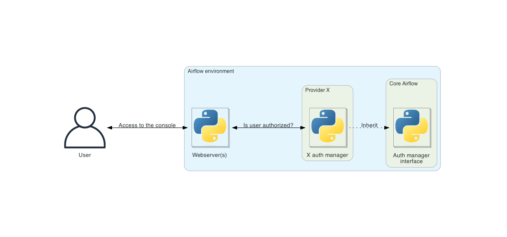

# Auth manager (менеджер аутентификации и авторизации)

**Auth manager** (от authentication/authorization) — компонент Airflow, который отвечает за аутентификацию и авторизацию пользователей. У всех менеджеров общий API, они «подключаемые» (pluggable): менеджер можно менять в зависимости от установки.

В один момент времени может быть настроен только один auth manager. Он задаётся опцией `auth_manager` в секции `[core]` [файла конфигурации](https://airflow.apache.org/docs/apache-airflow/stable/howto/set-config.html).



> **Примечание.** Подробнее о конфигурации Airflow: [Setting Configuration Options](https://airflow.apache.org/docs/apache-airflow/stable/howto/set-config.html).

Текущий auth manager можно проверить командой `airflow config get-value core auth_manager`:

```bash
$ airflow config get-value core auth_manager
airflow.providers.fab.auth_manager.fab_auth_manager.FabAuthManager
```

## Доступные auth manager’ы

Список auth manager’ов, которые можно использовать в окружении Airflow.

**Поставляются с Airflow:**

- [Simple auth manager](https://airflow.apache.org/docs/apache-airflow/stable/core-concepts/auth-manager/simple/index.html)

**Поставляются провайдерами.** Список поддерживаемых auth manager’ов: [Auth managers](https://airflow.apache.org/docs/apache-airflow-providers/core-extensions/auth-managers.html).

## Зачем подключаемые auth manager’ы?

Airflow используют в самых разных конфигурациях: от одного пользователя до тысяч. Окружению с одним (или немногими) пользователями не нужна та же система учёта, что и окружению с тысячами пользователей.

Поэтому управление пользователями (аутентификация и авторизация) вынесено в отдельный компонент — auth manager. Так можно подобрать менеджер под ваши задачи.

По умолчанию в Airflow используется [Simple auth manager](https://airflow.apache.org/docs/apache-airflow/stable/core-concepts/auth-manager/simple/index.html).

> **Примечание.** Смена auth manager — серьёзное изменение и так и должна рассматриваться. Оно затронет пользователей: процесс входа и выхода, скорее всего, изменится и может их сбить с толку, если не предупредить. Кроме того, всех текущих пользователей и права нужно перенести со старого auth manager на новый.

## Написание своего auth manager’а

Все auth manager’ы в Airflow реализуют общий интерфейс, чтобы их можно было подключать и чтобы любой менеджер имел доступ ко всем возможностям и интеграциям Airflow. Через этот интерфейс в Airflow выполняются все операции, связанные с аутентификацией и авторизацией.

Публичный интерфейс — `BaseAuthManager`. Актуальная детализация — в коде; ниже перечислены основные моменты.

> **Примечание.** Подробнее о публичном интерфейсе Airflow: [Public Interface for Airflow 3.0+](https://airflow.apache.org/docs/apache-airflow/stable/public-airflow-interface.html).

Собственный auth manager может понадобиться, если:

- Нет подходящего менеджера под ваш сценарий (конкретный инструмент или сервис управления пользователями).
- Хотите использовать менеджер на базе identity provider вашего облачного провайдера.
- Есть внутренняя система учёта пользователей, доступная только вам или вашей организации.

### Представление пользователя

`BaseAuthManager` задаёт менеджер аутентификации, параметризованный классом пользователя T, представляющим тип аутентифицированного пользователя. Реализации (подклассы `BaseAuthManager`) должны указать конкретный тип пользователя. У каждого auth manager своё определение типа пользователя. Конкретные типы должны быть подклассами `BaseUser`.

### Методы, связанные с аутентификацией

| Метод | Описание |
|-------|----------|
| **`get_url_login`** | URL, на который перенаправляется пользователь для входа. |
| **`get_url_logout`** | URL для перенаправления при выходе. Метод опциональный; перенаправление обычно нужно, чтобы инвалидировать ресурсы (например, сессию). |
| **`serialize_user`** | Сериализация экземпляра пользователя в словарь. Этот словарь — содержимое JWT-токена. В нём должна быть вся информация для идентификации пользователя и проверки авторизации. |
| **`deserialize_user`** | Создание экземпляра пользователя из словаря (payload JWT-токена) — того же, что возвращает `serialize_user`. |

### Методы, связанные с авторизацией

У большинства методов авторизации в `BaseAuthManager` общая схема. Параметры, которые они используют:

- **`method`**: HTTP-метод задаёт тип действия над ресурсом.
  - **GET** — может ли пользователь читать ресурс?
  - **POST** — может ли создавать?
  - **PUT** — может ли изменять?
  - **DELETE** — может ли удалять?
- **`details`**: опциональные сведения о ресурсе.
- **`user`**: пользователь, который обращается к ресурсу.

Методы авторизации:

| Метод | Описание |
|-------|----------|
| **`is_authorized_configuration`** | Авторизован ли пользователь для доступа к конфигурации Airflow. Можно передать детали (например, секцию конфига). |
| **`is_authorized_connection`** | Доступ к подключениям (connections). Детали — например, ID подключения. |
| **`is_authorized_dag`** | Доступ к DAG. Детали — например, ID DAG. Вызывается и для сущностей, связанных с DAG (task instances, Dag runs и т.д.); сущность передаётся в `access_entity`. Пример: `auth_manager.is_authorized_dag(method="GET", access_entity=DagAccessEntity.Run, details=DagDetails(id="dag-1"))` — есть ли у пользователя право читать Dag runs DAG «dag-1». |
| **`is_authorized_backfill`** | Доступ к backfill’ам. Детали — например, ID backfill’а. |
| **`is_authorized_asset`** | Доступ к ассетам Airflow. Детали — например, ID ассета. |
| **`is_authorized_asset_alias`** | Доступ к алиасам ассетов. Детали — например, ID алиаса. |
| **`is_authorized_pool`** | Доступ к пулам. Детали — например, имя пула. |
| **`is_authorized_variable`** | Доступ к переменным. Детали — например, ключ переменной. |
| **`is_authorized_view`** | Доступ к конкретному представлению (view) в Airflow. Представление задаётся через `access_view` (например, `AccessView.CLUSTER_ACTIVITY`). |
| **`is_authorized_custom_view`** | Доступ к представлению, не встроенному в Airflow — предоставленному самим auth manager’ом или плагином пользователя. |
| **`filter_authorized_menu_items`** | По списку пунктов меню в UI возвращает список пунктов, к которым у пользователя есть доступ. |

Параметр `method` имеет смысл не для всех методов авторизации. Например, ресурс `configuration` по определению только для чтения, поэтому в контексте `is_authorized_configuration` релевантен только `GET`.

### Управление JWT-токеном со стороны auth manager’а

Auth manager создаёт JWT-токен для работы с публичным API Airflow. Для этого он должен предоставить эндпоинт создания токена. Обычно это `POST /auth/token`; уточняйте в документации вашего auth manager’а.

Auth manager также отвечает за передачу JWT-токена в UI Airflow. Обмен токеном между auth manager’ом и UI идёт через cookies: auth manager записывает JWT в cookie с именем `_token` и затем перенаправляет на UI. UI читает cookie, сохраняет токен и удаляет cookie.

```python
from airflow.api_fastapi.auth.managers.base_auth_manager import COOKIE_NAME_JWT_TOKEN

response = RedirectResponse(url="/")

secure = request.base_url.scheme == "https" or bool(conf.get("api", "ssl_cert", fallback=""))
response.set_cookie(COOKIE_NAME_JWT_TOKEN, token, secure=secure, httponly=True)
return response
```

> **Примечание.** Параметр cookie `httponly` должен быть установлен в `True`. UI не управляет токеном.

#### Обновление JWT-токена

Обновление токена — опциональная возможность; её наличие зависит от реализации auth manager’а. Auth manager обновляет JWT при истечении срока. В API Airflow middleware перехватывает каждый запрос и проверяет токен. Передача токена идёт через cookie с `httponly` для безопасности. При истечении токена middleware [JWTRefreshMiddleware](https://github.com/apache/airflow/blob/3.1.5/airflow-core/src/airflow/api_fastapi/auth/middlewares/refresh_token.py) вызывает у auth manager’а метод `refresh_user`, чтобы получить новый токен.

Чтобы поддерживать обновление токена, auth manager должен реализовать метод `refresh_user`. Он получает истёкший токен и должен вернуть новый валидный. Данные пользователя берутся из истёкшего токена и используются для генерации нового.

Пример реализации `refresh_user`: [KeycloakAuthManager::refresh_user](https://github.com/apache/airflow/blob/3.1.5/providers/keycloak/src/airflow/providers/keycloak/auth_manager/keycloak_auth_manager.py#L113-L121). Данные пользователя берутся из экземпляра `BaseUser`. Важно, чтобы объект пользователя содержал все поля, нужные для обновления токена. Пример класса пользователя: [KeycloakAuthManagerUser(BaseUser)](https://github.com/apache/airflow/blob/3.1.5/providers/keycloak/src/airflow/providers/keycloak/auth_manager/user.py).

### Рекомендуемые опциональные методы для оптимизации

Их переопределение не обязательно для рабочего auth manager’а, но рекомендуется для ускорения (и снижения нагрузки):

| Метод | Описание |
|-------|----------|
| **`batch_is_authorized_connection`** | Пакетный вариант `is_authorized_connection`. Без переопределения вызывается `is_authorized_connection` для каждого элемента. |
| **`batch_is_authorized_dag`** | Пакетный вариант `is_authorized_dag`. |
| **`batch_is_authorized_pool`** | Пакетный вариант `is_authorized_pool`. |
| **`batch_is_authorized_variable`** | Пакетный вариант `is_authorized_variable`. |
| **`get_authorized_dag_ids`** | Список ID DAG, к которым у пользователя есть доступ. Без переопределения вызывается `is_authorized_dag` для каждого DAG в окружении. |
| **`is_authorized_hitl_task`** | Авторизован ли пользователь одобрить или отклонить задачу Human-in-the-loop (HITL). Переопределите для своей логики. По умолчанию проверяется, входит ли ID пользователя в список назначенных. |

Для фильтрации результатов `get_authorized_dag_ids` рекомендуется задать логику в методе `filter_authorized_dag_ids`. Это удобно, если доступ к DAG зависит от полей самого DAG (например, тегов).

Метод `get_authorized_dag_ids` требует активной сессии с БД метаданных Airflow. Его переопределение — продвинутый сценарий; при реализации стоит ориентироваться на [ERD Schema of the Database](https://airflow.apache.org/docs/apache-airflow/stable/database-erd-ref.html).

### CLI

Auth manager может предоставлять CLI-команды в утилиту `airflow`, реализовав метод `get_cli_commands`. Команды могут использоваться для настройки нужных ресурсов. Команды выдаются только для текущего сконфигурированного auth manager’а. Псевдокод:

```python
@staticmethod
def get_cli_commands() -> list[CLICommand]:
    sub_commands = [
        ActionCommand(
            name="command_name",
            help="Description of what this specific command does",
            func=lazy_load_command("path.to.python.function.for.command"),
            args=(),
        ),
    ]

    return [
        GroupCommand(
            name="my_cool_auth_manager",
            help="Description of what this group of commands do",
            subcommands=sub_commands,
        ),
    ]
```

> **Примечание.** Строгих правил по пространству имён команд Airflow пока нет. Разработчикам следует выбирать достаточно уникальные имена, чтобы не конфликтовать с другими компонентами Airflow.

> **Примечание.** При создании или обновлении auth manager’а не импортируйте и не выполняйте тяжёлый код на уровне модуля. Классы auth manager’ов импортируются в нескольких местах; медленный импорт ухудшит работу Airflow, особенно CLI.

### Расширение приложения API-сервера

Auth manager может расширять API-сервер Airflow — например, добавлять свои публичные эндпоинты. Для этого нужно реализовать метод `get_fastapi_app`. Такие эндпоинты могут управлять ресурсами (пользователи, группы, роли и т.д.), которые ведёт auth manager. Эндпоинты из `get_fastapi_app` монтируются по пути `/auth`.

### Другие опциональные методы

| Метод | Описание |
|-------|----------|
| **`init`** | Вызывается при инициализации Airflow. Переопределите, если нужны действия при старте (создание ресурсов, API-вызовы и т.д.). |
| **`get_extra_menu_items`** | Дополнительные ссылки в меню UI. |
| **`get_db_manager`** | Если auth manager использует один или несколько database manager’ов (см. `BaseDBManager`), их классы возвращаются из этого метода. Они будут автоматически добавлены в конфиг `[database] external_db_managers`. |

### Дополнительные замечания

Auth manager не должен использовать ничего из модуля `airflow.security.permissions` — он объявлен устаревшим. Вместо этого используйте определения из `airflow.api_fastapi.auth.managers.models.resource_details`. Подробнее: [Deprecation Notice for airflow.security.permissions](https://airflow.apache.org/docs/apache-airflow/stable/security/deprecated_permissions.html).

Атрибут `access_control` у экземпляра DAG совместим только с FAB auth manager. В своих реализациях используйте `get_authorized_dag_ids` для контроля доступа на основе атрибутов DAG (например, по тегам DAG, Dag bundles и т.д.).

Может быть полезно ввести приватный обобщённый метод `_is_authorized` как единую точку проверки авторизации и вызывать его из публичных `is_authorized_*` с нужными параметрами. Пример: `SimpleAuthManager._is_authorized_method`. Можно также использовать `airflow.api_fastapi.auth.managers.base_auth_manager.ExtendedResourceMethod` в этом приватном методе.

## Авторизация DAG и подкомпонентов DAG

Из-за иерархии DAG и их составных ресурсов метод `is_authorized_dag` auth manager’а должен обрабатывать авторизацию и для Dag runs, задач и task instances. Параметр `access_entity`, передаваемый в `is_authorized_dag`, указывает, к какому (если вообще к какому) подкомпоненту DAG обращается пользователь. Отсюда:

- Если `access_entity` равен `None`, пользователь обращается напрямую к DAG, а не к подкомпоненту.
- Если `access_entity` не `None`, обращение идёт к подкомпоненту DAG. При этом `method` может быть допустим для подсущности DAG, но не для самого DAG. Например, метод `POST` применим к Dag runs, но не к DAG.

Один из способов смоделировать такой запрос (когда `method` имеет смысл только для подкомпонента): разрешить доступ, если выполнены оба условия:

1. У пользователя есть право `PUT` («редактирование») для данного DAG.
2. У пользователя есть право `POST` («создание») для Dag runs.

## Дальнейшие шаги

После реализации класса auth manager с интерфейсом `BaseAuthManager` укажите его в конфигурации Airflow через `core.auth_manager` — путь к модулю класса:

```ini
[core]
auth_manager = my_company.auth_managers.MyCustomAuthManager
```

> **Примечание.** Подробнее о конфигурации: [Setting Configuration Options](https://airflow.apache.org/docs/apache-airflow/stable/howto/set-config.html); об управлении Python-модулями в Airflow: [Modules Management](https://airflow.apache.org/docs/apache-airflow/stable/administration-and-deployment/modules_management.html).

---

*Источник: [Airflow 3.1.7 — Auth manager](https://airflow.apache.org/docs/apache-airflow/stable/core-concepts/auth-manager/index.html). Перевод неофициальный.*
