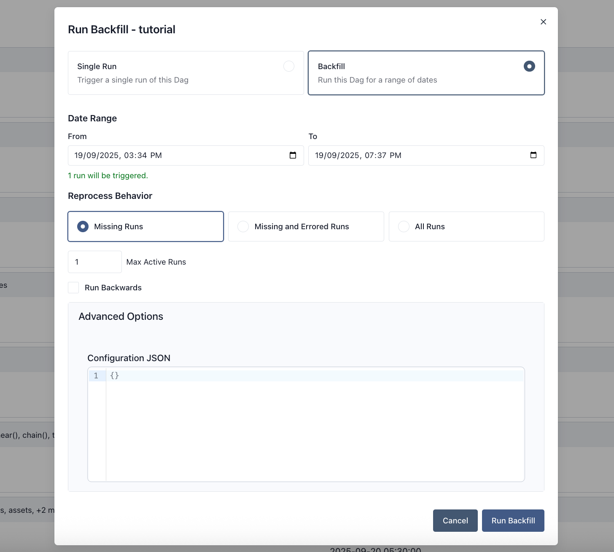

# Backfill

**Backfill** — создание запусков DAG за прошедшие даты. Airflow позволяет делать это через CLI и REST API: вы указываете DAG, начальную и конечную дату, и Airflow создаёт запуски в этом диапазоне по расписанию DAG.

Backfill не имеет смысла для DAG без расписания, привязанного ко времени.



## Управление переобработкой данных

Доступны три варианта поведения при переобработке (reprocessing behavior):

- **none** — если для данной логической даты уже есть запуск, новый не создаётся, независимо от состояния существующего.
- **failed** — если запуск есть и его состояние failed, создаётся новый запуск на эту дату.
- **completed** — если запуск есть и его состояние completed или failed, создаётся новый запуск на эту дату.

Если последний запуск ещё выполняется или в очереди, новый запуск не создаётся при любом выбранном варианте переобработки.

## Управление параллельностью

Параметр `max_active_runs` у backfill задаёт, сколько Dag run в рамках этого backfill могут выполняться одновременно. `max_active_runs` backfill действует отдельно от настройки `max_active_runs` самого DAG.

## Порядок запусков

Backfill можно выполнять в обратном порядке — сначала самые свежие даты. В CLI для этого опция `--run-backwards`.

## Dry run

Режим dry run backfill (опция в CLI) выводит даты, для которых backfill будет создавать запуски. Будут ли запуски реально созданы, зависит от выбранного варианта переобработки и состояний уже существующих запусков в диапазоне на момент фактического выполнения backfill.

## Пример

Backfill можно создать из CLI или из UI.

**Через CLI** — пример команды:

```bash
airflow backfill create --dag-id tutorial \
    --start-date 2015-06-01 \
    --end-date 2015-06-07 \
    --reprocessing-behavior failed \
    --max-active-runs 3 \
    --run-backwards \
    --dag-run-conf '{"my": "param"}'
```

**Через UI** — шаги:

1. Откройте страницу DAG и нажмите **Trigger**.
2. В появившемся окне выберите **Backfill**.
3. Заполните форму:
   - **Date range** — укажите логические даты/время «From» и «To» для окна backfill.
   - **Reprocess behavior** — выберите один из вариантов: Missing Runs, Missing and Errored Runs или All Runs.
   - **Max active runs** — ограничение числа одновременных запусков backfill.
   - **Run backwards** — выполнять сначала самые последние интервалы.
   - **Advanced Config** — при необходимости укажите JSON для `dag_run.conf`.
4. Если DAG на паузе, в том же окне можно нажать **Unpause**.

---

*Источник: [Airflow 3.1.7 — Backfill](https://airflow.apache.org/docs/apache-airflow/stable/core-concepts/backfill.html). Перевод неофициальный.*
