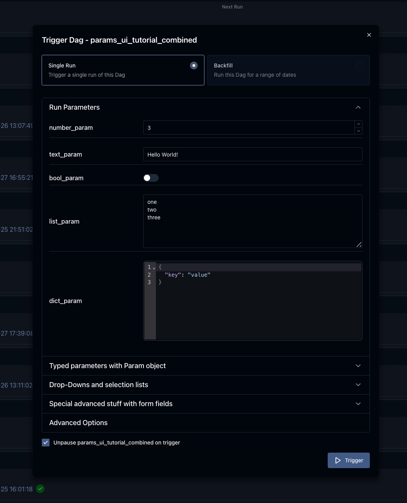
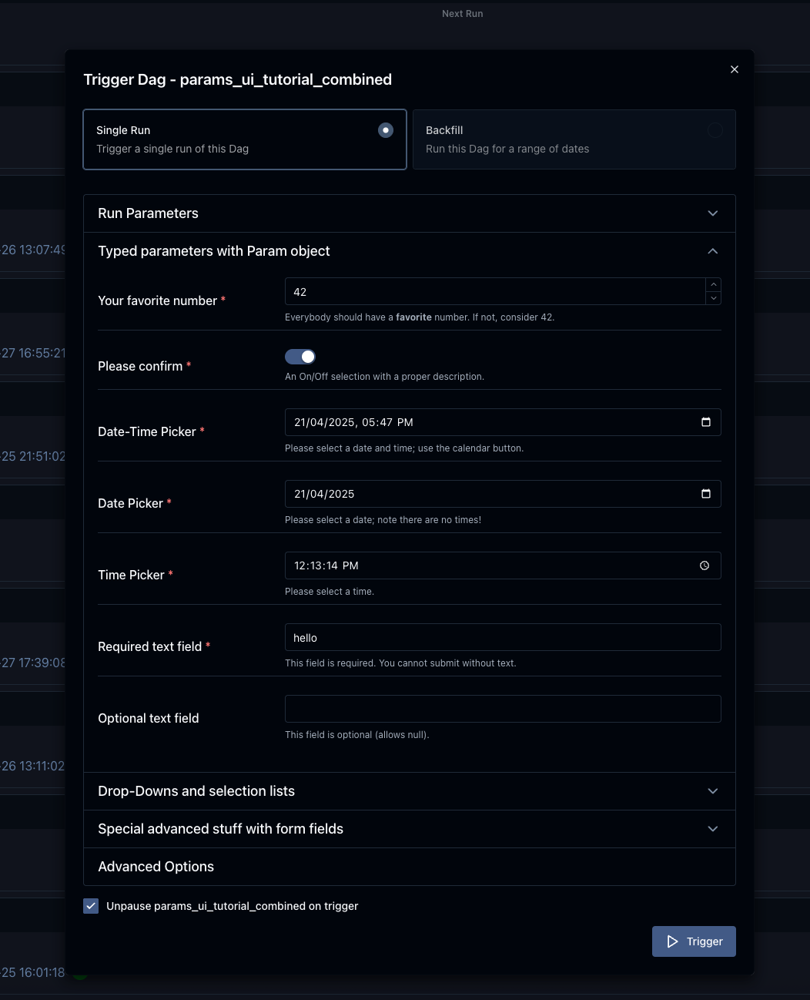
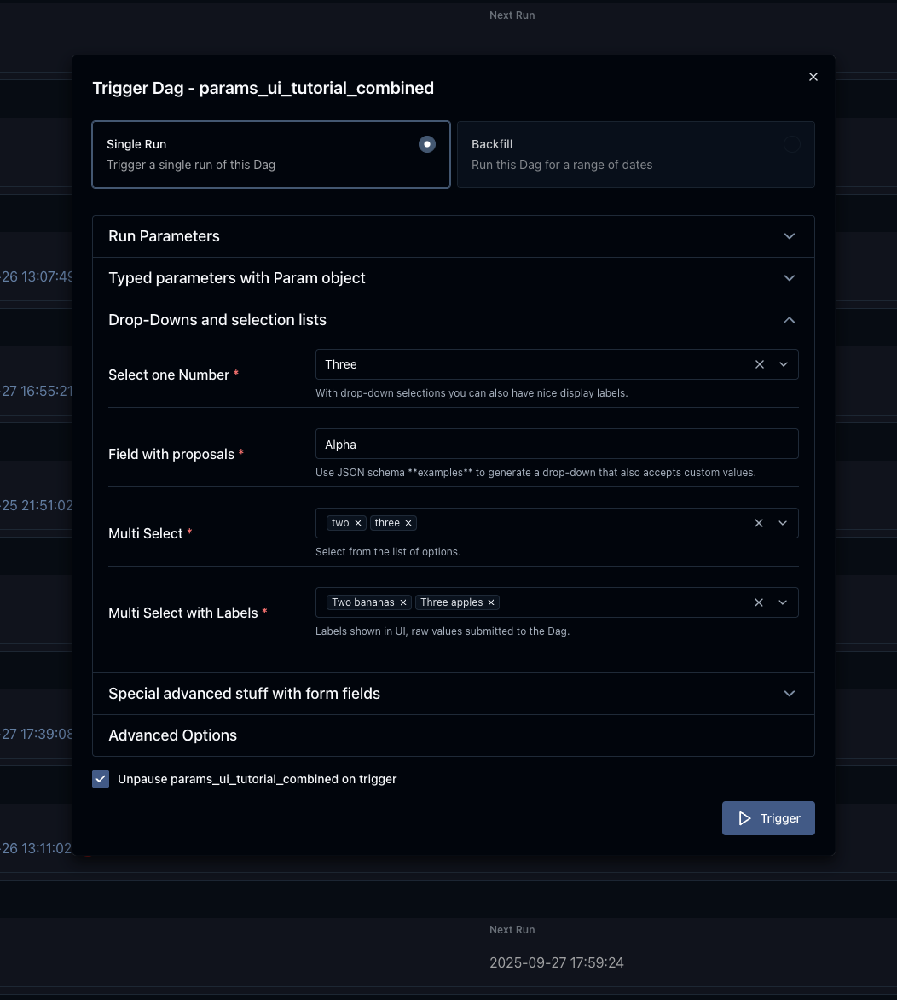
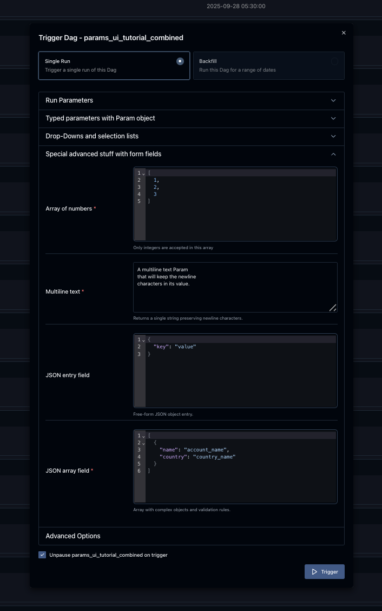

# Params (параметры)

**Params** позволяют передавать в задачи конфигурацию в момент выполнения. Значения по умолчанию задаются в коде DAG, а при ручном запуске DAG можно добавить параметры или переопределить существующие. Значения `Param` проверяются по JSON Schema. Для запланированных запусков DAG используются значения по умолчанию.

Заданные Params также используются для отображения формы в UI при ручном запуске. При ручном запуске DAG можно изменить его Params до старта Dag run. Если введённые пользователем значения не проходят валидацию, Airflow показывает предупреждение и не создаёт Dag run.

## Params на уровне DAG

Чтобы добавить Params в [DAG](https://airflow.apache.org/docs/task-sdk/stable/api.html#airflow.sdk.DAG), при создании укажите аргумент `params` — словарь от имён параметров к объектам `Param` или к значениям по умолчанию.

```python
from airflow.sdk import DAG, task, Param, get_current_context
import logging

with DAG(
    "the_dag",
    params={
        "x": Param(5, type="integer", minimum=3),
        "my_int_param": 6
    },
) as dag:

    @task.python
    def example_task():
        ctx = get_current_context()
        logger = logging.getLogger("airflow.task")

        # Выведет значение по умолчанию, 6:
        logger.info(ctx["dag"].params["my_int_param"])

        # Выведет значение, переданное при запуске, 42:
        logger.info(ctx["params"]["my_int_param"])

        # Выведет значение по умолчанию, 5 (не было передано вручную):
        logger.info(ctx["params"]["x"])

    example_task()

if __name__ == "__main__":
    dag.test(
        run_conf={"my_int_param": 42}
    )
```

> **Примечание.** Параметры на уровне DAG — это значения по умолчанию для задач. Их не стоит путать со значениями, введёнными вручную в форме UI или через CLI: последние существуют только в контексте DagRun и TaskInstance. Это важно для TaskFlow DAG с логикой внутри блока `with DAG(...) as dag:`: обращение к параметрам через объект `dag` даст только значения по умолчанию. Чтобы использовать значения, переданные при запуске, обращайтесь к ним внутри задачи через контекст — например, `params` или `ti`.

## Params на уровне задачи

Параметры можно задавать и для отдельных задач.

```python
def print_my_int_param(params):
    print(params.my_int_param)

PythonOperator(
    task_id="print_my_int_param",
    params={"my_int_param": 10},
    python_callable=print_my_int_param,
)
```

Параметры задачи имеют приоритет над параметрами DAG, а параметры, переданные пользователем при запуске DAG, — над параметрами задачи.

## Использование Params в задаче

Params доступны в [шаблонных строках](https://airflow.apache.org/docs/apache-airflow/stable/templates-ref.html#templates-ref) под ключом `params`. Например:

```python
PythonOperator(
    task_id="from_template",
    op_args=[
        "{{ params.my_int_param + 10 }}",
    ],
    python_callable=(
        lambda my_int_param: print(my_int_param)
    ),
)
```

Несмотря на то что Params могут быть разных типов, по умолчанию шаблоны подставляют в задачу строку. Чтобы изменить это, задайте `render_template_as_native_obj=True` при создании DAG:

```python
with DAG(
    "the_dag",
    params={"my_int_param": Param(5, type="integer", minimum=3)},
    render_template_as_native_obj=True
):
```

Тогда тип `Param` сохраняется при передаче в задачу:

```python
# по умолчанию выведет <class 'str'>
# при render_template_as_native_obj=True выведет <class 'int'>
PythonOperator(
    task_id="template_type",
    op_args=[
        "{{ params.my_int_param }}",
    ],
    python_callable=(
        lambda my_int_param: print(type(my_int_param))
    ),
)
```

Другой способ — обращение к параметру через аргумент `context` задачи:

```python
def print_my_int_param(**context):
    print(context["params"]["my_int_param"])

PythonOperator(
    task_id="print_my_int_param",
    python_callable=print_my_int_param,
    params={"my_int_param": 12345},
)
```

## Валидация JSON Schema

`Param` использует [JSON Schema](https://json-schema.org/). Для определения объектов `Param` можно применять спецификацию с [https://json-schema.org/draft/2020-12/json-schema-validation.html](https://json-schema.org/draft/2020-12/json-schema-validation.html).

```python
with DAG(
    "my_dag",
    params={
        # целое число со значением по умолчанию
        "my_int_param": Param(10, type="integer", minimum=0, maximum=20),

        # обязательный параметр с несколькими допустимыми типами
        # у Param должно быть значение по умолчанию
        "multi_type_param": Param(5, type=["null", "number", "string"]),

        # enum-параметр, одно из трёх значений
        "enum_param": Param("foo", enum=["foo", "bar", 42]),

        # параметр с format из json-schema
        "email": Param(
            default="example@example.com",
            type="string",
            format="idn-email",
            minLength=5,
            maxLength=255,
        ),
    },
):
```

> **Примечание.** Если у DAG задан `schedule`, параметры со значениями по умолчанию должны быть валидны; проверка выполняется при разборе DAG. Если `schedule=None`, валидация параметров при разборе не выполняется, но выполняется перед запуском DAG. Это удобно, когда автор DAG не хочет задавать значения по умолчанию, но требует от пользователя передавать корректные параметры при запуске.

> **Примечание.** По соображениям безопасности нельзя использовать объекты `Param`, производные от пользовательских классов. Планируется система регистрации кастомных классов `Param` по аналогии с Operator ExtraLinks.

## Использование Params для формы запуска в UI

*Добавлено в версии 2.6.0.*

Параметры на уровне DAG используются для отображения формы запуска. Форма показывается при нажатии кнопки «Trigger Dag».

Форма строится по заданным в DAG Params. Если у DAG нет params, форма не показывается. Элементы формы задаются классом `Param`; атрибуты определяют вид и поведение полей.

В форме поддерживается следующее:

- Скалярные значения (boolean, int, string, списки, словари) из params DAG верхнего уровня автоматически оборачиваются в `Param`; тип определяется по типу данных Python. Имя параметра используется как подпись, дополнительная валидация не выполняется, все поля считаются необязательными.

- При использовании класса `Param` можно задать атрибуты:
  - **`title`** — подпись поля формы. Если не задан, используется имя параметра.
  - **`description`** — текст подсказки под полем (серый текст). Для разметки или ссылок используйте атрибут **`description_md`**. Пример — в example DAG Params UI.

- Атрибут **`type`** у `Param` влияет на тип поля:

| Тип Param | Элемент формы | Доп. атрибуты | Пример |
|-----------|---------------|---------------|--------|
| `string` | Однострочное поле или textarea. | `minLength`, `maxLength`; `format="date"` — выбор даты; `format="date-time"` — дата и время; `format="time"` — время; `format="multiline"` — многострочное поле; `enum=["a","b","c"]` — выпадающий список; `values_display={"a":"Alpha","b":"Beta"}` — подписи для вариантов; `examples=["One","Two"]` — подсказки значений (без ограничения enum). См. [JSON Schema string](https://json-schema.org/understanding-json-schema/reference/string.html). | `Param("default", type="string", maxLength=10)`; `Param(..., format="date")` |
| `number` или `integer` | Поле только для чисел (обычно со счётчиком). `integer` — только целые. | `minimum`, `maximum`. См. [JSON Schema numeric](https://json-schema.org/understanding-json-schema/reference/numeric.html). | `Param(42, type="integer", minimum=14, multipleOf=7)` |
| `boolean` | Переключатель True/False. | — | `Param(True, type="boolean")` |
| `array` | Многострочное текстовое поле (каждая строка — элемент массива строк). С атрибутом `examples` (список) — мультивыбор вместо свободного ввода. `values_display` — подписи. С атрибутом `items` (словарь с полем `type` не "string") — JSON-поле для массивов других типов, см. [JSON Schema Array Items](https://json-schema.org/understanding-json-schema/reference/array.html#items). | | `Param(["a","b","c"], type="array")`; с `examples`; с `items={"type":"string","format":"idn-email"}` |
| `object` | JSON-поле с проверкой синтаксиса. Валидация структуры — см. [JSON Schema Object](https://json-schema.org/understanding-json-schema/reference/object.html). | | `Param({"key":"value"}, type=["object","null"])` |
| `null` | Ожидается отсутствие значения. Сам по себе редко нужен; полезен в комбинациях типа `type=["null","string"]` (атрибут `type` может быть списком типов). | По умолчанию типизированное поле обязательное. Чтобы сделать поле необязательным, добавьте тип `"null"`. | `Param(None, type=["null","string"])` |

Пустое поле формы передаётся в словарь params как `None`.

Порядок полей в форме совпадает с порядком определения `params` в DAG.

Чтобы разбить форму на секции, задайте атрибут **`section`** у полей — его значение будет заголовком секции. Поля без `section` попадают в область по умолчанию. Дополнительные секции по умолчанию свёрнуты.

Чтобы скрыть параметр из формы, но всё равно передавать его, используйте атрибут **`const`**. Значение `const` должно совпадать со значением по умолчанию для прохождения [JSON Schema validation](https://json-schema.org/understanding-json-schema/reference/generic.html#constant-values).

Внизу формы можно развернуть сгенерированную JSON-конфигурацию и при необходимости править её вручную; изменения отразятся в полях формы.

Поля могут быть обязательными или необязательными. Типизированные поля по умолчанию обязательны. Чтобы сделать типизированное поле необязательным, добавьте тип `"null"`.

Поля без `section` отображаются в области по умолчанию. Дополнительные секции по умолчанию свёрнуты.

> **Примечание.** Для обязательного поля значение по умолчанию тоже должно быть валидным по схеме. При `schedule=None` валидация параметров выполняется в момент запуска.

Примеры: example DAG Params trigger и Params UI.

*Источник: [example_params_trigger_ui.py](https://airflow.apache.org/docs/apache-airflow/stable/_modules/airflow/example_dags/example_params_trigger_ui.html)*

```python
with DAG(
    dag_id=Path(__file__).stem,
    dag_display_name="Params Trigger UI",
    description=__doc__.partition(".")[0],
    doc_md=__doc__,
    schedule=None,
    start_date=datetime.datetime(2022, 3, 4),
    catchup=False,
    tags=["example", "params"],
    params={
        "names": Param(
            ["Linda", "Martha", "Thomas"],
            type="array",
            description="Define the list of names for which greetings should be generated in the logs."
            " Please have one name per line.",
            title="Names to greet",
        ),
        "english": Param(True, type="boolean", title="English"),
        "german": Param(True, type="boolean", title="German (Formal)"),
        "french": Param(True, type="boolean", title="French"),
    },
) as dag:

    @task(task_id="get_names", task_display_name="Get names")
    def get_names(**kwargs) -> list[str]:
        params = kwargs["params"]
        if "names" not in params:
            print("Uuups, no names given, was no UI used to trigger?")
            return []
        return params["names"]

    @task.branch(task_id="select_languages", task_display_name="Select languages")
    def select_languages(**kwargs) -> list[str]:
        params = kwargs["params"]
        selected_languages = []
        for lang in ["english", "german", "french"]:
            if params[lang]:
                selected_languages.append(f"generate_{lang}_greeting")
        return selected_languages

    # ... (generate_english_greeting, generate_german_greeting, generate_french_greeting, print_greetings)
    lang_select = select_languages()
    names = get_names()
    english_greetings = generate_english_greeting.expand(name=names)
    german_greetings = generate_german_greeting.expand(name=names)
    french_greetings = generate_french_greeting.expand(name=names)
    lang_select >> [english_greetings, german_greetings, french_greetings]
    results_print = print_greetings(english_greetings, german_greetings, french_greetings)
```

*Источник: [example_params_ui_tutorial.py](https://airflow.apache.org/docs/apache-airflow/stable/_modules/airflow/example_dags/example_params_ui_tutorial.html)*

Первая секция — базовое использование без класса `Param`:



```python
params={
    "number_param": 3,
    "text_param": "Hello World!",
    "bool_param": False,
    "list_param": ["one", "two", "three", "actually one value is made per line"],
    "dict_param": {"key": "value"},
```

Вторая секция — использование класса `Param` и атрибут `section`:



```python
    "most_loved_number": Param(
        42,
        type="integer",
        title="Your favorite number",
        description_md="Everybody should have a **favorite** number. ...",
        minimum=0,
        maximum=128,
        section="Typed parameters with Param object",
    ),
    "pick_one": Param(
        "value 42",
        type="string",
        title="Select one Value",
        description="You can use JSON schema enum's to generate drop down selection boxes.",
        enum=[f"value {i}" for i in range(16, 64)],
        section="Typed parameters with Param object",
    ),
```

Третья секция — обязательные и необязательные поля, выпадающие списки:



```python
        "required_field": Param(
            type="string",
            title="Required text field",
            minLength=10,
            maxLength=30,
            description="This field is required. ...",
            section="Typed parameters with Param object",
        ),
        "optional_field": Param(
            "optional text, you can trigger also w/o text",
            type=["null", "string"],
            title="Optional text field",
            description_md="This field is optional. ...",
            section="Typed parameters with Param object",
        ),
```

Четвёртая секция — продвинутые элементы формы:



```python
    @task(task_display_name="Show used parameters")
    def show_params(**kwargs) -> None:
        params = kwargs["params"]
        print(f"This DAG was triggered with the following parameters:\n\n{json.dumps(params, indent=4)}\n")

    show_params()
```

Туториал Params UI состоит из четырёх секций с типичными примерами: первая — базовое использование без `Param`; вторая — класс `Param` и атрибуты; третья — выпадающие списки и обязательность полей; четвёртая — продвинутые элементы формы.

*Изменено в 3.0.0:* по умолчанию произвольный HTML запрещён (защита от внедрения скриптов и другого вредоносного кода). Поле `description_html` заменено на атрибут `description_md`. `description_html` больше не поддерживается. Кастомные элементы формы через атрибут `custom_html_form` объявлены устаревшими в 2.8.0 и удалены в 3.0.0.

## Отключение изменения Params при запуске

Возможность менять params при запуске DAG управляется конфигом `core.dag_run_conf_overrides_params`. При значении `False` параметры по умолчанию фактически становятся константами.

---

*Источник: [Airflow 3.1.7 — Params](https://airflow.apache.org/docs/apache-airflow/stable/core-concepts/params.html). Перевод неофициальный.*
