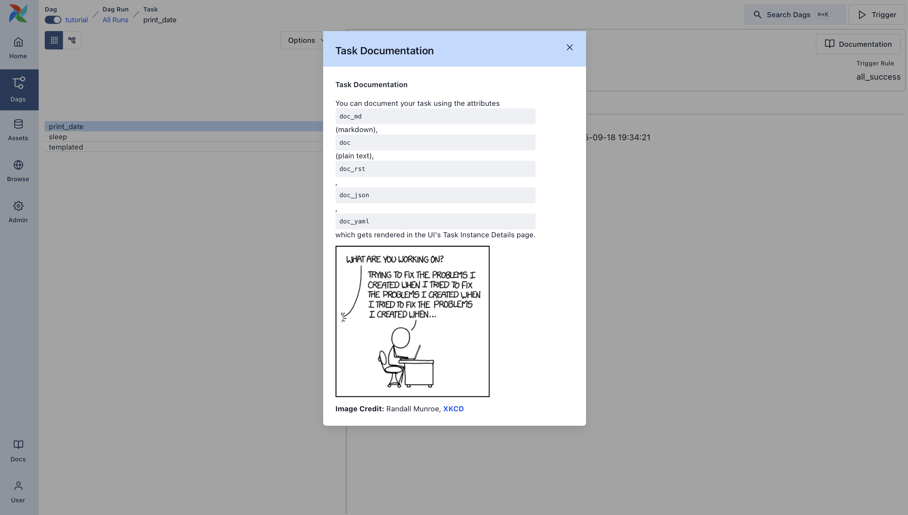
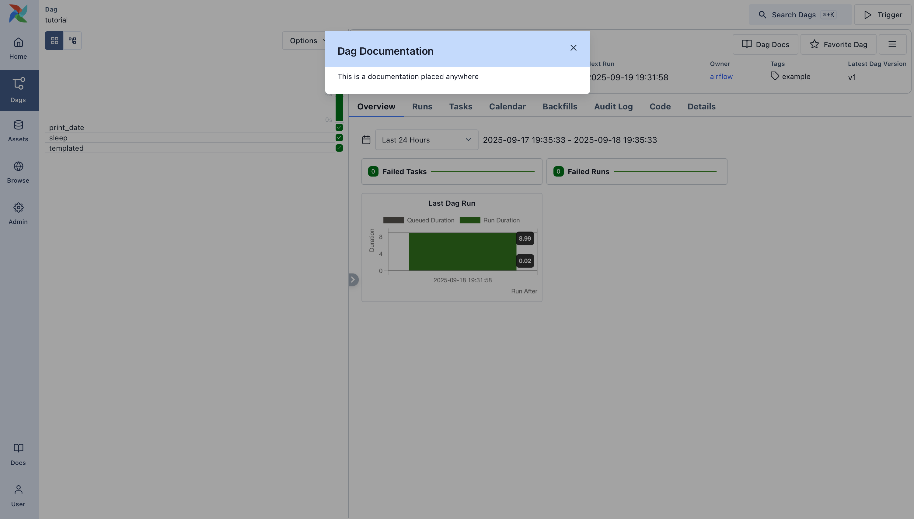

# Airflow 101: первый workflow

Краткое введение в Apache Airflow. В этом туториале разбираются базовые понятия и написание первого DAG — по шагам и с примерами кода.

## Что такое DAG?

**DAG** — набор задач, упорядоченных по связям и зависимостям. По сути это «карта» workflow: видно, как задачи связаны друг с другом. Ниже всё разберём по шагам.

## Пример определения пайплайна

Начнём с простого примера. Сначала он может выглядеть громоздко — ниже разберём каждую часть.

*Источник: [airflow/example_dags/tutorial.py](https://airflow.apache.org/docs/apache-airflow/stable/_modules/airflow/example_dags/tutorial.html)*

```python
import textwrap
from datetime import datetime, timedelta

# Операторы — нужны для выполнения задач
from airflow.providers.standard.operators.bash import BashOperator

# Объект DAG — для создания DAG
from airflow.sdk import DAG

with DAG(
    "tutorial",
    default_args={
        "depends_on_past": False,
        "retries": 1,
        "retry_delay": timedelta(minutes=5),
    },
    description="A simple tutorial DAG",
    schedule=timedelta(days=1),
    start_date=datetime(2021, 1, 1),
    catchup=False,
    tags=["example"],
) as dag:

    t1 = BashOperator(
        task_id="print_date",
        bash_command="date",
    )

    t2 = BashOperator(
        task_id="sleep",
        depends_on_past=False,
        bash_command="sleep 5",
        retries=3,
    )
    t1.doc_md = textwrap.dedent(
        """\
    #### Task Documentation
    You can document your task using the attributes `doc_md` (markdown),
    `doc` (plain text), `doc_rst`, `doc_json`, `doc_yaml` which gets
    rendered in the UI's Task Instance Details page.
    
    **Image Credit:** Randall Munroe, [XKCD](https://xkcd.com/license.html)
    """
    )

    dag.doc_md = __doc__  # если в начале DAG есть docstring; ИЛИ
    dag.doc_md = """
    This is a documentation placed anywhere
    """  # иначе задайте так

    templated_command = textwrap.dedent(
        """
    
        echo "{{ ds }}"
        echo "{{ macros.ds_add(ds, 7)}}"
    
    """
    )

    t3 = BashOperator(
        task_id="templated",
        depends_on_past=False,
        bash_command=templated_command,
    )

    t1 >> [t2, t3]
```

## Файл определения DAG

Скрипт Airflow на Python можно считать конфигурацией: в коде задаётся структура DAG. Сами задачи выполняются в другом окружении, то есть этот файл не для обработки данных. Его задача — определить объект DAG, и он должен выполняться быстро, так как DAG File Processor регулярно проверяет его на изменения.

## Импорт модулей

В начале скрипта импортируются нужные библиотеки — как в любом Python-проекте.

*Источник: [airflow/example_dags/tutorial.py](https://airflow.apache.org/docs/apache-airflow/stable/_modules/airflow/example_dags/tutorial.html)*

```python
import textwrap
from datetime import datetime, timedelta

# Операторы
from airflow.providers.standard.operators.bash import BashOperator

# Объект DAG
from airflow.sdk import DAG
```

Подробнее о модулях в Python и Airflow: [Modules Management](https://airflow.apache.org/docs/apache-airflow/stable/administration-and-deployment/modules_management.html).

## Аргументы по умолчанию

При создании DAG и задач аргументы можно передавать в каждую задачу отдельно или задать общий словарь `default_args`. Второй вариант обычно удобнее.

*Источник: [airflow/example_dags/tutorial.py](https://airflow.apache.org/docs/apache-airflow/stable/_modules/airflow/example_dags/tutorial.html)*

```python
default_args={
    "depends_on_past": False,
    "retries": 1,
    "retry_delay": timedelta(minutes=5),
    # 'queue': 'bash_queue',
    # 'pool': 'backfill',
    # 'priority_weight': 10,
    # 'end_date': datetime(2016, 1, 1),
    # 'wait_for_downstream': False,
    # 'execution_timeout': timedelta(seconds=300),
    # 'on_failure_callback': some_function,
    # 'on_success_callback': some_other_function,
    # 'on_retry_callback': another_function,
    # 'sla_miss_callback': yet_another_function,
    # 'on_skipped_callback': another_function,
    # 'trigger_rule': 'all_success'
},
```

Подробнее по параметрам BaseOperator: [airflow.sdk.BaseOperator](https://airflow.apache.org/docs/task-sdk/stable/api.html#airflow.sdk.BaseOperator).

## Создание DAG

Создаём объект DAG с уникальным `dag_id`, передаём в него `default_args` и задаём расписание (например, раз в день).

*Источник: [airflow/example_dags/tutorial.py](https://airflow.apache.org/docs/apache-airflow/stable/_modules/airflow/example_dags/tutorial.html)*

```python
with DAG(
    "tutorial",
    default_args={...},
    description="A simple tutorial DAG",
    schedule=timedelta(days=1),
    start_date=datetime(2021, 1, 1),
    catchup=False,
    tags=["example"],
) as dag:
```

## Операторы

**Оператор** в Airflow — единица работы. Из операторов собираются workflow’ы. Кроме операторов можно использовать [TaskFlow API](https://airflow.apache.org/docs/apache-airflow/stable/tutorial/taskflow.html) — более «питоновский» способ описания DAG; к нему вернёмся позже.

Все операторы наследуются от `BaseOperator` с общими аргументами для запуска задач. Часто используются `PythonOperator`, `BashOperator`, `KubernetesPodOperator`. В этом туториале — `BashOperator` для простых bash-команд.

## Определение задач

Оператор нужно создать как задачу (экземпляр). Задачи задают, как оператор выполняется в контексте DAG. Ниже два экземпляра `BashOperator` с разными `task_id` и командами.

*Источник: [airflow/example_dags/tutorial.py](https://airflow.apache.org/docs/apache-airflow/stable/_modules/airflow/example_dags/tutorial.html)*

```python
t1 = BashOperator(
    task_id="print_date",
    bash_command="date",
)

t2 = BashOperator(
    task_id="sleep",
    depends_on_past=False,
    bash_command="sleep 5",
    retries=3,
)
```

Специфичные для оператора аргументы (например, `bash_command`) сочетаются с общими (например, `retries`) из `BaseOperator`. У второй задачи `retries` переопределён на 3.

Приоритет аргументов задачи:

1. Явно переданные аргументы
2. Значения из словаря `default_args`
3. Значения по умолчанию оператора

> **Примечание.** У каждой задачи должны быть (или наследоваться) аргументы `task_id` и `owner`, иначе Airflow выдаст ошибку. В свежей установке `owner` по умолчанию `airflow`, поэтому обычно достаточно задать `task_id`.

## Шаблонизация Jinja

В Airflow используется [Jinja](https://jinja.palletsprojects.com/en/2.11.x/): в шаблонах доступны встроенные параметры и макросы. Ниже — переменная `{{ ds }}` (дата в формате YYYY-MM-DD).

*Источник: [airflow/example_dags/tutorial.py](https://airflow.apache.org/docs/apache-airflow/stable/_modules/airflow/example_dags/tutorial.html)*

```python
templated_command = textwrap.dedent(
    """

    echo "{{ ds }}"
    echo "{{ macros.ds_add(ds, 7)}}"

"""
)

t3 = BashOperator(
    task_id="templated",
    depends_on_past=False,
    bash_command=templated_command,
)
```

В `templated_command` есть блоки `` и подстановки вроде `{{ ds }}`. В `bash_command` можно передать и файл, например `bash_command='templated_command.sh'`. Дополнительно можно задать `user_defined_macros` и `user_defined_filters`. Подробнее: [Jinja Documentation](https://jinja.palletsprojects.com/en/latest/api/#custom-filters).

Список переменных и макросов для шаблонов: [Templates reference](https://airflow.apache.org/docs/apache-airflow/stable/templates-ref.html#templates-ref).

## Документация DAG и задач

Документацию можно добавить к DAG и к отдельным задачам. У DAG поддерживается markdown; у задач — обычный текст, markdown, reStructuredText, JSON или YAML. Удобно помещать описание в начало файла DAG.

*Источник: [airflow/example_dags/tutorial.py](https://airflow.apache.org/docs/apache-airflow/stable/_modules/airflow/example_dags/tutorial.html)*

Документация задачи отображается на странице Task Instance Details в UI:



```python
t1.doc_md = textwrap.dedent(
    """\
#### Task Documentation
You can document your task using the attributes `doc_md` (markdown),
`doc` (plain text), `doc_rst`, `doc_json`, `doc_yaml` which gets
rendered in the UI's Task Instance Details page.

**Image Credit:** Randall Munroe, [XKCD](https://xkcd.com/license.html)
"""
)
```

Документация DAG отображается в интерфейсе DAG:



```python
dag.doc_md = __doc__  # если в начале DAG есть docstring; ИЛИ
dag.doc_md = """
This is a documentation placed anywhere
"""  # иначе задайте так
```

## Зависимости между задачами

Задачи могут зависеть друг от друга. Для `t1`, `t2`, `t3` зависимости можно задать так:

```python
t1.set_downstream(t2)

# t2 будет запускаться после успешного завершения t1.
# Эквивалентно:
t2.set_upstream(t1)

# Оператор >> для цепочки:
t1 >> t2

# Зависимость «выше по потоку»:
t2 << t1

# Несколько зависимостей подряд:
t1 >> t2 >> t3

# Список задач как зависимости (все варианты эквивалентны):
t1.set_downstream([t2, t3])
t1 >> [t2, t3]
[t2, t3] << t1
```

Airflow сообщит об ошибке, если в DAG есть циклы или одна и та же зависимость задана несколько раз.

## Часовые пояса

Чтобы DAG учитывал часовой пояс, используйте «осознанные» даты из [pendulum](https://github.com/python-pendulum/pendulum). Стандартный [timezone](https://docs.python.org/3/library/datetime.html#timezone-objects) из библиотеки лучше не использовать из-за ограничений.

## Краткое повторение

К этому моменту у вас есть: DAG, задачи с зависимостями и шаблонизация. Итоговый фрагмент может выглядеть так:

*Источник: [airflow/example_dags/tutorial.py](https://airflow.apache.org/docs/apache-airflow/stable/_modules/airflow/example_dags/tutorial.html)*

```python
import textwrap
from datetime import datetime, timedelta

from airflow.providers.standard.operators.bash import BashOperator
from airflow.sdk import DAG

with DAG(
    "tutorial",
    default_args={
        "depends_on_past": False,
        "retries": 1,
        "retry_delay": timedelta(minutes=5),
    },
    description="A simple tutorial DAG",
    schedule=timedelta(days=1),
    start_date=datetime(2021, 1, 1),
    catchup=False,
    tags=["example"],
) as dag:

    t1 = BashOperator(task_id="print_date", bash_command="date",)
    t2 = BashOperator(task_id="sleep", depends_on_past=False, bash_command="sleep 5", retries=3,)
    t1.doc_md = textwrap.dedent("""\n#### Task Documentation\n...""")
    dag.doc_md = __doc__  # или строка с описанием

    templated_command = textwrap.dedent("""
    
        echo "{{ ds }}"
        echo "{{ macros.ds_add(ds, 7)}}"
    
    """)
    t3 = BashOperator(task_id="templated", depends_on_past=False, bash_command=templated_command,)

    t1 >> [t2, t3]
```

## Проверка пайплайна

Сначала убедитесь, что скрипт выполняется без ошибок. Если файл лежит в каталоге DAG (указан в `airflow.cfg`), например `tutorial.py`:

```bash
python ~/airflow/dags/tutorial.py
```

Если ошибок нет — DAG задан корректно.

### Проверка метаданных из командной строки

Дополнительные проверки:

```bash
# применить миграции БД
airflow db migrate

# список активных DAG
airflow dags list

# список задач в DAG "tutorial"
airflow tasks list tutorial

# граф DAG "tutorial" (graphviz)
airflow dags show tutorial
```

### Тестирование Task Instance и Dag Run

Отдельную задачу можно прогнать для выбранной логической даты — так имитируется запуск планировщиком.

> **Примечание.** Планировщик запускает задачу для определённой даты/времени, но не обязательно в этот момент. **Logical date** — метка, по которой именуется Dag run; обычно это конец периода, за который идёт обработка, или момент ручного запуска. По logical date различают запуски в UI, логах и коде. При запуске DAG через UI или API можно задать свой logical date.

```bash
# формат: command subcommand [dag_id] [task_id] [(опционально) date]

# тест print_date
airflow tasks test tutorial print_date 2015-06-01

# тест sleep
airflow tasks test tutorial sleep 2015-06-01
```

Проверка подстановки шаблонов:

```bash
airflow tasks test tutorial templated 2015-06-01
```

Команда выведет логи и выполнит bash-команду.

Команда `airflow tasks test` запускает экземпляр задачи локально, пишет логи в stdout и не записывает состояние в БД — удобно для отладки одной задачи.

Аналогично `airflow dags test` запускает один Dag run без записи состояния в БД — для локальной проверки всего DAG.

## Что дальше?

Первый пайплайн написан и проверен. Дальше можно вынести код в репозиторий и запустить Scheduler — тогда DAG будет запускаться по расписанию (например, ежедневно).

Рекомендуемые следующие шаги:

- Продолжить туториал: [Pythonic Dags with the TaskFlow API](https://airflow.apache.org/docs/apache-airflow/stable/tutorial/taskflow.html).
- Раздел [Core Concepts](https://airflow.apache.org/docs/apache-airflow/stable/core-concepts/index.html) — подробнее о DAG, задачах, операторах и др.

---

*Источник: [Airflow 3.1.7 — Tutorial: Fundamentals](https://airflow.apache.org/docs/apache-airflow/stable/tutorial/fundamentals.html). Перевод неофициальный.*
