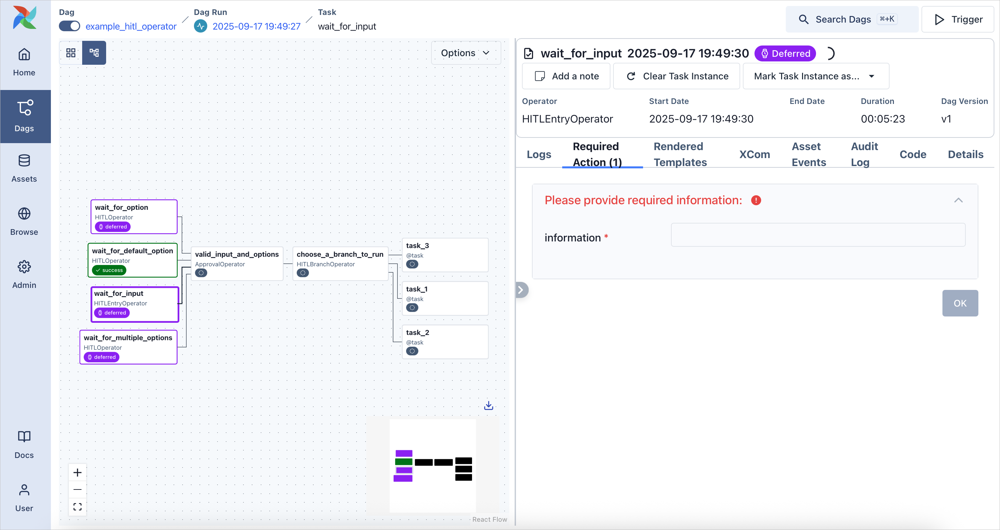
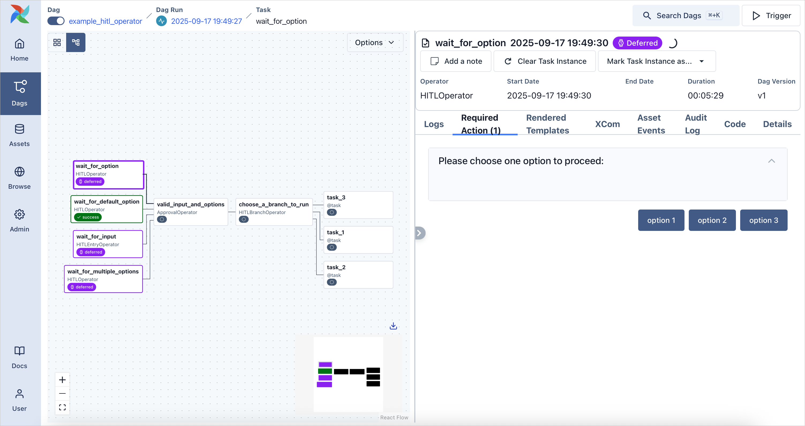
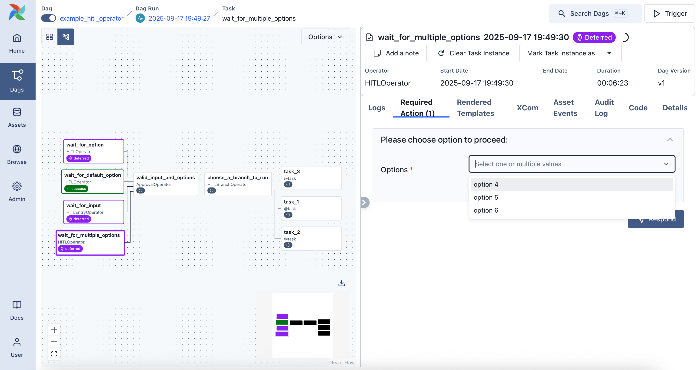
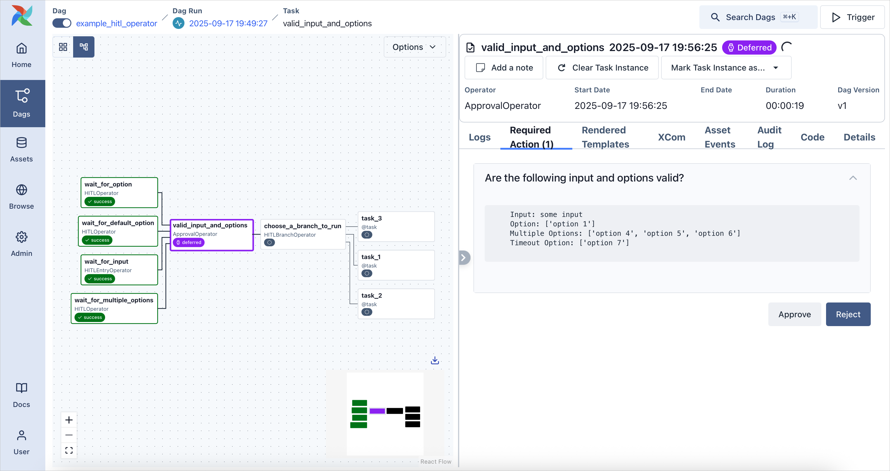
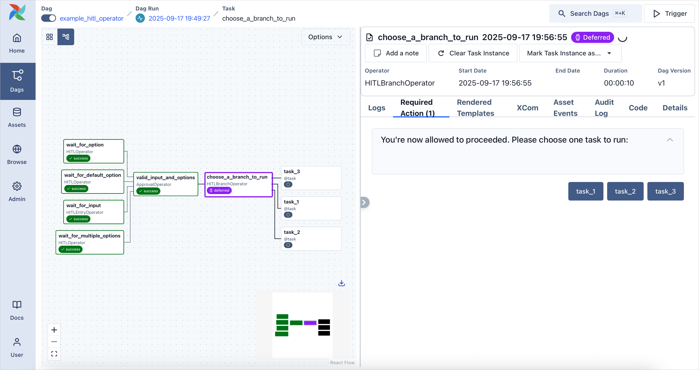
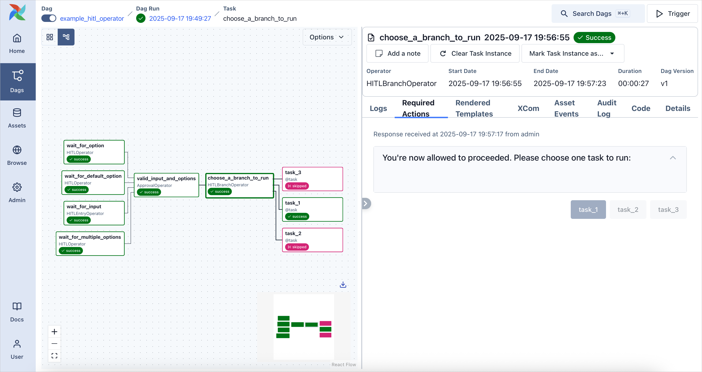

# HITLOperator (Human-in-the-Loop)

*Добавлено в версии 3.1.*

**Human-in-the-Loop (HITL)** позволяет встраивать в пайплайны шаги, где решение принимает человек. Workflow может останавливаться и ждать ввода пользователя — это удобно для согласований, ручных проверок качества и сценариев, где нужна человеческая оценка.

В этом туториале разберём использование HITL-операторов в DAG и то, как это выглядит в UI Airflow.

## Пример DAG с HITL

Ниже — пример DAG с HITL. Далее разберём его по частям.

*Источник: example_hitl_operator.py*

```python
class LocalLogNotifier(BaseNotifier):
    """Simple notifier to demonstrate HITL notification without setup any connection."""

    template_fields = ("message",)

    def __init__(self, message: str) -> None:
        self.message = message

    def notify(self, context: Context) -> None:
        url = HITLOperator.generate_link_to_ui_from_context(
            context=context,
            base_url="http://localhost:28080",
        )
        self.log.info(self.message)
        self.log.info("Url to respond %s", url)


hitl_request_callback = LocalLogNotifier(
    message="""
[HITL]
Subject: {{ task.subject }}
Body: {{ task.body }}
Options: {{ task.options }}
Is Multiple Option: {{ task.multiple }}
Default Options: {{ task.defaults }}
Params: {{ task.params }}
"""
)
hitl_success_callback = LocalLogNotifier(
    message="{{ ti.xcom_pull(task_ids=task_id) }}"
)
hitl_failure_callback = LocalLogNotifier(message="Request to response to '{{ task.subject }}' failed")

with DAG(
    dag_id="example_hitl_operator",
    start_date=pendulum.datetime(2021, 1, 1, tz="UTC"),
    catchup=False,
    tags=["example", "HITL"],
):
    wait_for_input = HITLEntryOperator(
        task_id="wait_for_input",
        subject="Please provide required information: ",
        params={"information": Param("", type="string")},
        notifiers=[hitl_request_callback],
        on_success_callback=hitl_success_callback,
        on_failure_callback=hitl_failure_callback,
    )
    wait_for_option = HITLOperator(
        task_id="wait_for_option",
        subject="Please choose one option to proceed: ",
        options=["option 1", "option 2", "option 3"],
        notifiers=[hitl_request_callback],
        on_success_callback=hitl_success_callback,
        on_failure_callback=hitl_failure_callback,
    )
    wait_for_multiple_options = HITLOperator(
        task_id="wait_for_multiple_options",
        subject="Please choose option to proceed: ",
        options=["option 4", "option 5", "option 6"],
        multiple=True,
        notifiers=[hitl_request_callback],
        on_success_callback=hitl_success_callback,
        on_failure_callback=hitl_failure_callback,
    )
    wait_for_default_option = HITLOperator(
        task_id="wait_for_default_option",
        subject="Please choose option to proceed: ",
        options=["option 7", "option 8", "option 9"],
        defaults=["option 7"],
        execution_timeout=datetime.timedelta(seconds=1),
        notifiers=[hitl_request_callback],
        on_success_callback=hitl_success_callback,
        on_failure_callback=hitl_failure_callback,
    )
    valid_input_and_options = ApprovalOperator(
        task_id="valid_input_and_options",
        subject="Are the following input and options valid?",
        body="""
        Input: {{ ti.xcom_pull(task_ids='wait_for_input')["params_input"]["information"] }}
        Option: {{ ti.xcom_pull(task_ids='wait_for_option')["chosen_options"] }}
        Multiple Options: {{ ti.xcom_pull(task_ids='wait_for_multiple_options')["chosen_options"] }}
        Timeout Option: {{ ti.xcom_pull(task_ids='wait_for_default_option')["chosen_options"] }}
        """,
        defaults="Reject",
        execution_timeout=datetime.timedelta(minutes=1),
        notifiers=[hitl_request_callback],
        on_success_callback=hitl_success_callback,
        on_failure_callback=hitl_failure_callback,
        assigned_users=[{"id": "admin", "name": "admin"}],
    )
    choose_a_branch_to_run = HITLBranchOperator(
        task_id="choose_a_branch_to_run",
        subject="You're now allowed to proceeded. Please choose one task to run: ",
        options=["task_1", "task_2", "task_3"],
        notifiers=[hitl_request_callback],
        on_success_callback=hitl_success_callback,
        on_failure_callback=hitl_failure_callback,
    )

    @task
    def task_1(): ...

    @task
    def task_2(): ...

    @task
    def task_3(): ...

    (
        [wait_for_input, wait_for_option, wait_for_default_option, wait_for_multiple_options]
        >> valid_input_and_options
        >> choose_a_branch_to_run
        >> [task_1(), task_2(), task_3()]
    )
```

## Ввод данных (Input Provision)

Пользователь может ввести данные через **params**, которые затем доступны в следующих задачах. Это полезно в workflow с участием человека, в том числе в пайплайнах с большими языковыми моделями (LLM).

*Источник: example_hitl_operator.py*

```python
wait_for_input = HITLEntryOperator(
    task_id="wait_for_input",
    subject="Please provide required information: ",
    params={"information": Param("", type="string")},
    notifiers=[hitl_request_callback],
    on_success_callback=hitl_success_callback,
    on_failure_callback=hitl_failure_callback,
)
```

В детальной панели задачи откройте вкладку **Required Actions**, чтобы ввести данные.



## Выбор варианта (Option Selection)

Вместо свободного ввода можно предложить список вариантов. Пользователь выбирает один из них, и выбор задаёт дальнейшее поведение workflow.

*Источник: example_hitl_operator.py*

```python
wait_for_option = HITLOperator(
    task_id="wait_for_option",
    subject="Please choose one option to proceed: ",
    options=["option 1", "option 2", "option 3"],
    notifiers=[hitl_request_callback],
    on_success_callback=hitl_success_callback,
    on_failure_callback=hitl_failure_callback,
)
```



Поддерживается и **выбор нескольких вариантов**:

*Источник: example_hitl_operator.py*

```python
wait_for_multiple_options = HITLOperator(
    task_id="wait_for_multiple_options",
    subject="Please choose option to proceed: ",
    options=["option 4", "option 5", "option 6"],
    multiple=True,
    notifiers=[hitl_request_callback],
    on_success_callback=hitl_success_callback,
    on_failure_callback=hitl_failure_callback,
)
```



## Одобрение или отклонение (Approval or Rejection)

Частный случай выбора варианта — только **Approval** и **Rejection**. У оператора можно задать **`assigned_users`**: список пользователей, которым разрешено отвечать на HITL. Формат — список словарей с полями `id` и `name` (например, `[{"id": "1", "name": "user1"}, {"id": "2", "name": "user2"}]`). Отвечать смогут только пользователи из этого списка.

*Источник: example_hitl_operator.py*

```python
valid_input_and_options = ApprovalOperator(
    task_id="valid_input_and_options",
    subject="Are the following input and options valid?",
    body="""
    Input: {{ ti.xcom_pull(task_ids='wait_for_input')["params_input"]["information"] }}
    Option: {{ ti.xcom_pull(task_ids='wait_for_option')["chosen_options"] }}
    Multiple Options: {{ ti.xcom_pull(task_ids='wait_for_multiple_options')["chosen_options"] }}
    Timeout Option: {{ ti.xcom_pull(task_ids='wait_for_default_option')["chosen_options"] }}
    """,
    defaults="Reject",
    execution_timeout=datetime.timedelta(minutes=1),
    notifiers=[hitl_request_callback],
    on_success_callback=hitl_success_callback,
    on_failure_callback=hitl_failure_callback,
    assigned_users=[{"id": "admin", "name": "admin"}],
)
```

В поле `body` можно использовать XCom, чтобы подставить данные, введённые пользователем ранее.



## Выбор ветки (Branch Selection)

Пользователь может выбрать, по какой ветке DAG идти дальше. Типичный сценарий — модерация контента, где иногда нужна ручная оценка.

Это похоже на выбор варианта, но в качестве вариантов указываются **задачи**. Не забудьте задать связи между этими задачами и остальным DAG.

*Источник: example_hitl_operator.py*

```python
choose_a_branch_to_run = HITLBranchOperator(
    task_id="choose_a_branch_to_run",
    subject="You're now allowed to proceeded. Please choose one task to run: ",
    options=["task_1", "task_2", "task_3"],
    notifiers=[hitl_request_callback],
    on_success_callback=hitl_success_callback,
    on_failure_callback=hitl_failure_callback,
)
```

```python
@task
def task_1(): ...

@task
def task_2(): ...

@task
def task_3(): ...

(
    [wait_for_input, wait_for_option, wait_for_default_option, wait_for_multiple_options]
    >> valid_input_and_options
    >> choose_a_branch_to_run
    >> [task_1(), task_2(), task_3()]
)
```



После выбора ветки выполнение продолжается по выбранному пути.



## Notifiers (уведомления)

**Notifier** — механизм callback для событий HITL: ожидание ввода пользователя, успех или неудача. В примере используется `LocalLogNotifier`, который пишет сообщения в лог для демонстрации.

Метод **`HITLOperator.generate_link_to_ui_from_context`** формирует прямую ссылку на страницу UI, где пользователь должен ответить. Аргументы:

- **`context`** — передаётся в `notify` нотификатором автоматически
- **`base_url`** — (опционально) базовый URL UI Airflow; если не задан, берётся `api.base_url` из конфигурации
- **`options`** — (опционально) предвыбранные варианты для страницы UI
- **`params_inputs`** — (опционально) предзаполненные поля ввода для страницы UI

Так в уведомлениях или логах можно добавлять ссылки для ответа. Свой нотификатор можно реализовать для другой логики. Подробнее: [Creating a notifier](https://airflow.apache.org/docs/apache-airflow/stable/howto/notifications.html) и [Notifications](https://airflow.apache.org/docs/apache-airflow-providers/core-extensions/notifications.html).

В примере DAG нотификатор задаётся так:

*Источник: example_hitl_operator.py*

```python
class LocalLogNotifier(BaseNotifier):
    """Simple notifier to demonstrate HITL notification without setup any connection."""

    template_fields = ("message",)

    def __init__(self, message: str) -> None:
        self.message = message

    def notify(self, context: Context) -> None:
        url = HITLOperator.generate_link_to_ui_from_context(
            context=context,
            base_url="http://localhost:28080",
        )
        self.log.info(self.message)
        self.log.info("Url to respond %s", url)


hitl_request_callback = LocalLogNotifier(
    message="""
[HITL]
Subject: {{ task.subject }}
Body: {{ task.body }}
Options: {{ task.options }}
Is Multiple Option: {{ task.multiple }}
Default Options: {{ task.defaults }}
Params: {{ task.params }}
"""
)
hitl_success_callback = LocalLogNotifier(
    message="{{ ti.xcom_pull(task_ids=task_id) }}"
)
hitl_failure_callback = LocalLogNotifier(message="Request to response to '{{ task.subject }}' failed")
```

Список нотификаторов передаётся в HITL-операторы через аргумент **`notifiers`**. Когда оператор создаёт HITL-запрос и ждёт ответа пользователя, у каждого нотификатора вызывается метод `notify` с одним аргументом — **`context`**.

*Источник: example_hitl_operator.py*

```python
wait_for_input = HITLEntryOperator(
    task_id="wait_for_input",
    subject="Please provide required information: ",
    params={"information": Param("", type="string")},
    notifiers=[hitl_request_callback],
    on_success_callback=hitl_success_callback,
    on_failure_callback=hitl_failure_callback,
)
```

## Польза и типичные сценарии

HITL полезен в workflow с большими языковыми моделями (LLM), где подсказки от человека могут заметно улучшить результат. Он также удобен в корпоративных пайплайнах данных, где ручная проверка дополняет автоматику.

## См. также

- [Документация HITL-операторов (Standard provider)](https://airflow.apache.org/docs/apache-airflow-providers-standard/stable/operators/hitl.html)
- [Python API HITL-операторов](https://airflow.apache.org/docs/apache-airflow-providers-standard/stable/_api/airflow/providers/standard/operators/hitl/index.html)

---

*Источник: [Airflow 3.1.7 — Tutorial: HITLOperator (Human-in-the-Loop)](https://airflow.apache.org/docs/apache-airflow/stable/tutorial/hitl.html). Перевод неофициальный.*
