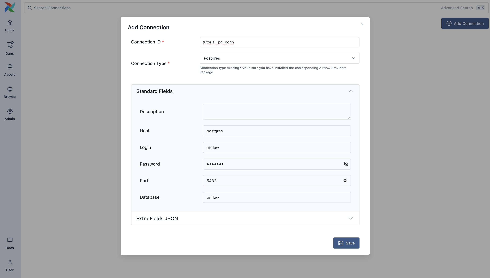
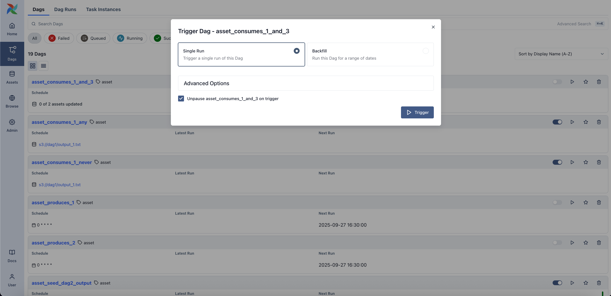
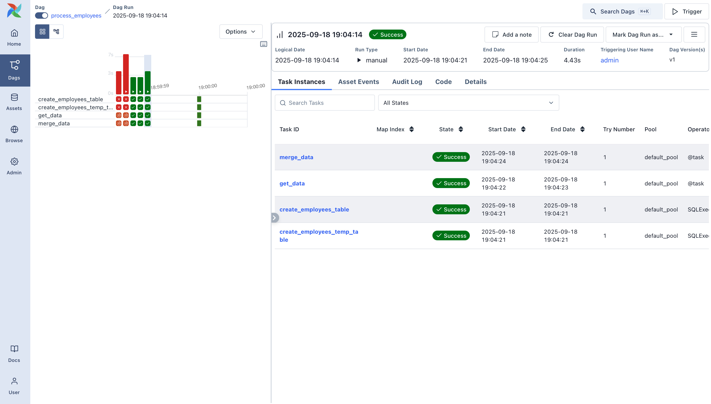
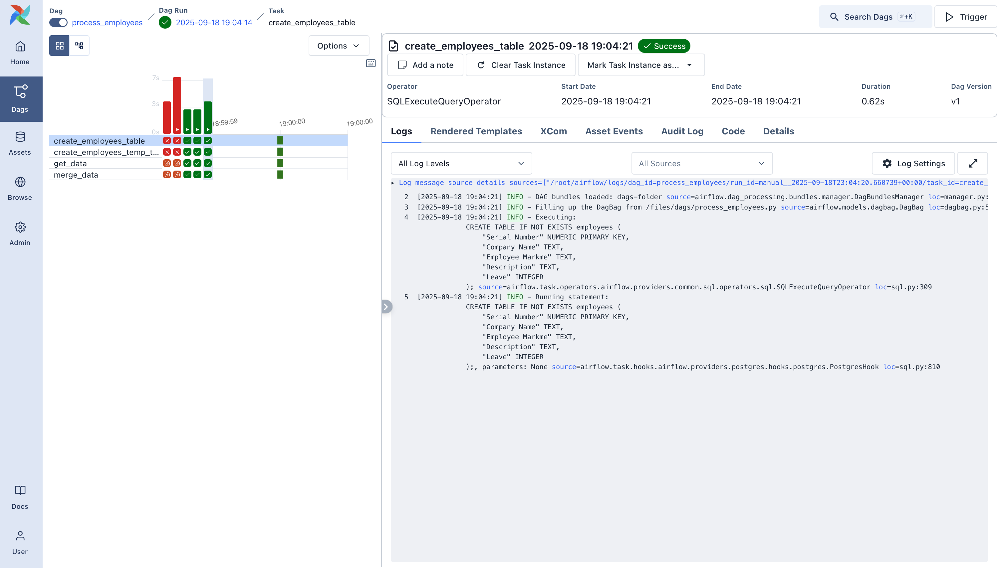

# Построение простого пайплайна данных

Третий туториал серии. К этому моменту у вас уже есть первый DAG и базовые операторы. Теперь соберём небольшой, но осмысленный пайплайн: загрузка данных из внешнего источника, запись в БД и очистка по пути.

В туториале используется **SQLExecuteQueryOperator** — современный способ выполнять SQL в Airflow. С его помощью будем работать с локальной Postgres, настроенной в UI Airflow.

В итоге получится пайплайн, который:

- Скачивает CSV-файл
- Загружает данные во временную (staging) таблицу
- Очищает данные и делает upsert в целевую таблицу

По ходу вы поработаете с UI Airflow, подключениями (connections), выполнением SQL и типичными приёмами написания DAG.

Полезные ссылки:

- [SQLExecuteQueryOperator](https://airflow.apache.org/docs/apache-airflow-providers-common-sql/stable/_api/airflow/providers/common/sql/operators/sql/index.html#airflow.providers.common.sql.operators.sql.SQLExecuteQueryOperator)
- [Провайдер Postgres](https://airflow.apache.org/docs/apache-airflow-providers-postgres/stable/index.html)

## Начальная настройка

> **Внимание.** Для этого туториала нужен Docker. Airflow запускается локально через Docker Compose. Инструкция: [Docker Compose quickstart](https://airflow.apache.org/docs/apache-airflow/stable/howto/docker-compose/index.html).

Для запуска пайплайна нужна рабочая среда Airflow. Docker Compose упрощает и изолирует установку. В терминале выполните:

```bash
# Скачать docker-compose.yaml
curl -LfO 'https://airflow.apache.org/docs/apache-airflow/stable/docker-compose.yaml'

# Создать каталоги и задать переменную окружения
mkdir -p ./dags ./logs ./plugins
echo -e "AIRFLOW_UID=$(id -u)" > .env

# Инициализировать БД
docker compose up airflow-init

# Запустить все сервисы
docker compose up
```

Когда Airflow поднимется, откройте UI по адресу `http://localhost:8080`.

Вход:

- **Username:** `airflow`
- **Password:** `airflow`

Откроется дашборд Airflow: запуск DAG, просмотр логов, управление окружением.

## Создание подключения к Postgres

Перед записью в Postgres нужно настроить [подключение](https://airflow.apache.org/docs/apache-airflow/stable/concepts/connections.html). В UI откройте **Admin → Connections** и нажмите **+** для нового подключения.



Заполните поля:

| Поле | Значение |
|------|----------|
| Connection ID | `tutorial_pg_conn` |
| Connection Type | `postgres` |
| Host | `postgres` |
| Database | `airflow` (БД по умолчанию в контейнере) |
| Login | `airflow` |
| Password | `airflow` |
| Port | `5432` |

Сохраните подключение. Дальше соберём пайплайн, который будет его использовать.

## Создание таблиц для staging и итоговых данных

Создаём две таблицы:

- **`employees_temp`** — временная таблица для сырых данных
- **`employees`** — итоговая таблица после очистки и дедупликации

Используем `SQLExecuteQueryOperator` для выполнения SQL:

```python
from airflow.providers.common.sql.operators.sql import SQLExecuteQueryOperator

create_employees_table = SQLExecuteQueryOperator(
    task_id="create_employees_table",
    conn_id="tutorial_pg_conn",
    sql="""
        CREATE TABLE IF NOT EXISTS employees (
            "Serial Number" NUMERIC PRIMARY KEY,
            "Company Name" TEXT,
            "Employee Markme" TEXT,
            "Description" TEXT,
            "Leave" INTEGER
        );""",
)

create_employees_temp_table = SQLExecuteQueryOperator(
    task_id="create_employees_temp_table",
    conn_id="tutorial_pg_conn",
    sql="""
        DROP TABLE IF EXISTS employees_temp;
        CREATE TABLE employees_temp (
            "Serial Number" NUMERIC PRIMARY KEY,
            "Company Name" TEXT,
            "Employee Markme" TEXT,
            "Description" TEXT,
            "Leave" INTEGER
        );""",
)
```

SQL можно вынести в файлы `.sql` в каталог `dags/` и передать путь в аргумент `sql=` — так код DAG остаётся чище.

## Загрузка данных во временную таблицу

Дальше: скачать CSV, сохранить локально и загрузить в `employees_temp` через `PostgresHook`.

```python
import os
import requests
from airflow.sdk import task
from airflow.providers.postgres.hooks.postgres import PostgresHook


@task
def get_data():
    # Настройте путь под ваше окружение Airflow
    data_path = "/opt/airflow/dags/files/employees.csv"
    os.makedirs(os.path.dirname(data_path), exist_ok=True)

    url = "https://raw.githubusercontent.com/apache/airflow/main/airflow-core/docs/tutorial/pipeline_example.csv"
    response = requests.request("GET", url)

    with open(data_path, "w") as file:
        file.write(response.text)

    postgres_hook = PostgresHook(postgres_conn_id="tutorial_pg_conn")
    conn = postgres_hook.get_conn()
    cur = conn.cursor()
    with open(data_path, "r") as file:
        cur.copy_expert(
            "COPY employees_temp FROM STDIN WITH CSV HEADER DELIMITER AS ',' QUOTE '\"'",
            file,
        )
    conn.commit()
```

Здесь сочетаются обычный Python, SQL и хуки Airflow — типичный паттерн для реальных пайплайнов.

## Слияние и очистка данных

Дедупликация и перенос в итоговую таблицу — задача с SQL `INSERT … ON CONFLICT DO UPDATE`:

```python
from airflow.sdk import task
from airflow.providers.postgres.hooks.postgres import PostgresHook


@task
def merge_data():
    query = """
        INSERT INTO employees
        SELECT *
        FROM (
            SELECT DISTINCT *
            FROM employees_temp
        ) t
        ON CONFLICT ("Serial Number") DO UPDATE
        SET
              "Employee Markme" = excluded."Employee Markme",
              "Description" = excluded."Description",
              "Leave" = excluded."Leave";
    """
    try:
        postgres_hook = PostgresHook(postgres_conn_id="tutorial_pg_conn")
        conn = postgres_hook.get_conn()
        cur = conn.cursor()
        cur.execute(query)
        conn.commit()
        return 0
    except Exception as e:
        return 1
```

## Определение DAG

Все задачи собраны — объединяем их в один DAG:

```python
import datetime
import pendulum
import os

import requests
from airflow.sdk import dag, task
from airflow.providers.postgres.hooks.postgres import PostgresHook
from airflow.providers.common.sql.operators.sql import SQLExecuteQueryOperator


@dag(
    dag_id="process_employees",
    schedule="0 0 * * *",
    start_date=pendulum.datetime(2021, 1, 1, tz="UTC"),
    catchup=False,
    dagrun_timeout=datetime.timedelta(minutes=60),
)
def ProcessEmployees():
    create_employees_table = SQLExecuteQueryOperator(
        task_id="create_employees_table",
        conn_id="tutorial_pg_conn",
        sql="""
            CREATE TABLE IF NOT EXISTS employees (
                "Serial Number" NUMERIC PRIMARY KEY,
                "Company Name" TEXT,
                "Employee Markme" TEXT,
                "Description" TEXT,
                "Leave" INTEGER
            );""",
    )

    create_employees_temp_table = SQLExecuteQueryOperator(
        task_id="create_employees_temp_table",
        conn_id="tutorial_pg_conn",
        sql="""
            DROP TABLE IF EXISTS employees_temp;
            CREATE TABLE employees_temp (
                "Serial Number" NUMERIC PRIMARY KEY,
                "Company Name" TEXT,
                "Employee Markme" TEXT,
                "Description" TEXT,
                "Leave" INTEGER
            );""",
    )

    @task
    def get_data():
        data_path = "/opt/airflow/dags/files/employees.csv"
        os.makedirs(os.path.dirname(data_path), exist_ok=True)
        url = "https://raw.githubusercontent.com/apache/airflow/main/airflow-core/docs/tutorial/pipeline_example.csv"
        response = requests.request("GET", url)
        with open(data_path, "w") as file:
            file.write(response.text)
        postgres_hook = PostgresHook(postgres_conn_id="tutorial_pg_conn")
        conn = postgres_hook.get_conn()
        cur = conn.cursor()
        with open(data_path, "r") as file:
            cur.copy_expert(
                "COPY employees_temp FROM STDIN WITH CSV HEADER DELIMITER AS ',' QUOTE '\"'",
                file,
            )
        conn.commit()

    @task
    def merge_data():
        query = """
            INSERT INTO employees
            SELECT *
            FROM (
                SELECT DISTINCT *
                FROM employees_temp
            ) t
            ON CONFLICT ("Serial Number") DO UPDATE
            SET
              "Employee Markme" = excluded."Employee Markme",
              "Description" = excluded."Description",
              "Leave" = excluded."Leave";
        """
        try:
            postgres_hook = PostgresHook(postgres_conn_id="tutorial_pg_conn")
            conn = postgres_hook.get_conn()
            cur = conn.cursor()
            cur.execute(query)
            conn.commit()
            return 0
        except Exception as e:
            return 1

    [create_employees_table, create_employees_temp_table] >> get_data() >> merge_data()


dag = ProcessEmployees()
```

Сохраните DAG в файл `dags/process_employees.py`. Через некоторое время он появится в UI.

## Запуск и просмотр DAG

Откройте UI Airflow, найдите DAG `process_employees` в списке. Включите его переключателем и запустите кнопкой запуска (play).



В виде Grid можно наблюдать за выполнением каждой задачи и смотреть логи по шагам.





После успешного завершения у вас будет рабочий пайплайн: данные из внешнего источника загружаются в Postgres и очищаются.

## Что дальше?

Идеи для следующих шагов:

- Подставить другой SQL-провайдер (MySQL, SQLite).
- Разбить DAG на TaskGroups или вынести общие части в переиспользуемый паттерн.
- Добавить шаг оповещения или уведомление после обработки данных.

См. также:

- [How-to руководства](https://airflow.apache.org/docs/apache-airflow/stable/howto/index.html)
- [Справка по SQL-провайдеру](https://airflow.apache.org/docs/apache-airflow-providers-common-sql/stable/)
- [Создание своего оператора](https://airflow.apache.org/docs/apache-airflow/stable/howto/custom-operator.html)

---

*Источник: [Airflow 3.1.7 — Tutorial: Building a Simple Data Pipeline](https://airflow.apache.org/docs/apache-airflow/stable/tutorial/pipeline.html). Перевод неофициальный.*
